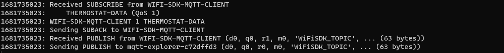
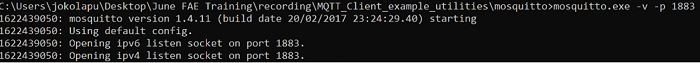

# Wi-Fi - Embedded MQTT Client

## Table of Contents

- [Wi-Fi - Embedded MQTT Client](#wi-fi---embedded-mqtt-client)
  - [Table of Contents](#table-of-contents)
  - [Purpose/Scope](#purposescope)
  - [Prerequisites/Setup Requirements](#prerequisitessetup-requirements)
    - [Hardware Requirements](#hardware-requirements)
    - [Software Requirements](#software-requirements)
    - [Setup Diagram](#setup-diagram)
  - [Getting Started](#getting-started)
  - [Application Build Environment](#application-build-environment)
  - [Test the Application](#test-the-application)
    - [Procedure for executing the application when enabled with SSL](#procedure-for-executing-the-application-when-enabled-with-ssl)
  - [Additional Information](#additional-information)
    - [Steps to set up MQTT server](#steps-to-set-up-mqtt-server)

## Purpose/Scope

This application demonstrates how SiWx91x is configured as an MQTT client, connects to an MQTT broker, subscribes to a topic, and publishes messages on a particular MQTT topic.
In this application, SiWx91x is configured as a Wi-Fi station and connects to an access point. After successful Wi-Fi connection, the application connects to a MQTT broker and subscribes to the topic called **THERMOSTAT-DATA**. Subsequently, the application publishes a message **"Lorem ipsum dolor sit amet, consectetur adipiscing elit, sed do"** on the **WiFiSDK_TOPIC** topic. Finally, the application waits to receive the data published on the subscribed topic by other clients after which it unsubscribes from the topic it has subscribed to and disconnects from MQTT broker.

## Prerequisites/Setup Requirements

### Hardware Requirements  

- Windows PC
- Wireless Access Point
- Windows PC1 (for running MQTT broker)
- Windows PC2 (for running MQTT client utility - MQTT Explorer)
- SoC Mode:
  - Silicon Labs [BRD4338A, BRD4343A](https://www.silabs.com/)
  - For Soc Mode, Simplicity Studio Energy Profiler can be used for the current consumption measurement - [Simplicity Studio Energy Profiler](#using-simplicity-studio-energy-profiler-for-current-measurement).
- NCP Mode:
  - Silicon Labs [BRD4180B](https://www.silabs.com/) 
  - Host MCU Eval Kit. This example has been tested with:
    - Silicon Labs [WSTK + EFR32MG21](https://www.silabs.com/development-tools/wireless/efr32xg21-bluetooth-starter-kit)
   - Interface and Host MCU Supported
      - SPI - EFR32 
      - UART - EFR32

### Software Requirements

- Simplicity Studio

### Setup Diagram

  

>**NOTE:**
>
>- The Host MCU platform (EFR32MG21) and the SiWx91x interact with each other through the SPI interface.

## Getting Started

Refer to the instructions [here](https://docs.silabs.com/wiseconnect/latest/wiseconnect-getting-started/) to:

- [Install Simplicity Studio](https://docs.silabs.com/wiseconnect/latest/wiseconnect-developers-guide-developing-for-silabs-hosts/#install-simplicity-studio)
- [Install WiSeConnect extension](https://docs.silabs.com/wiseconnect/latest/wiseconnect-developers-guide-developing-for-silabs-hosts/#install-the-wi-se-connect-extension)
- [Connect your device to the computer](https://docs.silabs.com/wiseconnect/latest/wiseconnect-developers-guide-developing-for-silabs-hosts/#connect-si-wx91x-to-computer)
- [Upgrade your connectivity firmware ](https://docs.silabs.com/wiseconnect/latest/wiseconnect-developers-guide-developing-for-silabs-hosts/#update-si-wx91x-connectivity-firmware)
- [Create a Studio project ](https://docs.silabs.com/wiseconnect/latest/wiseconnect-developers-guide-developing-for-silabs-hosts/#create-a-project)

For details on the project folder structure, see the [WiSeConnect Examples](https://docs.silabs.com/wiseconnect/latest/wiseconnect-examples/#example-folder-structure) page.

## Application Build Environment

The application can be configured to suit your requirements and development environment. Read through the following sections and make any changes needed.

In the Project explorer pane, expand the **config** folder and open the ``sl_net_default_values.h`` file. Configure the following parameters to enable your Silicon Labs Wi-Fi device to connect to your Wi-Fi network:

- STA instance related parameters

	- DEFAULT_WIFI_CLIENT_PROFILE_SSID refers to the name with which the Wi-Fi network shall be advertised. The Si91X module is connected to it.
	
	```c
  	#define DEFAULT_WIFI_CLIENT_PROFILE_SSID               "YOUR_AP_SSID"      
  	```

	- DEFAULT_WIFI_CLIENT_CREDENTIAL refers to the secret key if the access point is configured in WPA-PSK/WPA2-PSK security modes.

  	```c 
  	#define DEFAULT_WIFI_CLIENT_CREDENTIAL                 "YOUR_AP_PASSPHRASE" 
  	```
  
	- DEFAULT_WIFI_CLIENT_SECURITY_TYPE refers to the security type if the access point is configured in WPA/WPA2 or mixed security modes.
  	```c
  	#define DEFAULT_WIFI_CLIENT_SECURITY_TYPE              SL_WIFI_WPA2 
  	```

- Other STA instance configurations can be modified if required in `default_wifi_client_profile` configuration structure.

  - MQTT_BROKER_PORT port refers to the port number on which the remote MQTT broker/server is running.

   ```c
   #define MQTT_BROKER_PORT                                8886
   ```

  - MQTT_BROKER_IP refers remote peer IP address (Windows PC1) on which MQTT server is running.

   ```c
   #define MQTT_BROKER_IP                         "192.168.10.1"
   ```

  - CLIENT_PORT port refers to the device MQTT client port number.

   ```c
   #define CLIENT_PORT                                1
   ```

  - CLIENT_ID refers to the unique ID with which the MQTT client connects to MQTT broker/server.

   ```c
   #define clientID "WIFI-SDK-MQTT-CLIENT"
   ```

  - PUBLISH_TOPIC refers to the topic to which MQTT client is supposed to subscribe.

   ```c
   #define PUBLISH_TOPIC  "WiFiSDK_TOPIC"
   ```

  - PUBLISH_MESSAGE refers to message that would be published by MQTT client.

   ```c
   #define PUBLISH_MESSAGE    "Lorem ipsum dolor sit amet, consectetur adipiscing elit, sed do"
   ```

  - QOS_OF_PUBLISH_MESSAGE indicates quality of service which MQTT client uses to publish a message.

   ```c
   #define QOS_OF_PUBLISH_MESSAGE 0
   ```

  - IS_DUPLICATE_MESSAGE indicates whether message sent by MQTT client is a duplicated message.

   ```c
   #define IS_DUPLICATE_MESSAGE 0
   ```

  - IS_MESSAGE_RETAINED whether broker needs to retain message published by MQTT client.

   ```c
   #define IS_MESSAGE_RETAINED 0
   ```

  - IS_CLEAN_SESSION indicates whether this connection is a new one or a continuation of last session.

   ```c
   #define IS_CLEAN_SESSION 0
   ```

  - LAST_WILL_TOPIC Topic of last will message.

   ```c
   #define LAST_WILL_TOPIC  "WiFiSDK-MQTT-CLIENT-LAST-WILL"
   ```

  - LAST_WILL_MESSAGE Message that would be published by broker if MQTT client disconnected abruptly.

   ```c
   #define LAST_WILL_MESSAGE  "WiFiSDK-MQTT-CLIENT has been disconnect from network"
   ```

  - QOS_OF_LAST_WILL Quality of service for last will message.

   ```c
   #define QOS_OF_LAST_WILL  1
   ```

  - IS_LAST_WILL_RETAINED Whether broker needs to retain last will message of client.

   ```c
   #define IS_LAST_WILL_RETAINED 1
   ```

  - ENCRYPT_CONNECTION Whether the connection between client and broker should be encrypted using SSL.

   ```c
   #define ENCRYPT_CONNECTION  0
   ```

  - KEEP_ALIVE_INTERVAL client keep alive period in seconds.

   ```c
   #define KEEP_ALIVE_INTERVAL                       100
   ```

  - MQTT_CONNECT_TIMEOUT Timeout for broker connection in milliseconds.

   ```c
   #define MQTT_CONNECT_TIMEOUT                      5000
   ```

  - SEND_CREDENTIALS Whether to send username and password in connect request.

   ```c
   #define SEND_CREDENTIALS 0
   ```

  - USERNAME for login credentials.

   ```c
   #define USERNAME "WIFISDK"
   ```

  - PASSWORD for login credentials.

   ```c
   #define PASSWORD "password"
   ```

> **Note**: For recommended settings, please refer the [recommendations guide](https://docs.silabs.com/wiseconnect/latest/wiseconnect-developers-guide-prog-recommended-settings/).

## Test the Application

Refer to the instructions [here](https://docs.silabs.com/wiseconnect/latest/wiseconnect-getting-started/) to:

- Build the application.
- Flash, run, and debug the application.

- SoC mode

   

- NCP mode

   

Follow the steps below for successful execution of the application:

- Once the SiWx91x gets connected to the MQTT broker, it will subscribe to the topic **TOPIC_TO_BE_SUBSCRIBED (Ex: "THERMOSTAT-DATA")**. You can see the client connected and subscription success information in the MQTT broker.

   ****

- SiWx91x publishes a message which is given in **PUBLISH_MESSAGE**. 
  (Ex: "Lorem ipsum dolor sit amet, consectetur adipiscing elit, sed do") on **PUBLISH_TOPIC** (Ex: WiFiSDK_TOPIC).

- MQTT Explorer which is running on Windows PC2 will receive the message published by the SiWx91x EVK as it subscribed to the same topic.

   ****

- Now to publish a message using MQTT Explorer, enter the topic name under **Publish** tab, select **raw** data format, type the data that you wish to send, and then click on **publish**. This message will be received by the SiWx91x.

    ****

- In the MQTT broker and on the terminal, you can observe the published message as the MQTT client is subscribed to that topic.

   ****

- SiWx91x unsubscribes to the topic that it has subscribed to after receiving the message that was published by MQTT Explorer running on Windows PC2.

- Once subscription is successful, SiWx91x disconnects from the broker.

### Procedure for executing the application when enabled with SSL

1. Install MQTT broker in Windows PC1 which is connected to the access point through LAN.

2. Update the **mosquitto.conf** file with the proper file paths, in which the certificates are available in the mosquitto.conf file.

3. Also, add **certs** folder to the mosquitto broker folder.

4. Execute the following command in MQTT server installed folder. (Ex:  C:\Program Files\mosquitto>mosquitto.exe -c mosquitto.conf -v) (Port should be 8883)

   `mosquitto.exe -c mosquitto.conf -v`  
  
   ****

5. If you see any error - Unsupported tls_version **tlsv1**, just comment the **tls_version tlsv1** in **mosquitto.conf** file.

>**Note:**
> Multiple MQTT client instances can be created.
> If mosquitto isn't allowing external connections to the broker, add the following lines in **mosquitto.conf** file:

  ```c
  listener 8886
  allow_anonymous true
  ```

> For using a different config file for mosquitto broker, use command:
  `mosquitto -v -p 8886 -c config/mosquitto.conf`
  where **config** is the sub-folder and **mosquitto.conf** is the different config file than default.

## Additional Information

### Steps to set up MQTT server

1. To run MQTT broker on port 8886 in Windows PC1, open the command prompt and go to the MQTT installed folder (Ex: C:\Program Files\mosquitto) and run the following command:

   ```c
   mosquitto.exe –p 8886 –v
   ```

   ****

2. Open MQTT Explorer in Windows PC2 and delete the existing connections, if any, and click on **Advanced** as shown in the image below.

   ****

3. Delete the existing topic names if any. Enter the desired **TOPIC_NAME** in the topic field and click on **ADD**. The desired topic name then can be observed in the topic list. Click on **BACK** as shown in the image below.

   ****

4. Connect to MQTT broker by entering IP address and port number of Windows PC1 in HOST and PORT fields in MQTT Explorer respectively, and click on **CONNECT**. If you are running your MQTT broker on the same PC, then the following configuration is made as shown in the image below.

   ****

>**Note:**
> If we want to use IPv6 with the embedded MQTT client application, we will be using the Mosquitto command line to test the example because the MQTT Explorer application doesn't support IPv6.

> The following commands are used to test the MQTT client with IPv6 addresses using the Mosquitto command line:
>
> 1. `mosquitto_sub -h 2405:201:c013:61e3:faf7:fb6f:8d37:bca8 -p 1883 -t test/topic`
>
>    This command runs the Mosquitto client in subscriber mode.  It will connect to the MQTT broker and listen for messages published to a specific topic.
>
>    - `-h 2405:201:c013:61e3:faf7:fb6f:8d37:bca8`: Specifies the hostname or IP address of the MQTT broker to connect to. In this case, it's an IPv6 address.
>    - `-p 1883`: Specifies the network port that the MQTT broker is listening on. The default MQTT port is 1883.
>    - `-t test/topic`: Specifies the topic that the client should subscribe to. The client will receive any messages published to this topic.
>
> 2. `mosquitto_pub -h 2401:4901:1290:10de::1000 -p 1883 -t THERMOSTAT-DATA -m "hello"`
>
>    This command runs the Mosquitto client in publisher mode. It connects to the MQTT broker, publishes a message to a specific topic, and then automatically disconnects and closes the client.
>
>    - `-h 2401:4901:1290:10de::1000`: Like the `-h` option for `mosquitto_sub`, this specifies the hostname or IP address of the MQTT broker to connect to.
>    - `-p 1883`: This is the same as the `-p` option for `mosquitto_sub`, specifying the network port of the MQTT broker.
>    - `-t THERMOSTAT-DATA`: Specifies the topic that the client should publish the message to.
>    - `-m "hello"`: Specifies the message to publish. In this case, the message is the string "hello".
