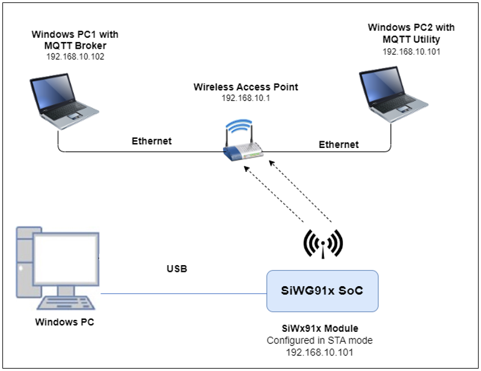
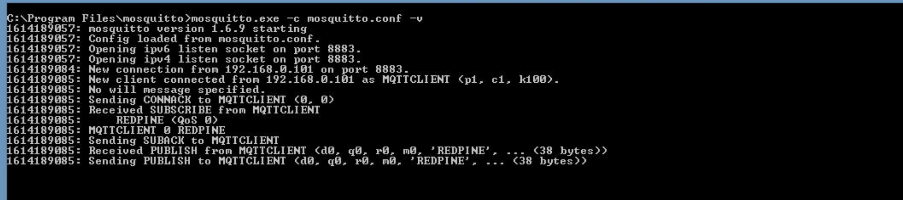
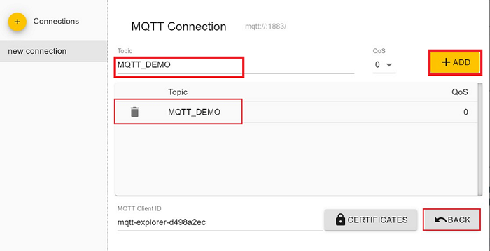
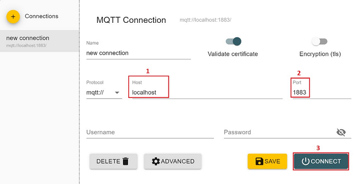

# Embedded MQTT

## 1 Purpose/Scope

This application demonstrates how SiWx91x is configured as an MQTT client, connects to an MQTT broker, subscribes to a topic and publishes messages on a particular MQTT topic.
In this application, SiWx91x is configured as a Wi-Fi station and connects to an Access Point. After successful Wi-Fi connection, application connects to a MQTT broker and subscribes to the topic called **THERMOSTAT-DATA**. Subsequently, the application publishes a message **"Lorem ipsum dolor sit amet, consectetur adipiscing elit, sed do** on the **WiFiSDK_TOPIC** topic. Finally, the application waits to receive the data published on the subscribed topic by other clients after which it would be unsubscribe from topic it has subscribed to and disconnect from MQTT broker.

## 2 Prerequisites/Setup Requirements

### 2.1 Hardware Requirements  

- A Windows PC

- A Wireless Access Point

- Windows PC1 (for running MQTT broker)

- Windows PC2 (for running MQTT client utility - MQTT Explorer)
- **SoC Mode**:
  - Silicon Labs [BRD4325A, BRD4325B, BRD4325C, BRD4325G, BRD4338A](https://www.silabs.com/)
  - For Soc Mode, Simplicity Studio Energy Profiler can be used for the current consumption measurement - [Simplicity Studio Energy Profiler](#using-simplicity-studio-energy-profiler-for-current-measurement).
- **NCP Mode**:
  - Silicon Labs [BRD4180B](https://www.silabs.com/) **AND**
  - Host MCU Eval Kit. This example has been tested with:
    - Silicon Labs [WSTK + EFR32MG21](https://www.silabs.com/development-tools/wireless/efr32xg21-bluetooth-starter-kit)

### 2.2 Software Requirements

- Simplicity Studio IDE

  - Download the latest [Simplicity Studio IDE](https://www.silabs.com/developers/simplicity-studio)
  - Follow the [Simplicity Studio user guide](https://docs.silabs.com/simplicity-studio-5-users-guide/1.1.0/ss-5-users-guide-getting-started/install-ss-5-and-software#install-ssv5) to install Simplicity Studio IDE

  - [Mosquitto broker](https://mosquitto.org/download/)

  - [MQTT Explorer](http://mqtt-explorer.com/)

### 2.3 Setup Diagram

#### SoC Mode


  
#### NCP Mode


**NOTE**:

- The Host MCU platform (EFR32MG21) and the SiWx91x interact with each other through the SPI interface.

Follow the [Getting Started with Wiseconnect3 SDK](https://docs.silabs.com/wiseconnect/latest/wiseconnect-getting-started/) guide to set up the hardware connections and Simplicity Studio IDE.

## 3 Project Environment

- Ensure the SiWx91x loaded with the latest firmware following the [Upgrade Si91x firmware](https://docs.silabs.com/wiseconnect/latest/wiseconnect-getting-started/getting-started-with-soc-mode#upgrade-si-wx91x-connectivity-firmware)

- Ensure the latest Gecko SDK along with the extension WiSeConnect3 is added to Simplicity Studio.

### 3.1 Creating the project

#### 3.1.1 SoC mode

- Ensure the SiWx91x set up is connected to your PC.

- In the Simplicity Studio IDE, the SiWx91x SoC board will be detected under **Debug Adapters** pane as shown below.

  ****

#### 3.1.2 NCP mode

- Ensure the EFx32 and SiWx91x set up is connected to your PC.

- In the Simplicity Studio IDE, the EFR32 board will be detected under **Debug Adapters** pane as shown below.

  ****

### 3.2 Importing the project

- Studio should detect your board. Your board will be shown here. Click on the board detected and go to **EXAMPLE PROJECTS & DEMOS** section 

#### SOC Mode

- Select **Wi-Fi - Embedded MQTT Client** test application

  ****

- Click 'Create'. The "New Project Wizard" window appears. Click 'Finish'

  ****

### 3.3 Set up for application prints

#### 3.3.1 Teraterm set up - for BRD4325A, BRD4325B, BRD4325C, BRD4325G

You can use either of the below USB to UART converters for application prints.

1. Set up using USB to UART converter board.

   - Connect Tx (Pin-6) to P27 on WSTK
   - Connect GND (Pin 8 or 10) to GND on WSTK

   ****

2. Set up using USB to UART converter cable.

   - Connect RX (Pin 5) of TTL convertor to P27 on WSTK
   - Connect GND (Pin1) of TTL convertor to GND on WSTK

   ****

3. Open the Teraterm tool.

   - For SoC mode, choose the serial port to which USB to UART converter is connected and click on **OK**.

     ****

**Note:** For Other 917 SoC boards please refer section #3.3.2

#### 3.3.2 **Teraterm set up - for NCP and SoC modes**

1. Open the Teraterm tool.

- choose the J-Link port and click on **OK**.
    
    ****

2. Navigate to the Setup → Serial port and update the baud rate to **115200** and click on **OK**.

    ****

    ****

## 4 Application Build Environment

### 4.1 Configure the application

The application can be configured to suit user requirements and development environment. Read through the following sections and make any changes needed.

#### 4.1.1 In the Project explorer pane, expand the **config** folder and open the **sl_net_default_values.h** file. Configure the following parameters to enable your Silicon Labs Wi-Fi device to connect to your Wi-Fi network

- **STA instance related parameters**

	- DEFAULT_WIFI_CLIENT_PROFILE_SSID refers to the name with which Wi-Fi network that shall be advertised and Si91X module is connected to it.
	
	```c
  	#define DEFAULT_WIFI_CLIENT_PROFILE_SSID               "YOUR_AP_SSID"      
  	```

	- DEFAULT_WIFI_CLIENT_CREDENTIAL refers to the secret key if the Access point is configured in WPA-PSK/WPA2-PSK security modes.

  	```c 
  	#define DEFAULT_WIFI_CLIENT_CREDENTIAL                 "YOUR_AP_PASSPHRASE" 
  	```
  
	- DEFAULT_WIFI_CLIENT_SECURITY_TYPE refers to the security type if the Access point is configured in WPA/WPA2 or mixed security modes.
  	```c
  	#define DEFAULT_WIFI_CLIENT_SECURITY_TYPE              SL_WIFI_WPA2 
  	```
  
- Other STA instance configurations can be modified if required in `default_wifi_client_profile` configuration structure.

  - MQTT_BROKER_PORT port refers to the port number on which the remote MQTT broker/server is running.

   ```c
   #define MQTT_BROKER_PORT                                8886
   ```

  - MQTT_BROKER_IP refers remote peer IP address (Windows PC1) on which MQTT server is running.

   ```c
   #define MQTT_BROKER_IP                         "192.168.10.1"
   ```

  - CLIENT_PORT port refers to the device MQTT client port number.

   ```c
   #define CLIENT_PORT                                1
   ```

  - CLIENT_ID refers to the unique ID with which the MQTT client connects to MQTT broker/server.

   ```c
   #define clientID "WIFI-SDK-MQTT-CLIENT"
   ```

  - PUBLISH_TOPIC refers to the topic to which MQTT client is supposed to subscribe.

   ```c
   #define PUBLISH_TOPIC  "WiFiSDK_TOPIC"
   ```

  - PUBLISH_MESSAGE refers to message that would be published by MQTT client.

   ```c
   #define PUBLISH_MESSAGE    "Lorem ipsum dolor sit amet, consectetur adipiscing elit, sed do"
   ```

  - QOS_OF_PUBLISH_MESSAGE indicates quality of service using which MQTT client publishes message.

   ```c
   #define QOS_OF_PUBLISH_MESSAGE 0
   ```

  - IS_DUPLICATE_MESSAGE indicates whether message sent by MQTT client is a duplicated message.

   ```c
   #define IS_DUPLICATE_MESSAGE 0
   ```

  - IS_MESSAGE_RETAINED whether broker need to retain message published by MQTT client.

   ```c
   #define IS_MESSAGE_RETAINED 0
   ```

  - IS_CLEAN_SESSION indicates whether this connection is new one or continuation of last session

   ```c
   #define IS_CLEAN_SESSION 0
   ```

  - LAST_WILL_TOPIC Topic of last will message

   ```c
   #define LAST_WILL_TOPIC  "WiFiSDK-MQTT-CLIENT-LAST-WILL"
   ```

  - LAST_WILL_MESSAGE Message that would be published by broker if MQTT client disconnect abruptly.

   ```c
   #define LAST_WILL_MESSAGE  "WiFiSDK-MQTT-CLIENT has been disconnect from network"
   ```

  - QOS_OF_LAST_WILL Quality of service for last will message

   ```c
   #define QOS_OF_LAST_WILL  1
   ```

  - IS_LAST_WILL_RETAINED Whether broker needs to retail last will message of client

   ```c
   #define IS_LAST_WILL_RETAINED 1
   ```

  - ENCRYPT_CONNECTION Whether the connection between client and broker should be encrypted using SSL.

   ```c
   #define ENCRYPT_CONNECTION  0
   ```

  - KEEP_ALIVE_INTERVAL client keep alive period in milliseconds

   ```c
   #define KEEP_ALIVE_INTERVAL                       100
   ```

  - MQTT_CONNECT_TIMEOUT Timeout for broker connection in milliseconds

   ```c
   #define MQTT_CONNECT_TIMEOUT                      5000
   ```

  - SEND_CREDENTIALS Whether to send username and password in connect request.

   ```c
   #define SEND_CREDENTIALS 0
   ```

  - USERNAME for login credentials

   ```c
   #define USERNAME "WIFISDK"
   ```

  - PASSWORD for login credentials

   ```c
   #define PASSWORD "password"
   ```

### 4.2 Build the application

- SoC mode:  Build as embedded mqtt Example

    ****

- NCP mode:

### 4.3 Run and Test the application

- Once the build was successful, right click on project and click on Debug As->Silicon Labs ARM Program as shown in below image.

  - SoC

    

  - NCP

    

- Once the SiWx91x gets connected to the MQTT broker, it will subscribe to the topic **TOPIC_TO_BE_SUBSCRIBED (Ex: "THERMOSTAT-DATA")**. The user can see the client connected and subscription success information in the MQTT broker.

   ****

- SiWx91x publishes a message which is given in **PUBLISH_MESSAGE**
  (Ex: "Lorem ipsum dolor sit amet, consectetur adipiscing elit, sed do") on **PUBLISH_TOPIC(Ex: WiFiSDK_TOPIC)**

- MQTT Explorer which is running on Windows PC2 will receive the message published by the SiWx91x EVK as it subscribed to the same topic.

   ****

- Now to publish a message using MQTT Explorer, enter the topic name under **Publish** tab, select **raw** data format, type the data that user wishes to send and then click on **publish**. This message will be received by the SiWx91x.

    ****

- In the MQTT broker and on the terminal, user can observe the published message as the MQTT client is subscribed to that topic.

   ****

- SiWx91x unsubscribes to the topic that it has subscribe after receiving the message that was published by MQTT Explorer running on Windows PC2.

- Once subscription is successful, SiWx91x disconnects from the broker.

**Procedure for executing the application when enabled with SSL**

1. Install MQTT broker in Windows PC1 which is connected to Access Point through LAN.

2. Update the **mosquitto.conf** file with the proper file paths, in which the certificates are available in the mosquitto.conf file.

3. Also, add **certs** folder to the mosquitto broker folder.

4. Execute the following command in MQTT server installed folder. (Ex:  C:\Program Files\mosquitto>mosquitto.exe -c mosquitto.conf -v) (Port should be 8883)

   `mosquitto.exe -c mosquitto.conf -v`  
  
   ****

5. If you see any error - Unsupported tls_version **tlsv1**, just comment the **tls_version tlsv1** in **mosquitto.conf** file.

**Note**:
> Multiple MQTT client instances can be created.
> If mosquitto isn't allowing external connections to broker, add the below lines in **mosquitto.conf** file:

  ```c
  listener 8886
  allow_anonymous true
  ```

> For using a different config file for mosquitto broker, use command:
  `mosquitto -v -p 8886 -c config/mosquitto.conf`
  where **config** is the sub folder and **mosquitto.conf** is the different config file than default.

### 4.4 Application Output

**Application Prints - SoC mode**:

   ****

**Application Prints - NCP mode**:

   ****

### 4.5 Additional Information

**Steps to set up MQTT server**

1. To run MQTT broker on port 8886 in Windows PC1, open command prompt and go to MQTT installed folder (Ex: C:\Program Files\mosquitto) and run the following command:

   ```c
   mosquitto.exe –p 8886 –v
   ```

   ****

2. Open MQTT Explorer in Windows PC2 and delete the existing connections if any and click on **Advanced** as shown in the below image.

   ****

3. Delete the existing topic names if any. Enter the desired **TOPIC_NAME** in topic field and click on **ADD**. Then the desired topic name can be observed in the topic list and click on **BACK** as shown in below image.

   ****

4. Connect to MQTT broker by giving IP address and port number of Windows PC1 in HOST and PORT fields in MQTT Explorer respectively and click on **CONNECT** to connect to the MQTT broker. If you are running your MQTT broker on the same PC then the following configuration is made as shown in the below image.

   ****