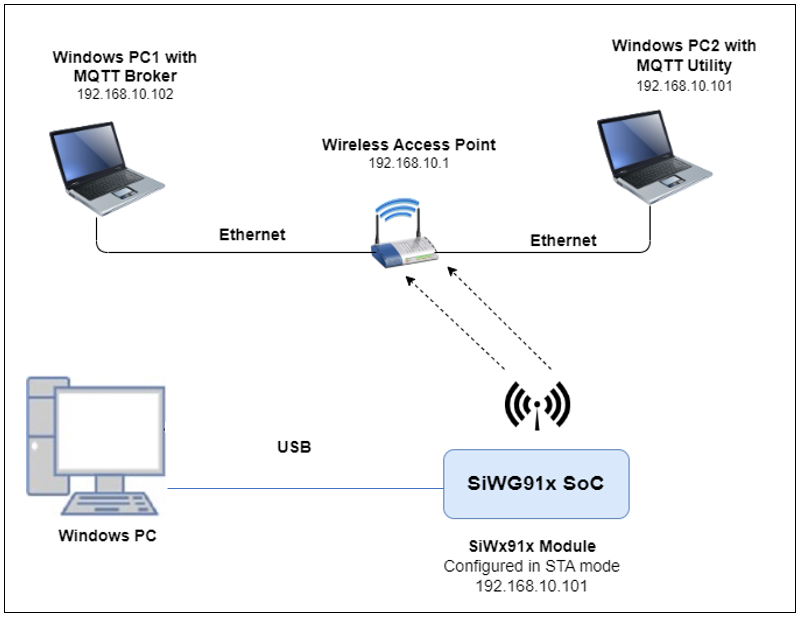
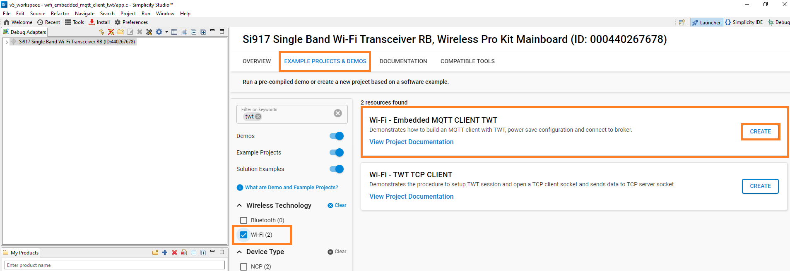
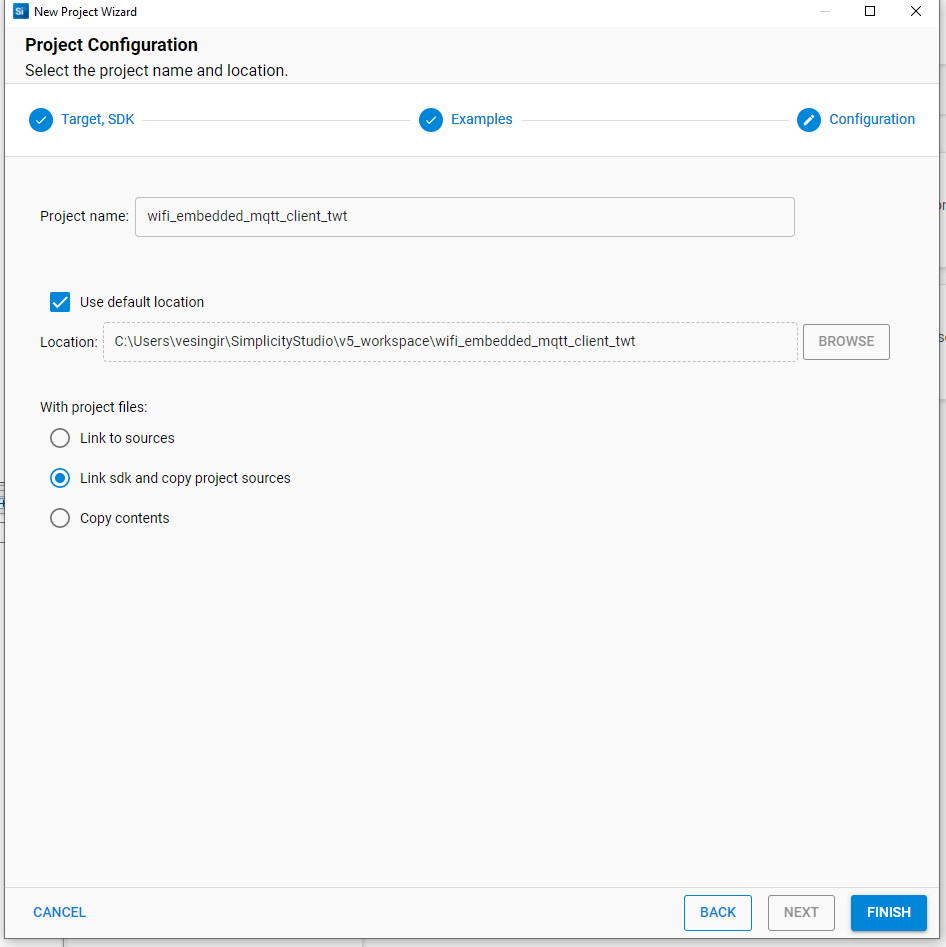
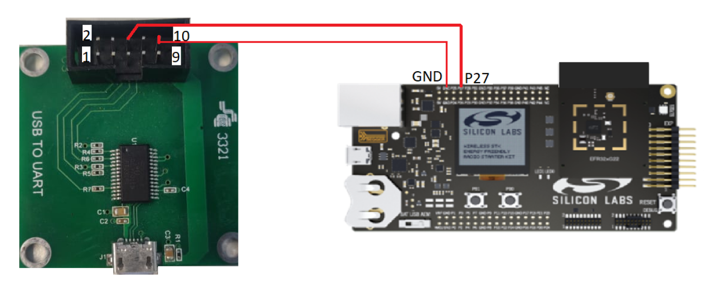
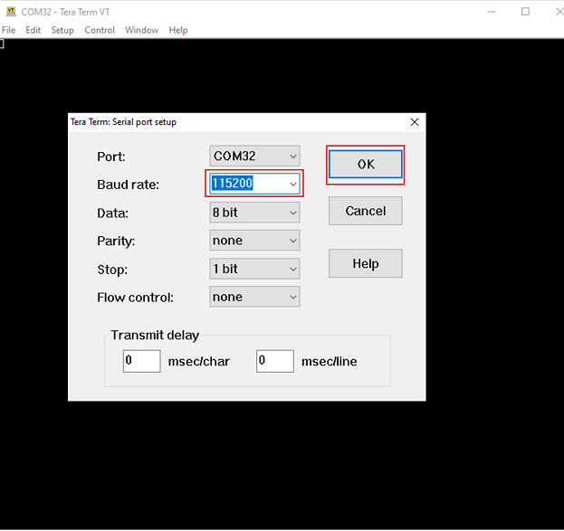
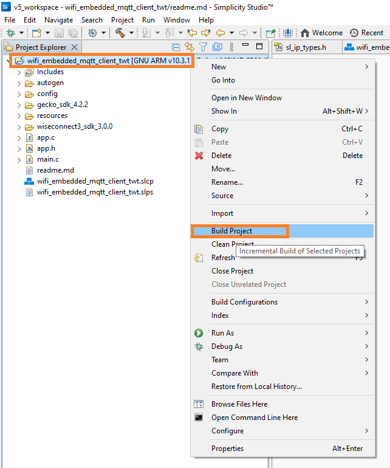
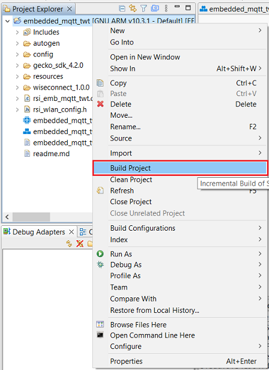
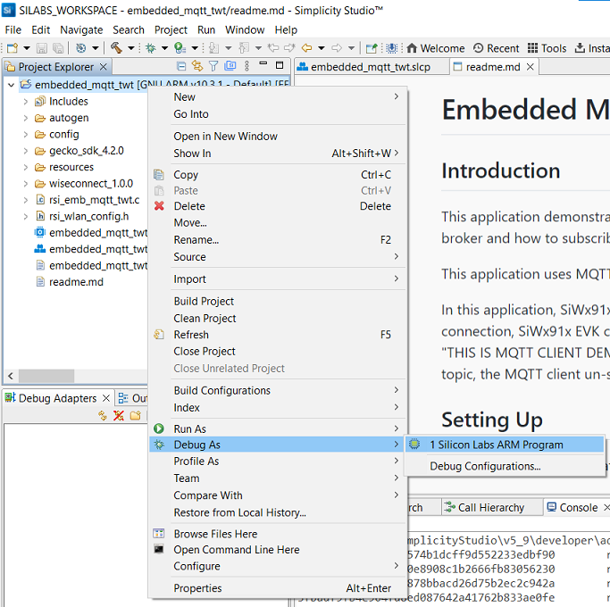
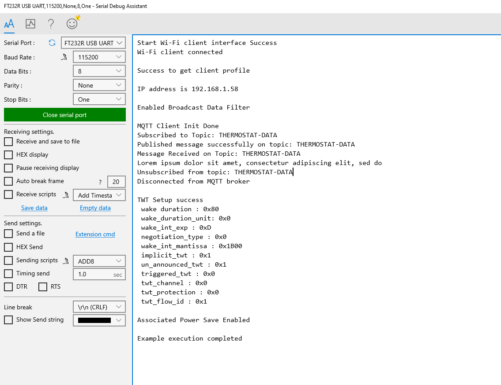

# Embedded MQTT TWT

## 1 Purpose/Scope

This application demonstrates how to SiWx91x is configured as an MQTT client, connects to an MQTT broker and maintains connection with broker while in TWT sleep. 
In this application, SiWx91x is configured as a Wi-Fi station and connects to an Access Point. After successful Wi-Fi connection, SiWx91x connects to a MQTT broker. Then application configures the TWT session and enables associated power save mode. 

## 2 Prerequisites/Setup Requirements

### 2.1 Hardware Requirements  

- A Windows PC

- A Wireless Access Point

- Windows PC1 (for running MQTT broker)

- Windows PC2 (for running MQTT client utility - MQTT Explorer)
- **SoC Mode**:
  - Silicon Labs [BRD4325A, BRD4325B, BRD4325C, BRD4325G, BRD4338A, BRD4340A](https://www.silabs.com/)
  - For Soc Mode, Simplicity Studio Energy Profiler can be used for the current consumption measurement - [Simplicity Studio Energy Profiler](#using-simplicity-studio-energy-profiler-for-current-measurement).
- **NCP Mode**:
  - Silicon Labs [BRD4180B](https://www.silabs.com/) **AND**
  - Host MCU Eval Kit. This example has been tested with:
    - Silicon Labs [WSTK + EFR32MG21](https://www.silabs.com/development-tools/wireless/efr32xg21-bluetooth-starter-kit)

### 2.2 Software Requirements

- Simplicity Studio IDE

  - Download the latest [Simplicity Studio IDE](https://www.silabs.com/developers/simplicity-studio)
  - Follow the [Simplicity Studio user guide](https://docs.silabs.com/simplicity-studio-5-users-guide/1.1.0/ss-5-users-guide-getting-started/install-ss-5-and-software#install-ssv5) to install Simplicity Studio IDE

  - [Mosquitto broker](https://mosquitto.org/download/)

  - [MQTT Explorer](http://mqtt-explorer.com/)

### 2.3 Setup Diagram

#### SoC Mode


  
#### NCP Mode  


**NOTE**:

- The Host MCU platform (EFR32MG21) and the SiWx91x interact with each other through the SPI interface.

## 3 Project Environment

- Ensure the SiWx91x loaded with the latest firmware following the [Upgrade Si91x firmware](https://docs.silabs.com/wiseconnect/latest/wiseconnect-getting-started/getting-started-with-soc-mode#upgrade-si-wx91x-connectivity-firmware)

- Ensure the latest Gecko SDK along with the extension WiSeConnect3 is added to Simplicity Studio.

### 3.1 Creating the project

#### 3.1.1 SoC mode

- Ensure the SiWx91x set up is connected to your PC.

- In the Simplicity Studio IDE, the SiWx91x SoC board will be detected under **Debug Adapters** pane as shown below.

  ****

#### 3.1.2 NCP mode

- Ensure the EFx32 and SiWx91x set up is connected to your PC.

- In the Simplicity Studio IDE, the EFR32 board will be detected under **Debug Adapters** pane as shown below.

  ****

### 3.2 Importing the project

- Studio should detect your board. Your board will be shown here. Click on the board detected and go to **EXAMPLE PROJECTS & DEMOS** section 

#### SOC Mode

- Select **Wi-Fi - Embedded MQTT Client TWT** test application

  ****

- Click 'Create'. The "New Project Wizard" window appears. Click 'Finish'

  ****

### 3.3 Set up for application prints

#### 3.3.1 Teraterm set up - for BRD4325A, BRD4325B, BRD4325C, BRD4325G, BRD4340A

You can use either of the below USB to UART converters for application prints.

1. Set up using USB to UART converter board.

   - Connect Tx (Pin-6) to P27 on WSTK
   - Connect GND (Pin 8 or 10) to GND on WSTK

   ****

2. Set up using USB to UART converter cable.

   - Connect RX (Pin 5) of TTL convertor to P27 on WSTK
   - Connect GND (Pin1) of TTL convertor to GND on WSTK

   ****

3. Open the Teraterm tool.

   - For SoC mode, choose the serial port to which USB to UART converter is connected and click on **OK**.

     ****

**Note:** For Other 917 SoC boards please refer section #3.3.2

#### 3.3.2 **Teraterm set up - for NCP and SoC modes**

1. Open the Teraterm tool.

- choose the J-Link port and click on **OK**.
    
    ****

2. Navigate to the Setup → Serial port and update the baud rate to **115200** and click on **OK**.

    ****

    ****

## 4 Application Build Environment

### 4.1 Configure the application

The application can be configured to suit user requirements and development environment. Read through the following sections and make any changes needed.

#### 4.1.1 In the Project explorer pane, expand the **config** folder and open the **sl_net_default_values.h** file. Configure the following parameters to enable your Silicon Labs Wi-Fi device to connect to your Wi-Fi network

- **STA instance related parameters**

	- DEFAULT_WIFI_CLIENT_PROFILE_SSID refers to the name with which Wi-Fi network that shall be advertised and Si91X module is connected to it.
	
  	```c
  	#define DEFAULT_WIFI_CLIENT_PROFILE_SSID               "YOUR_AP_SSID"      
  	```

	- DEFAULT_WIFI_CLIENT_CREDENTIAL refers to the secret key if the Access point is configured in WPA-PSK/WPA2-PSK security modes.

  	```c
  	#define DEFAULT_WIFI_CLIENT_CREDENTIAL                 "YOUR_AP_PASSPHRASE" 
  	```

	- DEFAULT_WIFI_CLIENT_SECURITY_TYPE refers to the security type if the Access point is configured in WPA/WPA2 or mixed security modes.

  	```c
  	#define DEFAULT_WIFI_CLIENT_SECURITY_TYPE              SL_WIFI_WPA2 
  	```
  
- Other STA instance configurations can be modified if required in `default_wifi_client_profile` configuration structure.

  - ENABLE_MQTT_SUBSCRIBE_PUBLISH is provided to enable or disable MQTT subscribe, publish, and disconnect in the application. If disabled (set to 0), the MQTT client connects to the broker and remains idle without any activity. If enabled (set to 1), it subscribes, publishes, and disconnects from the broker. 

      ```c
      #define ENABLE_MQTT_SUBSCRIBE_PUBLISH 0
      ```
**Note**:
> ENABLE_MQTT_SUBSCRIBE_PUBLISH is disabled by default, as the purpose of this application is to demonstrate power performance with TWT and without MQTT connection loss.

  - MQTT_BROKER_PORT port refers to the port number on which the remote MQTT broker/server is running.
      ```c
      #define MQTT_BROKER_PORT                                8886
      ```

  - MQTT_BROKER_IP refers remote peer IP address (Windows PC1) on which MQTT server is running. This needs to be configured at mqtt_broker_configuration variable declaration.

      ```c
      .ip         = SL_IPV4_ADDRESS(192, 168, 1, 0)
      ```

  - CLIENT_PORT port refers to the device MQTT client port number.

      ```c
      #define CLIENT_PORT                                1
      ```

  - CLIENT_ID refers to the unique ID with which the MQTT client connects to MQTT broker/server.

      ```c
      #define clientID "WIFI-SDK-MQTT-CLIENT"
      ```

  - TOPIC_TO_BE_SUBSCRIBED refers to the topic to which MQTT client is supposed to subscribe to.

      ```c
      #define TOPIC_TO_BE_SUBSCRIBED  "THERMOSTAT-DATA"
      ```

  - PUBLISH_TOPIC refers to the topic to which MQTT client is supposed to publish on.

      ```c
      #define PUBLISH_TOPIC  "THERMOSTAT-DATA"
      ```

  - PUBLISH_MESSAGE refers to message that would be published by MQTT client.

      ```c
      #define PUBLISH_MESSAGE    "Lorem ipsum dolor sit amet, consectetur adipiscing elit, sed do"
      ```

  - QOS_OF_PUBLISH_MESSAGE indicates quality of service using which MQTT client publishes message.

      ```c
      #define QOS_OF_PUBLISH_MESSAGE 0
      ```

  - IS_DUPLICATE_MESSAGE indicates whether message sent by MQTT client is a duplicated message.

      ```c
      #define IS_DUPLICATE_MESSAGE 0
      ```

  - IS_MESSAGE_RETAINED whether broker need to retain message published by MQTT client.

      ```c
      #define IS_MESSAGE_RETAINED 0
      ```

  - IS_CLEAN_SESSION indicates whether this connection is new one or continuation of last session

      ```c
      #define IS_CLEAN_SESSION 0
      ```

  - LAST_WILL_TOPIC Topic of last will message

      ```c
      #define LAST_WILL_TOPIC  "WiFiSDK-MQTT-CLIENT-LAST-WILL"
      ```

  - LAST_WILL_MESSAGE Message that would be published by broker if MQTT client disconnect abruptly.

      ```c
      #define LAST_WILL_MESSAGE  "WiFiSDK-MQTT-CLIENT has been disconnect from network"
      ```

  - QOS_OF_LAST_WILL Quality of service for last will message

      ```c
      #define QOS_OF_LAST_WILL  1
      ```

  - IS_LAST_WILL_RETAINED Whether broker needs to retail last will message of client

      ```c
      #define IS_LAST_WILL_RETAINED 1
      ```

  - ENCRYPT_CONNECTION Whether the connection between client and broker should be encrypted using SSL. 

      ```c
      #define ENCRYPT_CONNECTION  0
      ```

  - KEEP_ALIVE_INTERVAL client keep alive period in milliseconds

      ```c
      #define KEEP_ALIVE_INTERVAL                       100
      ```

  - MQTT_CONNECT_TIMEOUT Timeout for broker connection in milliseconds

      ```c
      #define MQTT_CONNECT_TIMEOUT                      5000
      ```

  - SEND_CREDENTIALS Whether to send username and password in connect request.

      ```c
      #define SEND_CREDENTIALS 0
      ```

  - USERNAME for login credentials

      ```c
      #define USERNAME "WIFISDK"
      ```

  - PASSWORD for login credentials

      ```c
      #define PASSWORD "password"
      ```

**Power save configuration**

  - By default, the application is configured without power save.

      ```c
      #define ENABLE_POWER_SAVE 0
      ```
  - If user wants to run the application in power save, modify the below macro.

      ```c
      #define ENABLE_POWER_SAVE 1
      ```
> Note: 
>  *  Once TWT SP started, beacon sync will happen as described below. This will be applicable till TWT teardown.
>     * Beacon sync will happen every 5 second if TWT interval is less then 5 second. Else it will happen at 600ms before every TWT SP start.
>  * Listen interval/DTIM skip/DTIM based sleep setting will not be applicable once TWT SP started. These setting will be applicable once TWT is teardown.

- While editing the above mentioned parameters, Simplicity Studio shows a warning, click on the "Make a Copy" option and edit the above mentioned parameters

   

#### 4.1.2 **iTWT Configuration**

There are three TWT configuration APIs. 
> * sl_wifi_target_wake_time_auto_selection - This API calculates and automatically configures TWT parameters based on the given inputs. Enables or disables a TWT session.
> * sl_wifi_enable_target_wake_time - Configures user given TWT parameters. Enables a TWT session.
> * sl_wifi_disable_target_wake_time - Disables a TWT session.

**sl_wifi_target_wake_time_auto_selection**

```c
sl_status_t sl_wifi_target_wake_time_auto_selection(sl_wifi_twt_selection_t *twt_auto_request)
```

Parameters of this API can be configured in *sl_wifi_twt_selection_t* structure. Below given are the parameter descriptions:
- twt_enable  :  1- Setup ; 0 - teardown
- tx_latency  :  The period, in milliseconds, within which the given Tx operation needs to be completed. Valid values is either 0 or in the range of [200ms - 6hrs]
- rx_latency  :  The maximum allowed receive latency, in milliseconds, when an Rx packet is buffered at the AP. If rx_latency is less than <= 1sec (except 0), session creation is not possible. For default configuration, input 0.
- avg_tx_throughput  :  The expected average throughput, in Kilo Bytes per seconds, to be achieved within the Tx latency. Valid value is 0 to half of Device Throughput ( = 20MBPS / 2).

Enable TWT_AUTO_CONFIG MACRO in the app.c file.

Given below are sample configurations.
```c
sl_wifi_twt_selection_t default_twt_selection_configuration = {
  .twt_enable                            = 1,
  .average_tx_throughput                 = 1000,
  .tx_latency                            = 0,
  .rx_latency                            = 5000,
  .device_average_throughput             = DEVICE_AVERAGE_THROUGHPUT,
  .estimated_extra_wake_duration_percent = ESTIMATE_EXTRA_WAKE_DURATION_PERCENT,
  .twt_tolerable_deviation               = TWT_TOLERABLE_DEVIATION,
  .default_wake_interval_ms              = TWT_DEFAULT_WAKE_INTERVAL_MS,
  .default_minimum_wake_duration_ms      = TWT_DEFAULT_WAKE_DURATION_MS,
  .beacon_wake_up_count_after_sp         = MAX_BEACON_WAKE_UP_AFTER_SP
};
```
Sample API call is given as below : 
```c
status                            = sl_wifi_target_wake_time_auto_selection(&performance_profile.twt_selection);
```
There are default macro settings that are used for calculating the iTWT parameters. 

Sample Macro Settings : 
```c
#define DEVICE_AVG_THROUGHPUT                20000 \\ KBPS
#define ESTIMATE_EXTRA_WAKE_DURATION_PERCENT 0 \\ in percentage
#define TWT_TOLERABLE_DEVIATION              10 \\ in percentage
#define TWT_DEFAULT_WAKE_INTERVAL_MS         1024     // in milli seconds
#define TWT_DEFAULT_WAKE_DURATION_MS         16       // in milli seconds
#define MAX_TX_AND_RX_LATENCY_LIMIT          22118400 // 6hrs in milli seconds
#define MAX_BEACON_WAKE_UP_AFTER_SP \
  2 // The number of beacons after the service period completion for which the module wakes up and listens for any pending RX.
```
Note :  WLAN Keep Alive should not be disabled while using this API.

**sl_wifi_enable_target_wake_time API**

```c
sl_status_t sl_wifi_enable_target_wake_time(sl_wifi_twt_request_t *twt_req)
```

iTWT parameters should be configured and filled into the structure type *sl_wifi_twt_request_t*  in app.c and passed as a parameter to *sl_wifi_enable_target_wake_time()* API.

Given below are sample configurations.

```c
sl_wifi_twt_request_t default_twt_setup_configuration = {
  .twt_enable              = 1,
  .twt_flow_id             = 1,
  .wake_duration           = 0x80,
  .wake_duration_unit      = 0,
  .wake_duration_tol       = 0x80,
  .wake_int_exp            = 13,
  .wake_int_exp_tol        = 13,
  .wake_int_mantissa       = 0x1B00,
  .wake_int_mantissa_tol   = 0x1B00,
  .implicit_twt            = 1,
  .un_announced_twt        = 1,
  .triggered_twt           = 0,
  .twt_channel             = 0,
  .twt_protection          = 0,
  .restrict_tx_outside_tsp = 1,
  .twt_retry_limit         = 6,
  .twt_retry_interval      = 10,
  .req_type                = 1,
  .negotiation_type        = 0,
};
```
These parameters with their limits are defined as below.

- **twt_enable**:  1- Setup ; 0 - teardown
- **twt_flow_id**: range 0-7 or 0xFF
- **twt_req_params**: Structure with parameters in case of setup and NULL in case of teardown.
- **wake_duration**: This is the nominal minimum wake duration of TWT. This is the time for which DUT will be in wake state for Transmission or reception of data. Allowed values range is  0-255.
- **wake_duration_unit**: This parameter defines unit for wake_duration. Allowed values are  0 (256uS) and 1 (1024uS).
- **wake_duration_tol**: This is the tolerance allowed for wake duration in case of suggest TWT. Received TWT wake duration from AP will be validated against tolerance limits and decided if TWT config received is in acceptable range. Allowed values are 0-255.
- **wake_int_exp**: TWT Wake interval exponent. It is exponent to base 2. Allowed values are 0 - 31.
- **wake_int_exp_tol**: This is the allowed tolerance for wake_int_exp in case of suggest TWT request. Received TWT wake interval exponent from AP will be validated against tolerance limits and decided if TWT config received is in acceptable range. Allowed values are 0 - 31.
- **wake_int_mantissa**: This is the TWT wake interval mantissa. Allowed values are 0-65535.
- **wake_int_mantissa_tol**: This is tolerance allowed for wake_int_mantissa in case of suggest TWT. Received TWT wake interval mantissa from AP will be validated against tolerance limits and decided if TWT config received is in acceptable range. Allowed values are 0-65535.
- **implicit_twt**: If enabled (1), the TWT requesting STA calculates the Next TWT by adding a fixed value to the current TWT value. Explicit TWT is currently not allowed.
- **un_announced_twt**: If enabled (1), TWT requesting STA does not announce its wake up to AP through PS-POLLs or UAPSD Trigger frames.
- **triggered_twt**: If enabled(1), at least one trigger frame is included in the TWT Service Period(TSP).
- **twt_channel**: Currently this configuration is not supported. Allowed values are 0-7.
- **twt_protection**:  If enabled (1), TSP is protected. This is negotiable with AP. Currently not supported. Only zero is allowed.
- **restrict_tx_outside_tsp**: If enabled (1), any Tx outside the TSP is restricted. Else, TX can happen outside the TSP also.
- **twt_retry_limit**: This is the maximum number of retries allowed, if the TWT response frame is not received for the sent TWT request frame. Allowed values are 0 - 15.
- **twt_retry_interval**: The interval, in seconds, between two twt request retries. Allowed values are 5 - 255.
- **req_type**: This is the TWT request type.
> * 0 - Request TWT
> * 1 - Suggest TWT
> * 2 - Demand TWT

Below is the sample TWT setup API call.
```c
status                          = sl_wifi_enable_target_wake_time(&twt_request);
```

> Note:
> * TWT Wake duration depends on the wake duration unit. For example, for the above configuration, wake duration value is  (0xE0 * 256 = 57.3 msec).
> * TWT Wake interval is calculated as mantissa *2 ^ exp.  For example, for the above configuration, wake interval value is (0x1B00 * 2^13  = 55.2 sec).
> * Configuring TWT Wake interval beyond 1 min might lead to disconnections from the AP.
> * There might be disconnections while using TWT with wake interval > 4sec when connected to an AP with non-zero GTK key renewal time.
> * Keep Alive timeout should be non-zero when negotiated TWT setup is **unannounced**, otherwise there might be disconnections.

**iTWT Teardown Configuration**

To teardown TWT session use the matching TWT API:
1. For TWT Auto Selection API :
```c
status = sl_wifi_target_wake_time_auto_selection(twt_selection);
```
Set twt_enable parameter to 0 in the twt_selection structure. The other parameters are ignored. 

2. For user given TWT parameters API call the API as follows:

```c
status = sl_wifi_disable_target_wake_time(&twt_req);
```
* twt_req->twt_enable should be set to '0' for teardown operation.

* twt_req->twt_flow_id should be configured as described below: 
> * This paramater value range is 0-7. It should be same as setup flow ID, other wise error will be triggered.
> * 0xFF - To teardown all active sessions. This value is valid only in case of teardown command.

* Rest of the parameters in the structure are ignored for a Teardown operation. 

> Note : For setting a new TWT session, the existing TWT session must be teared down.

**iTWT Command Status Codes**

The following are the possible TWT command status codes.

|S.No |MACRO  |Error code |Description| SAPI/WLAN error code|
|:------:|:--------|:--------|:-----------------------------|:--------|
|1.|ERROR_COMMAND_GIVEN_IN_WRONG_STATE| 0xFFFD| Occurs when the API is given before opermode is done for this particular API.|SAPI|
|2.|ERROR_INVALID_PARAM|0xFFFE|Occurs when invalid parameters are passed to this API.|SAPI|
|3.|TWT_SUPPORT_NOT_ENABLED_ERR|0x70|When HE_PARAMS_SUPPORT and TWT_SUPPORT macros are not enabled|FW|
|4.|TWT_SETUP_ERR_SESSION_ACTIVE|0x71|Occurs when user tries to give TWT config command when there is an already active TWT session.|FW|
|5.|TWT_TEARDOWN_ERR_FLOWID_NOT_MATCHED|0x72|Occurs when TWT teardown command is given with a flow ID that does not match existing session flow ID.|FW|
|6.|TWT_TEARDOWN_ERR_NOACTIVE_SESS|0x73|Occurs when teardown command is given while there is no active session.|FW|
|7.|TWT_SESSION_NOT_FEASIBLE|0x74|This error code indicates that TWT session is not feasible. It is thrown only when TWT Auto Selection API is used.|FW|

**iTWT Session Status Codes**

User can get asynchronous TWT session updates if *twt_response_handler* is defined and the callback is registered. A *twt_response_handler* is provided in the example application. The following are the TWT session status codes.

|S.No|  MACRO|  Session status code|  Description|
|:----|:------|:-------------------|:--------------|
|1.|  TWT_SESSION_SUCC| 0|  TWT session setup success. TWT session is active.|
|2.|  TWT_UNSOL_SESSION_SUCC| 1|  Unsolicited TWT setup response from AP accepted. TWT session is active.|
|3.|  TWT_SETUP_AP_REJECTED|  4|  TWT Reject frame received in response for the sent TWT setup frame.|
|4.|  TWT_SETUP_RSP_OUTOF_TOL|5|  TWT response parameters from AP for TWT Suggest request is not within tolerance set by User.|
|5.|  TWT_SETUP_RSP_NOT_MATCHED|  6|  TWT response parameters from AP for TWT Demand request does not match parameters given by User.|
|6.|  TWT_SETUP_UNSUPPORTED_RSP|  10| Unsupported TWT response from AP.|
|7.|  TWT_TEARDOWN_SUCC|  11| TWT session teardown success|
|8.|  TWT_AP_TEARDOWN_SUCC| 12| TWT session teardown from AP success|
|9.|  TWT_SETUP_FAIL_MAX_RETRIES_REACHED| 15| TWT setup request retried maximum number of times as configured by user.|
|10.| TWT_INACTIVE_DUETO_ROAMING| 16  |TWT session inactive due to roaming|
|11.| TWT_INACTIVE_DUETO_DISCONNECT|  17| TWT session inactive due to disconnect|
|12.| TWT_INACTIVE_NO_AP_SUPPORT| 18| TWT session inactive as connected AP does not support TWT.|

> Note:
> **twt_session_active** variable is provided in the example application and is updated according to the asychronous TWT session notifications. User can utilise this variable to teardown or configure new session parameters depending upon existing session status. 

#### 4.1.3 Recommendations

1. Use sl_wifi_target_wake_time_auto_selection with appropriate Rx Latency input according to the user scenario as it has improved  design over sl_wifi_enable_target_wake_time, handles Embedded MQTT level disconnections and has better user interface. 
2. iTWT setup is recommended after IP assignment/TCP connection/application connection.
3. When using sl_wifi_target_wake_time_auto_selection API, increase TCP / ARP Timeouts at remote side depending upon the configured Rx Latency.
4. When using sl_wifi_enable_target_wake_time, increase TCP / ARP Timeouts at remote side depending upon the configured TWT interval configured.
5. For iTWT, GTK Interval Should be kept maximum possible value or zero. If GTK interval is not configurable, recommended TWT interval (in case of sl_wifi_enable_target_wake_time) / RX Latency (in case of sl_wifi_target_wake_time_auto_selection API) is less than 4sec.
6. When sl_wifi_enable_target_wake_time API is used, configuring TWT Wake interval beyond 1 min might lead to disconnections from the AP. Recommended to use TWT wakeup interval less than or equal to 1 min.
7. WLAN Keep Alive timeout should not be disabled when sl_wifi_target_wake_time_auto_selection API is used or when unannounced TWT session is set up using sl_wifi_enable_target_wake_time API. It is recommended to use WLAN Keep Alive timeout of 30 sec.

### 4.2 Build the application

- SoC mode:

    

- NCP mode:

   

### 4.3 Run and Test the application

- Once the build was successful, right click on project and click on Debug As->Silicon Labs ARM Program as shown in below image.

  - SoC

    

  - NCP

    

- Once the SiWx91x gets connected to the MQTT broker, it will subscribe to the topic **TOPIC_TO_BE_SUBSCRIBED (Ex: "THERMOSTAT-DATA")**. The user can see the client connected and subscription success information in the MQTT broker.

   ****

- SiWx91x publishes a message which is given in **PUBLISH_MESSAGE**
  (Ex: "Lorem ipsum dolor sit amet, consectetur adipiscing elit, sed do") on **PUBLISH_TOPIC(Ex: THERMOSTAT-DATA)**

- MQTT Explorer which is running on Windows PC2 will receive the message published by the SiWx91x EVK as it subscribed to the same topic.

   ****

- Now to publish a message using MQTT Explorer, enter the topic name under **Publish** tab, select **raw** data format, type the data that user wishes to send and then click on **publish**. This message will be received by the SiWx91x.

    ****

- In the MQTT broker and on the terminal, user can observe the published message as the MQTT client is subscribed to that topic.

   ****

- SiWx91x unsubscribes to the topic that it has subscribe after receiving the message that was published by MQTT Explorer running on Windows PC2.

- Once subscription is successful, SiWx91x disconnects from the broker.

**Procedure for executing the application when enabled with SSL**

1. Install MQTT broker in Windows PC1 which is connected to Access Point through LAN.

2. Update the **mosquito.conf** file with the proper file paths, in which the certificates are available in the mosquitto.conf file.

3. Also, add **certs** folder to the mosquitto broker folder.

4. Execute the following command in MQTT server installed folder. (Ex:  C:\Program Files\mosquitto>mosquitto.exe -c mosquitto.conf -v) (Port should be 8883)

   `mosquitto.exe -c mosquitto.conf -v`  
  
   ****

5. If you see any error - Unsupported tls_version **tlsv1**, just comment the **tls_version tlsv1** in **mosquitto.conf** file.

**Note**:
> Multiple MQTT client instances can be created.
> If mosquitto isn't allowing external connections to broker, add the below lines in **mosquitto.conf** file:

  ```c
  listener 8886
  allow_anonymous true
  ```

> For using a different config file for mosquitto broker, use command:
  `mosquitto -v -p 8886 -c config/mosquitto.conf`
  where **config** is the sub folder and **mosquitto.conf** is the different config file than default.

### 4.4 Application Output

**Application Prints - SoC mode**:

   ****

**Application Prints - NCP mode**:

   ****

### 4.5 Additional Information

**Steps to set up MQTT server**

1. To run MQTT broker on port 8886 in Windows PC1, open command prompt and go to MQTT installed folder (Ex: C:\Program Files\mosquitto) and run the following command: 

   ```c
   mosquitto.exe –p 8886 –v
   ```

   ****

2. Open MQTT Explorer in Windows PC2 and delete the existing connections if any and click on **Advanced** as shown in the below image.

   ****

3. Delete the existing topic names if any. Enter the desired **TOPIC_NAME** in topic field and click on **ADD**. Then the desired topic name can be observed in the topic list and click on **BACK** as shown in below image.

   ****

4. Connect to MQTT broker by giving IP address and port number of Windows PC1 in HOST and PORT fields in MQTT Explorer respectively and click on **CONNECT** to connect to the MQTT broker. If you are running your MQTT broker on the same PC then the following configuration is made as shown in the below image.

   ****