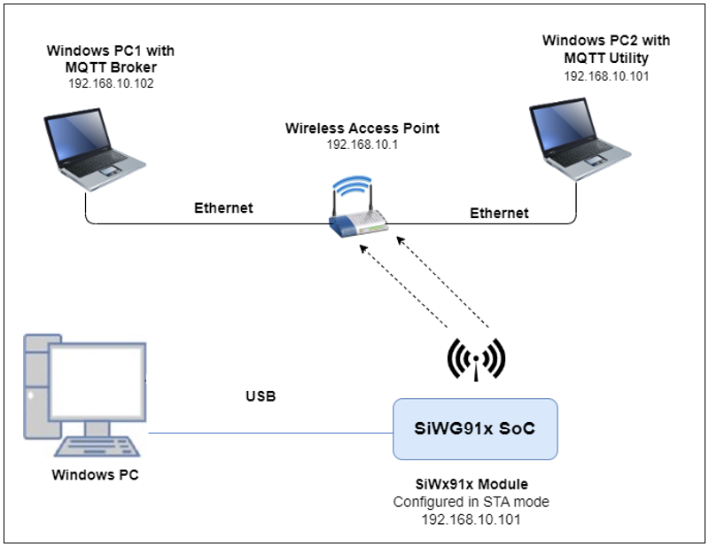
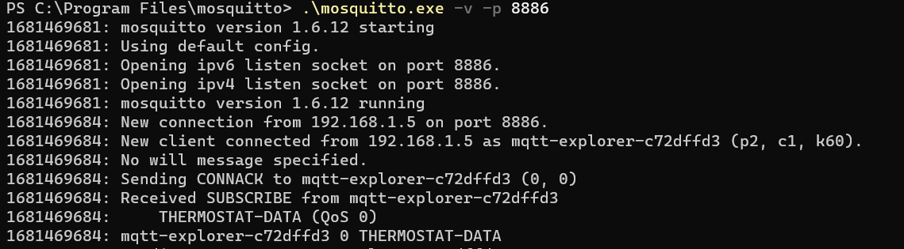
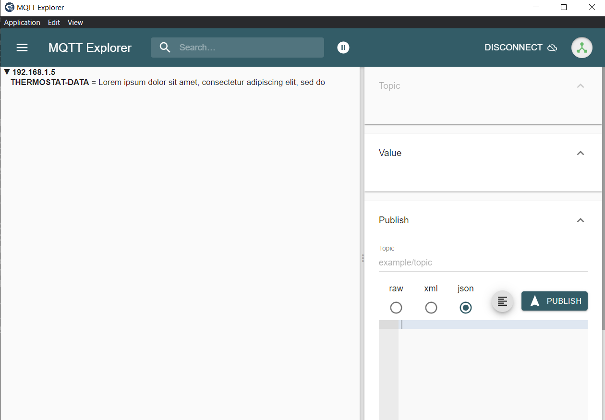
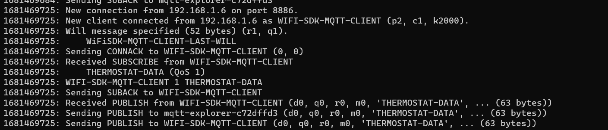
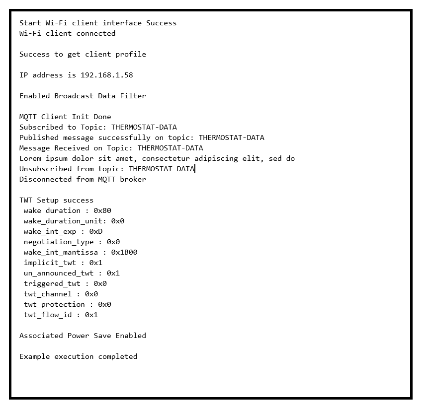
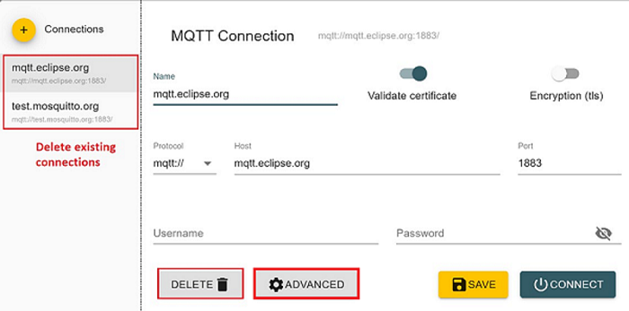

# Wi-Fi - Embedded MQTT Client TWT

## Table of Contents

- [Purpose/Scope](#purposescope)
- [Prerequisites/Setup Requirements](#prerequisitessetup-requirements)
  - [Hardware Requirements](#hardware-requirements)
  - [Software Requirements](#software-requirements)
  - [Setup Diagram](#setup-diagram)
- [Getting Started](#getting-started)
- [Application Build Environment](#application-build-environment)
- [iTWT Session Status Codes](#itwt-session-status-codes)
- [TWT Recommendations](#twt-recommendations)
- [Test the Application](#test-the-application)
- [Application Output](#application-output)

## Purpose/Scope

This application demonstrates how SiWx91x is configured as an MQTT client, connects to an MQTT broker, and maintains connection with broker while in TWT sleep. 
The application configures the TWT session and enables associated power save mode. 

## Prerequisites/Setup Requirements

### Hardware Requirements  

- Windows PC

- Wireless Access Point

- Windows PC1 (for running MQTT broker)

- Windows PC2 (for running MQTT client utility - MQTT Explorer)
- **SoC Mode**:
  - Standalone
    - BRD4002A Wireless Pro Kit Mainboard [SI-MB4002A]
    - Radio Boards 
  	  - BRD4338A [SiWx917-RB4338A]
  	  - BRD4343A [SiWx917-RB4343A]
  - Kits
  	- SiWx917 Pro Kit [Si917-PK6031A](https://www.silabs.com/development-tools/wireless/wi-fi/siwx917-pro-kit?tab=overview)
  	- SiWx917 Pro Kit [Si917-PK6032A]
     - SiWx917 AC1 Module Explorer Kit (BRD2708A)
  	
- **NCP Mode**:
  - Standalone
    - BRD4002A Wireless pro kit mainboard [SI-MB4002A]
    - EFR32xG24 Wireless 2.4 GHz +10 dBm Radio Board [xG24-RB4186C](https://www.silabs.com/development-tools/wireless/xg24-rb4186c-efr32xg24-wireless-gecko-radio-board?tab=overview)
    - NCP Expansion Kit with NCP Radio Boards
      - (BRD4346A + BRD8045A) [SiWx917-EB4346A]
      - (BRD4357A + BRD8045A) [SiWx917-EB4357A]
  - Kits
  	- EFR32xG24 Pro Kit +10 dBm [xG24-PK6009A](https://www.silabs.com/development-tools/wireless/efr32xg24-pro-kit-10-dbm?tab=overview)
  - Interface and Host MCU Supported
    - SPI - EFR32 
    - UART - EFR32

### Software Requirements

- [Simplicity Studio IDE](https://www.silabs.com/developers/simplicity-studio)

- [Mosquitto broker](https://mosquitto.org/download/)

- [MQTT Explorer](http://mqtt-explorer.com/)

### Setup Diagram



## Getting Started

Refer to the instructions [here](https://docs.silabs.com/wiseconnect/latest/wiseconnect-getting-started/) to:

- [Install Simplicity Studio](https://docs.silabs.com/wiseconnect/latest/wiseconnect-developers-guide-developing-for-silabs-hosts/#install-simplicity-studio)
- [Install WiSeConnect 3 extension](https://docs.silabs.com/wiseconnect/latest/wiseconnect-developers-guide-developing-for-silabs-hosts/#install-the-wi-se-connect-3-extension)
- [Connect your device to the computer](https://docs.silabs.com/wiseconnect/latest/wiseconnect-developers-guide-developing-for-silabs-hosts/#connect-si-wx91x-to-computer)
- [Upgrade your connectivity firmware ](https://docs.silabs.com/wiseconnect/latest/wiseconnect-developers-guide-developing-for-silabs-hosts/#update-si-wx91x-connectivity-firmware)
- [Create a Studio project ](https://docs.silabs.com/wiseconnect/latest/wiseconnect-developers-guide-developing-for-silabs-hosts/#create-a-project)

For details on the project folder structure, see the [WiSeConnect Examples](https://docs.silabs.com/wiseconnect/latest/wiseconnect-examples/#example-folder-structure) page.

## Application Build Environment
The application can be configured to suit user requirements and development environment. Read through the following sections and make any changes needed.

#### In the Project explorer pane, expand the **config** folder and open the **sl_net_default_values.h** file. Configure the following parameters to enable your Silicon Labs Wi-Fi device to connect to your Wi-Fi network.

- **STA instance related parameters**

  - DEFAULT_WIFI_CLIENT_PROFILE_SSID refers to the name with which Wi-Fi network that shall be advertised and Si91X module is connected to it.
 
   ```c
   #define DEFAULT_WIFI_CLIENT_PROFILE_SSID               "YOUR_AP_SSID"      
   ```

  - DEFAULT_WIFI_CLIENT_CREDENTIAL refers to the secret key if the Access point is configured in WPA-PSK/WPA2-PSK security modes.

   ```c
   #define DEFAULT_WIFI_CLIENT_CREDENTIAL                 "YOUR_AP_PASSPHRASE" 
   ```

  - DEFAULT_WIFI_CLIENT_SECURITY_TYPE refers to the security type if the Access point is configured in WPA/WPA2 or mixed security modes.

   ```c
   #define DEFAULT_WIFI_CLIENT_SECURITY_TYPE              SL_WIFI_WPA2 
   ```
> Note: 
> You can configure default region-specific regulatory information using `sl_wifi_region_db_config.h`.

- Other STA instance configurations can be modified if required in `default_wifi_client_profile` configuration structure.

     - ENABLE_MQTT_SUBSCRIBE_PUBLISH is provided to enable or disable MQTT subscribe, publish, and disconnect in the application. If disabled (set to 0), the MQTT client connects to the broker and remains idle without any activity. If enabled (set to 1), it subscribes, publishes, and disconnects from the broker. 

      ```c
      #define ENABLE_MQTT_SUBSCRIBE_PUBLISH 0
      ```

> Note:
> ENABLE_MQTT_SUBSCRIBE_PUBLISH is disabled by default because the purpose of this application is to demonstrate power performance with TWT and without MQTT connection loss.
 
- MQTT_BROKER_PORT port refers to the port number on which the remote MQTT broker/server is running.

     ```c
     #define MQTT_BROKER_PORT                                8886
     ```

- MQTT_BROKER_IP refers to remote peer IP address (Windows PC1) on which MQTT server is running. This needs to be configured at mqtt_broker_configuration variable declaration.

     ```c
     .ip         = SL_IPV4_ADDRESS(192, 168, 1, 0)
     ```

- CLIENT_PORT port refers to the device MQTT client port number.

     ```c
     #define CLIENT_PORT                                1
     ```

- CLIENT_ID refers to the unique ID with which the MQTT client connects to MQTT broker/server.

     ```c
     #define clientID "WIFI-SDK-MQTT-CLIENT"
     ```

- TOPIC_TO_BE_SUBSCRIBED refers to the topic to which MQTT client is supposed to subscribe to.

     ```c
     #define TOPIC_TO_BE_SUBSCRIBED  "THERMOSTAT-DATA"
     ```

- PUBLISH_TOPIC refers to the topic to which MQTT client is supposed to publish on.

     ```c
     #define PUBLISH_TOPIC  "THERMOSTAT-DATA"
     ```

- PUBLISH_MESSAGE refers to message that would be published by MQTT client.

     ```c
     #define PUBLISH_MESSAGE    "Lorem ipsum dolor sit amet, consectetur adipiscing elit, sed do"
     ```

- QOS_OF_PUBLISH_MESSAGE indicates quality of service used wtih which MQTT client publishes message.

     ```c
     #define QOS_OF_PUBLISH_MESSAGE 0
     ```

- IS_DUPLICATE_MESSAGE indicates whether message sent by MQTT client is a duplicated message.

     ```c
     #define IS_DUPLICATE_MESSAGE 0
     ```

- IS_MESSAGE_RETAINED whether broker needs to retain message published by MQTT client.

     ```c
     #define IS_MESSAGE_RETAINED 0
     ```

- IS_CLEAN_SESSION indicates whether this connection is a new one or a continuation of last session.

     ```c
     #define IS_CLEAN_SESSION 0
     ```

- LAST_WILL_TOPIC Topic of last will message.

     ```c
     #define LAST_WILL_TOPIC  "WiFiSDK-MQTT-CLIENT-LAST-WILL"
     ```

- LAST_WILL_MESSAGE Message that would be published by broker if MQTT client disconnected abruptly.

     ```c
     #define LAST_WILL_MESSAGE  "WiFiSDK-MQTT-CLIENT has been disconnect from network"
     ```

- QOS_OF_LAST_WILL Quality of service for last will message.

     ```c
     #define QOS_OF_LAST_WILL  1
     ```

- IS_LAST_WILL_RETAINED Whether broker needs to retain last will message of client.

     ```c
     #define IS_LAST_WILL_RETAINED 1
     ```

- ENCRYPT_CONNECTION Whether the connection between client and broker should be encrypted using SSL. 

     ```c
     #define ENCRYPT_CONNECTION  0
     ```

- KEEP_ALIVE_INTERVAL client keep alive period in seconds.

     ```c
     #define KEEP_ALIVE_INTERVAL                       100
     ```

- MQTT_CONNECT_TIMEOUT Timeout for broker connection in milliseconds

     ```c
     #define MQTT_CONNECT_TIMEOUT                      5000
     ```

- SEND_CREDENTIALS Whether to send username and password in connect request.

     ```c
     #define SEND_CREDENTIALS 0
     ```

- USERNAME for login credentials.

     ```c
     #define USERNAME "WIFISDK"
     ```

- PASSWORD for login credentials.

     ```c
     #define PASSWORD "password"
     ```

- Power save configuration.

     - By default, the application is configured without power save.

          ```c
          #define ENABLE_NWP_POWER_SAVE 0
          ```

     - If you want to run the application in power save, modify the macro below.

          ```c
          #define ENABLE_NWP_POWER_SAVE 1
          ```

     > Note: 
     >
     > - Once TWT SP starts, the beacon sync will happen as described below. This will be applicable till TWT teardown.
     >   - Beacon sync will happen every 5 second if TWT interval is less then 5 seconds. Else, it will happen at 600 ms before every TWT SP start.
     > - Listen interval/DTIM skip/DTIM based sleep setting will not be applicable once TWT SP started. These settings will be applicable after TWT teardown.
     > - If Simplicity Studio displays a warning while you are editing the above mentioned parameters, click on the "Make a Copy" option and edit the parameters.
     > 

- iTWT Configuration

     To configure iTWT parameters, open **app.c**.
     There are three TWT configuration APIs. 
     >
     > - **sl_wifi_target_wake_time_auto_selection** - This API calculates and automatically configures suitable TWT parameters based on the given inputs. Enables or disables a TWT session. Recommended for user applications. 
     > - **sl_wifi_enable_target_wake_time** - This API allows users to manually configure iTWT session parameters and enables the iTWT session. This API is not recommended for users. It is for internal certification purposes only.
     > - **sl_wifi_disable_target_wake_time** - Disables a TWT session.


     **sl_wifi_target_wake_time_auto_selection API:**

     ```c
     sl_status_t sl_wifi_target_wake_time_auto_selection(sl_wifi_twt_selection_t *twt_auto_request)
     ```

     This TWT API is recommended because it's designed for maintaining connections, improving throughput, and enhancing power performance.

     Input parameter descriptions are as follows:

     - **twt_enable** : TWT enable. 0 - TWT session teardown; 1 - TWT session setup.
     - **average_tx_throughput** : This is the expected average Tx throughput in Kbps. Value ranges from 0 to 10 Mbps, which is half of the default [device_average_throughput](https://docs.silabs.com/wiseconnect/latest/wiseconnect-api-reference-guide-wi-fi/sl-wifi-twt-selection-t#device-average-throughput) (20 Mbps by default).
     - **tx_latency** : The allowed latency, in milliseconds, within which the given Tx operation is expected to be completed. If 0 is configured, maximum allowed Tx latency is same as rx_latency. Otherwise, valid values are in the range of [200 ms - 6 hrs].
     - **rx_latency** : The maximum latency, in milliseconds, for receiving buffered packets from the AP. The device wakes up at least once for a TWT service period within the configured rx_latency if there are any pending packets destined for the device from the AP. If set to 0, the default latency of 2 seconds is used. Valid range is between 2 seconds to 6 hours. Recommended range is 2 seconds to 60 seconds to avoid connection failures with AP due to longer sleep time.

     For more information on input parameters, refer [sl_wifi_twt_selection_t](https://docs.silabs.com/wiseconnect/latest/wiseconnect-api-reference-guide-wi-fi/sl-wifi-twt-selection-t).

     Enable TWT_AUTO_CONFIG MACRO in the app.c file to enable usage of this API.

     ```c
     #define TWT_AUTO_CONFIG         1
     ```
     Given below are sample configurations.

     ```c
          sl_wifi_twt_selection_t default_twt_selection_configuration = {
          .twt_enable                            = 1,
          .average_tx_throughput                 = 1000,
          .tx_latency                            = 0,
          .rx_latency                            = 5000,
          .device_average_throughput             = DEVICE_AVERAGE_THROUGHPUT,
          .estimated_extra_wake_duration_percent = ESTIMATE_EXTRA_WAKE_DURATION_PERCENT,
          .twt_tolerable_deviation               = TWT_TOLERABLE_DEVIATION,
          .default_wake_interval_ms              = TWT_DEFAULT_WAKE_INTERVAL_MS,
          .default_minimum_wake_duration_ms      = TWT_DEFAULT_WAKE_DURATION_MS,
          .beacon_wake_up_count_after_sp         = MAX_BEACON_WAKE_UP_AFTER_SP
          };
     ```
     - The following are the default macro settings. Do not change these values as it may affect the working of the algorithm. 

     ```c
     #define DEVICE_AVG_THROUGHPUT                20000    // Kbps
     #define ESTIMATE_EXTRA_WAKE_DURATION_PERCENT 0        // in percentage
     #define TWT_TOLERABLE_DEVIATION              10       // in percentage
     #define TWT_DEFAULT_WAKE_INTERVAL_MS         1024     // in milli seconds
     #define TWT_DEFAULT_WAKE_DURATION_MS         16       // in milli seconds
     #define MAX_TX_AND_RX_LATENCY_LIMIT          22118400 // 6 hrs in milli seconds
     #define MAX_BEACON_WAKE_UP_AFTER_SP \
     2 // The number of beacons after the service period completion for which the module wakes up and listens for any pending RX.
     ```

     >**Note** : 
     >
     > WLAN Keep Alive should not be disabled while using this API.

          
     **sl_wifi_enable_target_wake_time API**

     Usage of this API requires knowledge of individual TWT setup negotiation. This API doesn't take care of network disconnections.
     ```c
     sl_status_t sl_wifi_enable_target_wake_time(sl_wifi_twt_request_t *twt_req)
     ```

     iTWT parameters should be configured and filled into the structure type *sl_wifi_twt_request_t*  in app.c and passed as a parameter to *sl_wifi_enable_target_wake_time()* API.

     Given below are sample configurations.

     ```c
     sl_wifi_twt_request_t default_twt_setup_configuration = {
     .twt_enable              = 1,
     .twt_flow_id             = 1,
     .wake_duration           = 0x80,
     .wake_duration_unit      = 0,
     .wake_duration_tol       = 0x80,
     .wake_int_exp            = 13,
     .wake_int_exp_tol        = 13,
     .wake_int_mantissa       = 0x1B00,
     .wake_int_mantissa_tol   = 0x1B00,
     .implicit_twt            = 1,
     .un_announced_twt        = 1,
     .triggered_twt           = 0,
     .twt_channel             = 0,
     .twt_protection          = 0,
     .restrict_tx_outside_tsp = 1,
     .twt_retry_limit         = 6,
     .twt_retry_interval      = 10,
     .req_type                = 1,
     .negotiation_type        = 0,
     };
     ```

    These parameters with their limits are defined as below.

    - **twt_enable**:  1- Setup ; 0 - teardown
    - **twt_flow_id**: range 0-7 or 0xFF
    - **twt_req_params**: Structure with parameters in case of setup and NULL in case of teardown.
    - **wake_duration**: This is the nominal minimum wake duration of TWT. This is the time for which DUT will be in wake state for transmission or reception of data. Allowed values range is  0-255.
    - **wake_duration_unit**: This parameter defines unit for wake_duration. Allowed values are  0 (256 uS) and 1 (1024 uS).
    - **wake_duration_tol**: This is the tolerance allowed for wake duration in case of Suggest TWT request. Received TWT wake duration from AP will be validated against tolerance limits and decided if TWT config received is in acceptable range. Allowed values are 0-255.
    - **wake_int_exp**: TWT Wake interval exponent. It is exponent to base 2. Allowed values are 0 - 31.
    - **wake_int_exp_tol**: This is the allowed tolerance for wake_int_exp in case of Suggest TWT request. Received TWT wake interval exponent from AP will be validated against tolerance limits and decided if TWT config received is in acceptable range. Allowed values are 0 - 31.
    - **wake_int_mantissa**: This is the TWT wake interval mantissa. Allowed values are 0-65535.
    - **wake_int_mantissa_tol**: This is the tolerance allowed for wake_int_mantissa in case of Suggest TWT request. Received TWT wake interval mantissa from AP will be validated against tolerance limits and decided if TWT config received is in acceptable range. Allowed values are 0-65535.
    - **implicit_twt**: If enabled (1), the TWT requesting STA calculates the next TWT by adding a fixed value to the current TWT value. Explicit TWT is currently not allowed.
    - **un_announced_twt**: If enabled (1), TWT requesting STA does not announce its wake up to AP through PS-POLLs or UAPSD Trigger frames.
    - **triggered_twt**: If enabled(1), at least one trigger frame is included in the TWT Service Period(TSP).
    - **twt_channel**: Currently this configuration is not supported. Allowed values are 0-7.
    - **twt_protection**:  If enabled (1), TSP is protected. This is negotiable with AP. Currently not supported. Only zero is allowed.
    - **restrict_tx_outside_tsp**: If enabled (1), any Tx outside the TSP is restricted. Else, TX can happen outside the TSP also.
    - **twt_retry_limit**: This is the maximum number of retries allowed if the TWT response frame is not received for the sent TWT request frame. Allowed values are 0 - 15.
    - **twt_retry_interval**: The interval, in seconds, between two twt request retries. Allowed values are 5 - 255.
    - **req_type**: This is the TWT request type.
      - 0 - Request TWT
      - 1 - Suggest TWT
      - 2 - Demand TWT

    Below is the sample TWT setup API call.

     ```c
     status                          = sl_wifi_enable_target_wake_time(&twt_request);
     ```

     > Note:
     >
     > - TWT Wake duration depends on the wake duration unit. For example, for the above configuration, wake duration value is  (0xE0 * 256 = 57.3 msec).
     > - TWT Wake interval is calculated as mantissa 2 ^ exp.  For example, for the above configuration, wake interval value is (0x1B00 * 213  = 55.2 sec).
     > - Configuring TWT Wake interval beyond 1 min might lead to disconnections from the AP.
     > - There might be disconnections while using TWT with wake interval > 4 sec when connected to an AP with non-zero GTK key renewal time.
     > - Keep Alive timeout should be non-zero when negotiated TWT setup is **unannounced**, otherwise there might be disconnections.

- iTWT Teardown Configuration

     To teardown TWT session, use the matching TWT teardown API corresponding to the TWT setup configuration API:
     1. For TWT parameters Auto Selection API, call the following API to teardown:
          ```c
          status = sl_wifi_target_wake_time_auto_selection(twt_selection);
          ```
          - Set twt_enable parameter to 0 in the twt_selection structure. 
          - The other parameters are ignored. 

     2. For manually configurable TWT parameters API, call the following API to teardown:
          ```c
          status = sl_wifi_disable_target_wake_time(&twt_req);
          ```
          * twt_req->twt_enable should be set to '0' for teardown operation.
          * twt_req->twt_flow_id should be configured as described below: 
               * The value range for this parameter is 0-7. It should be the same as setup flow ID, otherwise an error will be triggered.
               * 0xFF - To teardown all active sessions. This value is valid only in case of teardown command.
          * The rest of the parameters in the structure are ignored for a teardown operation.  

     > Note : To set a new TWT session, you must teardown the existing TWT session.

## iTWT Session Status Codes

You can get asynchronous TWT session updates if *twt_response_handler* is defined and the callback is registered. A *twt_response_handler* is provided in the example application. The following are the TWT session status codes.
|S.No|  MACRO|  Session status code|  Description|
|:----|:------|:-------------------|:--------------|
|1.|  TWT_SESSION_SUCC| 0|  TWT session setup success. TWT session is active.|
|2.|  TWT_UNSOL_SESSION_SUCC| 1|  Unsolicited TWT setup response from AP accepted. TWT session is active.|
|3.|  TWT_SETUP_AP_REJECTED|  4|  TWT Reject frame received in response for the sent TWT setup frame.|
|4.|  TWT_SETUP_RSP_OUTOF_TOL|5|  TWT response parameters from AP for TWT Suggest request is not within tolerance set by the user.|
|5.|  TWT_SETUP_RSP_NOT_MATCHED|  6|  TWT response parameters from AP for TWT Demand request does not match parameters given by the user.|
|6.|  TWT_SETUP_UNSUPPORTED_RSP|  10| Unsupported TWT response from AP.|
|7.|  TWT_TEARDOWN_SUCC|  11| TWT session teardown success.|
|8.|  TWT_AP_TEARDOWN_SUCC| 12| TWT session teardown from AP success.|
|9.|  TWT_SETUP_FAIL_MAX_RETRIES_REACHED| 15| TWT setup request retried maximum number of times as configured by user.|
|10.| TWT_INACTIVE_DUETO_ROAMING| 16  |TWT session inactive due to roaming.|
|11.| TWT_INACTIVE_DUETO_DISCONNECT|  17| TWT session inactive due to disconnect.|
|12.| TWT_INACTIVE_NO_AP_SUPPORT| 18| TWT session inactive as connected AP does not support TWT.|

> Note:
> **twt_session_active** variable is provided in the example application and is updated according to the asychronous TWT session notifications. You can utilise this variable to teardown or configure new session parameters depending upon existing session status. 


## TWT Recommendations 

1. Use sl_wifi_target_wake_time_auto_selection with appropriate Rx Latency input according to the use case as it has improved design over sl_wifi_enable_target_wake_time. Also, it handles network level disconnections such as ARP, Embedded MQTT and TCP connections. It has better user interface and simplifies TWT usage.
2. iTWT setup is recommended after IP assignment/TCP connection/application connection.
3. When using sl_wifi_target_wake_time_auto_selection API, Rx Latency should be less than TCP / ARP Timeouts at the remote side.
4. When using sl_wifi_enable_target_wake_time API, TWT interval configured should be less than TCP / ARP Timeouts at the remote side.
5. For iTWT, GTK Interval should be kept at maximum possible value or zero. If GTK interval is not configurable, the recommended TWT interval (in case of sl_wifi_enable_target_wake_time) / RX Latency (in case of sl_wifi_target_wake_time_auto_selection API) is less than 4 sec.
6. When sl_wifi_enable_target_wake_time API is used, configuring TWT Wake interval beyond 1 min might lead to disconnections from the AP. Recommended to use TWT wakeup interval less than or equal to 1 min.
7. WLAN Keep Alive timeout should **not** be disabled when sl_wifi_target_wake_time_auto_selection API is used or when unannounced TWT session is set up using sl_wifi_enable_target_wake_time API. It is recommended to use WLAN Keep Alive timeout of 30 sec which is the default timeout even if not configured specifically by the user.
8. Set keep_alive_retries to 4 in the sl_mqtt_broker_t structure and tcp_max_retransmission_cap_for_emb_mqtt to 128 in the si91x_mqtt_client_init_request_t structure when using the sl_mqtt_client_connect API to establish a stable MQTT connection. This adjustment is necessary in higher congestion environments and does not affect other cases.
9. If OFDMA/MIMO is not needed, enable SLI_ENABLE_BEAMFORMEE_SUPPORT in sl_wifi.c. This action will reduce power consumption.

## Soc Mode:

### Without Tickless Mode:

The M4 processor is set in sleep mode. The M4 processor can be woken in several ways as mentioned below:

- ALARM timer-based - In this method, an ALARM timer runs and wakes the M4 processor periodically.
  - We can enable the ALARM timer-wakeup by setting the macros "SL_ENABLE_CALENDAR_WAKEUP_SOURCE" and "ENABLE_ALARM" to '1'.
  - We can configure the periodic alarm time by setting the macro "ALARM_TIME_MSEC" to a specific value.
- Button press-based (GPIO) - In this method, the M4 processor wakes up upon pressing a button (BTN0).
  - We can enable the Button press-based wakeup by setting the macro "ENABLE_NPSS_GPIO_2" to '1'.
- Wireless-based - When an RX packet is to be received by the NWP, the M4 processor is woken up.

### Tickless Mode

In Tickless Mode, the device enters sleep based on the idle time set by the scheduler. The device can be awakened by two methods: SysRTC or a wireless signal.

- **SysRTC (System Real-Time Clock)**: By default, the device uses SysRTC as the wakeup source. The device will enter sleep mode and then wake up when the SysRTC matches the idle time set by the scheduler.

- **Wireless Wakeup**: The device can also be awakened by a wireless signal. If this signal is triggered before the idle time set by the scheduler, the device will wake up in response to it.

## Test the Application

Refer to the instructions [here](https://docs.silabs.com/wiseconnect/latest/wiseconnect-getting-started/) to:

- Build the application
- Flash, run, and debug the application

- Once the SiWx91x gets connected to the MQTT broker, if ENABLE_MQTT_SUBSCRIBE_PUBLISH is enabled, it will subscribe to the topic **TOPIC_TO_BE_SUBSCRIBED (Ex: "THERMOSTAT-DATA")**. You can see the client connected and subscription success information in the MQTT broker.

   ****

- SiWx91x publishes a message which is given in **PUBLISH_MESSAGE**.
  (Ex: "Lorem ipsum dolor sit amet, consectetur adipiscing elit, sed do") on **PUBLISH_TOPIC (Ex: THERMOSTAT-DATA)**

- MQTT Explorer which is running on Windows PC2 will receive the message published by the SiWx91x EVK as it subscribed to the same topic.

   ****

- Now to publish a message using MQTT Explorer, enter the topic name under **Publish** tab, select **raw** data format, type the data you wish to send, and then click on **publish**. This message will be received by the SiWx91x.

    ****

- In the MQTT broker and on the terminal, you can observe the published message as the MQTT client is subscribed to that topic.

   ****

- SiWx91x unsubscribes to the topic that it has subscribed to after receiving the message that was published by MQTT Explorer running on Windows PC2.

- Once subscription is successful, SiWx91x disconnects from the broker.

**Procedure for executing the application when enabled with SSL**

1. Install MQTT broker in Windows PC1, which is connected to the access point through LAN.

2. Update the **mosquito.conf** file with the proper file paths, in which the certificates are available in the mosquitto.conf file.

3. Also, add **certs** folder to the mosquitto broker folder.

4. Execute the following command in the MQTT server installed folder. (Ex:  C:\Program Files\mosquitto>mosquitto.exe -c mosquitto.conf -v) (Port should be 8883)

   `mosquitto.exe -c mosquitto.conf -v`  
  
   ****

5. If you see the error, Unsupported **tls_version tlsv1**, just comment the **tls_version tlsv1** in the **mosquitto.conf** file.

**Note**:
> Multiple MQTT client instances can be created.
> If mosquitto isn't allowing external connections to the broker, add the following lines in the **mosquitto.conf** file:

  ```c
  listener 8886
  allow_anonymous true
  ```

> For using a different config file for mosquitto broker, use command:
  `mosquitto -v -p 8886 -c config/mosquitto.conf`
  where **config** is the sub folder and **mosquitto.conf** is the different config file than default.

### Application Output

**Application Prints**:

   ****

### Additional Information

**Steps to set up MQTT server**

1. To run MQTT broker on port 8886 in Windows PC1, open the command prompt and go to the MQTT installed folder (Ex: C:\Program Files\mosquitto) and run the following command: 

   ```c
   mosquitto.exe –p 8886 –v
   ```

   ****

2. Open MQTT Explorer in Windows PC2 and delete the existing connections, if any, and click on **Advanced** as shown in the below image.

   ****

3. Delete the existing topic names, if any. Enter the desired **TOPIC_NAME** in the topic field and click on **ADD**. The desired topic name can be observed in the topic list. Click on **BACK** as shown in the image below.

   ****

4. Connect to MQTT broker by providing the IP address and port number of Windows PC1 in HOST and PORT fields in MQTT Explorer, respectively, and click on **CONNECT** to connect to the MQTT broker. If you are running your MQTT broker on the same PC, then the following configuration is made as shown in the image below.

   ****

**Using Simplicity Studio Energy Profiler for current measurement**
  
  After flashing the application code to the module, the Energy Profiler can be used for current consumption measurements.

- From tools, choose Energy Profiler and click "OK".

  

- From Quick Access, choose Start Energy Capture option.

  

- Expected output in Energy Profiler.

  

**NOTE**: The average current consumption may vary based on the environment, the above image is for reference.
