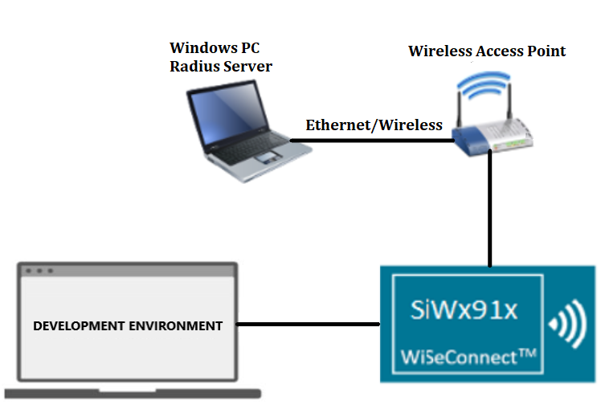
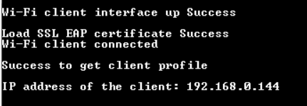
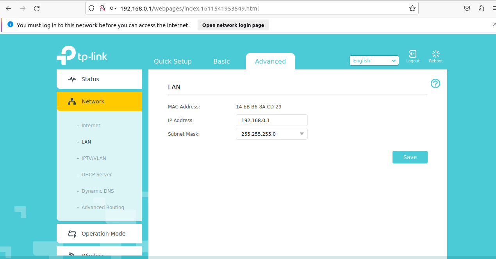
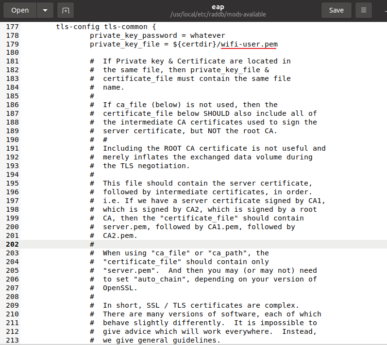
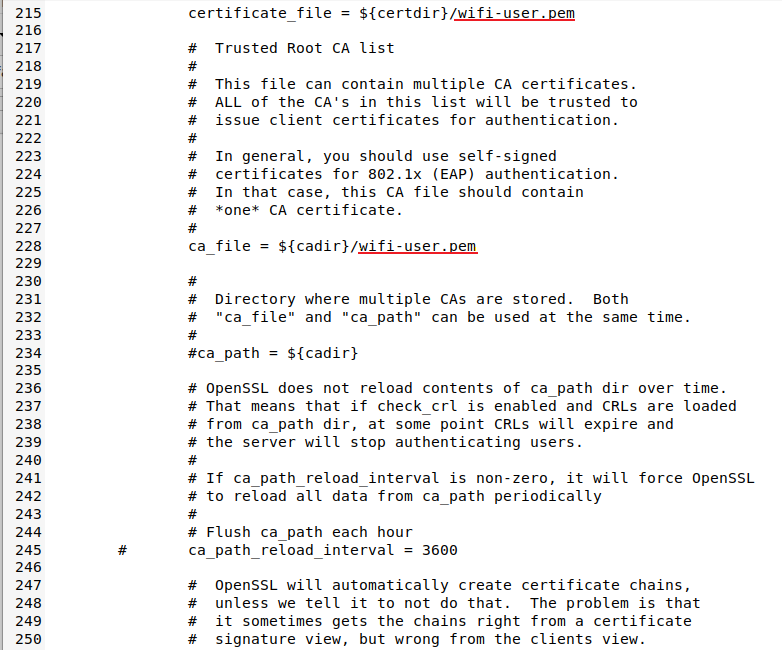

# Wi-Fi - Enterprise Client Mode

## Table of Contents

- [Purpose/Scope](#purposescope)
- [Prerequisites/Set up Requirements](#prerequisitesset-up-requirements)
  - [Hardware Requirements](#hardware-requirements)
  - [Software Requirements](#software-requirements)
  - [Setup Diagram](#setup-diagram)
- [Getting Started](#getting-started)
- [Application Build Environment](#application-build-environment)
- [Test the Application](#test-the-application)
- [Additional Information](#additional-information)
  - [Configure Access Point in WAP2-EAP](#configure-access-point-in-wap2-eap)
  - [FreeRADIUS server setup](#freeradius-server-setup)

## Purpose/Scope

This application demonstrates how to configure SiWx91x in enterprise client mode and connect SiWx91x to an enterprise secured access point using any of the EAP-TLS, EAP-TTLS, EAP-FAST, and PEAP methods.

##  Prerequisites/Set up Requirements

Before running the application, you will need to setup the following:

###  Hardware Requirements

- Windows PC with Free Radius Server
- Wireless Access Point with WPA2-Enterprise configuration
- USB-C cable
  
- **SoC Mode**:
  - Standalone
    - BRD4002A Wireless pro kit mainboard [SI-MB4002A]
    - Radio Boards 
  	  - BRD4338A [SiWx917-RB4338A]
  	  - BRD4343A [SiWx917-RB4343A]
  - Kits
  	- SiWx917 Pro Kit [Si917-PK6031A](https://www.silabs.com/development-tools/wireless/wi-fi/siwx917-pro-kit?tab=overview)
  	- SiWx917 Pro Kit [Si917-PK6032A]
   - SiWx917 AC1 Module Explorer Kit (BRD2708A)
  	
- **NCP Mode**:
  - Standalone
    - BRD4002A Wireless Pro Kit Mainboard [SI-MB4002A]
    - EFR32xG24 Wireless 2.4 GHz +10 dBm Radio Board [xG24-RB4186C](https://www.silabs.com/development-tools/wireless/xg24-rb4186c-efr32xg24-wireless-gecko-radio-board?tab=overview)
    - NCP Expansion Kit with NCP Radio Boards
      - (BRD4346A + BRD8045A) [SiWx917-EB4346A]
      - (BRD4357A + BRD8045A) [SiWx917-EB4357A]
  - Interface and Host MCU Supported
    - SPI - EFR32

###  Software Requirements

- Simplicity Studio
- [FreeRADIUS Server](https://freeradius.org/)
- Serial Terminal - [Docklight](https://docklight.de/)/[Tera Term](https://ttssh2.osdn.jp/index.html.en)

###  **Setup Diagram**

The following image illustrates the EAP frame exchanges between the SiWx91x, access point, and FreeRADIUS Server.




## Getting Started

Refer to the instructions on the [WiSeConnect Getting Started](https://docs.silabs.com/wiseconnect/latest/wiseconnect-getting-started/) page to:

- [Install Simplicity Studio](https://docs.silabs.com/wiseconnect/latest/wiseconnect-developers-guide-developing-for-silabs-hosts/#install-simplicity-studio).
- [Install WiSeConnect 3 extension](https://docs.silabs.com/wiseconnect/latest/wiseconnect-developers-guide-developing-for-silabs-hosts/#install-the-wi-se-connect-3-extension).
- [Connect your device to the computer](https://docs.silabs.com/wiseconnect/latest/wiseconnect-developers-guide-developing-for-silabs-hosts/#connect-si-wx91x-to-computer).
- [Upgrade your connectivity firmware](https://docs.silabs.com/wiseconnect/latest/wiseconnect-developers-guide-developing-for-silabs-hosts/#update-si-wx91x-connectivity-firmware).
- [Create a Studio project](https://docs.silabs.com/wiseconnect/latest/wiseconnect-developers-guide-developing-for-silabs-hosts/#create-a-project).

For details on the project folder structure, see the [WiSeConnect Examples](https://docs.silabs.com/wiseconnect/latest/wiseconnect-examples/#example-folder-structure) page.

##  Application Build Environment

The application can be configured to suit your requirements and development environment.

- In the Project explorer pane, expand the **enterprise_client** folder and open the `app.c` file. Configure the following parameters based on your requirements.

   - WIFI_ACCESS_POINT_SSID refers to the name of the access point configured in WAP/WPA2-EAP security mode. The SiWx91x module connects to it.

      ```c
      #define WIFI_ACCESS_POINT_SSID                              "enterprise"
      ```
  
   - All the configuration parameters are present in **wifi_client_enterprise_eap_profile**. The **wifi_client_enterprise_eap_profile.config.security** refers to the security type of the access point. In this example, SiWx91x supports WPA-EAP, WPA2-EAP security types.

      ```c
      .config.security                                            SL_WIFI_WPA2_ENTERPRISE
      ```

   - In most of the cases, the EAP-TLS method uses root CA certificate and public-private key pairs for authentication.
   - Encryption type can be switched using the following:

      ```c
      .config.encryption                                          SL_WIFI_EAP_TLS_ENCRYPTION
      ```

> Note: 
> You can configure default region-specific regulatory information using `sl_wifi_region_db_config.h`.

>  **NOTE:**
> 1. The application shall load the certificates using **[sl_net_set_credential](https://docs.silabs.com/wiseconnect/3.0.13/wiseconnect-api-reference-guide-nwk-mgmt/net-credential-functions#sl-net-set-credential)** API.
> 2. By default, the application loads **wifi-user.pem** certificate present at **<WiFi SDK> → resources → certificates**.
      
   - To load your own certificate, refer to the following steps:

   - The certificate must be passed as a parameter to **sl_net_set_credential** API in linear array format. Convert the **.pem** format certificate into linear array form using the python script provided in the SDK **WiSeConnect SDK → resources → certificates → certificate_to_array.py**.

   - You can load the certificate in two ways as described in the following:
     - Aggregate the certificates into one file in a fixed order of private key, public key, intermediate CA/dummy certificate, and CA certificate and load the certificate with certificate type **1**. Place the certificate at **<WiSeConnect SDK> → resources → certificates**. Convert the single certificate file into linear array using the following command:

         `python certificate_to_array.py wifi-user.pem`

      - Load the EAP certificates - private key, public key, and CA certificates individually with certificate type as 17, 33, and 49, respectively. The maximum certificate length for each individual certificate is 4088 bytes. Place the certificate at **<WiSeConnect SDK> → resources → certificates**. Convert the certificates into linear array using the following commands:

         `python certificate_to_array.py <private key file name>`

         `python certificate_to_array.py <public key file name>`

         `python certificate_to_array.py <CA certificate file name>`

      - The above commands shall generate .h files which contain the certificate as a character array. Include these files in the `app.c` file.

   - Credentials for EAP authentication can be passed in through **wifi_client_enterprise_eap_credential** structure.
   - **wifi_client_enterprise_eap_credential.data.username** refers to the user ID, which is configured in the user configuration file of the Radius server. By default, the user identity is **user1**. 

      ```c
      .data.username                                              "user1"
      ```

   - **wifi_client_enterprise_eap_credential.data.password** refers to the password which is configured in the user configuration file of the Radius Server for that User Identity. In this example, the password is **password1**.

      ```c
      .data.password                                              "12345678"
      ```

   - DHCP_MODE refers to whether the SiWx91x IP assignment is done statically or through DHCP.

      1  - DHCP_MODE
      
      0  - Static IP assignment

   - IP-related configuration can be configured in **wifi_client_enterprise_eap_profile.ip** structure.

      ```c
      .ip = {
            .mode = SL_IP_MANAGEMENT_DHCP,
            .type = SL_IPV4,
            .host_name = NULL,
            .ip = {{{0}}},
         }
      ```

   - Enterprise configuration parameters. By default, the EAP method is set to **TLS**.

**Important Notes**: 

- Ensure the access point is configured in WPA2-Enterprise security mode. For more details, refer to [Configure Access Point in WAP2-EAP](#configure-access-point-in-wap2-eap) in the Additional Information section.
- Ensure the FreeRADIUS set up is ready before running the application project. For more details, please refer to [FreeRADIUS Server set up](#freeradius-server-set-up) in the Additional Information section.

## Test the Application

Refer to the instructions [here](https://docs.silabs.com/wiseconnect/latest/wiseconnect-getting-started/) to:

- Build the application.
- Flash, run, and debug the application.

    ****

## Additional Information

### Configure Access Point in WAP2-EAP

- Navigate to the Wireless Security section and enable the **WPA/WPA2 - Enterprise** option, as shown in the following figure. The following image is for a TP-Link access point.

   ****

- Enter the IP address of the Radius Server in the field labeled, **Radius Server IP**. In the above figure, it is **192.168.0.139**.

   **Note**: Give **Radius Server IP** as the IP address of the PC on which you want to run the FreeRADIUS Server.

- Enter the Radius Password as **12345678**. This password should be given as a **secret** in the FreeRADIUS Server.

### FreeRADIUS Server Setup

The configuration explained below is for Linux OS. A similar process may be followed for other OS types.

1. FreeRADIUS Server installation links:

   [https://freeradius.org/](https://freeradius.org/)

   [http://xperiencetech.com/download/radius-free-download.asp](http://xperiencetech.com/download/radius-free-download.asp)

   >**Note**: This example application has been tested with FreeRADIUS-server-3.2.3.
   
2.  Once installed, go to the **C: → FreeRADIUS → etc → raddb** folder. Open the **clients.conf** file and add the following lines at the end of the file.

      ```c
      client 192.168.0.1/24 {
      secret = 12345678
      shortname = private-network-1
      }
      ```

3. The IP address in the above lines (**192.168.0.1**) is the gateway IP address of the access point to which SiWx91x is going to connect. The **secret = 12345678** is the key that is given in the access point's Radius Server configurations to authenticate it with the FreeRADIUS Server.

   The gateway IP address of TP_Link access point is:

   ****

4. Open the **eap.conf** file by following the path, **FreeRADIUS → etc → raddb → mods-available**, and make the following changes:
    - Change the **default_eap_type** field under the **eap** section to  **tls**, as shown in the following figure.

         ****

    -   Change the paths for **private_key_file**, **certificate_file**, and **CA_file** under the **tls** section to **${certdir}/wifi-user.pem**, as shown in the following figure.

         ****

         ****
     
    -  Uncomment the **fragment_size** and **include_length** lines under the **tls** section, as shown in the following figure.

         ****
  
5. Open the **users** file present at **C: → FreeRADIUS → etc → raddb** and add the lines shown in following figure. This adds/registers a user with username **user1** and password **test123**. These are given in the `app.c`  at  **sl_net_wifi_eap_credential_entry_t** API.

     ****

6. Copy the **wifi-user.pem** file from **WiSeConnect3 → resources → certificates** folder to **C: → FreeRADIUS → etc → raddb → certs** folder.

     - Open the terminal in Linux, go to the Radius Server path, and give the command below to start the Radius Server:
      
         ```c
         radiusd -X
         ```

7. When Radius Server has started successfully, you will see a line at the end which says, **Ready to process requests**.

     ****

>**Note:**
> - The Radius Server has to run before the application is executed. You will observe some transactions when the module is trying to connect to the Radius Server. Restart the Radius Server when you execute the application every time.
>
> - Make sure that the Radius Server and module are on the same network. 
