# Enterprise client

## 1 Purpose/Scope

This application demonstrates how to configure SiWx91x in enterprise client mode, connect SiWx91x to an enterprise secured Access point using any of the EAP-TLS, EAP-TTLS, EAP-FAST, and PEAP methods. Subsequently, the application pings to a specified IP address continuously.

## 2 Prerequisites/Set up Requirements

Before running the application, the user will need the following things to setup.

### 2.1 Hardware Requirements

Silicon Labs [BRD4325A, BRD4325B, BRD4325C, BRD4325G, BRD4338A](https://www.silabs.com/)

- For Soc Mode, Simplicity Studio Energy Profiler can be used for the current consumption measurement - [Simplicity Studio Energy Profiler](#using-simplicity-studio-energy-profiler-for-current-measurement).

- **NCP Mode**:
  - [SiWx91x Wi-Fi Expansion Board](https://www.silabs.com/)
  - A Host MCU. This example application has been tested with the following host MCUs.

  - [Silicon Labs EFR32xG21 Starter Kit with Wireless Gecko](https://www.silabs.com/development-tools/wireless/efr32xg21-bluetooth-starter-kit) (SLSWSTK6006A Base board: BRD4001A, Radio board: BRD4180B)

- A Wireless Access point with WPA2-Enterprise configuration

- A windows PC

### 2.2 Software Requirements

- Simplicity Studio IDE

  - Download the [Simplicity Studio IDE](https://www.silabs.com/developers/simplicity-studio).

  - Follow the [Simplicity Studio user guide](https://docs.silabs.com/simplicity-studio-5-users-guide/1.1.0/ss-5-users-guide-getting-started/install-ss-5-and-software#install-ssv5) to install Simplicity Studio IDE.

- [Silicon Labs Gecko SDK](https://github.com/SiliconLabs/gecko_sdk)

- [Si91x COMBO SDK](https://github.com/SiliconLabs/wiseconnect-wifi-bt-sdk/)

- [FreeRADIUS Server](https://freeradius.org/)

**NOTE:**

> This example application supports Bare metal and FreeRTOS configurations.

### 2.3 Setup Diagram

#### SoC Mode  

The picture below illustrates the EAP frame exchanges between SiWx91x, Access Point and FreeRADIUS Server.

**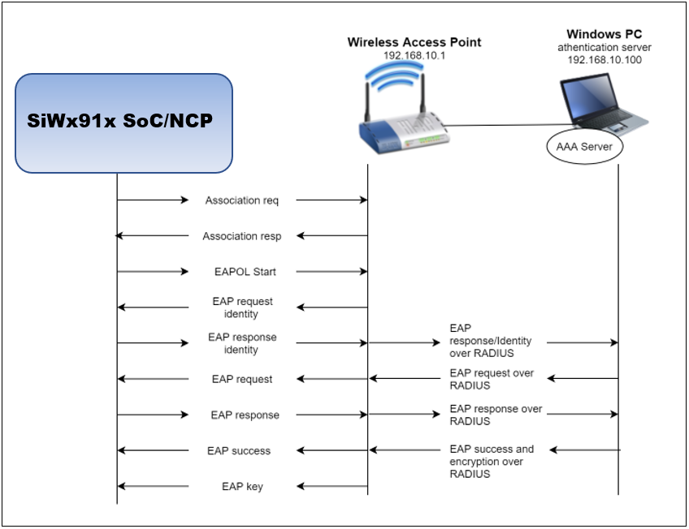**

Set up diagram for SoC mode:
**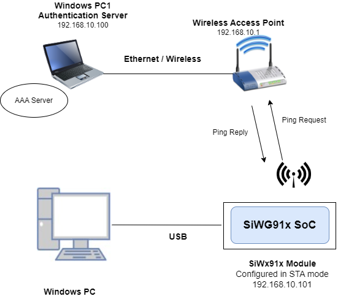**

#### NCP Mode  

#### 3.2 NCP Mode

**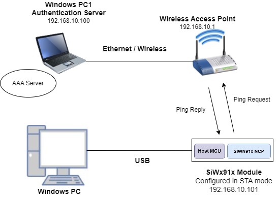**

**NOTE**:

- The Host MCU platform (EFR32MG21) and the SiWx91x interact with each other through the SPI interface.

Follow the [Getting Started with Wiseconnect3 SDK](https://docs.silabs.com/wiseconnect/latest/wiseconnect-getting-started/) guide to set up the hardware connections and Simplicity Studio IDE.


## 3 Project Environment

- Ensure the SiWx91x loaded with the latest firmware following the [Upgrade Si91x firmware](https://docs.silabs.com/wiseconnect/latest/wiseconnect-getting-started/getting-started-with-soc-mode#upgrade-si-wx91x-connectivity-firmware)

- Ensure the latest Gecko SDK along with the extension WiSeConnect3 is added to Simplicity Studio.

### 3.1 Creating the project

#### 3.1.1 SoC mode

- Ensure the SiWx91x set up is connected to your PC.

- In the Simplicity Studio IDE, the SiWx91x SoC board will be detected under **Debug Adapters** pane as shown below.

  ****

#### 3.1.2 NCP mode

- Ensure the EFx32 and SiWx91x set up is connected to your PC.

- In the Simplicity Studio IDE, the EFR32 board will be detected under **Debug Adapters** pane as shown below.

  ****

### 3.2 Importing the project

- Studio should detect your board. Your board will be shown here. Click on the board detected and go to **EXAMPLE PROJECTS & DEMOS** section 

#### SOC Mode

- Select **Wi-Fi - Enterprise Client Mode** test application

  **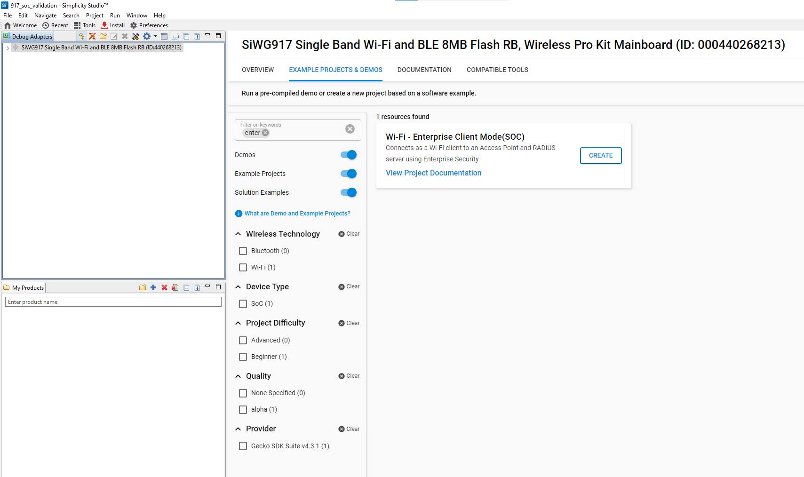**

- Click 'Create'. The "New Project Wizard" window appears. Click 'Finish'

  **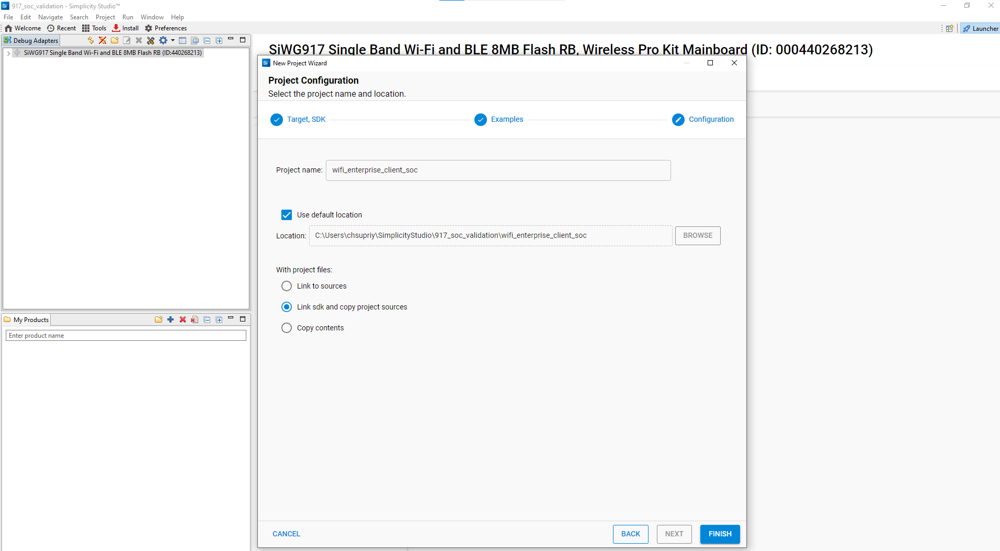**

### 3.3 Set up for application prints

#### 3.3.1 Teraterm set up - for BRD4325A, BRD4325B, BRD4325C, BRD4325G

You can use either of the below USB to UART converters for application prints.

1. Set up using USB to UART converter board.

   - Connect Tx (Pin-6) to P27 on WSTK
   - Connect GND (Pin 8 or 10) to GND on WSTK

   ****

2. Set up using USB to UART converter cable.

   - Connect RX (Pin 5) of TTL convertor to P27 on WSTK
   - Connect GND (Pin1) of TTL convertor to GND on WSTK

   **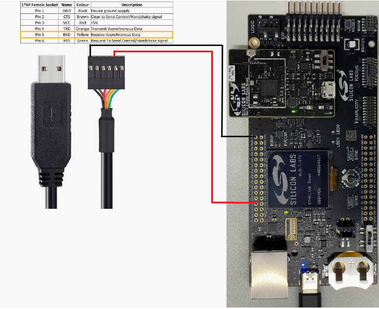**

3. Open the Teraterm tool.

   - For SoC mode, choose the serial port to which USB to UART converter is connected and click on **OK**.

     **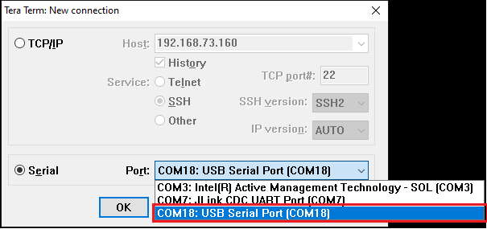**

**Note:** For Other 917 SoC boards please refer section #3.3.2

#### 3.3.2 **Teraterm set up - for NCP and SoC modes**

1. Open the Teraterm tool.

- choose the J-Link port and click on **OK**.
    
    ****

2. Navigate to the Setup → Serial port and update the baud rate to **115200** and click on **OK**.

    ****

    **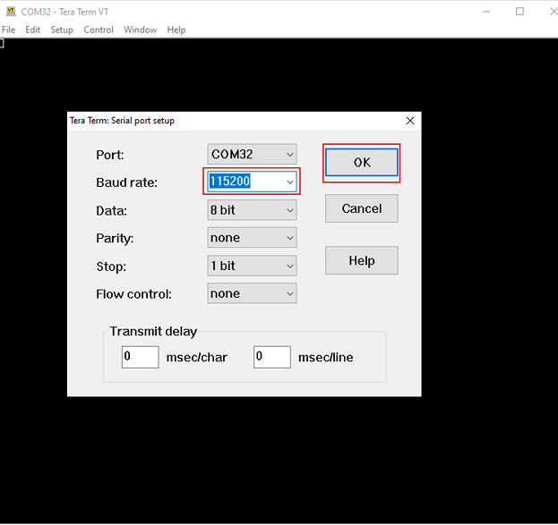**

## 4 Application Build Environment

1. Ensure the SiWx91x is loaded with the latest firmware following the [Getting started with a PC](https://docs.silabs.com/rs9116/latest/wiseconnect-getting-started). The firmware file is located at **< WiSeConnect3 > → connectivity_firmware**.

2. Ensure the EFx32 and SiWx91x set up is connected to your PC.

### 4.1 Board detection

### 4.1.1 SoC mode

1. In the Simplicity Studio IDE, 
    - The SiWx91x SoC board will be detected under **Debug Adapters** pane as shown below.

      ****

### 4.1.2 NCP mode

1. In the Simplicity Studio IDE, 
    - The EFR32 board will be detected under **Debug Adapters** pane as shown below.

      ****

### 4.2 Creation of project

Ensure the latest Gecko SDK along with the extension WiSeConnect3 is added to Simplicity Studio.

1. Click on the board detected and go to **EXAMPLE PROJECTS & DEMOS** section.

   **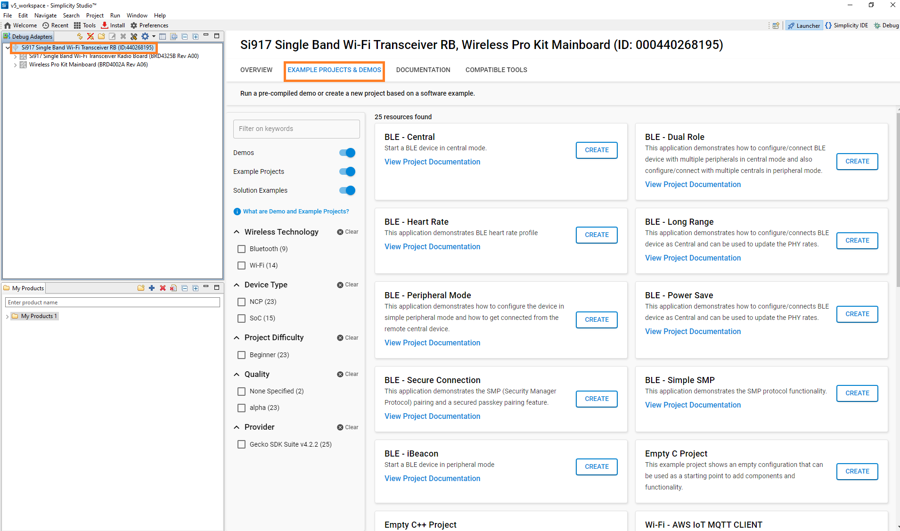**

2. Filter for Wi-Fi examples from the Gecko SDK added. For this, check the *Wi-Fi* checkbox under **Wireless Technology** and *Gecko SDK Suite* checkbox under **Provider**.

3. Under **Device Type**, for SoC based example, check the *SoC* checkbox and for NCP based example, check the *NCP* checkbox.

4. Now choose Wi-Fi- NCP Client with Enterprise Security example for NCP mode or choose Wi-Fi- SoC Client with Enterprise Security example for SoC mode and click on **Create**.

    For NCP mode:

    **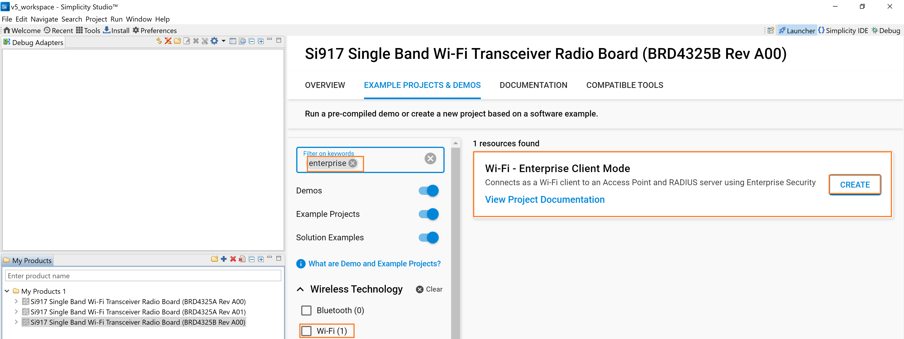**

    For SoC mode:

    **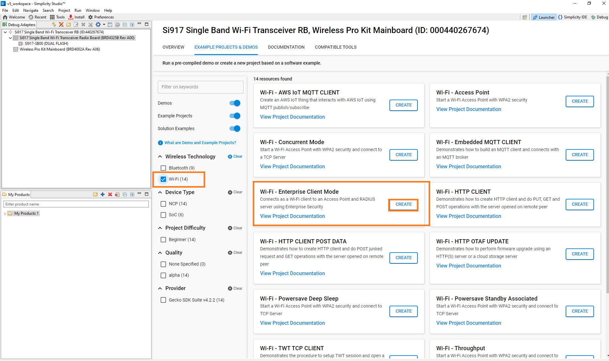**

5. Give the desired name to your project and cick on **Finish**.

   **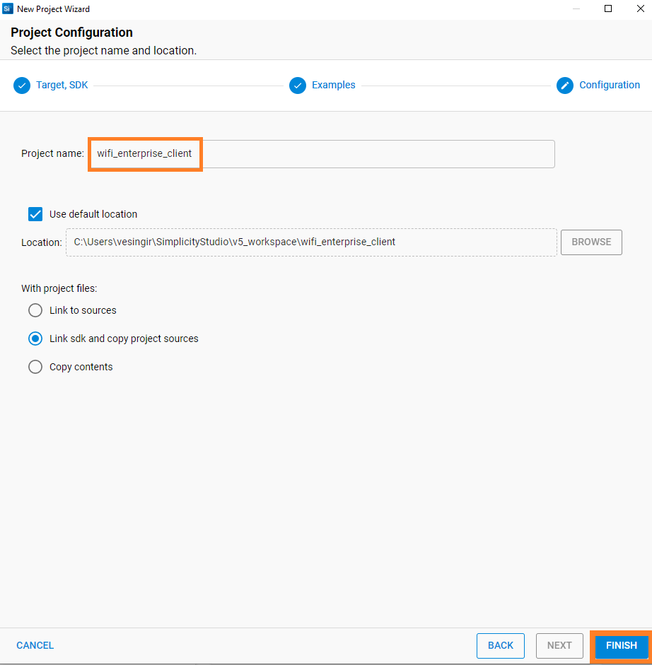**

## 4.3 Application Configurations

The application can be configured to suit your requirements and development environment.

1. In the Project explorer pane, expand the **enterprise_client** folder and open the **app.c** file. Configure the following parameters based on your requirements.

    **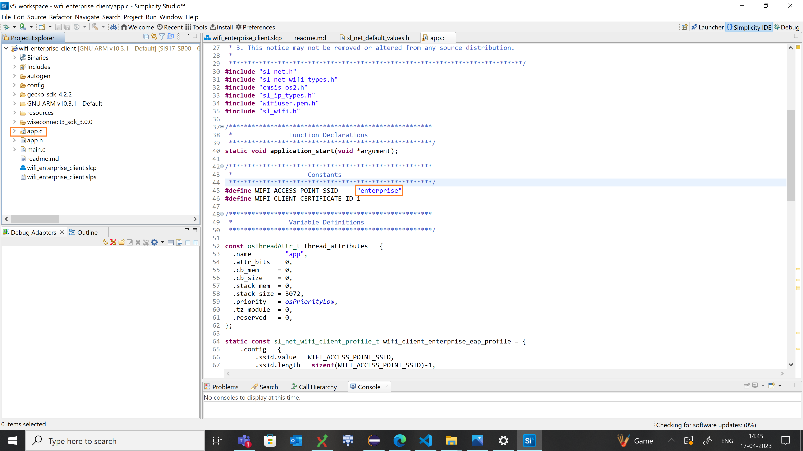**

    - WIFI_ACCESS_POINT_SSID refers to the name of the Access point configured in WAP/WPA2-EAP security mode.

    ```c
    #define WIFI_ACCESS_POINT_SSID                              "SILABS_AP"
    ```
  
   - All the configuration parameters are present in **wifi_client_enterprise_eap_profile**, **wifi_client_enterprise_eap_profile.config.security** refers to the type of security. In this example, SiWx91x supports WPA-EAP, WPA2-EAP security types.

    ```c
    .config.security                                            SL_WIFI_WPA2_ENTERPRISE
    ```

   - In most of the cases, the EAP-TLS method uses root CA certificate and public-private key pairs for authentication.
   - Encryption type can be switched between SL_WIFI_EAP_TLS_ENCRYPTION and SL_WIFI_EAP_TTLS_ENCRYPTION using following

    ```c
    .config.encryption                                          SL_WIFI_EAP_TLS_ENCRYPTION
    ```

    **NOTE**: 
      1. Application shall load the certificates using **sl_wifi_set_certificate** API.

      2. By default, the application loads **wifiuser.pem** certificate present at **<WiFi SDK> → resources → certificates**. 
         In order to load your own certificate, follow the below steps:

         - The certificate has to be passed as a parameter to **rsi_wlan_set_certificate** API in linear array format. Convert the **.pem** format certificate into linear array form using python script provided in the SDK **<SiWx91x COMBO SDK → resources → certificates → certificate_to_array.py**.

         - You can load the certificate in two ways as mentioned below. 
             - Aggregate the certificates in to one file in a fixed order of private key, public key, intermediate CA/dummy certificate, and CA certificate and load the certificate with certificate type **1**. Place the certificate at **<SiWx91x COMBO SDK> → resources → certificates**. Convert the single certificate file into linear array using the following command.

                `python certificate_to_array.py wifi-user.pem`

            - Load the EAP certificates - private key, public key, and CA certificates individually with certificate type as 17,33 and 49 respectively. Maximum certificate length for each individual certificate is 4088 bytes. Place the certificate at **<SiWx91x COMBO SDK> → resources → certificates**. Convert the certificates into linear array using the following commands.

                `python certificate_to_array.py <private key file name>`

                `python certificate_to_array.py <public key file name>`

                `python certificate_to_array.py <CA certificate file name>`

            - The above commands shall generate .h files which contains certificate as a character array. Include these files in **rsi_enterprise_client.c** file.

   - Credentials for EAP authentication can be passed in through **wifi_client_enterprise_eap_credential** structure
   - **wifi_client_enterprise_eap_credential.data.username** refers to user ID which is configured in the user configuration file of the radius server. In this example, user identity is **user1**.

    ```c
    .data.username                                              "\"user1\""
    ```

   - **wifi_client_enterprise_eap_credential.data.password** refers to the password which is configured in the user configuration file of the Radius Server for that User Identity. In this example, password is **password1**.

    ```c
    .data.password                                              "\"password1\""
    ```

   - DHCP_MODE refers to whether the IP assignment of SiWx91x is done statically or through DHCP.

      1  - DHCP_MODE
      0  - Static IP assignment

   - IP related configuration can be configured in **wifi_client_enterprise_eap_profile.ip** structure

   ```c
   .ip = {
        .mode = SL_IP_MANAGEMENT_DHCP,
        .type = SL_IPV4,
        .host_name = NULL,
        .ip = {{{0}}},
    }
   ```

   - Enterprise configuration parameters. By default, the EAP method is set to **TLS**.

**Important Notes**: 

- Ensure the Access Point is configured in WPA2-Enterprise security mode. For more details, please refer to [Configure Access Point in WAP2-EAP](#configure-access-point-in-wap2-eap) in Appendix section.
- Ensure the FreeRADIUS set up is ready before running the application project. For more details, please refer to [FreeRADIUS Server set up](#freeradius-server-set-up) in Appendix section.

### 4.4 Execution of the Application

Follow the below steps for the successful execution of the application.

#### 4.4.1 Build the Project

#### - SoC Mode : Build as enterprise_client Example
  
  **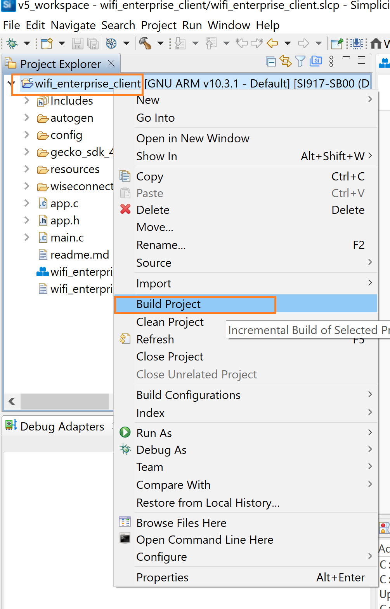**
  
- NCP Mode

### 4.4.2 Set up for application prints

Before setting up Tera Term, do the following for SoC mode.

**SoC mode**:
You can use either of the below USB to UART converters for application prints.

1. Set up using USB to UART converter board.

   - Connect Tx (Pin-6) to P27 on WSTK
   - Connect GND (Pin 8 or 10) to GND on WSTK

      

2. Set up using USB to UART converter cable.

   - Connect RX (Pin 5) of TTL convertor to P27 on WSTK
   - Connect GND (Pin1) of TTL convertor to GND on WSTK

      

**Tera term set up - for NCP and SoC modes**

1. Open the Tera Term tool. 
   - For SoC mode, choose the serial port to which USB to UART converter is connected and click on **OK**. 

     ****

   - For NCP mode, choose the J-Link port and click on **OK**.

     ****

2. Navigate to the Setup → Serial port and update the baud rate to **115200** and click on **OK**.

    ****

    ****

### 4.4.3 Execute the application

1. Once the build was successful, right click on project and select **Debug As → Silicon Labs ARM Program** to program the device as shown in below image.

   **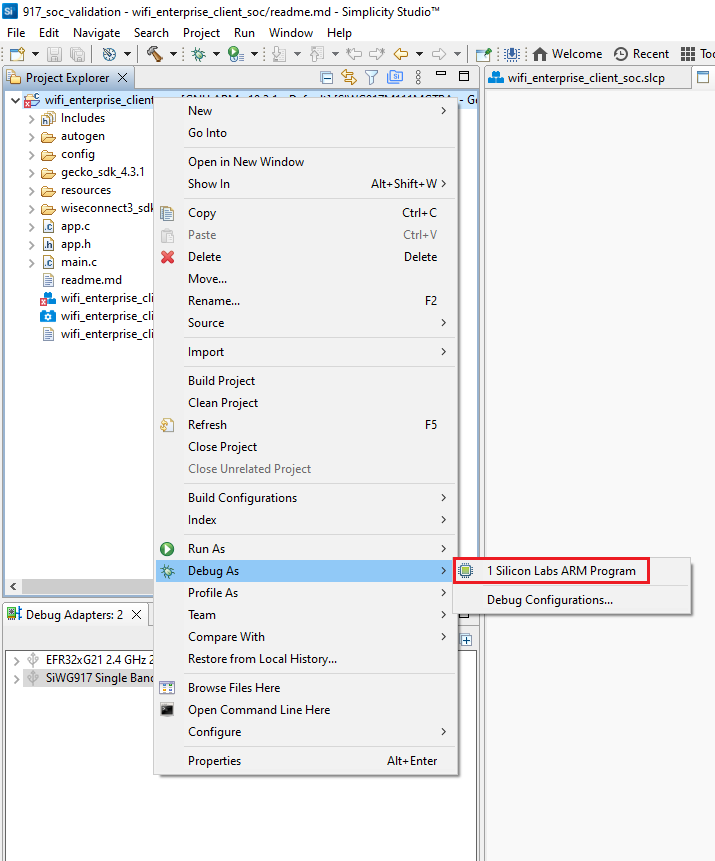**

2. As soon as the debug process is completed, the application control branches to the main().

3. Go to the J-link Silicon Labs console pane to observe the debug prints in the Serial 1 tab.

4. Click on the **Resume** icon in the Simplicity Studio IDE toolbar to run the application.

   ****

5. As soon as the application gets executed, the SiWx91x connects to the specified Access point configured in WPA-EAP/WPA2-EAP mode.

6. After a successful connection with the Access Point, the application starts sending ping requests to the given REMOTE_IP with configured PING_SIZE to check the availability of the target device.

7. In this example, the ping requests are continuously sent 1000 times continuously.

### 4.4.4 **Application Prints - SoC mode**

   **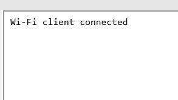**

**Application Prints - NCP mode**:

   ****

## Appendix

### Configure Access Point in WAP2-EAP

- Navigate to the Wireless Security section and enable the **WPA/WPA2 - Enterprise** option, as shown in the figure below. The image below is for a TP-Link Access Point.

      **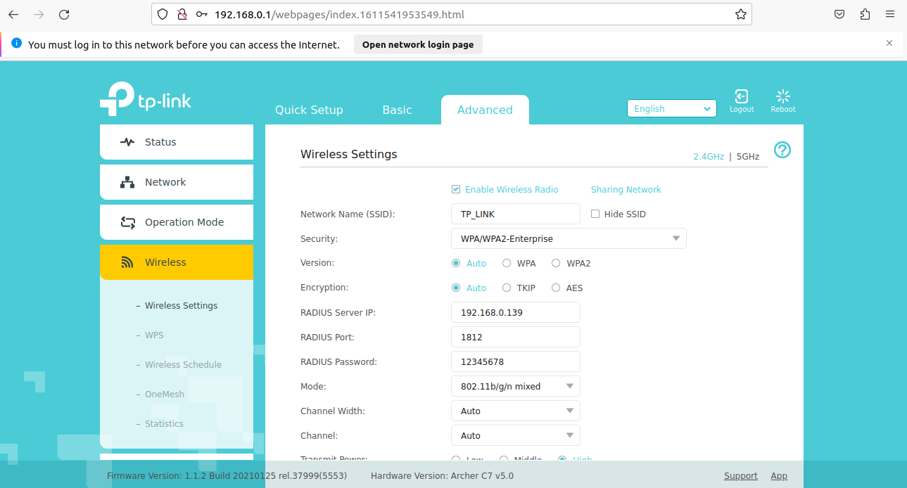**

- Enter the IP address of the Radius Server in the field labeled, **Radius Server IP**. In the above figure, it is **192.168.50.100**.
   **NOTE**: Give **Radius Server IP** as the IP address of the PC on which you want to run the FreeRADIUS server.

- Enter the Radius Password as **12345678**. This password should be given as a **secret** in FreeRADIUS server.

### FreeRADIUS server set up

The configuration explained below is for Windows OS, similar process may be followed for other OS.

- FreeRADIUS Server installation links:

   [https://freeradius.org/](https://freeradius.org/)

   [http://xperiencetech.com/download/radius-free-download.asp](http://xperiencetech.com/download/radius-free-download.asp)

   **Note**: This example application has been tested with tested with FreeRADIUS-server-2.2.3-x86.

- Once installed, go to the **C: → FreeRADIUS → etc → raddb** folder. Open the **clients.conf** file and add the following lines at the end of the file.

   ```c
   client 192.168.50.1/24 {
   secret = 12345678
   shortname = private-network-1
   }
   ```

- The IP address in the above lines (**192.168.50.1**) is the IP address of the Access Point to which SiWx91x is going to connect. The **secret = 12345678** is the key that is given in the Access Point's radius server configurations to authenticate it with the FreeRADIUS Server.

- Open the **eap.conf** file and make the following changes:
  - Change the **default_eap_type** field under the **eap** section to  **tls**, as shown in the figure below.

      **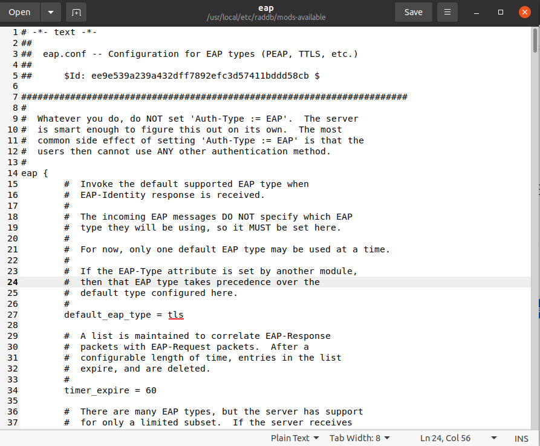**

  - Change the paths for **private_key_file**, **certificate_file** and **CA_file** under the **tls** section to **${certdir}/wifi-user.pem**, as shown in the figure below.

      **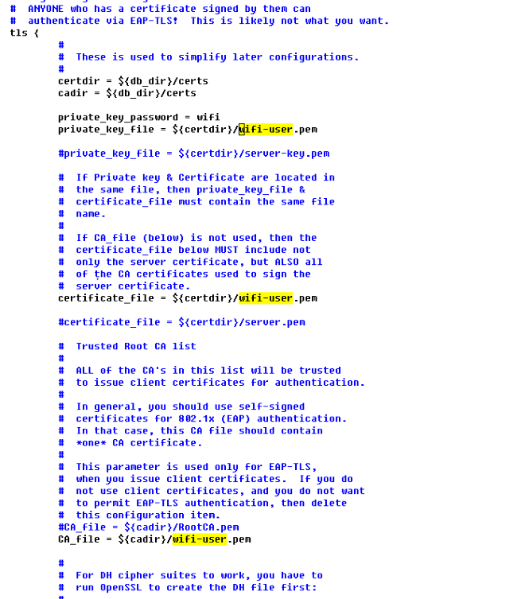**
  
  - Uncomment the **fragment_size** and **include_length** lines under the **tls** section, as shown in the figure below.

      **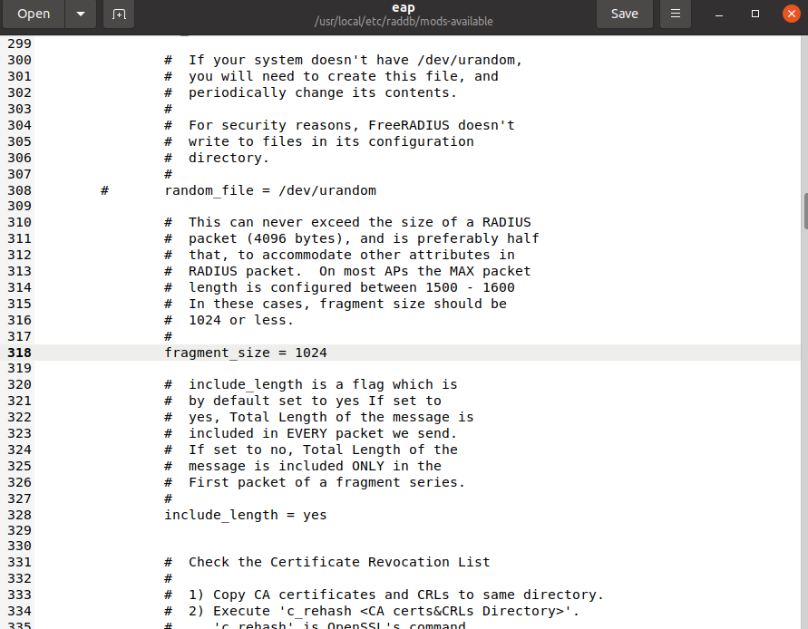**
  
  - Open the **users** file present at **C: → FreeRADIUS → etc → raddb** and add the lines shown below. This adds/registers a user with username **user1** and password **test123**.

     **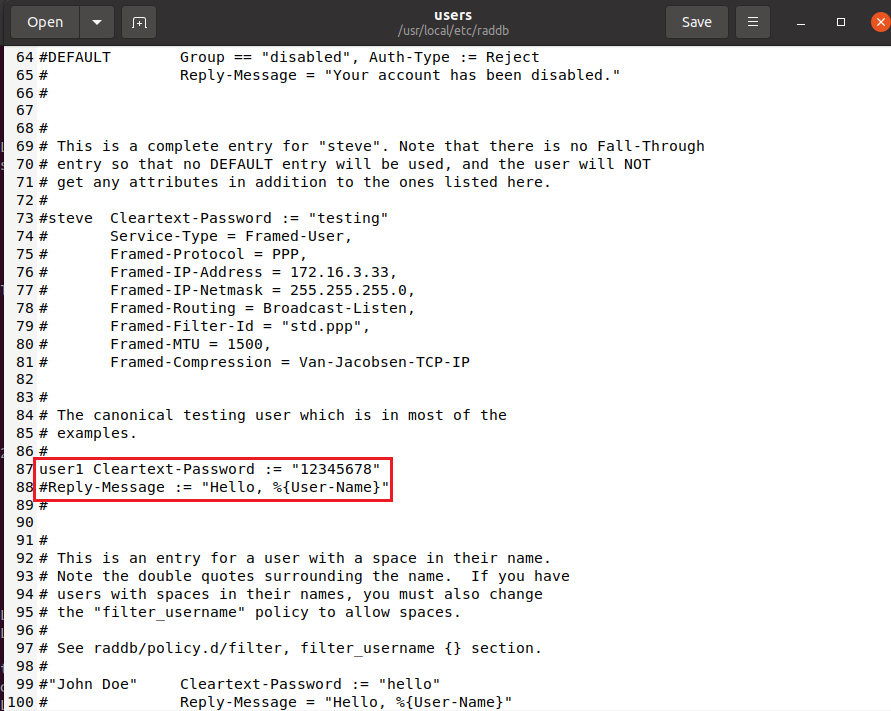**

  - Copy the **wifi-user.pem** file from **<WiSeConnect3> → resources → certificates** folder to **C: → FreeRADIUS → etc → raddb → certs** folder.

  - Click on the windows key and just search for Start RADIUS Server and click on it.

  - Then Radius server has started successfully you will see a print at the end which says, **Ready to process requests**.

     **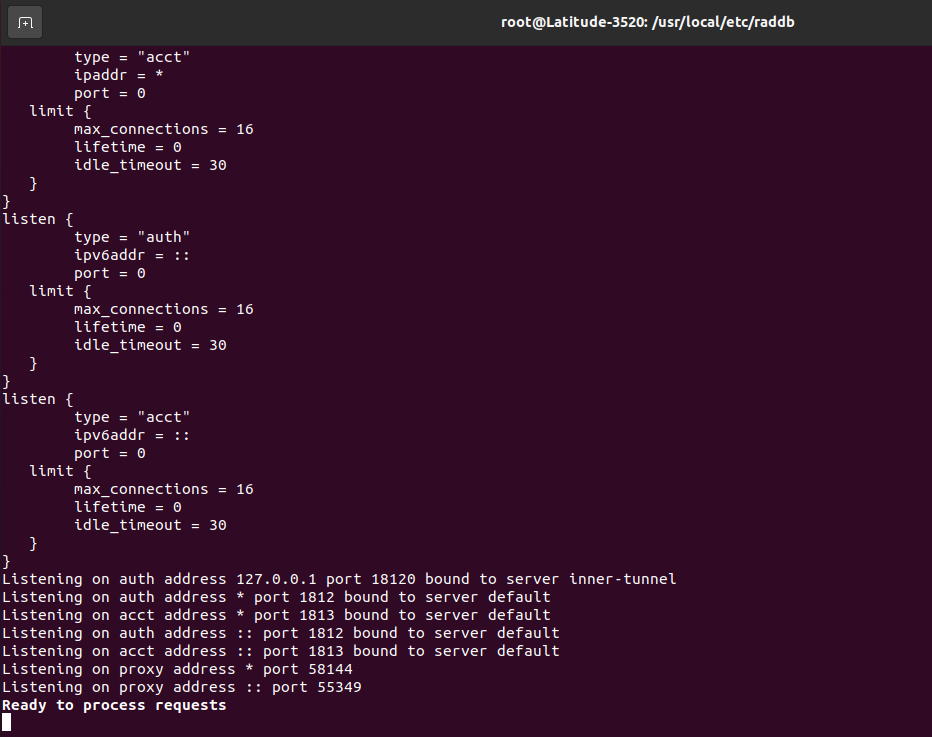**

**Note:**
 The radius server has to run before the application is executed. You will observe some transactions when the module is trying to connect to the radius server. Restart the Radius server when you execute the application every time.
