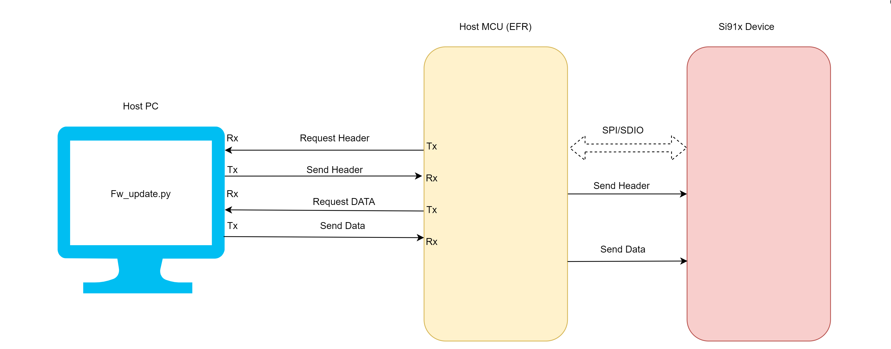
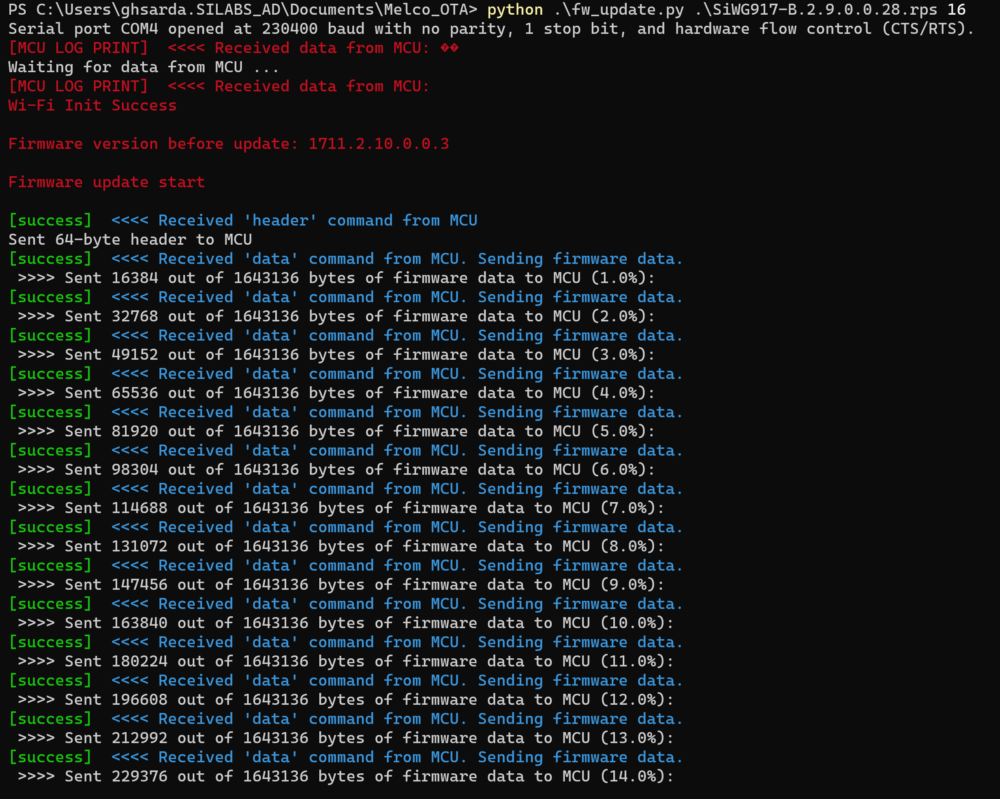
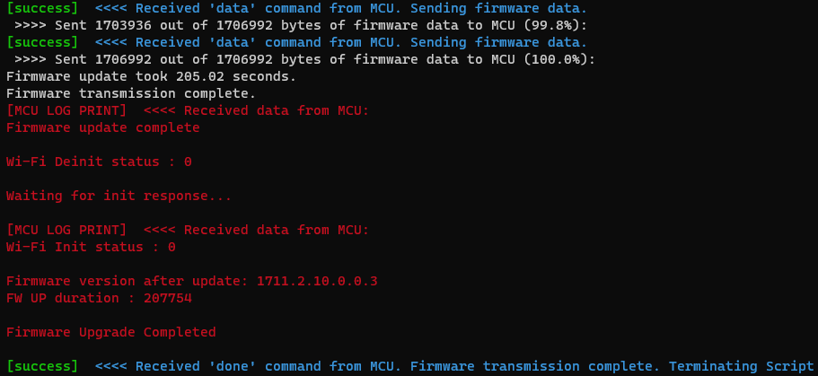

# Wi-Fi - Firmware Update from Host UART

## Table of Contents

- [Wi-Fi - Firmware Update from Host UART](#wi-fi---firmware-update-from-host-uart)
  - [Table of Contents](#table-of-contents)
  - [Purpose/Scope](#purposescope)
  - [Prerequisites/Setup Requirements](#prerequisitessetup-requirements)
    - [Hardware Requirements](#hardware-requirements)
    - [Software Requirements](#software-requirements)
    - [Setup Diagram](#setup-diagram)
  - [Getting Started](#getting-started)
  - [Application Build Environment](#application-build-environment)
    - [app Configuration](#app-configuration)
    - [Run the Python script](#run-the-python-script)
  - [Test the Application](#test-the-application)

## Purpose/Scope

This application demonstrates to update firmware on the Si91x Device from the Host MCU using UART-to-SPI communication. The system consists of three main components:
  - Host PC: Contains the firmware file and the Python script for updating firmware
  - Host MCU: Acts as an intermediary between the PC and the Si91x Device. It receives firmware data from the PC over UART and transfers it to the Si91x Device via SPI.
  - Si91x Device: The target embedded system that needs a firmware update. It receives firmware data from the Host MCU and updates its firmware.
  
## Prerequisites/Setup Requirements

### Hardware Requirements  

- PC or Mac.
- Linux PC or Cygwin on Windows (to build and run the python script provided in release_package/utilities/python)
- **NCP Mode**:
  - Standalone
    - BRD4002A Wireless pro kit mainboard [SI-MB4002A]
    - EFR32xG24 Wireless 2.4 GHz +10 dBm Radio Board [xG24-RB4186C](https://www.silabs.com/development-tools/wireless/xg24-rb4186c-efr32xg24-wireless-gecko-radio-board?tab=overview)
    - NCP EFR Expansion Kit with NCP Radio board (BRD4346A + BRD8045A) [SiWx917-EB4346A]
  - Kits
  	- EFR32xG24 Pro Kit +10 dBm [xG24-PK6009A](https://www.silabs.com/development-tools/wireless/efr32xg24-pro-kit-10-dbm?tab=overview)
    - EFR32xG25 FG25 Pro Kit [FG25-PK6012A](https://www.silabs.com/development-tools/wireless/proprietary/efr32fg25-pro-kit-fg25-pk6012a?tab=overview)
    - EFR32xG21 Wireless Gecko Starter Kit [SLWSTK6006A](https://www.silabs.com/development-tools/wireless/efr32xg21-wireless-starter-kit)

### Software Requirements

- Simplicity Studio IDE

### Setup Diagram



## Getting Started

Refer to the instructions [here](https://docs.silabs.com/wiseconnect/latest/wiseconnect-getting-started/) to:

- Install Studio and WiSeConnect 3 extension
- Connect your device to the computer
- Upgrade your connectivity firmware
- Create a Studio project

For details on the project folder structure, see the [WiSeConnect Examples](https://docs.silabs.com/wiseconnect/latest/wiseconnect-examples/#example-folder-structure) page.

## Application Build Environment

The application can be configured to suit your requirements and development environment.


### app Configuration

```c
#define RECV_BUFFER_SIZE 16384     // Update this Macro to receive to max buffer data
#define CHUNK_SIZE       16 * 1024 // Update this value depending upon 'chunk_size_kb' passed in python script

stack_size member in osThreadAttr_t can be changed depending on RECV_BUFFER_SIZE. By Default it is 18432 (16k+2k)
```

To verify firmware update in Wi-Fi Transceiver operating mode, right-click project and select 'Properties'. Go to 'C/C++ Build' -> 'Settings' -> Under 'GNU ARM C Compiler' select 'Preprocessor' and add the macro `TRANSCEIVER_OPER_MODE=1` in 'Tool Settings' tab.


### Run the Python script

  1. This demo create a serial connection with no parity, 1 stop bit, and hardware flow control (CTS/RTS) and uses standard baud rate 115200 for communication.
  2. By default, this script will send 16k firmware data on HostMCU Rx UART port 
  3. Go to Python script location [fw_update_from_host_uart.py] provided in release packaage/utilities/python. 
  4. Open script in command prompt
  5. Include the Python libraries pyserial and print-color before executing the script 
     1. Install the pyserial library by using the command: 'pip install pyserial'
     2. Install the print-color library by using the command: 'pip install print-color'
      ```c
  	  C:\Users\Downloads\release_package> python fw_update_from_host_uart_script.py <firmware_file_path/SiWx91x.NBZ.WC.GEN.OSI.x.x.x.rps> 
	    ```

        
     3. When the firmware update completes, the SiWx91x should be rebooted after which it may take a few minutes to overwrite the old firmware with the new firmware in flash memory.
         
          
  6. If users intend to employ different configurations, they must make corresponding adjustments in both the Python script and the Host UART configuration

Note: Python 3.9.0 version used to test this application.

## Test the Application

Refer to the instructions [here](https://docs.silabs.com/wiseconnect/latest/wiseconnect-getting-started/) to:

- Build the application
- Flash, run and debug the application.
- Make sure that size of RECV_BUFFER_SIZE should be always greather than 'chunk_size_kb' in python file
- Make sure that CHUNK_SIZE in Kb should be equal to 'chunk_size_kb' in python file
- Note that application should start after python script initiated.
