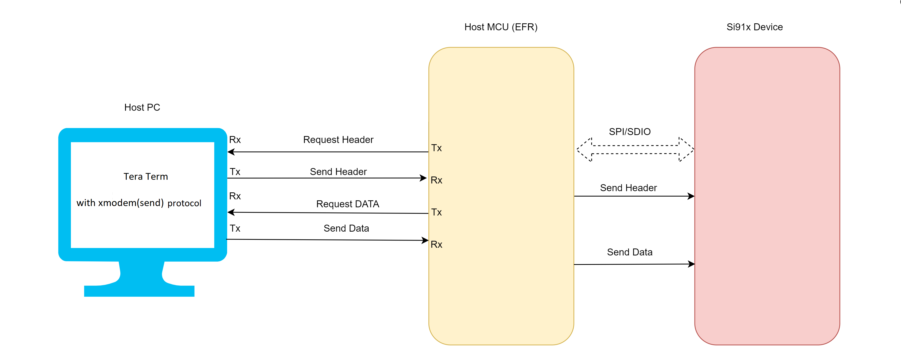
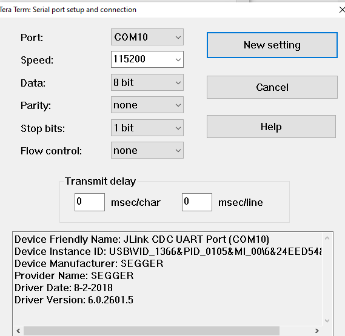
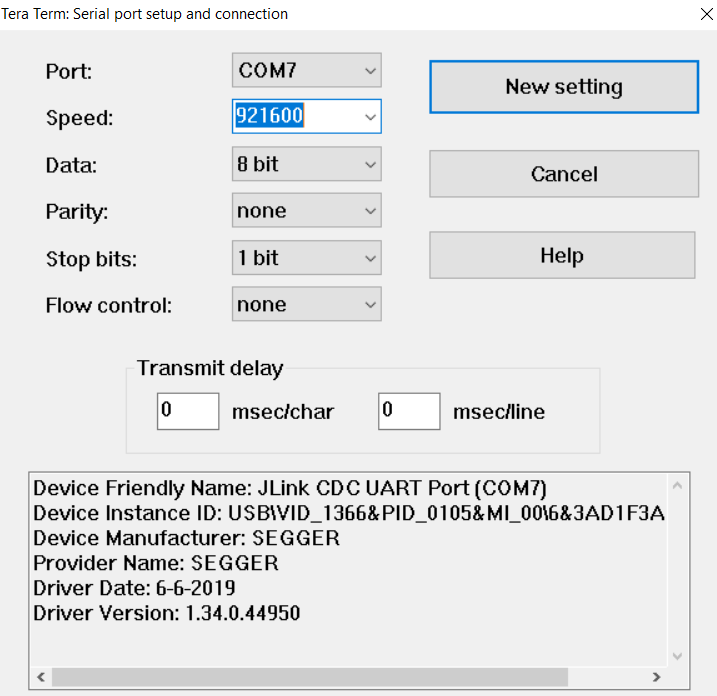
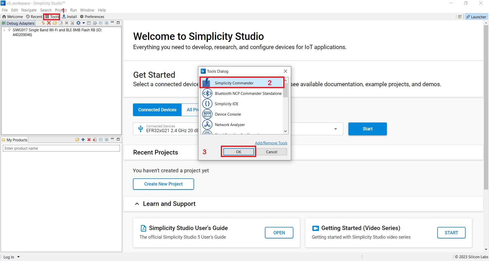

# Wi-Fi - Firmware Flashing from Host UART

## Table of Contents

- [Wi-Fi - Firmware Flashing from Host UART](#wi-fi---firmware-flashing-from-host-uart)
  - [Table of Contents](#table-of-contents)
  - [Purpose/Scope](#purposescope)
  - [Prerequisites/Setup Requirements](#prerequisitessetup-requirements)
    - [Hardware Requirements](#hardware-requirements)
    - [Software Requirements](#software-requirements)
    - [Setup Diagram](#setup-diagram)
  - [Getting Started](#getting-started)
  - [Application Build Environment](#application-build-environment)
    - [App Configuration](#app-configuration)
  - [Test the Application](#test-the-application)
    - [Console Prints](#console-prints)
  - [Timings Observed](#timings-observed)
  - [**Appendix**](#appendix)

## Purpose/Scope

This application demonstrates how to flash the firmware on the Si91x device from the Host MCU using XMODEM protocol. The system consists of three main components:

  - Host PC: Contains the firmware file and the Tera Term (Xmodem protcol) for updating firmware
  - Host MCU: Acts as an intermediary between the PC and the Si91x device. It receives firmware data from the PC over UART and transfers it to the Si91x device via SPI.
  - Si91x Device: The target embedded system that needs a firmware update. It receives firmware data from the Host MCU and updates its firmware.
  
## Prerequisites/Setup Requirements

### Hardware Requirements  

- Windows PC or Mac
- **NCP/SoC Mode**:
  - Standalone
    - BRD4002A Wireless Pro Kit Mainboard [SI-MB4002A]
    - EFR32xG24 Wireless 2.4 GHz +10 dBm Radio Board [xG24-RB4186C](https://www.silabs.com/development-tools/wireless/xg24-rb4186c-efr32xg24-wireless-gecko-radio-board?tab=overview)
    - NCP Expansion Kit with NCP Radio Boards
      - (BRD4346A + BRD8045A) [SiWx917-EB4346A]
      - (BRD4357A + BRD8045A) [SiWx917-EB4357A]
    - SoC
      - Silicon Labs [BRD4338A]
  - Kits
  	- EFR32xG24 Pro Kit +10 dBm [xG24-PK6009A](https://www.silabs.com/development-tools/wireless/efr32xg24-pro-kit-10-dbm?tab=overview)
  - Interface and Host MCU Supported
    - SPI - EFR32 

### Software Requirements

- Simplicity Studio IDE
- [Teraterm application](https://ttssh2.osdn.jp/index.html.en)

### Setup Diagram



## Getting Started

Refer to the instructions on the [WiSeConnect Getting Started](https://docs.silabs.com/wiseconnect/latest/wiseconnect-getting-started/) page to:

- [Install Simplicity Studio](https://docs.silabs.com/wiseconnect/latest/wiseconnect-developers-guide-developing-for-silabs-hosts/#install-simplicity-studio).
- [Install WiSeConnect 3 extension](https://docs.silabs.com/wiseconnect/latest/wiseconnect-developers-guide-developing-for-silabs-hosts/#install-the-wi-se-connect-3-extension).
- [Connect your device to the computer](https://docs.silabs.com/wiseconnect/latest/wiseconnect-developers-guide-developing-for-silabs-hosts/#connect-si-wx91x-to-computer).
- [Upgrade your connectivity firmware](https://docs.silabs.com/wiseconnect/latest/wiseconnect-developers-guide-developing-for-silabs-hosts/#update-si-wx91x-connectivity-firmware).
- [Create a Studio project](https://docs.silabs.com/wiseconnect/latest/wiseconnect-developers-guide-developing-for-silabs-hosts/#create-a-project).

For details on the project folder structure, see the [WiSeConnect Examples](https://docs.silabs.com/wiseconnect/latest/wiseconnect-examples/#example-folder-structure) page.

## Application Build Environment

The application can be configured to suit your requirements and development environment.

### App Configuration

- By default, the application does Fast Firmware upgrade.
- For Safe Firmware upgrade, delete this preprocessor macro in preprocessor settings, **SL_SI91X_FAST_FW_UP==1**.
- For secure image, only Safe Firmware upgrade is supported.
- For NCP, only NWP Firmware update is supported.
- For SoC, both NWP and M4 Firmware updates are supported. 
- For SoC, secure image update with secure zone enabled (slave mode), add SLAVE_MODE_TRANSFER in preprocessor settings. Refer to the [Appendix](#appendix) for information on secure zone.
- By default, the application is configured to update the NWP firmware in the **app.c** file: 
    ```c
     #define FW_UPDATE_TYPE NWP_FW_UPDATE
    ```

- For M4 update, make the change as shown below in **app.c** file:
    ```c
     #define FW_UPDATE_TYPE M4_FW_UPDATE
    ```

> **Note**: For recommended settings, see the [recommendations guide](https://docs.silabs.com/wiseconnect/latest/wiseconnect-developers-guide-prog-recommended-settings/).

## Test the Application

Refer to the instructions [here](https://docs.silabs.com/wiseconnect/latest/wiseconnect-getting-started/) to:

- Build the application
- Flash, run, and debug the application.
- Open the Tera Term application. Set the baud rate to 115200 in Tera Term by navigating to the Setup>Serial port>speed and click on New setting.
  
  
  
 
 
 - To minimize the firmware update process time, set the baud rate to 921600. 

- Configure the following parameter in `app.c` to test the firmware flashing through xmodem app as per requirement.
  ```c
    init.baudrate = 921600;
  ```
- In launch console, set the vcom port baudrate to 921600 using the command below:
  ```c
    serial vcom config speed 921600
  ```
- Then send the firmware file(.rps) by navigating to the path, file -> transfer -> xmodem -> send and select fimware file.
- For the SoC board, press and hold both the Reset and ISP buttons. Release the Reset button first, followed by the ISP button.
- The duration for completing a firmware update can vary depending on the size of the chunks processed.
- To see application prints, follow the [Console prints](console_prints) section.

**NOTE:** You must run the xmodem application within 90 seconds of starting a file transfer using Tera Term. Tera Term cancels the file transfer if the xmodem application is not started within 90 seconds. It is suggested that you keep the application compiled and ready to run before initiating file transfer using Tera Term.

### Console Prints

- Open Simplicity Studio.
- From the menu, select Tools.
- In the Tools dialog, select Simplicity Commander and click OK.
  


- In the Simplicity Commander window, click Select Kit and choose your radio board.
  


- In the navigation pane, go to the Console section.
- In the Console section, select the RTT tab.
- Before we start streaming the logs over RTT, make sure you have flashed the application.
- Enable the check box on Reset target on connect.
- Click on connect

## Timings Observed

| **XMODEM Bootloader**     | **Using Fast FW Upgrade**| **Using SAFE FW Upgrade** |
|---------------------------|--------------------------|--------------------------|
|**Firmware Upgrade timing**|    3mins 58secs          |     4mins 37secs         |

## **Appendix**
- [Secure Zone](https://www.silabs.com/documents/public/data-sheets/siwg917-datasheet.pdf)
- [Secure Zone bit](https://www.silabs.com/documents/public/user-guides/ug574-siwx917-soc-manufacturing-utility-user-guide.pdf)
