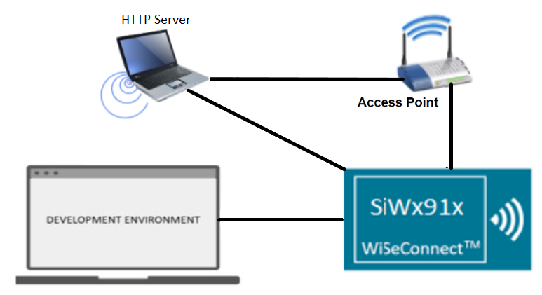
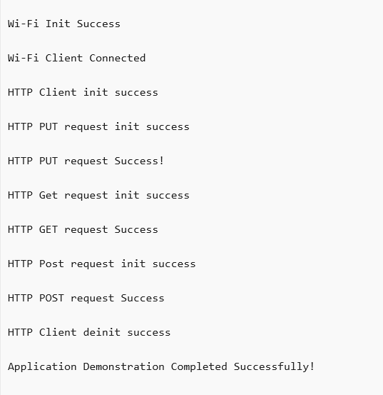

# Wi-Fi - HTTP Client

## Table of Contents

- [Purpose/Scope](#purposescope)
- [Prerequisites/Setup Requirements](#prerequisitessetup-requirements)
  - [Hardware Requirements](#hardware-requirements)
  - [Software Requirements](#software-requirements)
  - [Setup Diagram](#setup-diagram)
- [Getting Started](#getting-started)
- [Application Build Environment](#application-build-environment)
- [Test the Application](#test-the-application)
- [Steps to set up HTTP server](#steps-to-set-up-http-server)

## Purpose/Scope

This application demonstrates how to configure the SiWx91x device as an HTTP client and perform HTTP PUT, GET, and POST operations with the HTTP server opened on a remote peer. In this application, the SiWx91x is configured as a Wi-Fi station and connects to an access point. The application then performs HTTP PUT, GET, and POST operations with the HTTP server opened on a remote peer.

## Prerequisites/Setup Requirements

### Hardware Requirements

- Windows PC
- SoC Mode:
  - Silicon Labs [BRD4388A](https://www.silabs.com/)
- NCP Mode:
  - Standalone
    - BRD4002A Wireless Pro Kit Mainboard [SI-MB4002A]
    - EFR32xG24 Wireless 2.4 GHz +10 dBm Radio Board [xG24-RB4186C](https://www.silabs.com/development-tools/wireless/xg24-rb4186c-efr32xg24-wireless-gecko-radio-board?tab=overview)
    - NCP Expansion Kit with NCP Radio Boards
      - (BRD4346A + BRD8045A) [SiWx917-EB4346A]
      - (BRD4357A + BRD8045A) [SiWx917-EB4357A]
  - Interface and Host MCU Supported
    - SPI - EFR32 

### Software Requirements

- Simplicity Studio
- Windows PC (Remote PC) with HTTP server

### Setup Diagram

  

## Getting Started

Refer to the instructions [here](https://docs.silabs.com/wiseconnect/latest/wiseconnect-getting-started/) to:

- [Install Simplicity Studio](https://docs.silabs.com/wiseconnect/latest/wiseconnect-developers-guide-developing-for-silabs-hosts/#install-simplicity-studio)
- [Install WiSeConnect 3 extension](https://docs.silabs.com/wiseconnect/latest/wiseconnect-developers-guide-developing-for-silabs-hosts/#install-the-wi-se-connect-3-extension)
- [Connect your device to the computer](https://docs.silabs.com/wiseconnect/latest/wiseconnect-developers-guide-developing-for-silabs-hosts/#connect-si-wx91x-to-computer)
- [Upgrade your connectivity firmware ](https://docs.silabs.com/wiseconnect/latest/wiseconnect-developers-guide-developing-for-silabs-hosts/#update-si-wx91x-connectivity-firmware)
- [Create a Studio project ](https://docs.silabs.com/wiseconnect/latest/wiseconnect-developers-guide-developing-for-silabs-hosts/#create-a-project)

For details on the project folder structure, see the [WiSeConnect Examples](https://docs.silabs.com/wiseconnect/latest/wiseconnect-examples/#example-folder-structure) page.

## Application Build Environment

The application can be configured to suit your requirements and development environment. Read through the following sections and make any changes needed.

- The application uses the default configurations as provided in the **default_wifi_ap_profile** in ``sl_net_default_values.h``, and you can choose to configure these parameters as needed.
- In the Project Explorer pane, expand the **config** folder and open the **sl_net_default_values.h** file. Configure the following parameters to enable your Silicon Labs Wi-Fi device to connect to your Wi-Fi network.

  - STA instance related parameters

    - DEFAULT_WIFI_CLIENT_PROFILE_SSID refers to the name with which the Wi-Fi network shall be advertised. The Si91X module is connected to it.

      ```c
      #define DEFAULT_WIFI_CLIENT_PROFILE_SSID               "YOUR_AP_SSID"      
      ```

    - DEFAULT_WIFI_CLIENT_CREDENTIAL refers to the secret key if the access point is configured in WPA-PSK/WPA2-PSK security modes.

      ```c
      #define DEFAULT_WIFI_CLIENT_CREDENTIAL                 "YOUR_AP_PASSPHRASE" 
      ```

    - DEFAULT_WIFI_CLIENT_SECURITY_TYPE refers to the security type if the access point is configured in WPA/WPA2 or mixed security modes.

      ```c
      #define DEFAULT_WIFI_CLIENT_SECURITY_TYPE              SL_WIFI_WPA2 
      ```
  
  - Other STA instance configurations can be modified if required in `default_wifi_client_profile` configuration structure.
  
  > Note: 
  > You can configure default region-specific regulatory information using `sl_wifi_region_db_config.h`.

  - Configure the following parameters in ``app.c`` to test the HTTP Client app as per requirements:

  - HTTP Server Port and IP Settings

    ```c
    #define HTTP_PORT           80                 // Remote http server port
    #define HTTP_SERVER_IP      "192.168.0.100"    // Remote http server IP address
    ```

  - HTTPS Server Port and IP Settings

    ```c
    #define HTTPS_ENABLE        1                  // Enable for https server
    #define HTTP_PORT           443                // Remote https server port
    #define HTTP_SERVER_IP      "192.168.0.100"    // Remote https server IP address
    ```

- `sl_wifi_device_configuration_t` from `app.c` should be modified as per the requirements below:

  **[sl_net_set_credential()](https://docs.silabs.com/wiseconnect/3.0.13/wiseconnect-api-reference-guide-nwk-mgmt/net-credential-functions#sl-net-set-credential)** API expects the certificate in the form of a linear array. Convert the pem certificate into a linear array form using the python script provided in the SDK `<SDK>/resources/scripts/certificate_to_array.py`.

   For example : If the certificate is ca-cert.pem, enter the command in the following way:
   python certificate_script.py ca-cert.pem cacert.pem
   The script will generate cacert.pem.h in which one linear array named cacert contains the certificate.

  Root CA certificate needs to be converted as mentioned above.

  After the conversion, place the converted file in `<SDK>/resources/certificates/` path and include the certificate file in app.c.

  ```c
  // Certificate includes
  #include "cacert.pem.h"
  
  // Load Security Certificates
  status = sl_net_set_credential(SL_NET_TLS_SERVER_CREDENTIAL_ID(0), SL_NET_SIGNING_CERTIFICATE, cacert, sizeof(cacert) - 1);
  ```

## Test the Application

Refer to the instructions [here](https://docs.silabs.com/wiseconnect/latest/wiseconnect-getting-started/) to:

- Build the application
- Flash, run, and debug the application.

- Before running the application, set up the HTTP server on a remote PC.

- Run the application. After the program gets executed, the SiWx91x module connects to the AP and gets an IP address.

- The application then requests for HTTP PUT to PUT/Create the file onto the server, which is given in index.txt file and waits until PUT file operation is complete.

- The remote HTTP server accepts the PUT request and writes the received data to a file. You can find the created new file **index.html** at the following path **resources → scripts**.

- After successful creation of the file using HTTP PUT, the application requests the **index.html** file from the HTTP server using the HTTP GET method and waits until a complete response is received from the server.

- After fetching **index.html**, the application posts the given data in **HTTP_DATA** to the HTTP server using the HTTP POST method.

- You can see the log messages (success responses for HTTP PUT, HTTP GET, and HTTP POST) at the HTTP server as follows:


  

## Steps to Setup HTTP server

1. In a Windows PC, make sure python is installed.
2. Navigate to **`/<SDK>/resources/scripts/`**. Run the **simple_http_server.py** script on port number 80 using the following command:

   `python simple_http_server.py 80`

   **NOTE:** If the python command is not working, replace the python with py.

## Steps to Setup HTTPS server

1. In a Windows PC, make sure python is installed.
2. Navigate to **`/<SDK>/resources/scripts/`**. Run the **simple_https_server.py** script on port number 443 using the following command:

   `python simple_https_server.py 443`

    **NOTE:** If python command is not working, replace the python with py.

## Troubleshooting

- If any permission errors are observed while setting up the Python HTTP/HTTPS server:
  - Try running the python HTTP/HTTPS server script with admin privileges (Open command prompt or terminal in admin mode)
  - Try using a different port like 8080 for the HTTP/HTTPS connection
