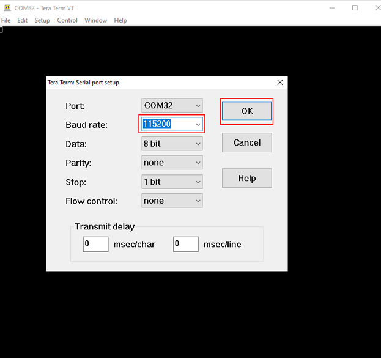
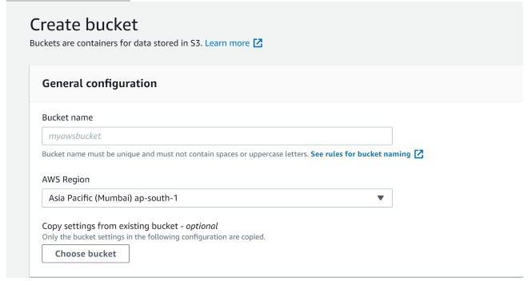
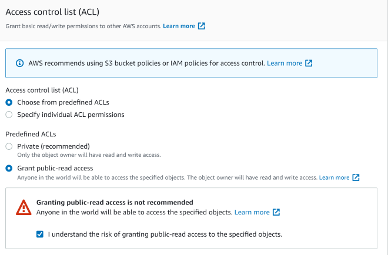
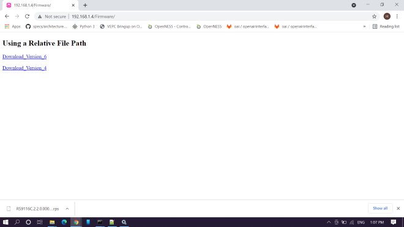

# HTTP/HTTPS OTA

## 1 Purpose/Scope 

This application demonstrates how to update new firmware to SiWx91x using remote HTTP/s server or cloud storage server.

> Note:
> By enabling HTTPS_SUPPORT Flag in app.c file, the same HTTP_OTAF application is used for HTTPS_OTAF.

In this application, SiWx91x EVK connects to Access Point as HTTP/HTTPS client and establishes connection with HTTP/s server (Apache server) or the cloud storage server (i.e., AWS S3 bucket/Azure Blob storage). After successful HTTP/s connection, SiWx91x EVK sends firmware file request (HTTP GET Request) to remote server and server responds with Firmware file.

The server transferred firmware file gets loaded/updated in the SiWx91x module flash memory. After successful firmware update, HTTP/s OTA API returns success response.

## 2 Prerequisites/Setup Requirements 

Before running the application, set up the following.

### 2.1 Hardware Requirements 

- Windows PC
- Wireless Access point
- SiWx91x Wi-Fi Evaluation Kit. The SiWx91x supports multiple operating modes. See [Operating Modes]() for details.
  - **SoC Mode**:
    - Silicon Labs [BRD4325A,BRD4325B, BRD4325G](https://www.silabs.com/)
  - **NCP Mode**:
    - Silicon Labs [(BRD4180A, BRD4280B)](https://www.silabs.com/); **AND** a Host MCU Eval Kit.

### 2.2 Software Requirements 

- Simplicity Studio IDE 
  - Download the [Simplicity Studio IDE](https://www.silabs.com/developers/simplicity-studio).
  - Follow the [Simplicity Studio user guide](https://docs.silabs.com/simplicity-studio-5-users-guide/1.1.0/ss-5-users-guide-getting-started/install-ss-5-and-software#install-ssv5) to install Simplicity Studio IDE.
- Install and configure Wamp-Apache HTTP server, refer to Appendix section 6.3 **Configuring and uploading firmware on Apache HTTP**.
- Install and configure Wamp-Apache HTTPs server, refer to Appendix section 6.4 **Configuring and uploading firmware on Apache HTTPs**.
- Configure AWS S3 bucket, refer to Appendix setion 6.1 **Configuring AWS S3 Bucket**.
- Configure Azure Blob storage, refer to Appendix section 6.2 **Configuring Azure Blob Storage**.

### 2.3 Set up Diagram

#### SoC Mode

Set up diagram for SoC mode:


Follow the [Getting Started with SiWx91x SoC](https://docs.silabs.com/) guide to set up the hardware connections and Simplicity Studio IDE.
  
#### NCP Mode

Set up diagram for NCP mode:


Follow the [Getting Started with EFx32](https://docs.silabs.com/rs9116-wiseconnect/latest/wifibt-wc-getting-started-with-efx32/) guide to setup the hardware connections and Simplicity Studio IDE.

## Project Environment

1. Ensure the SiWx91x loaded with the latest firmware following the [Getting started with a PC](https://docs.silabs.com/rs9116/latest/wiseconnect-getting-started). The firmware file is located at `<WiSeConnect3>/connectivity_firmware/`.

2. Ensure the EFx32 and SiWx91x set up is connected to your PC.

3. Ensure the latest Gecko SDK along with the extension WiSeConnect3 is added to Simplicity Studio.

### 3.1 Creating the project

#### 3.1.1 SoC mode

- Connect your board. The Si917 compatible SoC board is **BRD4325A,BRD4325B**.
- Studio should detect your board. Your board will be shown here.

  ****

- Go to the 'EXAMPLE PROJECT & DEMOS' tab and select "Wi-Fi - HTTP OTAF UPDATE"

  ****

- Give the desired name to your project and cick on **Finish**.

  ****

#### 3.1.2 NCP mode

- Connect your board. The supported NCP boards are: **BRD4180A,BRD4280B**
- The EFR32 board will be detected under **Debug Adapters** pane as shown below.

  ****

- Go to the 'EXAMPLE PROJECT & DEMOS' tab and select Wi-Fi - NCP http_otaf 

  ****

- Give the desired name to your project and cick on **Finish**

  ****

### Setup for applications prints

Before setting up Tera Term, do the following for SoC mode.

**SoC mode**: 
You can use either of the below USB to UART converters for application prints.

1. Set up using USB to UART converter board.

   - Connect Tx (Pin-6) to P27 on WSTK
   - Connect GND (Pin 8 or 10) to GND on WSTK

      

2. Set up using USB to UART converter cable.

   - Connect RX (Pin 5) of TTL convertor to P27 on WSTK
   - Connect GND (Pin1) of TTL convertor to GND on WSTK

      

**Tera term set up - for NCP and SoC modes**

1. Open the Tera Term tool. 
   - For SoC mode, choose the serial port to which USB to UART converter is connected and click on **OK**. 

     ****

   - For NCP mode, choose the J-Link port and click on **OK**.

     ****

2. Navigate to the Setup → Serial port and update the baud rate to **115200** and click on **OK**.

    ****

    ****

The serial port is now connected.

## 4 Application Build Environment

### 4.1 Configure the Application

The application can be configured to suit user requirements and development environment. Read through the following sections and make any changes needed.

- The application uses the default configurations as provided in the **default_wifi_ap_profile** in **sl_net_default_valus.h** and user can choose to configure these parameters as needed.

- In the Project explorer pane, expand the **config** folder and open the **sl_net_default_values.h** file. Configure the following parameters to enable your Silicon Labs Wi-Fi device to connect to your Wi-Fi network.

- **STA instance related parameters**

- DEFAULT_WIFI_CLIENT_PROFILE_SSID refers to the name with which the SiWx91x SoftAP's Wi-Fi network shall be advertised.

  ```c
  #define DEFAULT_WIFI_CLIENT_PROFILE_SSID               "YOUR_AP_SSID"      
  ```

- DEFAULT_WIFI_CLIENT_CREDENTIAL refers to the secret key if the Access point is configured in WPA-PSK/WPA2-PSK security modes.

  ```c
  #define DEFAULT_WIFI_CLIENT_CREDENTIAL                 "YOUR_AP_PASSPHRASE" 
  ```

- Other STA instance configurations can be modified if required in `default_wifi_client_profile` configuration structure.

#### 4.1.2 Below mentioned configurations in **app.c** file can be configured as per requirements

- Based on the type of server (Apache/AWS S3 bucket/Azure Blob Storage) from which firmware files needs to be downloaded, the below mentioned parameters needs to be configured.
- Configure FLAGS to choose the version and security type to be enabled

  Valid configurations are :

  ```c
  #define HTTPV6           BIT(0)         // Enable IPv6 set this bit in FLAGS, Default is IPv4
  #define HTTPS_SUPPORT    BIT(1)         // Set HTTPS_SUPPORT to use HTTPS feature
  #define HTTP_V_1_1       BIT(6)         // Set HTTP_V_1_1 to use HTTP version 1.1
  ```

In code, **AWS_ENABLE** macro is enabled by default in application.<br />
Depending on the requirement user can enable downloading firmware from Azure Blob storage (Enable Macro **AZURE_ENABLE**).<br />
Else if both AWS and Azure macro is disabled, HTTP/s Apache server can be used to download the firmware.

- HTTP_PORT refers to HTTP Server port number
- HTTP_SERVER_IP_ADDRESS refers to HTTP Server IP address
- HTTP_URL refers to HTTP resource name
- HTTP_HOSTNAME refers to HTTP server hostname
- HTTP_EXTENDED_HEADER refers to HTTP extended header. If NULL default extented header is filled
- USERNAME refers to the username to be used to access the HTTP resource
- PASSWORD refers to the password to be used to access the HTTP resource

**For Apache HTTP Server**

  ```c
  //Sample configurations
  #define FLAGS                   0
  #define HTTP_PORT               80
  #define HTTP_SERVER_IP_ADDRESS  "192.168.xxx.xxx"
  #define HTTP_URL                "Firmware/firmware.rps" //firwmare file name to download
  #define HTTP_HOSTNAME           "192.168.xxx.xxx"
  #define USERNAME                "admin"
  #define PASSWORD                "admin"
  ```

**For Apache HTTPS Server**

- Include Root certificate pem file for SSL connection
- Provide the PC IP where Apache server is running in HTTP_SERVER_IP_ADDRESS 
- Provide the firmware package name uploaded in Apache server in HTTP_URL
   
  ```c
  //Sample configurations
  #include "cacert.pem"
  #define FLAGS                   HTTPS_SUPPORT
  #define HTTP_PORT               443
  #define HTTP_SERVER_IP_ADDRESS  "192.168.xxx.xxx"
  #define HTTP_URL                "Firmware/firmware.rps" //firwmare file name to download
  #define HTTP_HOSTNAME           "192.168.xxx.xxx"
  #define USERNAME                "admin"
  #define PASSWORD                "admin"
  ```

 **For AWS S3 Bucket** 
 
- Include Starfield root certificate file for SSL connection
  
> Note : The certificate authority for Amazon AWS S3 is Starfield, hence we need to include Starfield Root certification for SSL connection to be successful. This certificate is already included in the SDK in linear array format "aws_starfield_ca.pem.h" which can be directly used for SSL connection to AWS S3.

- Extract the hostname from AWS S3 bucket URL `https://<Your-S3-Bucket-name>.s3.<Your-nearest-S3-location>.amazonaws.com/firmware.rps` and provide it in **hostname**
  
> Example: For S3 bucket URL <https://example.s3.ap-south-1.amazonaws.com/firmware.rps>", hostname will be "example.s3.ap-south-1.amazonaws.com"

- Extract the firmware package name from URL `https://<Your-S3-Bucket-name>.s3.<Your-nearest-S3-location>.amazonaws.com/firmware.rps` and provide it in **HTTP_URL**
 
> Example: For S3 bucket URL "<https://example.s3.ap-south-1.amazonaws.com/firmware.rps>", HTTP_URL will be "firmware.rps"
 
  ```c
  //Sample configurations
  #include "aws_starfield_ca.pem.h"         //CA certificate
  #define FLAGS                              HTTPS_SUPPORT
  #define HTTP_PORT                          443
  #define HTTP_URL                           "firmware.rps" //firwmare file name to download
  #define USERNAME                           ""
  #define PASSWORD                           ""
  char *hostname                             ="example.s3.ap-south-1.amazonaws.com";
  ```
   
  **Note:** The `USERNAME` and `PASSWORD` is provided as empty string "" since the S3 bucket URL created has public access provided. Refer Appendix section 6.1 on how to upload Firmware in AWS S3 Bucket. 

  ```c
  //Sample configurations
  #include "http_baltimore_ca.pem.h"        //Baltimore Root CA
  #define FLAGS                             HTTPS_SUPPORT
  #define HTTP_PORT                         443
  #define HTTP_URL                          "rps/firmware.rps" //firwmare file name to download
  #define USERNAME                          ""
  #define PASSWORD                          ""
  char *hostname                            ="example.blob.core.windows.net";
  ```

**Note:** The USERNAME and PASSWORD is provided as empty string "" since the Azure Blob storage URL created has public access provided. Refer to Appendix section 6.2 on how to upload Firmware in Azure Blob storage

#### 4.1.3 `sl_wifi_device_configuration_t` from `app.c` should be modified as per below requirements

- **For Apache HTTP Server**

```c
// station_init_configuration structure should contain below configurations
.tcp_ip_feature_bit_map     = (TCP_IP_FEAT_DHCPV4_CLIENT | TCP_IP_FEAT_HTTP_CLIENT | TCP_IP_FEAT_EXTENSION_VALID)

.ext_tcp_ip_feature_bit_map = EXT_FEAT_HTTP_OTAF_SUPPORT
```
   
- **For Apache HTTPS Server**

```c
// station_init_configuration structure should contain below configurations
.tcp_ip_feature_bit_map     = (TCP_IP_FEAT_DHCPV4_CLIENT | TCP_IP_FEAT_HTTP_CLIENT| TCP_IP_FEAT_EXTENSION_VALID | TCP_IP_FEAT_SSL)

.ext_tcp_ip_feature_bit_map = EXT_FEAT_HTTP_OTAF_SUPPORT
```

- **For AWS S3 Bucket**

```c
// station_init_configuration structure should contain below configurations
.tcp_ip_feature_bit_map     = (TCP_IP_FEAT_DHCPV4_CLIENT | TCP_IP_FEAT_HTTP_CLIENT| TCP_IP_FEAT_EXTENSION_VALID | TCP_IP_FEAT_SSL | TCP_IP_FEAT_DNS_CLIENT)

.ext_tcp_ip_feature_bit_map = (EXT_FEAT_HTTP_OTAF_SUPPORT | EXT_TCP_IP_SSL_16K_RECORD)
```

#### 4.1.4 To Load Certificate 

**sl_wifi_set_certificate()** API expects the certificate in the form of linear array. Convert the pem certificate into linear array form using python script provided in the SDK `<SDK>/resources/scripts/certificate_script.py`.

   For example : If the certificate is ca-certificate.pem, enter the command in the following way:
   python certificate_script.py ca-certificate.pem 
   The script will generate ca-certificate.pem in which one linear array named ca-certificate contains the certificate.

Root CA certificate needs to be converted as mentioned above.

After the conversion, place the converted file in `<SDK>/resources/certificates/` path and include the certificate file in rsi_http_otaf_app.c

- For HTTPs Apache server

  ```c 
  // Certificate includes
  #include "cacert.pem"
  
  // Load Security Certificates
  status = sl_wifi_set_certificate(SL_TLS_SSL_CA_CERTIFICATE, cacert, (sizeof(cacert) - 1));
  ```

- For AWS

  ```c
  // Certificate includes
  #include "aws_starfield_ca.pem.h"

  // Load Security Certificates
  status = sl_wifi_set_certificate(SL_TLS_SSL_CA_CERTIFICATE, aws_starfield_ca, (sizeof(aws_starfield_ca) - 1));
  ```

### 4.2 Build the Application

#### - SoC Mode : Build as http_otaf Example

  ****  
  
#### - NCP Mode

### Run and Test the application

1. Once the build was successful, right click on project and select Debug As → Silicon Labs ARM Program to program the device as shown in below image.

   ****

2. As soon as the debug process is completed, the application control branches to the main().

3. Go to the J-link Silicon Labs console pane to observe the debug prints in the Serial 1 tab.

4. Click on the **Resume** icon in the Simplicity Studio IDE toolbar to run the application.

   ****

### Application prints

SoC mode (with AWS)

   ****

NCP mode (with AWS)

   ****

SoC mode (with Apache)

   ****

NCP mode (with Apache)

   ****

## 4.3 Appendix

### 4.3.1 Configuring AWS S3 Bucket

- Sign into the Amazon S3 console at <https://console.aws.amazon.com/s3/>
- Choose **Create bucket**

   

- Enter a **bucket name**

   

- Enable ACLs

   

- Under **Bucket settings for Block Public Access** uncheck **Block all public access**

   

- Under **Bucket Versioning**, select **Enable** to keep all versions in the same bucket

   

- Choose **Create bucket**

   

- Choose the created bucket from the list of buckets in console

- Upload the file in creating bucket

   

- Add the file to the bucket

   

- Setting permission to public access

   

- After uploading the file, click on the file

   

- Get the object URL inside bucket/properties, like below :

   

[https://si917-ta-fmw.s3.us-east-2.amazonaws.com/SiWG917-A.1.0.0.0.17.rps]

### 4.3.2 Configuring and Uploading Firmware on Apache HTTP

* Download and Install Wamp-Apache Server
  - Open the below link in your system browser.
    Wamp Server - (<https://www.wampserver.com/en/>)
  - Under Downloads, Download the latest version of WAMP server for 32bit or 64bit machine.
  - Install Wamp-Apache server with all the default settings.
  - Make sure the Wamp-Apache server is present in C:\ directory
  - Configure a HTTP server
  - Navigate to C:\wamp64\bin\apache\apache2.4.46\conf
  - Open httpd.conf file with an editor.
  - Change the below lines into system IP address
   
 ```sh
    Listen {System-IP-Address}:80
    ServerName {System-IP-Address}:80
    Eg: Listen 192.168.1.4:80
        ServerName 192.168.1.4:80
 ```
 
- Save the file and Exit.
- Open command prompt and run with Administrator Privilege's.
- Navigate to directory C:\wamp64\bin\apache\apache2.4.46\bin
- Add Apache as a Windows Service:
    
    `httpd.exe -k install`
    
- While the install is in progress, you will be prompted to Windows Network Access page as shown below. Make sure you allow both Private and Public network access.

   

- Start Apache Service in Windows
  - Open RUN in windows using WIN+R button.
  - Input "services.msc" into RUN
  - This will open your Windows System Services
  - In the list of services running you can find Apache2.x present.
  - Start the service as shown below

   

- Now that your Apache has started and running, check it by using your browser. Open a Web browser and type the machine IP in the address bar and hit Enter. You should see the below, if server has started successfully.

   

- As you can see the connection is "Not Secure" means it is running HTTP server.
- Configure HTTP Wamp-Apache Server to Download firmware
  - Goto the Wamp Root directory, in my case it is C:\wamp64 and navigate to "www" folder C:\wamp64\www.
  - Create a new folder in that directory, in my case I created a folder named "Firmware". [Folder Structure: C:\wamp64\www\Firmware]
  - In the "Firmware" folder create an "index.html" file and write below contents to the file.
    
```html
    <!DOCTYPE html>
    <html>
        <body>
            <h2>Using a Relative File Path</h2>
            <a href="firmware.rps" download>Download_Version_6</a><br><br>
            <a href="firmware1.rps" download>Download_Version_4</a>
        </body>
    </html>
```
    
- This code will link your resources to Apache server, so that those files can be downloaded.
- you can edit href values in the index.html to your firmware file names.
- Make sure to copy all the firmware files into the present directory, C:\wamp64\www\Firmware. Save the file and Exit.
   
    ```html
    <a href="<your-firmware-file>-1.rps" download>Download_Version_6</a><br><br>
    <a href="<your-firmware-file>-2.rps" download>Download_Version_4</a>
    ```

* Configure HTTPD.conf file for Wamp-Apache Server
  - Open httpd.conf file in C:\wamp64\bin\apache\apache2.4.46\conf\httpd.conf
  - Search or Find "DocumentRoot" and change it to below configuration. Save the file and Exit
   
   ```sh
    "${INSTALL_DIR}/www/Firmware"
    ```

* Restart Apache Service
  - Open Windows services, "WIN+R" → "services.msc" → ENTER
  - Check for Apache service and Restart the service
  - In the above configuration, we have created a resource for our server in "Firmware" folder.
  - Our access resource URL looks as shown below
    
> `http://<your-ip-address>/<Sub-Resource-Directory>/<Resources>`
>
> Eg: <http://192.168.1.4/Firmware/firmware.rps>
> <http://192.168.1.4/Firmware/firmware1.rps>
    
- Giving the `http://<your-ip-address>/<Sub-Resource-Directory>` in browser should load as shown below. Clicking on any link should download the Firmware files.

   

- Get the resource Information and test with Application
  - In the SiWx91x FOTA application, make below changes and test application this should start downloading firmware.
  
  ```c
  #define HTTP_SERVER_IP_ADDRESS "192.168.1.4"              //Replace this values related to your requirements
  #define HTTP_URL               "Firmware/firmware_file.rps"          //HTTP GET request resource name
  #define HTTP_HOSTNAME          "192.168.1.4"//Replace this values related to your requirements
  ```

> **Warning:** Make sure that you are able to Access the WAMP-Apache Server (with its IP Address) is accessible to other systems in the same network, if not follow the Changing PHP Configurations. Else proceed with next steps

- Changing PHP Configuration 
  - The below steps to be done only when you face an issue of not able to access the WAMP-Server from other machines in the network. Issue shown below :

   

  - Give permissions to the newly created resource `"<Sub-Resource-Directory>"`
  - Open "phpmyadmin.conf" file in "C:\wamp64\alias\phpmyadmin.conf"
  - Add the line shown below into the end of file "phpmyadmin.conf" file. Save and exit the file.

    ```sh
    <Directory "c:/wamp64/www/<Sub-Resource-Directory>/">


    For example,
    <Directory "c:/wamp64/www/Firmware/">
    Options +Indexes +FollowSymLinks +MultiViews
    AllowOverride all
    Require all granted
    </Directory>
    ```

  - Restart Apache service and now the resource should be accessible from any systems connected in the same network.

> **Note:**
> Even though if you are not able to access `http://<your-ip-address>/` this page directly, you will be able to access your resources from here `http://<your-ip-address>/<Sub-Resource-Directory>/` as we gave only permissions for this

### 4.3.3 Configuring and Uploading Firmware on Apache HTTPs

HTTPs Sever configuration for Apache requires Wamp server, if you have not installed it, follow the **"Step 1: Download and Install Wamp-Apache Server"** step and continue with the HTTPS steps in this document.
- **Download and Install OPENSSL for windows**
  - OpenSSL for windows from here (<https://slproweb.com/products/Win32OpenSSL.html>).
  - Do default install for OpenSSL.
  - We can only run OpenSSL using command prompt, for that we need to first find the openssl.exe file.
  - Normally it will be in "C:\Program Files\OpenSSL-Win64\bin\openssl.exe"

- **Generate required certs**
   > **Note:** If you already have the reqired certs to run the server then, skip the **Generate required certs** step, copy your certs to `C:\wamp64\bin\apache\apache2.4.46\conf` directory and update the `httpd-ssl.conf` file with these certificate paths shown in **HTTPD Configuration** step. 

  - Open Command Prompt in Administrator privilege's.
  - Change directory to your openssl.exe file "cd C:\Program Files\OpenSSL-Win64\bin\"
  - Execute the below command to generate a private.key file with AES 256 encryption. 

 ```sh
    openssl.exe genrsa -aes256 -out private.key 2048
    openssl.exe rsa -in private.key -out private.key
    openssl.exe req -new -x509 -nodes -sha1 -key private.key -out certificate.crt -days 36500 -config <your-wamp-apache-openssl.conf-file-path>
    openssl.exe req -new -x509 -nodes -sha1 -key private.key -out certificate.crt -days 36500 -config C:\wamp64\bin\apache\apache2.4.46\conf\openssl.conf
 ```
    
- Now there will be two files created [Private.key and certificate.crt] in "C:\Program Files\OpenSSL-Win64\bin\" directory, copy them to "C:\wamp64\bin\apache\apache2.4.46\conf"

- **HTTPD Configuration**
  - Open "httpd.conf" file in "C:\wamp64\bin\apache\apache2.4.46\conf"
  - Uncomment the below shown lines in that file. Save and Exit.

  ```sh
  LoadModule ssl_module modules/mod_ssl.so
  Include conf/extra/httpd-ssl.conf
  LoadModule socache_shmcb_module modules/mod_socache_shmcb.so
  ```

  - Open "php.ini" file in "C:\wamp64\bin\php\php5.6.40" and uncomment the below line in the file
  
      `extension=php_openssl.dll`
  - Open "httpd-ssl.conf" file in "C:\wamp64\bin\apache\apache2.4.46\conf\extra" and update the below paths with proper information (i.e provide system relative paths)

  ``` sh
  <VirtualHost default:443>
  General setup for the virtual host
  DocumentRoot "C:/wamp64/www"
  ServerName 192.168.43.85:443
  ServerAdmin admin@example.com
  ErrorLog "C:/wamp64/bin/apache/apache2.4.46/logs/error.log"
  TransferLog "C:/wamp64/bin/apache/apache2.4.46/logs/access.log"

  SSLCertificateFile "C:/wamp64/bin/apache/apache2.4.46/conf/certificate.crt"
  SSLCertificateKeyFile "C:/wamp64/bin/apache/apache2.4.46/conf/private.key" 
  ```

  - Run below command to check if the configurations given above are proper or not. If the configurations are proper, it will return "Syntax OK"

      `httpd.exe -t`
- **Configure HTTPS Wamp-Apache Server to Download firmware**
  - Goto the Wamp Root directory "C:\wamp64" and navigate to "www"
  - Create a new folder in that directory "Firmware". [Folder Structure: C:\wamp64\www\Firmware]
  - In the "Firmware" folder create an "index.html" file and write below contents to the file.

```html
    <!DOCTYPE html>
    <html>
        <body>
            <h2>Using a Relative File Path</h2>
            <a href="firmware.rps" download>Download_Version_6</a><br><br>
            <a href="firmware1.rps" download>Download_Version_4</a>
        </body>
    </html>
```

- This code will link your resources to Apache server, so that those files can be downloaded.

- Make sure to copy all the firmware files into the present directory, C:\wamp64\www\Firmware

- you can edit href values in the index.html to your firmware file names.

```html
    <a href="<your-firmware-file>-1.rps" download>Download_Version_6</a><br><br>
    <a href="<your-firmware-file>-2.rps" download>Download_Version_4</a>
```

- Save the file and Exit.
- **Restart Server**
>
> - Open RUN, "WIN+R" → "services.msc" → ENTER
> - Restart the Apache service.
> - Open browser and give your Apache server URL

  ****

> - Here click on "Advanced Settings" and click on "Proceed to 192.168.43.85 (unsafe)"
> - You will be able to access the page and resources in HTTPS.

   

> **Note:** Make sure to check your HTTPS server from other local machines present in the same network. It should be accessible.
