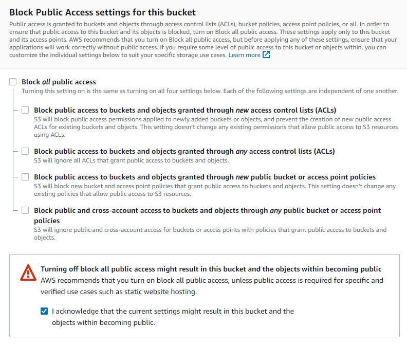
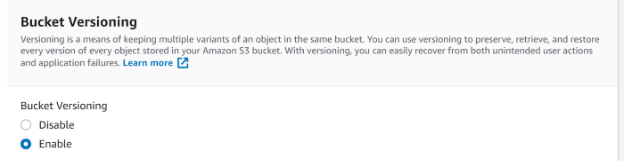
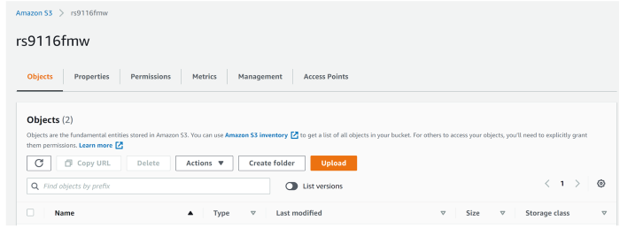
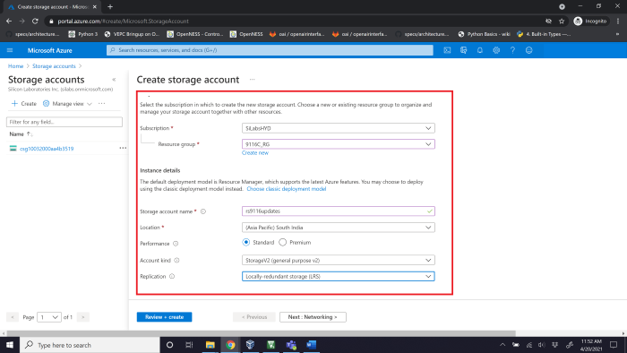
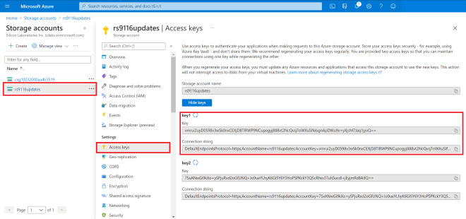
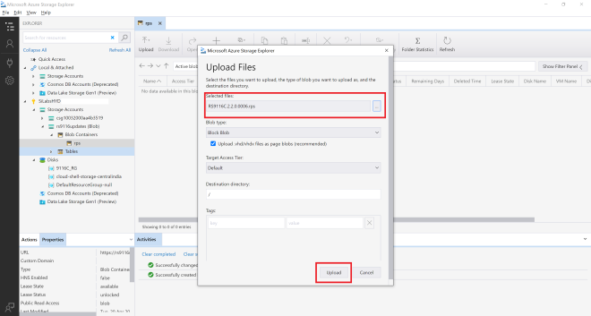

# Wi-Fi - HTTP OTAF Update

## Table of Contents

- [Purpose/Scope](#purposescope)
- [Prerequisites/Setup Requirements](#prerequisitessetup-requirements)
  - [Hardware Requirements](#hardware-requirements)
  - [Software Requirements](#software-requirements)
  - [Setup Diagram](#setup-diagram)
- [Getting Started](#getting-started)
- [Application Build Environment](#application-build-environment)
- [Test the Application](#test-the-application)
- [Additional Information](#additional-information)
  - [Configuring AWS S3 Bucket](#configuring-aws-s3-bucket)
  - [Configuring and Uploading Firmware on Apache HTTP](#configuring-and-uploading-firmware-on-apache-http)
  - [Configuring and Uploading Firmware on Apache HTTPs](#configuring-and-uploading-firmware-on-apache-https)

## Purpose/Scope

This application demonstrates how to update new firmware to SiWx91x using local HTTP/HTTPS server or cloud storage server.

> **Note:** By enabling HTTPS_SUPPORT Flag in `app.c` file, the same HTTP_OTAF application is used for HTTPS_OTAF.

In this application, the SiWx91x connects to an Access Point, configures as HTTP/HTTPS client and establishes connection with HTTP/HTTPS server (Apache server) or the cloud storage server (i.e., AWS S3 bucket/Azure Blob storage). After successful HTTP/HTTPS connection, SiWx91x sends firmware file request (HTTP GET Request) to remote server and server responds with Firmware file.

The server transferred firmware file gets loaded/updated in the SiWx91x flash memory. After successful firmware update, the [sl_si91x_http_otaf()](https://docs.silabs.com/wiseconnect/3.0.13/wiseconnect-api-reference-guide-fw-upgrade/service-firmware-upgrade-functions#sl-si91x-http-otaf) API returns success response.

## Prerequisites/Setup Requirements

### Hardware Requirements

- Windows PC
- Wireless Access point
- SiWx91x Wi-Fi Evaluation Kit. The SiWx91x supports multiple operating modes. See [Operating Modes]() for details.
- **SoC Mode**:
  - Standalone
    - BRD4002A Wireless pro kit mainboard [SI-MB4002A]
    - Radio Boards 
  	  - BRD4338A [SiWx917-RB4338A]
  	  - BRD4340A [SiWx917-RB4340A]
  - Kits
  	- SiWx917 Pro Kit [Si917-PK6031A](https://www.silabs.com/development-tools/wireless/wi-fi/siwx917-pro-kit?tab=overview)
  	- SiWx917 Pro Kit [Si917-PK6032A]
  	
- **NCP Mode**:
  - Standalone
    - BRD4002A Wireless pro kit mainboard [SI-MB4002A]
    - EFR32xG24 Wireless 2.4 GHz +10 dBm Radio Board [xG24-RB4186C](https://www.silabs.com/development-tools/wireless/xg24-rb4186c-efr32xg24-wireless-gecko-radio-board?tab=overview)
    - NCP EFR Expansion Kit with NCP Radio board (BRD4346A + BRD8045A) [SiWx917-EB4346A]
  - Kits
  	- EFR32xG24 Pro Kit +10 dBm [xG24-PK6009A](https://www.silabs.com/development-tools/wireless/efr32xg24-pro-kit-10-dbm?tab=overview)

### Software Requirements

- Simplicity Studio

### Setup Diagram


## Getting Started

Refer to the instructions [here](https://docs.silabs.com/wiseconnect/latest/wiseconnect-getting-started/) to:

- Install Studio and WiSeConnect 3 extension
- Connect your device to the computer
- Upgrade your connectivity firmware
- Create a Studio project

## Application Build Environment

The application can be configured to suit user requirements and development environment. Read through the following sections and make any changes needed.

- The application uses the default configurations as provided in the **DEFAULT_WIFI_CLIENT_PROFILE** in **sl_net_default_values.h** and user can choose to configure these parameters as needed.

- In the Project explorer pane, expand the **config** folder and open the ``sl_net_default_values.h`` file. Configure the following parameters to enable SiWx91x to connect to your Wi-Fi network.

- STA instance related parameters

  - DEFAULT_WIFI_CLIENT_PROFILE_SSID refers to the name with which Wi-Fi network that shall be advertised and Si91X module is connected to it.

    ```c
    #define DEFAULT_WIFI_CLIENT_PROFILE_SSID               "YOUR_AP_SSID"      
    ```

  - DEFAULT_WIFI_CLIENT_CREDENTIAL refers to the secret key if the Access point is configured in WPA-PSK/WPA2-PSK security modes.

    ```c
    #define DEFAULT_WIFI_CLIENT_CREDENTIAL                 "YOUR_AP_PASSPHRASE" 
    ```

  - DEFAULT_WIFI_CLIENT_SECURITY_TYPE refers to the security type if the Access point is configured in WPA/WPA2 or mixed security modes.

    ```c
    #define DEFAULT_WIFI_CLIENT_SECURITY_TYPE              SL_WIFI_WPA2 
    ```

- Other STA instance configurations can be modified if required in **DEFAULT_WIFI_CLIENT_PROFILE** configuration structure.

- Below mentioned configurations in ``app.c`` file can be configured as per requirements

  - Select Firmware update type

  - For TA firmware upgrade, set FW_UPDATE_TYPE to TA_FW_UPDATE and for M4 firmware upgrade, set FW_UPDATE_TYPE to M4_FW_UPDATE

    ```c
    //! Type of FW update
    #define M4_FW_UPDATE 0
    #define TA_FW_UPDATE 1

    //! Set FW update type
    #define FW_UPDATE_TYPE TA_FW_UPDATE
    ```

- Based on the type of server (Apache/AWS S3 bucket/Azure Blob Storage) from which firmware files needs to be downloaded, the below mentioned parameters needs to be configured.
- Configure FLAGS to choose the version and security type to be enabled

  Valid configurations are :

  ```c
  #define HTTPS_SUPPORT    BIT(0)         // Set HTTPS_SUPPORT to use HTTPS feature
  #define HTTPV6           BIT(3)         // Enable IPv6 set this bit in FLAGS, Default is IPv4
  #define HTTP_V_1_1       BIT(6)         // Set HTTP_V_1_1 to use HTTP version 1.1
  ```

- In the application, **AWS_ENABLE** macro is enabled by default. Depending on the requirement user can enable downloading firmware from Azure Blob storage (Enable Macro **AZURE_ENABLE**).
- Else if both **AWS_ENABLE** and **AZURE_ENABLE** macros are disabled, HTTP/HTTPS Apache server can be used to download the firmware.<br>
- In the application, the following parameters should be configured:
  - HTTP_PORT refers to HTTP Server port number
  - HTTP_SERVER_IP_ADDRESS refers to HTTP Server IP address
  - HTTP_URL refers to HTTP resource name
  - HTTP_HOSTNAME refers to HTTP server hostname
  - HTTP_EXTENDED_HEADER refers to HTTP extended header. If NULL default extented header is filled
  - USERNAME refers to the username to be used to access the HTTP resource
  - PASSWORD refers to the password to be used to access the HTTP resource
  <br>

- For **Apache HTTP Server**:

  - Provide the PC IP where Apache server is running in HTTP_SERVER_IP_ADDRESS
  - Provide the firmware package name uploaded in Apache server in HTTP_URL

    ```c
    //Sample configurations
    #define FLAGS                   0
    #define HTTP_PORT               80
    #define HTTP_SERVER_IP_ADDRESS  "192.168.xxx.xxx"
    #define HTTP_URL                "Firmware/firmware.rps" //firmware file name to download
    #define HTTP_HOSTNAME           "192.168.xxx.xxx"
    #define USERNAME                "admin"
    #define PASSWORD                "admin"
    ```
    > **Note:** Refer [Configuring and Uploading Firmware on Apache HTTP](#configuring-and-uploading-firmware-on-apache-http) section on how to set Apache Server up.

- For **Apache HTTPS Server**:
   - Include Root certificate pem file for SSL connection.
   
     ```c
     //Sample configurations
     #include "cacert.pem.h"
     #define FLAGS                   HTTPS_SUPPORT
     #define HTTP_PORT               443
     #define HTTP_SERVER_IP_ADDRESS  "192.168.xxx.xxx"
     #define HTTP_URL                "Firmware/firmware.rps" //firmware file name to download
     #define HTTP_HOSTNAME           "192.168.xxx.xxx"
     #define USERNAME                "admin"
     #define PASSWORD                "admin"
     ```
- For **AWS S3 Bucket**:

  - Include Starfield root certificate file for SSL connection.
  
    > **Note:** The certificate authority for Amazon AWS S3 is Starfield, hence we need to include Starfield Root certification for SSL connection to be successful. This certificate is already included in the SDK in linear array format ``aws_starfield_ca.pem.h`` which can be directly used for SSL connection to AWS S3.

  - Extract the hostname from AWS S3 bucket URL `https://<Your-S3-Bucket-name>.s3.<Your-nearest-S3-location>.amazonaws.com/firmware.rps` and provide it in **hostname**.
  
    > Example: For S3 bucket URL <https://example.s3.ap-south-1.amazonaws.com/firmware.rps>", hostname will be "example.s3.ap-south-1.amazonaws.com"

  - Extract the firmware package name from URL `https://<Your-S3-Bucket-name>.s3.<Your-nearest-S3-location>.amazonaws.com/firmware.rps` and provide it in **HTTP_URL**

    > Example: For S3 bucket URL "<https://example.s3.ap-south-1.amazonaws.com/firmware.rps>", HTTP_URL will be "firmware.rps"
  
  - Configurations for AWS S3 bucket
    ```c
    //Sample configurations
    #include "aws_starfield_ca.pem.h"          //CA certificate
    #define FLAGS                              HTTPS_SUPPORT
    #define HTTP_PORT                          443
    #define HTTP_URL                           "firmware.rps" //firmware file name to download
    #define USERNAME                           ""
    #define PASSWORD                           ""
    char *hostname                             ="example.s3.ap-south-1.amazonaws.com";
    ```

    > **Note:** The `USERNAME` and `PASSWORD` is provided as empty string "" since the S3 bucket URL created has public access provided. Refer [Configuring AWS S3 Bucket](#configuring-aws-s3-bucket) section on how to upload Firmware in AWS S3 Bucket.

    - For Private resource: While trying to download the private resource, please make sure to create the pre-signed URL and use it in HTTP_URL as shown below.
      ```C
      #define HTTP_URL "filename?query_parameters"  // This should be used when pre-signed URLs are passed
      ```

- For **Azure Blob Storage**:

  - Include Azure Baltimore certificate file for SSL connection.
    > **Note:** This certificate is already included in the SDK in linear array format ``azure_baltimore_ca.pem.h`` which can be directly used for SSL connection to Azure Blob Storage.

  - Extract the hostname from Azure Blob Storage URL `https://<Your-Azure-Storage-Account-name>.blob.core.windows.net/<Your-container-name>/firmware.rps` and provide it in **hostname**.
  
    > Example: For Azure Blob Storage URL <https://example1.blob.core.windows.net/example2/firmware.rps>", hostname will be "example..blob.core.windows.net".

  - Extract the firmware package name from URL `<Your-Azure-Storage-Account-name>.blob.core.windows.net/<Your-container-name>/firmware.rps` and provide it in **HTTP_URL**.

    > Example: For Azure Blob Storage URL "https://example1.blob.core.windows.net/example2/firmware.rps>", HTTP_URL will be "example2/firmware.rps"
  
  - Configurations for Azure Blob Storage
    ```c
    //Sample configurations
    #include "azure_baltimore_ca.pem.h"        //Baltimore Root CA
    #define FLAGS                             HTTPS_SUPPORT
    #define HTTP_PORT                         443
    #define HTTP_URL                          "rps/firmware.rps" //firmware file name to download
    #define USERNAME                          ""
    #define PASSWORD                          ""
    char *hostname                            ="example.blob.core.windows.net";
    ```

    > **Note:** The `USERNAME` and `PASSWORD` is provided as empty string "" since the Azure Blob storage URL created has public access provided. Refer to [Configuring Azure Blob Storage](#configuring-azure-blob-storage) on how to upload Firmware in Azure Blob storage.

- The **station_init_configuration** from `app.c` should be modified as per below requirements

  - For **Apache HTTP Server**:

    ```c
    // station_init_configuration structure should contain below configurations
    .tcp_ip_feature_bit_map     = (TCP_IP_FEAT_DHCPV4_CLIENT | TCP_IP_FEAT_HTTP_CLIENT | TCP_IP_FEAT_EXTENSION_VALID)
    .ext_tcp_ip_feature_bit_map = EXT_FEAT_HTTP_OTAF_SUPPORT
    ```

  - For **Apache HTTPS Server**:

    ```c
    // station_init_configuration structure should contain below configurations
    .tcp_ip_feature_bit_map     = (TCP_IP_FEAT_DHCPV4_CLIENT | TCP_IP_FEAT_HTTP_CLIENT| TCP_IP_FEAT_EXTENSION_VALID | TCP_IP_FEAT_SSL)

    .ext_tcp_ip_feature_bit_map = EXT_FEAT_HTTP_OTAF_SUPPORT
    ```

  - For **AWS S3 Bucket** and **Azure Blob Storage**:

    ```c
    // station_init_configuration structure should contain below configurations
    .tcp_ip_feature_bit_map     = (TCP_IP_FEAT_DHCPV4_CLIENT | TCP_IP_FEAT_HTTP_CLIENT| TCP_IP_FEAT_EXTENSION_VALID | TCP_IP_FEAT_SSL | TCP_IP_FEAT_DNS_CLIENT)

    .ext_tcp_ip_feature_bit_map = (EXT_FEAT_HTTP_OTAF_SUPPORT | EXT_TCP_IP_SSL_16K_RECORD)
    ```

- Certificate Loading
  - The **[sl_net_set_credential()](https://docs.silabs.com/wiseconnect/3.0.13/wiseconnect-api-reference-guide-nwk-mgmt/net-credential-functions#sl-net-set-credential)** API expects the certificate in the form of linear array. Convert the pem certificate into linear array form using python script provided in the SDK `<SDK>/resources/scripts/certificate_script.py`.

  - For example : If the certificate is ca-certificate.pem, enter the command in the following way:
   `python certificate_script.py ca-certificate.pem`
   - The script will generate ca-certificate.pem in which one linear array named ca-certificate contains the certificate.

  - Root CA certificate needs to be converted as mentioned above.

  - After the conversion, place the converted file in `<SDK>/resources/certificates/` path and include the certificate file in ``app.c``

- For HTTPS Apache server

  ```c
  // Certificate includes
  #include "ca-certificate.pem.h"
  
  // Load Security Certificates
  status = sl_net_set_credential(SL_NET_TLS_SERVER_CREDENTIAL_ID(0), SL_NET_SIGNING_CERTIFICATE, ca-certificate, sizeof(ca-certificate) - 1);
  ```

- For AWS Server

  ```c
  // Certificate includes
  #include "aws_starfield_ca.pem.h"

  // Load Security Certificates
  status = sl_net_set_credential(SL_NET_TLS_SERVER_CREDENTIAL_ID(0), SL_NET_SIGNING_CERTIFICATE, aws_starfield_ca, (sizeof(aws_starfield_ca) - 1));
  ```

- For Azure Server

  ```c
  // Certificate includes
  #include "azure_baltimore_ca.pem.h"

  // Load Security Certificates
  status = sl_net_set_credential(SL_NET_TLS_SERVER_CREDENTIAL_ID(0), SL_NET_SIGNING_CERTIFICATE, azure_baltimore_ca, (sizeof(azure_baltimore_ca) - 1));
  ```

## Test the Application

Refer to the instructions [here](https://docs.silabs.com/wiseconnect/latest/wiseconnect-getting-started/) to:

- Build the application.
- Flash, run, and debug the application.

- Application prints with AWS S3 bucket

    

- Application prints with Azure Blob Storage

    

- Application prints with Apache Server

    

## Additional Information

### Configuring AWS S3 Bucket

- Sign into the Amazon S3 console at <https://console.aws.amazon.com/s3/>.
- Choose **Create bucket**.

   

- Enter a **bucket name**.

   

- Enable ACLs.

   

- Under **Bucket settings for Block Public Access** uncheck **Block all public access**.

   

- Under **Bucket Versioning**, select **Enable** to keep all versions in the same bucket.

   

- Choose **Create bucket**.

   

- Choose the created bucket from the list of buckets in console.

- Upload the file in creating bucket.

   

- Add the file to the bucket

   

- Setting permission to public access

   

- After uploading the file, click on the file

   

- Get the object URL inside bucket/properties, like below :

   

### Configuring Azure Blob Storage
* Login to your Azure account and go to Storage Account or search for Storage Account

  

* Open storage account and create a new storage

  

* While creating a storage account select your common Resource Group you have already created and provide a storage account name.
* Select preferred location, for the account kind select Blob-Storage and Replication select LRS

  

* Review and create your storage account
* Now download the Windows Storage Explorer here
* After installing the storage explorer, open Azure Storage Explorer in your Windows machine and navigate to Account management and add your Azure account.

  

  

* Click on Open connect dialog, where you need to select a Resource from the list as shown below

  

* Select Storage account or service, then select connection method as Connection String

  

* In the Azure Portal, navigate to your newly created storage account and select Access Keys, copy the connection string for Key1

  

* The connection string has to be given in the local Azure Storage Explorer app
* Up on successfully adding, you should now see the EXPLORER tab on your Azure Storage Explorer display all the storages available in your account

  
* In the Azure Portal search for Storage Explorer and work the same thing there also. But it is in preview so better to use Windows Azure Storage Explorer.
* Create a new blob container as shown below:

  

* The route folder name you give is quite important as all the further connections happen from here. For this I am choosing a file extension
* The name used here is “rps”
* This should create a new folder, which looks like this

  

* Change the Public Access Level, right click on the new folder and select Set Container Access Level

  

* We can upload the Device Update File

  

* Once done uploading, we can see the file

  

* Right click on the uploaded file, then select properties. You will find a URL path.

  

* Copy it this link is used for accessing our device update files

  

* By accessing this URL, you can download the Device Update files in application

### Configuring and Uploading Firmware on Apache HTTP

- Download and Install Wamp-Apache Server
  - Open the below link in your system browser.
    Wamp Server - (<https://www.wampserver.com/en/>)
  - Under Downloads, Download the latest version of WAMP server for 32bit or 64bit machine.
  - Install Wamp-Apache server with all the default settings.
  - Make sure the Wamp-Apache server is present in C:\ directory
  - Configure a HTTP server
  - Navigate to C:\wamp64\bin\apache\apache2.4.46\conf
  - Open httpd.conf file with an editor.
  - Change the below lines into system IP address

  ```sh
      Listen {System-IP-Address}:80
      ServerName {System-IP-Address}:80
      Eg: Listen 192.168.1.4:80
          ServerName 192.168.1.4:80
  ```

- Save the file and Exit.
- Open command prompt and run with Administrator Privilege's.
- Navigate to directory C:\wamp64\bin\apache\apache2.4.46\bin
- Add Apache as a Windows Service:

    `httpd.exe -k install`

- While the install is in progress, you will be prompted to Windows Network Access page as shown below. Make sure you allow both Private and Public network access.

   

- Start Apache Service in Windows
  - Open RUN in windows using WIN+R button.
  - Input "services.msc" into RUN
  - This will open your Windows System Services
  - In the list of services running you can find Apache2.x present.
  - Start the service as shown below

   

- Now that your Apache has started and running, check it by using your browser. Open a Web browser and type the machine IP in the address bar and hit Enter. You should see the below, if server has started successfully.

   

- As you can see the connection is "Not Secure" means it is running HTTP server.
- Configure HTTP Wamp-Apache Server to Download firmware
  - Goto the Wamp Root directory, in my case it is C:\wamp64 and navigate to "www" folder C:\wamp64\www.
  - Create a new folder in that directory, in my case I created a folder named "Firmware". [Folder Structure: C:\wamp64\www\Firmware]
  - In the "Firmware" folder create an "index.html" file and write below contents to the file.

    ```html
        <!DOCTYPE html>
        <html>
            <body>
                <h2>Using a Relative File Path</h2>
                <a href="firmware.rps" download>Download_Version_6</a><br><br>
                <a href="firmware1.rps" download>Download_Version_4</a>
            </body>
        </html>
    ```

- This code will link your resources to Apache server, so that those files can be downloaded.
- you can edit href values in the index.html to your firmware file names.
- Make sure to copy all the firmware files into the present directory, C:\wamp64\www\Firmware. Save the file and Exit.

    ```html
    <a href="<your-firmware-file>-1.rps" download>Download_Version_6</a><br><br>
    <a href="<your-firmware-file>-2.rps" download>Download_Version_4</a>
    ```

- Configure HTTPD.conf file for Wamp-Apache Server
  - Open httpd.conf file in C:\wamp64\bin\apache\apache2.4.46\conf\httpd.conf
  - Search or Find "DocumentRoot" and change it to following configuration. Save the file and Exit

   ```sh
    "${INSTALL_DIR}/www/Firmware"
    ```

- Restart Apache Service
  - Open Windows services, "WIN+R" → "services.msc" → ENTER
  - Check for Apache service and Restart the service
  - In the above configuration, we have created a resource for our server in "Firmware" folder.
  - Our access resource URL looks as shown in following

- `http://<your-ip-address>/<Sub-Resource-Directory>/<Resources>`
>
> Eg: 
>- <http://192.168.1.4/Firmware/firmware.rps>
>- <http://192.168.1.4/Firmware/firmware1.rps>

- Giving the `http://<your-ip-address>/<Sub-Resource-Directory>` in browser should load as shown in following. Clicking on any link should download the Firmware files.

   

- Get the resource Information and test with Application
  - In the SiWx91x FOTA application, make below changes and test application this should start downloading firmware.
  
  ```c
  #define HTTP_SERVER_IP_ADDRESS "192.168.1.4"              //Replace this values related to your requirements
  #define HTTP_URL               "Firmware/firmware_file.rps"          //HTTP GET request resource name
  #define HTTP_HOSTNAME          "192.168.1.4"//Replace this values related to your requirements
  ```

  > **Warning:** Make sure that you are able to Access the WAMP-Apache Server (with its IP Address) is accessible to other systems in the same network, if not follow the Changing PHP Configurations. Else proceed with next steps.

- Changing PHP Configuration
  - The following steps to be done only when you face an issue of not able to access the WAMP-Server from other machines in the network. Issue shown below :

   

  - Give permissions to the newly created resource `"<Sub-Resource-Directory>"`
  - Open "phpmyadmin.conf" file in "C:\wamp64\alias\phpmyadmin.conf"
  - Add the line shown in following into the end of file "phpmyadmin.conf" file. Save and exit the file.

    ```sh
    <Directory "c:/wamp64/www/<Sub-Resource-Directory>/">


    For example,
    <Directory "c:/wamp64/www/Firmware/">
    Options +Indexes +FollowSymLinks +MultiViews
    AllowOverride all
    Require all granted
    </Directory>
    ```

  - Restart Apache service and now the resource should be accessible from any systems connected in the same network.

> **Note:** Even though if you are not able to access `http://<your-ip-address>/` this page directly, you will be able to access your resources from here `http://<your-ip-address>/<Sub-Resource-Directory>/` as we gave only permissions for this

### Configuring and Uploading Firmware on Apache HTTPs

HTTPs Sever configuration for Apache requires Wamp server, if you have not installed it, follow the **"Step 1: Download and Install Wamp-Apache Server"** step and continue with the HTTPS steps in this document.

- **Download and Install OPENSSL for windows**
  - OpenSSL for windows from here (<https://slproweb.com/products/Win32OpenSSL.html>).
  - Do default install for OpenSSL.
  - We can only run OpenSSL using command prompt, for that we need to first find the openssl.exe file.
  - Normally it will be in "C:\Program Files\OpenSSL-Win64\bin\openssl.exe"

- **Generate required certs**
   > **Note:** If you already have the required certs to run the server then, skip the **Generate required certs** step, copy your certs to `C:\wamp64\bin\apache\apache2.4.46\conf` directory and update the `httpd-ssl.conf` file with these certificate paths shown in **HTTPD Configuration** step.

  - Open Command Prompt in Administrator privilege's.
  - Change directory to your openssl.exe file "cd C:\Program Files\OpenSSL-Win64\bin\"
  - Execute the following command to generate a private.key file with AES 256 encryption.

 ```sh
    openssl.exe genrsa -aes256 -out private.key 2048
    openssl.exe rsa -in private.key -out private.key
    openssl.exe req -new -x509 -nodes -sha1 -key private.key -out certificate.crt -days 36500 -config <your-wamp-apache-openssl.conf-file-path>
    openssl.exe req -new -x509 -nodes -sha1 -key private.key -out certificate.crt -days 36500 -config C:\wamp64\bin\apache\apache2.4.46\conf\openssl.conf
 ```

- Now there will be two files created [Private.key and certificate.crt] in "C:\Program Files\OpenSSL-Win64\bin\" directory, copy them to "C:\wamp64\bin\apache\apache2.4.46\conf"

- **HTTPD Configuration**
  - Open ``httpd.conf`` file in "C:\wamp64\bin\apache\apache2.4.46\conf"
  - Uncomment the below shown lines in that file. Save and Exit.

  ```sh
  LoadModule ssl_module modules/mod_ssl.so
  Include conf/extra/httpd-ssl.conf
  LoadModule socache_shmcb_module modules/mod_socache_shmcb.so
  ```

  - Open "php.ini" file in "C:\wamp64\bin\php\php5.6.40" and uncomment the below line in the file
  
      `extension=php_openssl.dll`
  - Open ``httpd-ssl.conf`` file in "C:\wamp64\bin\apache\apache2.4.46\conf\extra" and update the below paths with proper information (i.e provide system relative paths)

  ``` sh
  <VirtualHost default:443>
  General setup for the virtual host
  DocumentRoot "C:/wamp64/www"
  ServerName 192.168.43.85:443
  ServerAdmin admin@example.com
  ErrorLog "C:/wamp64/bin/apache/apache2.4.46/logs/error.log"
  TransferLog "C:/wamp64/bin/apache/apache2.4.46/logs/access.log"

  SSLCertificateFile "C:/wamp64/bin/apache/apache2.4.46/conf/certificate.crt"
  SSLCertificateKeyFile "C:/wamp64/bin/apache/apache2.4.46/conf/private.key" 
  ```

  - Run below command to check if the configurations given above are proper or not. If the configurations are proper, it will return "Syntax OK"

      `httpd.exe -t`
- **Configure HTTPS Wamp-Apache Server to Download firmware**
  - Go to the Wamp Root directory "C:\wamp64" and navigate to "www"
  - Create a new folder in that directory "Firmware". [Folder Structure: C:\wamp64\www\Firmware]
  - In the "Firmware" folder create an "index.html" file and write below contents to the file.

  ```html
      <!DOCTYPE html>
      <html>
          <body>
              <h2>Using a Relative File Path</h2>
              <a href="firmware.rps" download>Download_Version_6</a><br><br>
              <a href="firmware1.rps" download>Download_Version_4</a>
          </body>
      </html>
  ```

- This code will link your resources to Apache server, so that those files can be downloaded.

- Make sure to copy all the firmware files into the present directory, C:\wamp64\www\Firmware

- you can edit href values in the index.html to your firmware file names.

  ```html
      <a href="<your-firmware-file>-1.rps" download>Download_Version_6</a><br><br>
      <a href="<your-firmware-file>-2.rps" download>Download_Version_4</a>
  ```

- Save the file and Exit.
- **Restart Server**
>
> - Open RUN, "WIN+R" → "services.msc" → ENTER
> - Restart the Apache service.
> - Open browser and give your Apache server URL

  

> - Here click on "Advanced Settings" and click on "Proceed to 192.168.43.85 (unsafe)"
> - You will be able to access the page and resources in HTTPS.

   

  > **Note:** Make sure to check your HTTPS server from other local machines present in the same network. It should be accessible.