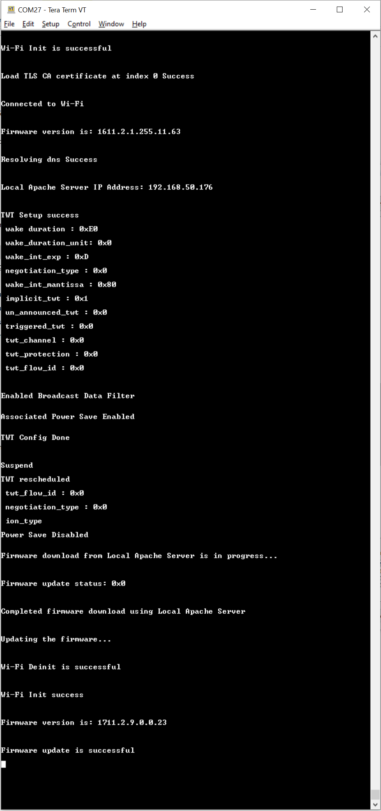
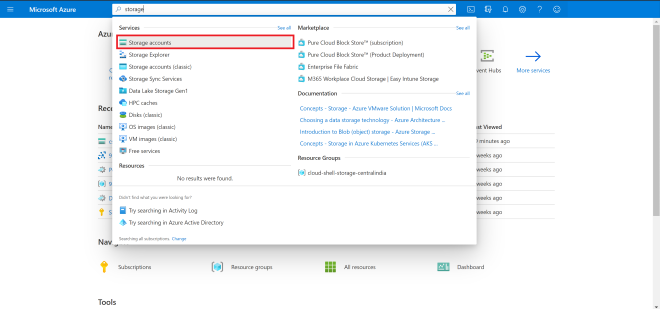
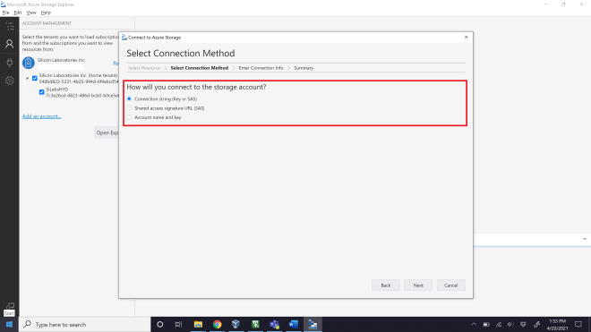
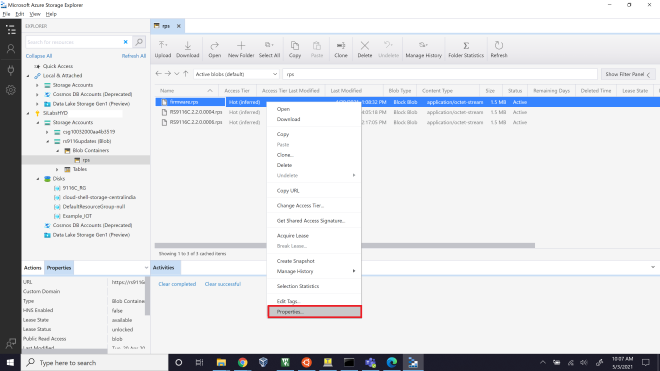
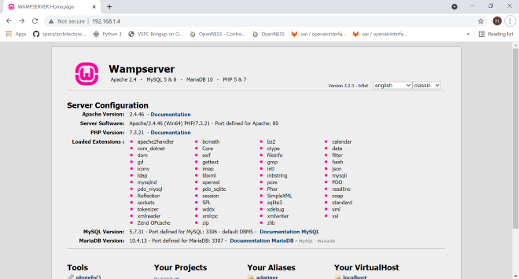
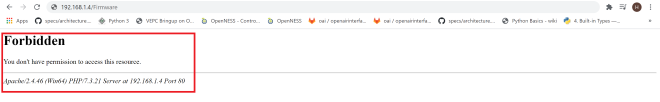

# Wi-Fi - HTTP/HTTPS OTAF TWT Update

## Table of Contents

- [Wi-Fi - HTTP/HTTPS OTAF TWT Update](#wi-fi---httphttps-otaf-twt-update)
  - [Table of Contents](#table-of-contents)
  - [Purpose/Scope](#purposescope)
  - [Prerequisites/Setup Requirements](#prerequisitessetup-requirements)
    - [Hardware Requirements](#hardware-requirements)
    - [Software Requirements](#software-requirements)
    - [Setup Diagram](#setup-diagram)
  - [Getting Started](#getting-started)
  - [Application Build Environment](#application-build-environment)
  - [iTWT Session Status Codes](#itwt-session-status-codes)
  - [TWT Recommendations](#twt-recommendations)
  - [Test the Application](#test-the-application)
  - [Additional Information](#additional-information)
    - [Configuring AWS S3 Bucket](#configuring-aws-s3-bucket)
    - [Configuring Azure Blob Storage](#configuring-azure-blob-storage)
    - [Configuring and Uploading Firmware on Apache HTTP](#configuring-and-uploading-firmware-on-apache-http)
    - [Configuring and Uploading Firmware on Apache HTTPs](#configuring-and-uploading-firmware-on-apache-https)

## Purpose/Scope

This application demonstrates how to update new firmware to SiWx91x using a local HTTP/HTTPS server or cloud storage server with TWT.

> **Note:** By enabling HTTPS_SUPPORT Flag in `app.c` file, the same HTTP_OTAF application is used for HTTPS_OTAF.

In this application, the SiWx91x connects to an access point, configures an HTTP/HTTPS client, and establishes connection with the HTTP/HTTPS server (Apache server) or the cloud storage server (i.e., AWS S3 bucket/Azure Blob storage). After successful HTTP/HTTPS connection, the SiWx91x sends the firmware file request (HTTP GET Request) to the remote server, which responds with the firmware file.

The server transferred firmware file gets loaded/updated in the SiWx91x flash memory. After successful firmware update, the [sl_si91x_http_otaf_v2()](https://docs.silabs.com/wiseconnect/latest/wiseconnect-api-reference-guide-fw-upgrade/service-firmware-upgrade-functions#sl-si91x-http-otaf-v2) API returns a success response.

## Prerequisites/Setup Requirements

### Hardware Requirements

- Windows PC
- Wireless Access Point
- SiWx91x Wi-Fi Evaluation Kit. The SiWx91x supports multiple operating modes. See [Operating Modes]() for details.
- **SoC Mode**:
  - Standalone
    - BRD4002A Wireless pro kit mainboard [SI-MB4002A]
    - Radio Boards 
  	  - BRD4338A [SiWx917-RB4338A]
  	  - BRD4343A [SiWx917-RB4343A]
  - Kits
  	- SiWx917 Pro Kit [Si917-PK6031A](https://www.silabs.com/development-tools/wireless/wi-fi/siwx917-pro-kit?tab=overview)
  	- SiWx917 Pro Kit [Si917-PK6032A]
    - SiWx917 AC1 Module Explorer Kit (BRD2708A)
  	
- **NCP Mode**:
  - Standalone
    - BRD4002A Wireless Pro Kit Mainboard [SI-MB4002A]
    - EFR32xG24 Wireless 2.4 GHz +10 dBm Radio Board [xG24-RB4186C](https://www.silabs.com/development-tools/wireless/xg24-rb4186c-efr32xg24-wireless-gecko-radio-board?tab=overview)
    - NCP Expansion Kit with NCP Radio Boards
      - (BRD4346A + BRD8045A) [SiWx917-EB4346A]
      - (BRD4357A + BRD8045A) [SiWx917-EB4357A]
  - Kits
  	- EFR32xG24 Pro Kit +10 dBm [xG24-PK6009A](https://www.silabs.com/development-tools/wireless/efr32xg24-pro-kit-10-dbm?tab=overview)
  - Interface and Host MCU Supported
    - SPI - EFR32 

### Software Requirements

- Simplicity Studio

### Setup Diagram


## Getting Started

Refer to the instructions [here](https://docs.silabs.com/wiseconnect/latest/wiseconnect-getting-started/) to:

- [Install Simplicity Studio](https://docs.silabs.com/wiseconnect/latest/wiseconnect-developers-guide-developing-for-silabs-hosts/#install-simplicity-studio)
- [Install WiSeConnect 3 extension](https://docs.silabs.com/wiseconnect/latest/wiseconnect-developers-guide-developing-for-silabs-hosts/#install-the-wi-se-connect-3-extension)
- [Connect your device to the computer](https://docs.silabs.com/wiseconnect/latest/wiseconnect-developers-guide-developing-for-silabs-hosts/#connect-si-wx91x-to-computer)
- [Upgrade your connectivity firmware ](https://docs.silabs.com/wiseconnect/latest/wiseconnect-developers-guide-developing-for-silabs-hosts/#update-si-wx91x-connectivity-firmware)
- [Create a Studio project ](https://docs.silabs.com/wiseconnect/latest/wiseconnect-developers-guide-developing-for-silabs-hosts/#create-a-project)

For details on the project folder structure, see the [WiSeConnect Examples](https://docs.silabs.com/wiseconnect/latest/wiseconnect-examples/#example-folder-structure) page.

## Application Build Environment

The application can be configured to suit your requirements and the development environment. Read through the following sections and make any changes needed.

- The application uses the default configurations as provided in the **DEFAULT_WIFI_CLIENT_PROFILE** in **sl_net_default_values.h** and you can choose to configure these parameters as needed.

- In the Project explorer pane, expand the **config** folder and open the ``sl_net_default_values.h`` file. Configure the following parameters to enable SiWx91x to connect to your Wi-Fi network.

- STA instance related parameters

  - DEFAULT_WIFI_CLIENT_PROFILE_SSID refers to the name with which the Wi-Fi network shall be advertised and Si91X module is connected to it.

    ```c
    #define DEFAULT_WIFI_CLIENT_PROFILE_SSID               "YOUR_AP_SSID"      
    ```

  - DEFAULT_WIFI_CLIENT_CREDENTIAL refers to the secret key if the access point is configured in WPA-PSK/WPA2-PSK security modes.

    ```c
    #define DEFAULT_WIFI_CLIENT_CREDENTIAL                 "YOUR_AP_PASSPHRASE" 
    ```

  - DEFAULT_WIFI_CLIENT_SECURITY_TYPE refers to the security type if the access point is configured in WPA/WPA2 or mixed security modes.

    ```c
    #define DEFAULT_WIFI_CLIENT_SECURITY_TYPE              SL_WIFI_WPA2 
    ```

- Other STA instance configurations can be modified if required in **DEFAULT_WIFI_CLIENT_PROFILE** configuration structure.

- The following configurations in the ``app.c`` file can be configured as per requirements.

  - Select firmware update type.

  - For NWP firmware upgrade, set FW_UPDATE_TYPE to TA_FW_UPDATE and for M4 firmware upgrade, set FW_UPDATE_TYPE to M4_FW_UPDATE. For Combined firmware upgrade, set FW_UPDATE_TYPE to COMBINED_FW_UPDATE.

    ```c
    //! Type of FW update
    #define M4_FW_UPDATE 0
    #define TA_FW_UPDATE 1
    #define COMBINED_FW_UPDATE 2

    //! Set FW update type
    #define FW_UPDATE_TYPE TA_FW_UPDATE
    ```

- Based on the type of server (Apache/AWS S3 bucket/Azure Blob Storage) from which the firmware files need to be downloaded, the parameters described below need to be configured.
- Configure FLAGS to choose the version and security type to be enabled.

  Valid configurations are:

  ```c
  #define HTTPS_SUPPORT    BIT(0)         // Set HTTPS_SUPPORT to use HTTPS feature
  #define HTTPV6           BIT(3)         // Enable IPv6. Set this bit in FLAGS. Default is IPv4
  #define HTTP_V_1_1       BIT(6)         // Set HTTP_V_1_1 to use HTTP version 1.1
  ```

- In the application, the **AWS_ENABLE** macro is enabled by default. Depending on the requirements, you can enable downloading firmware from Azure Blob storage (Enable Macro **AZURE_ENABLE**).
- Else, if both **AWS_ENABLE** and **AZURE_ENABLE** macros are disabled, HTTP/HTTPS Apache server can be used to download the firmware.<br>
- In the application, the following parameters should be configured:
  - HTTP_PORT refers to HTTP Server port number.
  - HTTP_SERVER_IP_ADDRESS refers to HTTP Server IP address.
  - HTTP_URL refers to HTTP resource name.
  - HTTP_HOSTNAME refers to HTTP server hostname.
  - HTTP_EXTENDED_HEADER refers to HTTP extended header. If NULL, default extented header is filled.

    The purpose of this macro is to append user configurable header fields to the default HTTP/HTTPS header.

    The extended header may contain multiple header fields, with each field terminated by "\r\n" (0x0D 0x0A).

    Example: key1:value1"\r\n"key2:value2"\r\n"

  - USERNAME refers to the username to be used to access the HTTP resource.
  - PASSWORD refers to the password to be used to access the HTTP resource.
  
- For **Apache HTTP Server**:

  - Provide the PC IP where Apache server is running in HTTP_SERVER_IP_ADDRESS.
  - Provide the firmware package name uploaded in Apache server in HTTP_URL.

    ```c
    //Sample configurations
    #define FLAGS                   0
    #define HTTP_PORT               80
    #define HTTP_SERVER_IP_ADDRESS  "192.168.xxx.xxx"
    #define HTTP_URL                "Firmware/firmware.rps" //Firmware file name to download
    #define HTTP_HOSTNAME           "192.168.xxx.xxx"
    #define USERNAME                "admin"
    #define PASSWORD                "admin"
    ```
    > **Note:** Refer to the [Configuring and Uploading Firmware on Apache HTTP](#configuring-and-uploading-firmware-on-apache-http) section for information on how to set up an Apache Server.

- For **Apache HTTPS Server**:
   - Include Root certificate pem file for SSL connection.
   
     ```c
     //Sample configurations
     #include "cacert.pem.h"
     #define FLAGS                   HTTPS_SUPPORT
     #define HTTP_PORT               443
     #define HTTP_SERVER_IP_ADDRESS  "192.168.xxx.xxx"
     #define HTTP_URL                "Firmware/firmware.rps" //Firmware file name to download
     #define HTTP_HOSTNAME           "192.168.xxx.xxx"
     #define USERNAME                "admin"
     #define PASSWORD                "admin"
     ```
- For **AWS S3 Bucket**:

  - Include Starfield root certificate file for SSL connection.
  
    > **Note:** The certificate authority for Amazon AWS S3 is Starfield, so we need to include Starfield Root certification for SSL connection to be successful. This certificate is already included in the SDK in a linear array format ``aws_starfield_ca.pem.h``, which can be directly used for SSL connection to AWS S3.

  - Extract the hostname from AWS S3 bucket URL `https://<Your-S3-Bucket-name>.s3.<Your-nearest-S3-location>.amazonaws.com/firmware.rps` and provide it in **hostname**.
  
    > Example: For S3 bucket URL <https://example.s3.ap-south-1.amazonaws.com/firmware.rps>", hostname will be "example.s3.ap-south-1.amazonaws.com".

  - Extract the firmware package name from URL `https://<Your-S3-Bucket-name>.s3.<Your-nearest-S3-location>.amazonaws.com/firmware.rps` and provide it in **HTTP_URL**.

    > Example: For S3 bucket URL "<https://example.s3.ap-south-1.amazonaws.com/firmware.rps>", HTTP_URL will be "firmware.rps".
  
  - Configurations for AWS S3 bucket
    ```c
    //Sample configurations
    #include "aws_starfield_ca.pem.h"          //CA certificate
    #define FLAGS                              HTTPS_SUPPORT
    #define HTTP_PORT                          443
    #define HTTP_URL                           "firmware.rps" //Firmware file name to download
    #define USERNAME                           ""
    #define PASSWORD                           ""
    char *hostname                             ="example.s3.ap-south-1.amazonaws.com";
    ```

    > **Note:** The `USERNAME` and `PASSWORD` is provided as empty string "" since the S3 bucket URL that was created has public access provided. Refer to the [Configuring AWS S3 Bucket](#configuring-aws-s3-bucket) section for information on how to upload firmware in the AWS S3 Bucket.

    - For Private resource: While trying to download the private resource, make sure to create the pre-signed URL and use it in the HTTP_URL as shown below.
      ```C
      #define HTTP_URL "filename?query_parameters"  // This should be used when pre-signed URLs are passed
      ```

- For **Azure Blob Storage**:

  - Include Azure Baltimore certificate file for SSL connection.
    > **Note:** This certificate is already included in the SDK in a linear array format ``azure_baltimore_ca.pem.h``, which can be directly used for SSL connection to Azure Blob Storage.

  - Extract the hostname from Azure Blob Storage URL `https://<Your-Azure-Storage-Account-name>.blob.core.windows.net/<Your-container-name>/firmware.rps` and provide it in **hostname**.
  
    > Example: For Azure Blob Storage URL <https://example1.blob.core.windows.net/example2/firmware.rps>", hostname will be "example..blob.core.windows.net".

  - Extract the firmware package name from URL `<Your-Azure-Storage-Account-name>.blob.core.windows.net/<Your-container-name>/firmware.rps` and provide it in **HTTP_URL**.

    > Example: For Azure Blob Storage URL "https://example1.blob.core.windows.net/example2/firmware.rps>", HTTP_URL will be "example2/firmware.rps".
  
  - Configurations for Azure Blob Storage
  
    ```c
    //Sample configurations
    #include "azure_baltimore_ca.pem.h"        //Baltimore Root CA
    #define FLAGS                             HTTPS_SUPPORT
    #define HTTP_PORT                         443
    #define HTTP_URL                          "rps/firmware.rps" //Firmware file name to download
    #define USERNAME                          ""
    #define PASSWORD                          ""
    char *hostname                            ="example.blob.core.windows.net";
    ```

    > **Note:** The `USERNAME` and `PASSWORD` is provided as empty string "" since the Azure Blob storage URL that was created has public access provided. Refer to [Configuring Azure Blob Storage](#configuring-azure-blob-storage) for information on how to upload Firmware in Azure Blob storage.

- The **station_init_configuration** from `app.c` should be modified as per the requirements below:

  - For **Apache HTTP Server**:

    ```c
    // station_init_configuration structure should contain the following configurations:
    .tcp_ip_feature_bit_map     = (TCP_IP_FEAT_DHCPV4_CLIENT | TCP_IP_FEAT_HTTP_CLIENT | TCP_IP_FEAT_EXTENSION_VALID)
    .ext_tcp_ip_feature_bit_map = EXT_FEAT_HTTP_OTAF_SUPPORT
    ```

  - For **Apache HTTPS Server**:

    ```c
    // station_init_configuration structure should contain the following configurations:
    .tcp_ip_feature_bit_map     = (TCP_IP_FEAT_DHCPV4_CLIENT | TCP_IP_FEAT_HTTP_CLIENT| TCP_IP_FEAT_EXTENSION_VALID | TCP_IP_FEAT_SSL)

    .ext_tcp_ip_feature_bit_map = EXT_FEAT_HTTP_OTAF_SUPPORT
    ```

  - For **AWS S3 Bucket** and **Azure Blob Storage**:

    ```c
    // station_init_configuration structure should contain the following configurations:
    .tcp_ip_feature_bit_map     = (TCP_IP_FEAT_DHCPV4_CLIENT | TCP_IP_FEAT_HTTP_CLIENT| TCP_IP_FEAT_EXTENSION_VALID | TCP_IP_FEAT_SSL | TCP_IP_FEAT_DNS_CLIENT)

    .ext_tcp_ip_feature_bit_map = (EXT_FEAT_HTTP_OTAF_SUPPORT | EXT_TCP_IP_SSL_16K_RECORD)
    ```

- Certificate Loading
  - The **[sl_net_set_credential()](https://docs.silabs.com/wiseconnect/3.0.13/wiseconnect-api-reference-guide-nwk-mgmt/net-credential-functions#sl-net-set-credential)** API expects the certificate in the form of a linear array. Convert the pem certificate into a linear array form using the python script provided in the SDK `<SDK>/resources/scripts/certificate_script.py`.

  - For example: If the certificate is ca-certificate.pem, enter the command in the following way:
   `python certificate_script.py ca-certificate.pem`
   - The script will generate ca-certificate.pem in which one linear array named ca-certificate contains the certificate.

  - Root CA certificate needs to be converted as mentioned above.

  - After the conversion, place the converted file in the `<SDK>/resources/certificates/` path and include the certificate file in ``app.c``.

- For HTTPS Apache server

  ```c
  // Certificate includes
  #include "ca-certificate.pem.h"
  
  // Load Security Certificates
  status = sl_net_set_credential(SL_NET_TLS_SERVER_CREDENTIAL_ID(0), SL_NET_SIGNING_CERTIFICATE, ca-certificate, sizeof(ca-certificate) - 1);
  ```

- For AWS Server

  ```c
  // Certificate includes
  #include "aws_starfield_ca.pem.h"

  // Load Security Certificates
  status = sl_net_set_credential(SL_NET_TLS_SERVER_CREDENTIAL_ID(0), SL_NET_SIGNING_CERTIFICATE, aws_starfield_ca, (sizeof(aws_starfield_ca) - 1));
  ```

- For Azure Server

  ```c
  // Certificate includes
  #include "azure_baltimore_ca.pem.h"

  // Load Security Certificates
  status = sl_net_set_credential(SL_NET_TLS_SERVER_CREDENTIAL_ID(0), SL_NET_SIGNING_CERTIFICATE, azure_baltimore_ca, (sizeof(azure_baltimore_ca) - 1));
  ```

- iTWT Configuration

    There are three TWT configuration APIs. 
    - sl_wifi_target_wake_time_auto_selection - This API calculates and automatically configures TWT session parameters based on the given inputs. Enables or disables a TWT session. Recommended for user applications.
    - sl_wifi_enable_target_wake_time - This API allows users to manually configure iTWT session parameters and enables the iTWT session. This API is not recommended for users. It is for internal certification purposes only.
    - sl_wifi_disable_target_wake_time - Disables a TWT session.

    **sl_wifi_target_wake_time_auto_selection API**
    
    ```c
      sl_status_t sl_wifi_target_wake_time_auto_selection(sl_wifi_twt_selection_t *twt_auto_request)
    ```
    Parameters of this API can be configured in *sl_wifi_twt_selection_t* structure. 
    This TWT API is recommended because it is designed for maintaining connections, improving throughput, and enhancing power performance.

    
   The following are the parameter descriptions:
    - twt_enable:  1- Setup ; 0 - teardown
    - tx_latency:  The allowed latency, in milliseconds, within which the given Tx operation is expected to be completed. If 0 is configured, the maximum allowed Tx latency is the same as rx_latency. Otherwise, valid values are in the range of [200 ms - 6 hrs].
    - rx_latency: The maximum latency, in milliseconds, for receiving buffered packets from the AP. The device wakes up at least once for a TWT service period within the configured rx_latency if there are any pending packets destined for the device from the AP. If set to 0, the default latency of 2 seconds is used. Valid range is between 2 seconds to 6 hours. Recommended range is 2 seconds to 60 seconds to avoid connection failures with AP due to longer sleep time.
    - avg_tx_throughput:  This is the expected average Tx throughput in Kbps. Value ranges from 0 to 10 Mbps, which is half of the default [device_average_throughput](https://docs.silabs.com/wiseconnect/latest/wiseconnect-api-reference-guide-wi-fi/sl-wifi-twt-selection-t#device-average-throughput) (20 Mbps by default).

    For more information on parameters, refer to [sl_wifi_twt_selection_t](https://docs.silabs.com/wiseconnect/latest/wiseconnect-api-reference-guide-wi-fi/sl-wifi-twt-selection-t).

    Enable TWT_AUTO_CONFIG MACRO in the app.c file.

   The following are sample configurations.
    ```c
      sl_wifi_twt_selection_t       default_twt_selection_configuration = {
        .twt_enable                            = 1,
        .average_tx_throughput                 = 1000,
        .tx_latency                            = 0,
        .rx_latency                            = 5000,
        .device_average_throughput             = DEVICE_AVERAGE_THROUGHPUT,
        .estimated_extra_wake_duration_percent = ESTIMATE_EXTRA_WAKE_DURATION_PERCENT,
        .twt_tolerable_deviation               = TWT_TOLERABLE_DEVIATION,
        .default_wake_interval_ms              = TWT_DEFAULT_WAKE_INTERVAL_MS,
        .default_minimum_wake_duration_ms      = TWT_DEFAULT_WAKE_DURATION_MS,
        .beacon_wake_up_count_after_sp         = MAX_BEACON_WAKE_UP_AFTER_SP
      };
    ```

    Sample API call is given as below : 
    ```c
      status                            = sl_wifi_target_wake_time_auto_selection(&performance_profile.twt_selection);
    ```

    The following are the default macro settings. The user should not change these values as they may affect the algorithm's functioning. 

    Sample Macro Settings : 
    ```c
      #define DEVICE_AVG_THROUGHPUT                20000 \\ Kbps
      #define ESTIMATE_EXTRA_WAKE_DURATION_PERCENT 0 \\ in percentage
      #define TWT_TOLERABLE_DEVIATION              10 \\ in percentage
      #define TWT_DEFAULT_WAKE_INTERVAL_MS         1024     // in milli   seconds
      #define TWT_DEFAULT_WAKE_DURATION_MS         16       // in milli seconds
      #define MAX_TX_AND_RX_LATENCY_LIMIT          22118400 // 6 hrs in milli seconds
      #define MAX_BEACON_WAKE_UP_AFTER_SP \
      2 // The number of beacons after the service period completion for which the module wakes up and listens for any pending RX.
    ```

    >Note :  WLAN Keep Alive should not be disabled while using this API.

    **sl_wifi_enable_target_wake_time API**
    ```c
      sl_status_t sl_wifi_enable_target_wake_time(sl_wifi_twt_request_t *twt_req)
    ```
    
    Usage of this API requires knowledge of individual TWT setup negotiation. This API does not take care of network disconnections.

    iTWT parameters should be configured and filled into the structure type *sl_wifi_twt_request_t*  in app.c and passed as a parameter to *sl_wifi_enable_target_wake_time()* API.

   The following are sample configurations.
    ```c
      sl_wifi_twt_request_t default_twt_setup_configuration = {
        .twt_enable              = 1,
        .twt_flow_id             = 1,
        .wake_duration           = 0x80,
        .wake_duration_unit      = 0,
        .wake_duration_tol       = 0x80,
        .wake_int_exp            = 13,
        .wake_int_exp_tol        = 13,
        .wake_int_mantissa       = 0x1B00,
        .wake_int_mantissa_tol   = 0x1B00,
        .implicit_twt            = 1,
        .un_announced_twt        = 1,
        .triggered_twt           = 0,
        .twt_channel             = 0,
        .twt_protection          = 0,
        .restrict_tx_outside_tsp = 1,
        .twt_retry_limit         = 6,
        .twt_retry_interval      = 10,
        .req_type                = 1,
        .negotiation_type        = 0,
      };
    ```

    These parameters with their limits are defined as below.

    - **twt_enable**:  1- Setup ; 0 - teardown
    - **twt_flow_id**: range 0-7 or 0xFF
    - **twt_req_params**: Structure with parameters in case of setup and NULL in case of teardown.
    - **wake_duration**: This is the nominal minimum wake duration of TWT. This is the time for which DUT will be in wake state for transmission or reception of data. Allowed values range is  0-255.
    - **wake_duration_unit**: This parameter defines unit for wake_duration. Allowed values are  0 (256 uS) and 1 (1024 uS).
    - **wake_duration_tol**: This is the tolerance allowed for wake duration in case of suggested TWT. Received TWT wake duration from AP will be validated against tolerance limits and decided if TWT config received is in acceptable range. Allowed values are 0-255.
    - **wake_int_exp**: TWT Wake interval exponent. It is exponent to base 2. Allowed values are 0 - 31.
    - **wake_int_exp_tol**: This is the allowed tolerance for wake_int_exp in case of Suggest TWT request. Received TWT wake interval exponent from AP will be validated against tolerance limits and decided if TWT config received is in acceptable range. Allowed values are 0 - 31.
    - **wake_int_mantissa**: This is the TWT wake interval mantissa. Allowed values are 0-65535.
    - **wake_int_mantissa_tol**: This is tolerance allowed for wake_int_mantissa in case of suggested TWT. Received TWT wake interval mantissa from AP will be validated against tolerance limits and decided if TWT config received is in acceptable range. Allowed values are 0-65535.
    - **implicit_twt**: If enabled (1), the TWT requesting STA calculates the Next TWT by adding a fixed value to the current TWT value. Explicit TWT is currently not allowed.
    - **un_announced_twt**: If enabled (1), TWT requesting STA does not announce its wake up to AP through PS-POLLs or UAPSD Trigger frames.
    - **triggered_twt**: If enabled(1), at least one trigger frame is included in the TWT Service Period(TSP).
    - **twt_channel**: Currently this configuration is not supported. Allowed values are 0-7.
    - **twt_protection**:  If enabled (1), TSP is protected. This is negotiable with AP. Currently not supported. Only zero is allowed.
    - **restrict_tx_outside_tsp**: If enabled (1), any Tx outside the TSP is restricted. Else, TX can happen outside the TSP also.
    - **twt_retry_limit**: This is the maximum number of retries allowed if the TWT response frame is not received for the sent TWT request frame. Allowed values are 0 - 15.
    - **twt_retry_interval**: The interval, in seconds, between two twt request retries. Allowed values are 5 - 255.
    - **req_type**: This is the TWT request type.
      - 0 - Request TWT
      - 1 - Suggest TWT
      - 2 - Demand TWT

  Below is the sample TWT setup API call.
  ```c
    status                          = sl_wifi_enable_target_wake_time(&twt_request);
  ```
    
    >**Note:**
    >- TWT Wake duration depends on the wake duration unit. For example, for the above configuration, the wake duration value is  (0xE0 * 256 = 57.3 msec).
    >- TWT Wake interval is calculated as mantissa 2 ^ exp.  For example, for the above configuration, wake interval value is (0x1B00 * 2^13  = 55.2 sec).
    >- Configuring TWT Wake interval beyond 1 min might lead to disconnections from the AP.
    >- There might be disconnections while using TWT with wake interval greater than 4 sec when connected to an AP with non-zero GTK key renewal time.
    >- Keep Alive timeout should be non-zero when negotiated TWT setup is **unannounced**, otherwise there might be disconnections.

- iTWT Teardown Configuration
  
  To teardown TWT session, use the matching TWT teardown API corresponding to the TWT setup configuration API:
    1. For TWT parameters Auto Selection API, call the following API to teardown:
    ```c
        status = sl_wifi_target_wake_time_auto_selection(twt_selection);
    ```
    - Set twt_enable parameter to '0' in the **twt_selection** structure. 
    - The other parameters in the structure are ignored. 

    2. For manually configurable TWT parameters API, call the following API to teardown:
    ```c
      status = sl_wifi_disable_target_wake_time(&twt_req);
    ```
    - twt_req->twt_enable should be set to '0' for teardown operation.
    - twt_req->twt_flow_id should be configured as described below: 
      - This paramater value range is 0-7. It should be the same as setup flow ID, otherwise an error will be triggered.
      - 0xFF - To teardown all active sessions. This value is valid only in case of teardown command.

    - The rest of the parameters in the structure are ignored for a teardown operation. 

    > Note : For setting a new TWT session, the existing TWT session must be torn down.

## iTWT Session Status Codes

  The user can get asynchronous TWT session updates if *twt_response_handler* is defined and the callback is registered. A *twt_response_handler* is provided in the example application. The following are the TWT session status codes.

  |S.No|  MACRO|  Session status code|  Description|
  |:----|:------|:-------------------|:--------------|
  |1.|  TWT_SESSION_SUCC| 0|  TWT session setup success. TWT session is active.|
  |2.|  TWT_UNSOL_SESSION_SUCC| 1|  Unsolicited TWT setup response from AP accepted. TWT session is active.|
  |3.|  TWT_SETUP_AP_REJECTED|  4|  TWT Reject frame received in response for the sent TWT setup frame.|
  |4.|  TWT_SETUP_RSP_OUTOF_TOL|5|  TWT response parameters from AP for TWT Suggest request is not within tolerance set by user.|
  |5.|  TWT_SETUP_RSP_NOT_MATCHED|  6|  TWT response parameters from AP for TWT Demand request does not match parameters given by user.|
  |6.|  TWT_SETUP_UNSUPPORTED_RSP|  10| Unsupported TWT response from AP.|
  |7.|  TWT_TEARDOWN_SUCC|  11| TWT session teardown success|
  |8.|  TWT_AP_TEARDOWN_SUCC| 12| TWT session teardown from AP success|
  |9.|  TWT_SETUP_FAIL_MAX_RETRIES_REACHED| 15| TWT setup request retried maximum number of times as configured by user.|
  |10.| TWT_INACTIVE_DUETO_ROAMING| 16  |TWT session inactive due to roaming|
  |11.| TWT_INACTIVE_DUETO_DISCONNECT|  17| TWT session inactive due to disconnect|
  |12.| TWT_INACTIVE_NO_AP_SUPPORT| 18| TWT session inactive as connected AP does not support TWT.|

> Note:
> **twt_session_active** variable is provided in the example application and is updated according to the asychronous TWT session notifications. The user can utilize this variable to teardown or configure new session parameters depending upon existing session status. 

## TWT Recommendations

  1. Use sl_wifi_target_wake_time_auto_selection with appropriate Rx Latency input according to the use case as it has improved design over sl_wifi_enable_target_wake_time. Also, it handles network level disconnections such as ARP, Embedded MQTT, and TCP connections. It has a better user interface and simplifies TWT usage.
  2. iTWT setup is recommended after IP assignment/TCP connection/application connection.
  3. When using sl_wifi_target_wake_time_auto_selection API, Rx Latency should be less than TCP / ARP Timeouts at the remote side.
  4. When using sl_wifi_enable_target_wake_time, TWT interval configured should be less than TCP / ARP Timeouts at the remote side.
  5. For iTWT, GTK Interval should be kept at maximum possible value or zero. If GTK interval is not configurable, recommended TWT interval (in case of sl_wifi_enable_target_wake_time) / RX Latency (in case of sl_wifi_target_wake_time_auto_selection API) is less than 4 sec.
  6. When sl_wifi_enable_target_wake_time API is used, configuring TWT Wake interval beyond 1 min might lead to disconnections from the AP. Using TWT wakeup interval less than or equal to 1 min is recommended.
  7. WLAN Keep Alive timeout should **not** be disabled when sl_wifi_target_wake_time_auto_selection API is used or when unannounced TWT session is set up using sl_wifi_enable_target_wake_time API. It is recommended to use WLAN Keep Alive timeout of 30 sec, which is the default timeout even if not configured specifically by the user.
  8. Disable power save and suspend any active TWT sessions before triggering HTTP OTAF.

  **Soc Mode**:
  
  The M4 processor is set in sleep mode. The M4 processor can be woken in several ways as mentioned below:

   - ALARM timer-based - In this method, an ALARM timer is run that wakes up the M4 processor every **ALARM_PERIODIC_TIME** time period.
      - We can enable the ALARM timer-wakeup by adding the preprocessor macro "ALARM_TIMER_BASED_WAKEUP" for the example.
      - In the Project explorer pane, expand as follows: wiseconnect3_sdk_xxx > components > device > silabs > si91x > mcu > drivers > peripheral_drivers > src folder and open sl_si91x_m4_ps.c file. Configure **ALARM_PERIODIC_TIME**, in seconds, in sl_si91x_m4_ps.c.
   - Button press-based (GPIO) - In this method, the M4 processor wakes up upon pressing a button (BTN0).
      - We can enable the Button press-based wakeup by adding the preprocessor macro "BUTTON_BASED_WAKEUP" for the example.
   - Wireless-based - When an RX packet is to be received by the NWP, the M4 processor is woken up.
      - We can enable the Wireless-wakeup by adding the preprocessor macro "WIRELESS_BASED_WAKEUP_TO_USE" for the example.

**Note:**
> AWS has announced that there will be changes in their root CA chain. More details can be found in the reference links.(https://aws.amazon.com/blogs/security/acm-will-no-longer-cross-sign-certificates-with-starfield-class-2-starting-august-2024/)
> We are providing both root CAs (Starfield class-2 and Starfield G2) in aws_starfield_ca.pem.h, which is located in the WiSeConnect directory `<SDK>/resources/certificates/aws_starfield_ca.pem.h`.
> Alternate certification chains support is added. With this, as opposed to requiring full chain validation, only the peer certificate must validate to a trusted certificate. This allows loading intermediate root CAs as trusted.
> The default CA certificate is the Starfield Combined CA certificate. To use the Intermediate Amazon Root CA 1 certificate, define the `SL_SI91X_AWS_IOT_ROOT_CA1` macro in the application.

> **Note**: For recommended settings, see the [recommendations guide](https://docs.silabs.com/wiseconnect/latest/wiseconnect-developers-guide-prog-recommended-settings/).

## Test the Application

Refer to the instructions [here](https://docs.silabs.com/wiseconnect/latest/wiseconnect-getting-started/) to:

- Build the application.
- Flash, run, and debug the application.

- Application prints with AWS S3 bucket

    

- Application prints with Azure Blob Storage

    

- Application prints with Apache Server

    

## Additional Information

### Configuring AWS S3 Bucket

- Sign in to the Amazon S3 console at <https://console.aws.amazon.com/s3/>.
- Choose **Create bucket**.

   

- Enter a **bucket name**.

   

- Enable ACLs.

   

- Under **Bucket settings for Block Public Access** uncheck **Block all public access**.

   

- Under **Bucket Versioning**, select **Enable** to keep all versions in the same bucket.

   

- Choose **Create bucket**.

   

- Choose the created bucket from the list of buckets in the console.

- Upload the file in creating bucket.

   

- Add the file to the bucket.

   

- Set permission to public access.

   

- After uploading the file, click on the file.

   

- Get the object URL inside bucket/properties, like below:

   

### Configuring Azure Blob Storage
* Login to your Azure account and go to Storage Account or search for Storage Account.

  

* Open storage account and create a new storage.

  

* While creating a storage account, select your common Resource Group you have already created and provide a storage account name.
* Select preferred location. For the account kind, select Blob-Storage and for Replication select LRS.

  

* Review and create your storage account.
* Now download the Windows Storage Explorer here.
* After installing the storage explorer, open Azure Storage Explorer in your Windows machine and navigate to Account management and add your Azure account.

  

  

* Click on Open connect dialog and select a Resource from the list as shown below:

  

* Select Storage account or service, then select connection method as Connection String.

  

* In the Azure Portal, navigate to your newly created storage account and select Access Keys. Copy the connection string for Key1.

  

* The connection string has to be given in the local Azure Storage Explorer app.
* Upon successfully adding, you should now see the EXPLORER tab on your Azure Storage Explorer displaying all the storages available in your account.

  
  
* In the Azure Portal, search for Storage Explorer and perform the same steps. However, this is in preview so it is better to use Windows Azure Storage Explorer.
* Create a new blob container as shown below.

  

* The route folder name you give is quite important as all the further connections happen from here. For this example, we use a file extension.
* The name used here is “rps”.
* This should create a new folder, which looks like this:

  

* Change the Public Access Level by right-clicking on the new folder and selecting Set Container Access Level.

  

* We can upload the Device Update File.

  

* Once done uploading, we can see the file.

  

* Right-click on the uploaded file, then select properties. You will find a URL path.

  

* Copy this link at it is used for accessing our device update files.

  

* By accessing this URL, you can download the Device Update files in the application.

### Configuring and Uploading Firmware on Apache HTTP

- Download and Install Wamp-Apache Server
  - Open the below link in your system browser.
    Wamp Server - (<https://www.wampserver.com/en/>)
  - Under Downloads, download the latest version of WAMP server for 32 bit or 64 bit machine.
  - Install Wamp-Apache server with all the default settings.
  - Make sure the Wamp-Apache server is present in C:\ directory
  - Configure an HTTP server.
  - Navigate to C:\wamp64\bin\apache\apache2.4.46\conf
  - Open httpd.conf file with an editor.
  - Change the below lines into system IP address.

  ```sh
      Listen {System-IP-Address}:80
      ServerName {System-IP-Address}:80
      Eg: Listen 192.168.1.4:80
          ServerName 192.168.1.4:80
  ```

- Save the file and Exit.
- Open command prompt and run with Administrator Privileges.
- Navigate to directory C:\wamp64\bin\apache\apache2.4.46\bin
- Add Apache as a Windows Service:

    `httpd.exe -k install`

- While the install is in progress, you will be directed to the Windows Network Access page as shown below. Make sure you allow both Private and Public network access.

   

- Start Apache Service in Windows
  - Open RUN in windows using WIN+R button.
  - Input "services.msc" into RUN.
  - This will open your Windows System Services.
  - In the list of services running, you can find Apache2.x present.
  - Start the service as shown below.

   

- Now that your Apache has started and is running, check it by using your browser. Open a Web browser and type the machine IP in the address bar and hit Enter. You should see the window below, if the server has started successfully.

   

- As you can see, the connection is "Not Secure", meaning it is running an HTTP server.
- Configure HTTP Wamp-Apache Server to download firmware
  - Go to the Wamp Root directory. In this example, it is C:\wamp64 and navigate to "www" folder C:\wamp64\www.
  - Create a new folder in that directory. In this example, we created a folder named "Firmware". [Folder Structure: C:\wamp64\www\Firmware]
  - In the "Firmware" folder, create an "index.html" file and write the following contents to the file.

    ```html
        <!DOCTYPE html>
        <html>
            <body>
                <h2>Using a Relative File Path</h2>
                <a href="firmware.rps" download>Download_Version_6</a><br><br>
                <a href="firmware1.rps" download>Download_Version_4</a>
            </body>
        </html>
    ```

- This code will link your resources to the Apache server so that those files can be downloaded.
- You can edit href values in the index.html to your firmware file names.
- Make sure to copy all the firmware files into the present directory, C:\wamp64\www\Firmware. Save the file and Exit.

    ```html
    <a href="<your-firmware-file>-1.rps" download>Download_Version_6</a><br><br>
    <a href="<your-firmware-file>-2.rps" download>Download_Version_4</a>
    ```

- Configure HTTPD.conf file for Wamp-Apache Server
  - Open httpd.conf file in C:\wamp64\bin\apache\apache2.4.46\conf\httpd.conf
  - Search or Find "DocumentRoot" and change it to below configuration. Save the file and exit.

   ```sh
    "${INSTALL_DIR}/www/Firmware"
    ```

- Restart Apache Service
  - Open Windows services, "WIN+R" → "services.msc" → ENTER.
  - Check for Apache service and restart the service.
  - In the above configuration, we have created a resource for our server in "Firmware" folder.
  - Our access resource URL looks as shown below.

- `http://<your-ip-address>/<Sub-Resource-Directory>/<Resources>`
>
> Eg: 
>- <http://192.168.1.4/Firmware/firmware.rps>
>- <http://192.168.1.4/Firmware/firmware1.rps>

- Entering the `http://<your-ip-address>/<Sub-Resource-Directory>` in your browser should load a window as shown below. Clicking on any link should download the firmware files.

   

- Get the resource information and test with the application
  - In the SiWx91x FOTA application, make the following changes and test the application. This process should start downloading firmware.
  
  ```c
  #define HTTP_SERVER_IP_ADDRESS "192.168.1.4"              //Replace this value related to your requirements
  #define HTTP_URL               "Firmware/firmware_file.rps"          //HTTP GET request resource name
  #define HTTP_HOSTNAME          "192.168.1.4"//Replace this value related to your requirements
  ```

  > **Warning:** Make sure that the WAMP-Apache Server (with its IP Address) is accessible to other systems in the same network. If not, follow the Changing PHP Configurations. Otherwise, proceed with the next steps.

- Changing PHP Configuration
  - The following steps are to be done only when you are unable to access the WAMP-Server from other machines in the network. Issue shown below:

   

  - Give permissions to the newly created resource `"<Sub-Resource-Directory>"`.
  - Open "phpmyadmin.conf" file in "C:\wamp64\alias\phpmyadmin.conf".
  - Add the line shown below into the end of the "phpmyadmin.conf" file. Save and exit the file.

    ```sh
    <Directory "c:/wamp64/www/<Sub-Resource-Directory>/">


    For example,
    <Directory "c:/wamp64/www/Firmware/">
    Options +Indexes +FollowSymLinks +MultiViews
    AllowOverride all
    Require all granted
    </Directory>
    ```

  - Restart Apache service and now the resource should be accessible from any system connected in the same network.

> **Note:** Even if you are not able to access `http://<your-ip-address>/` directly, you will be able to access your resources from here `http://<your-ip-address>/<Sub-Resource-Directory>/`.

### Configuring and Uploading Firmware on Apache HTTPs

HTTPs server configuration for Apache requires Wamp server. If you have not installed it, follow the procedures in **"Step 1: Download and Install Wamp-Apache Server"** step and continue with the HTTPS steps in this document.

- **Download and install OPENSSL for Windows**
  - OpenSSL for windows from here (<https://slproweb.com/products/Win32OpenSSL.html>).
  - Do default install for OpenSSL.
  - We can only run OpenSSL using command prompt, and for that we need to first find the openssl.exe file.
  - Normally, it will be in "C:\Program Files\OpenSSL-Win64\bin\openssl.exe".

- **Generate required certs**
   > **Note:** If you already have the required certs to run the server, skip the **Generate required certs** step. Copy your certs to `C:\wamp64\bin\apache\apache2.4.46\conf` directory and update the `httpd-ssl.conf` file with these certificate paths shown in **HTTPD configuration** step.

  - Open Command Prompt in Administrator privileges.
  - Change directory to your openssl.exe file "cd C:\Program Files\OpenSSL-Win64\bin\".
  - Execute the following command to generate a private.key file with AES 256 encryption.

 ```sh
    openssl.exe genrsa -aes256 -out private.key 2048
    openssl.exe rsa -in private.key -out private.key
    openssl.exe req -new -x509 -nodes -sha1 -key private.key -out certificate.crt -days 36500 -config <your-wamp-apache-openssl.conf-file-path>
    openssl.exe req -new -x509 -nodes -sha1 -key private.key -out certificate.crt -days 36500 -config C:\wamp64\bin\apache\apache2.4.46\conf\openssl.conf
 ```

- Now there will be two files created [Private.key and certificate.crt] in "C:\Program Files\OpenSSL-Win64\bin\" directory. Copy them to "C:\wamp64\bin\apache\apache2.4.46\conf".

- **HTTPD configuration**
  - Open ``httpd.conf`` file in "C:\wamp64\bin\apache\apache2.4.46\conf"
  - Uncomment the lines in that file (shown below). Save and exit.

  ```sh
  LoadModule ssl_module modules/mod_ssl.so
  Include conf/extra/httpd-ssl.conf
  LoadModule socache_shmcb_module modules/mod_socache_shmcb.so
  ```

  - Open "php.ini" file in "C:\wamp64\bin\php\php5.6.40" and uncomment the following line in the file.
  
      `extension=php_openssl.dll`
  - Open ``httpd-ssl.conf`` file in "C:\wamp64\bin\apache\apache2.4.46\conf\extra" and update the following paths with the proper information (i.e., provide system relative paths).

  ``` sh
  <VirtualHost default:443>
  General setup for the virtual host
  DocumentRoot "C:/wamp64/www"
  ServerName 192.168.43.85:443
  ServerAdmin admin@example.com
  ErrorLog "C:/wamp64/bin/apache/apache2.4.46/logs/error.log"
  TransferLog "C:/wamp64/bin/apache/apache2.4.46/logs/access.log"

  SSLCertificateFile "C:/wamp64/bin/apache/apache2.4.46/conf/certificate.crt"
  SSLCertificateKeyFile "C:/wamp64/bin/apache/apache2.4.46/conf/private.key" 
  ```

  - Run the command below to check if the configurations given above are proper or not. If the configurations are correct, the command will return "Syntax OK".

      `httpd.exe -t`
- **Configure HTTPS Wamp-Apache Server to download firmware**
  - Go to the Wamp Root directory "C:\wamp64" and navigate to "www".
  - Create a new folder in that directory "Firmware". [Folder Structure: C:\wamp64\www\Firmware]
  - In the "Firmware" folder, create an "index.html" file and write the following contents to the file.

  ```html
      <!DOCTYPE html>
      <html>
          <body>
              <h2>Using a Relative File Path</h2>
              <a href="firmware.rps" download>Download_Version_6</a><br><br>
              <a href="firmware1.rps" download>Download_Version_4</a>
          </body>
      </html>
  ```

- This code will link your resources to the Apache server so that those files can be downloaded.

- Make sure to copy all the firmware files into the present directory, C:\wamp64\www\Firmware.

- You can edit href values in the index.html to your firmware file names.

  ```html
      <a href="<your-firmware-file>-1.rps" download>Download_Version_6</a><br><br>
      <a href="<your-firmware-file>-2.rps" download>Download_Version_4</a>
  ```

- Save the file and exit.

- **Restart Server**
>
> - Open RUN, "WIN+R" → "services.msc" → ENTER.
> - Restart the Apache service.
> - Open browser and enter your Apache server URL.

  

> - Click on "Advanced Settings" and then click on "Proceed to 192.168.43.85 (unsafe)".
> - You will be able to access the page and resources in HTTPS.

   

  > **Note:** Make sure to check your HTTPS server from other local machines present in the same network. It should be accessible.
