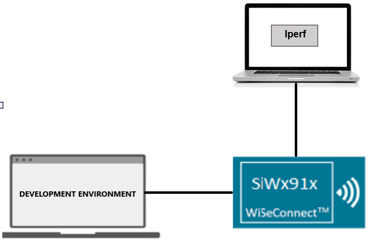
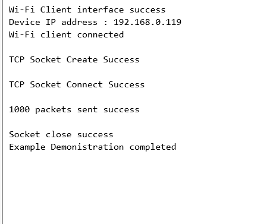

# Wi-Fi - LwIP TCP Client

## Table of Contents

- [Wi-Fi - LwIP TCP Client](#wi-fi---lwip-tcp-client)
  - [Table of Contents](#table-of-contents)
  - [Purpose/Scope](#purposescope)
  - [Prerequisites/Setup Requirements](#prerequisitessetup-requirements)
    - [Hardware Requirements](#hardware-requirements)
    - [Software Requirements](#software-requirements)
    - [Setup Diagram](#setup-diagram)
  - [Getting Started](#getting-started)
    - [Application Configuration Parameters](#application-configuration-parameters)
      - [Configure the following parameters in **app.c** to test LWIP app as per requirements](#configure-the-following-parameters-in-appc-to-test-lwip-app-as-per-requirements)
  - [Soc Mode:](#soc-mode)
    - [Without Tickless Mode:](#without-tickless-mode)
    - [Tickless Mode](#tickless-mode)
    - [Note](#note)
  - [Test the application](#test-the-application)

## Purpose/Scope

This application demonstrates how to transfer the TCP data using LWIP stack by configuring the SiWx91x in client mode.

## Prerequisites/Setup Requirements

### Hardware Requirements

- Windows PC
- **SoC Mode**:
  - Standalone
    - BRD4002A Wireless Pro Kit Mainboard [SI-MB4002A]
    - Radio Boards 
  	  - BRD4338A [SiWx917-RB4338A]
  	  - BRD4343A [SiWx917-RB4343A]
  - Kits
  	- SiWx917 Pro Kit [Si917-PK6031A](https://www.silabs.com/development-tools/wireless/wi-fi/siwx917-pro-kit?tab=overview)
  	- SiWx917 Pro Kit [Si917-PK6032A]
  	- SiWx917 AC1 Module Explorer Kit (BRD2708A)
  	
- **NCP Mode**:
  - Standalone
    - BRD4002A Wireless Pro Kit Mainboard [SI-MB4002A]
    - EFR32xG24 Wireless 2.4 GHz +10 dBm Radio Board [xG24-RB4186C](https://www.silabs.com/development-tools/wireless/xg24-rb4186c-efr32xg24-wireless-gecko-radio-board?tab=overview)
    - NCP Expansion Kit with NCP Radio Boards
      - (BRD4346A + BRD8045A) [SiWx917-EB4346A]
      - (BRD4357A + BRD8045A) [SiWx917-EB4357A]
  - Kits
  	- EFR32xG24 Pro Kit +10 dBm [xG24-PK6009A](https://www.silabs.com/development-tools/wireless/efr32xg24-pro-kit-10-dbm?tab=overview)
  - Interface and Host MCU Supported
    - SPI - EFR32 

### Software Requirements

- Simplicity Studio

### Setup Diagram

  

## Getting Started

Refer to the instructions [here](https://docs.silabs.com/wiseconnect/latest/wiseconnect-getting-started/) to:

- [Install Simplicity Studio](https://docs.silabs.com/wiseconnect/latest/wiseconnect-developers-guide-developing-for-silabs-hosts/#install-simplicity-studio)
- [Install WiSeConnect 3 extension](https://docs.silabs.com/wiseconnect/latest/wiseconnect-developers-guide-developing-for-silabs-hosts/#install-the-wi-se-connect-3-extension)
- [Connect your device to the computer](https://docs.silabs.com/wiseconnect/latest/wiseconnect-developers-guide-developing-for-silabs-hosts/#connect-si-wx91x-to-computer)
- [Upgrade your connectivity firmware ](https://docs.silabs.com/wiseconnect/latest/wiseconnect-developers-guide-developing-for-silabs-hosts/#update-si-wx91x-connectivity-firmware)
- [Create a Studio project ](https://docs.silabs.com/wiseconnect/latest/wiseconnect-developers-guide-developing-for-silabs-hosts/#create-a-project)

For details on the project folder structure, see the [WiSeConnect Examples](https://docs.silabs.com/wiseconnect/latest/wiseconnect-examples/#example-folder-structure) page.

### Application Configuration Parameters

The application can be configured to suit your requirements and development environment.
- In the Project Explorer pane, expand the **config** folder and open the ``sl_net_default_values.h`` file. Configure the following parameters to enable your Silicon Labs Wi-Fi device to connect to your Wi-Fi network.

- STA instance related parameters

  - DEFAULT_WIFI_CLIENT_PROFILE_SSID refers to the name with which the Wi-Fi network shall be advertised and Si91X module is connected to it.
 
   ```c
   #define DEFAULT_WIFI_CLIENT_PROFILE_SSID               "YOUR_AP_SSID"      
   ```

  - DEFAULT_WIFI_CLIENT_CREDENTIAL refers to the secret key if the access point is configured in WPA-PSK/WPA2-PSK security modes.

   ```c 
   #define DEFAULT_WIFI_CLIENT_CREDENTIAL                 "YOUR_AP_PASSPHRASE" 
   ```
  
  - DEFAULT_WIFI_CLIENT_SECURITY_TYPE refers to the security type if the access point is configured in WPA/WPA2 or mixed security modes.

   ```c
   #define DEFAULT_WIFI_CLIENT_SECURITY_TYPE               SL_WIFI_WPA2 
   ```
  
- Other STA instance configurations can be modified if required in `default_wifi_client_profile` configuration structure.

#### Configure the following parameters in **app.c** to test LWIP app as per requirements

- **App related parameters**

  - `SERVER_PORT` is the remote TCP server port number on the PC running iPerf.

    ```c
    #define SERVER_PORT         5001
    ```

  - `SERVER_IP` is the remote TCP server IP address on the PC running iPerf. 

    ```c
    #define SERVER_IP   "192.168.0.247"
    ```

  - `NUMBER_OF_PACKETS` controls the number of packets sent to the remote TCP server. 

    ```c
    #define NUMBER_OF_PACKETS   1000
    ```

## Soc Mode:

### Without Tickless Mode:

The M4 processor is set in sleep mode. The M4 processor can be woken in several ways as mentioned below:

- ALARM timer-based - In this method, an ALARM timer runs and wakes the M4 processor periodically.
  - We can enable the ALARM timer-wakeup by setting the macros "SL_ENABLE_CALENDAR_WAKEUP_SOURCE" and "ENABLE_ALARM" to '1'.
  - We can configure the periodic alarm time by setting the macro "ALARM_TIME_MSEC" to a specific value.
- Button press-based (GPIO) - In this method, the M4 processor wakes up upon pressing a button (BTN0).
  - We can enable the Button press-based wakeup by setting the macro "ENABLE_NPSS_GPIO_2" to '1'.
- Wireless-based - When an RX packet is to be received by the NWP, the M4 processor is woken up.

### Tickless Mode

In Tickless Mode, the device enters sleep based on the idle time set by the scheduler. The device can be awakened by two methods: SysRTC or a wireless signal.

- **SysRTC (System Real-Time Clock)**: By default, the device uses SysRTC as the wakeup source. The device will enter sleep mode and then wake up when the SysRTC matches the idle time set by the scheduler.

- **Wireless Wakeup**: The device can also be awakened by a wireless signal. If this signal is triggered before the idle time set by the scheduler, the device will wake up in response to it.

### Note
  - Enable `SL_SI91X_TCP_IP_FEAT_BYPASS` bitmap in tcp_ip_feature_bitmap to use the lwip stack.
  - Refer [sl_net_init()](https://docs.silabs.com/wiseconnect/latest/wiseconnect-api-reference-guide-nwk-mgmt/net-interface-functions#sl-net-init) API for using the lwip stack.

> **Note**: For recommended settings, see the [recommendations guide](https://docs.silabs.com/wiseconnect/latest/wiseconnect-developers-guide-prog-recommended-settings/).

## Test the application

Refer to the instructions [here](https://docs.silabs.com/wiseconnect/latest/wiseconnect-getting-started/) to:

- Build the application.
- Flash, run, and debug the application.
- After the application gets executed successfully, the device will connect to the remote and transfer the 1000 tcp packets.

The iPerf command to start the TCP server is:
  
> `C:\> iperf.exe -s -p <SERVER_PORT> -i 1`
>
> For example ...
>
> `C:\> iperf.exe -s -p 5001 -i 1`

  ****
