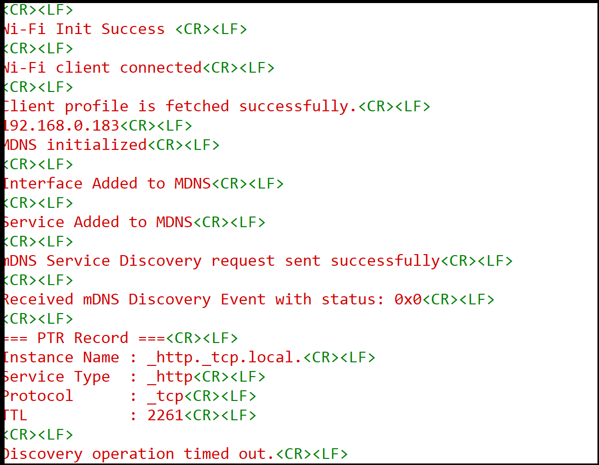

# Wi-Fi - mDNS Advertising and Discovery

## Table of Contents

- [Wi-Fi - mDNS Advertising and Discovery](#wi-fi---mdns-advertising-and-discovery)
  - [Table of Contents](#table-of-contents)
  - [Purpose/Scope](#purposescope)
  - [Prerequisites/Setup Requirements](#prerequisitessetup-requirements)
    - [Hardware Requirements](#hardware-requirements)
    - [Software Requirements](#software-requirements)
  - [Getting Started](#getting-started)
  - [Application Build Environment](#application-build-environment)
  - [Application Configuration](#application-configuration)
  - [Test the Application](#test-the-application)
  - [Behavior Overview](#behavior-overview)
  - [Discovery Response Handling](#discovery-response-handling)

---

## Purpose/Scope

Multicast DNS (mDNS) is a protocol that enables devices to discover services and resolve hostnames on a local network without relying on a centralized DNS server.  
This application demonstrates how to configure the SiWx91x module in client mode to either advertise a local service or discover services using mDNS over UDP. It supports both IPv4 and IPv6 and showcases service registration, query dispatch, and response parsing.

---

## Prerequisites/Setup Requirements

### Hardware Requirements

- A Windows PC  
- USB-C cable  
- A Wireless Access Point (with active internet access)

#### SoC Mode

- **Standalone**:
  - BRD4002A Wireless pro kit mainboard [SI-MB4002A]
  - Radio Boards:
    - BRD4338A [SiWx917-RB4338A]
    - BRD4342A [SiWx917-RB4342A]
    - BRD4343A [SiWx917-RB4343A]

- **Kits**:
  - [SiWx917 Pro Kit (Si917-PK6031A)](https://www.silabs.com/development-tools/wireless/wi-fi/siwx917-pro-kit?tab=overview)
  - SiWx917 Pro Kit (Si917-PK6032A)
  - SiWx917 AC1 Module Explorer Kit (BRD2708A)

#### NCP Mode

- **Standalone**:
  - BRD4002A Wireless pro kit mainboard [SI-MB4002A]
  - [EFR32xG24 Wireless 2.4 GHz +10 dBm Radio Board (xG24-RB4186C)](https://www.silabs.com/development-tools/wireless/xg24-rb4186c-efr32xg24-wireless-gecko-radio-board?tab=overview)
  - NCP Expansion Kit with NCP Radio Boards:
    - (BRD4346A + BRD8045A) [SiWx917-EB4346A]
    - (BRD4357A + BRD8045A) [SiWx917-EB4357A]

- **Interface and Host MCU Supported**:
  - SPI – EFR32  
  - UART – EFR32

---

### Software Requirements

- Simplicity Studio  
- Serial Terminal – [Docklight](https://docklight.de/) / [Tera Term](https://ttssh2.osdn.jp/index.html.en)

---

## Getting Started

Refer to the instructions [here](https://docs.silabs.com/wiseconnect/latest/wiseconnect-getting-started/) to:

- [Install Simplicity Studio](https://docs.silabs.com/wiseconnect/latest/wiseconnect-developers-guide-developing-for-silabs-hosts/#install-simplicity-studio)
- [Install WiSeConnect extension](https://docs.silabs.com/wiseconnect/latest/wiseconnect-developers-guide-developing-for-silabs-hosts/#install-the-wi-se-connect-extension)
- [Connect your device to the computer](https://docs.silabs.com/wiseconnect/latest/wiseconnect-developers-guide-developing-for-silabs-hosts/#connect-si-wx91x-to-computer)
- [Upgrade your connectivity firmware](https://docs.silabs.com/wiseconnect/latest/wiseconnect-developers-guide-developing-for-silabs-hosts/#update-si-wx91x-connectivity-firmware)
- [Create a Studio project](https://docs.silabs.com/wiseconnect/latest/wiseconnect-developers-guide-developing-for-silabs-hosts/#create-a-project)

For details on the project folder structure, see the [WiSeConnect Examples](https://docs.silabs.com/wiseconnect/latest/wiseconnect-examples/#example-folder-structure) page.

---

## Application Build Environment

In the Project Explorer pane, expand the **config/** folder and open the `sl_net_default_values.h` file. Configure the following parameters to connect your Silicon Labs Wi-Fi device to your network:

```c
#define DEFAULT_WIFI_CLIENT_PROFILE_SSID       "YOUR_AP_SSID"
#define DEFAULT_WIFI_CLIENT_CREDENTIAL         "YOUR_AP_PASSPHRASE"
#define DEFAULT_WIFI_CLIENT_SECURITY_TYPE      SL_WIFI_WPA2
```

## Application Configuration

### Configure mDNS Parameters in `app.c`

```c
#define MDNS_HOST_NAME       "wiseconnect.local."
#define MDNS_SERVICE_TYPE    "_http._tcp.local."
#define MDNS_SERVICE_NAME    "wiseconnect._http._tcp.local"
#define MDNS_SERVICE_MESSAGE "HTTP service"
#define MDNS_SERVICE_PORT    80
#define MDNS_SERVICE_TTL     300
```
### IP Version Configuration
- To enable IPv6, set the following macro in `app.c`:
```c
#define MDNSV6_ENABLE 1  // Set to 0 for IPv4, 1 for IPv6
```
- Ensure the preprocessor macro `SLI_SI91X_ENABLE_IPV6` is defined in the build settings.

- Configure the server IP and IP version based on the selected protocol:

```c
#if MDNSV6_ENABLE
#define SERVER_IP  "2401:4901:1290:10de::1004"  // IPv6 address
#define IP_VERSION SL_IPV6_VERSION
#else
#define SERVER_IP  "192.168.50.131"   // IPv4 address
#define IP_VERSION SL_IPV4_VERSION
#endif
```

> **Note**: For recommended settings, refer to the [configuration guide](https://docs.silabs.com/wiseconnect/latest/wiseconnect-developers-guide-prog-recommended-settings/).

## Test the Application

Refer to the instructions [here](https://docs.silabs.com/wiseconnect/latest/wiseconnect-getting-started/) to:

- Build the application  
- Flash, run, and debug the application  

---

## Setting Up an mDNS Test Environment

For mDNS discovery to work, an mDNS responder must advertise services on the same network as the SiWx91x device. Without an external service to discover, the application will time out.

### Linux (using Avahi)

Install and publish a test service:

```bash
# Install avahi (if not already installed)
sudo apt-get install avahi-utils

# Publish an HTTP service
avahi-publish-service "TestDevice" _http._tcp 80
```

> **Note**: The test machine running the mDNS responder must be connected to the **same network** as the SiWx91x device.

---

## Behavior Overview

After successfully connecting to the Access Point, the device initializes the mDNS stack.

- The device advertises its service using mDNS by default.

- It also performs service discovery for the specified service type.

---

## Discovery Response Handling

The mDNS event handler parses and prints the following record types:

```text
Record Type     Description
------------    --------------------------------------------
PTR             Instance name, service type, protocol
SRV             Hostname, port
A / AAAA        IPv4 / IPv6 addresses
TXT             Metadata associated with the service
```

## Expected Output: PTR Query
The following image shows the expected console output when performing a PTR query for `_http._tcp.local.`. This includes the discovered instance name, service type, protocol, and TTL.

  

### Performing an ANY Query (Optional)

To query advertised service types on the network, modify the `service_query` in `app.c`:

```c
sl_mdns_service_query_t service_query = { .service_type = "_services._dns-sd._udp.local.",
                                          .query_type   = SL_MDNS_QUERY_TYPE_ANY,
                                          .timeout      = 5000 };
```

This returns all PTR records on the network, which can then initiate targeted queries for specific services.
