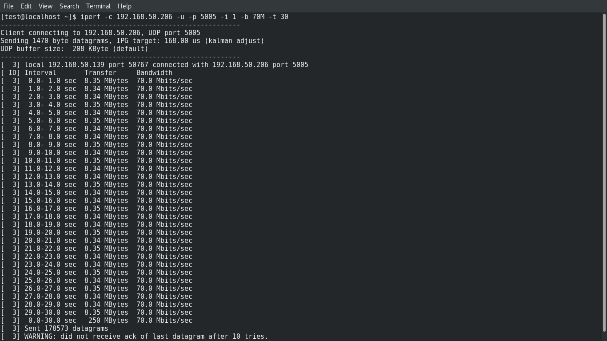
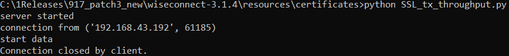

# Wi-Fi - Multithread sockets

## Table of Contents

- [Wi-Fi - Multithread sockets](#wi-fi---Multithread sockets)
  - [Table of Contents](#table-of-contents)
  - [Purpose/Scope](#purposescope)
  - [Prerequisites/Setup Requirements](#prerequisitessetup-requirements)
    - [Hardware Requirements](#hardware-requirements)
    - [Software Requirements](#software-requirements)
    - [Setup Diagram](#setup-diagram)
  - [Getting Started](#getting-started)
    - [Instructions for Simplicity Studio IDE and Silicon Labs devices (SoC and NCP Modes)](#instructions-for-simplicity-studio-ide-and-silicon-labs-devices-soc-and-ncp-modes)
  - [Application Build Environment](#application-build-environment)
    - [Configure sl\_net\_default\_values.h](#configure-sl_net_default_valuesh)
  - [Test the application](#test-the-application)
    - [Instructions for Simplicity Studio IDE and Silicon Labs devices (SoC and NCP Modes)](#instructions-for-simplicity-studio-ide-and-silicon-labs-devices-soc-and-ncp-modes-1)
    - [Application Prints:](#application-prints)
    - [To Run Server](#to-run-server)
      - [UDP Tx Throughput](#udp-tx-throughput)
      - [UDP Rx Throughput](#udp-rx-throughput)
      - [TCP Tx Throughput](#tcp-tx-throughput)
      - [TCP Rx Throughput](#tcp-rx-throughput)
      - [TLS Tx Throughput](#tls-tx-throughput)
      - [TLS Rx Throughput](#tls-rx-throughput)
  
## Purpose/Scope

This application demonstrates the procedure to measure WLAN UDP/TCP/TLS throughput by configuring the SiWx91x in client/server role. In this application, the SiWx91x connects to a Wi-Fi access point, obtains an IP address, and connects to an iPerf server/client or Python-based TLS scripts running on a remote PC. It then measures Tx/Rx throughput transmitted/received from the remote PC. Additionally, the application supports multithreaded operations, enabling simultaneous measurement of throughput across multiple connections or roles. This feature allows the SiWx91x to efficiently handle concurrent Tx and Rx streams or multiple client/server instances, thereby maximizing performance.

## Prerequisites/Setup Requirements

### Hardware Requirements

- Windows PC
- Wireless Access Point
- **SoC Mode**:
  - Standalone
    - BRD4002A Wireless pro kit mainboard [SI-MB4002A]
    - Radio Boards
      - BRD4338A [SiWx917-RB4338A]
      - BRD4342A [SiWx917-RB4342A]
      - BRD4343A [SiWx917-RB4343A]
  - Kits
    - SiWx917 Pro Kit [Si917-PK6031A](https://www.silabs.com/development-tools/wireless/wi-fi/siwx917-pro-kit?tab=overview)
    - SiWx917 Pro Kit [Si917-PK6032A]
    - SiWx917 AC1 Module Explorer Kit (BRD2708A)

- **NCP Mode**:
  - Standalone
    - BRD4002A Wireless pro kit mainboard [SI-MB4002A]
    - EFR32xG24 Wireless 2.4 GHz +10 dBm Radio Board [xG24-RB4186C](https://www.silabs.com/development-tools/wireless/xg24-rb4186c-efr32xg24-wireless-gecko-radio-board?tab=overview)
    - NCP Expansion Kit with NCP Radio boards
      - (BRD4346A + BRD8045A) [SiWx917-EB4346A]
      - (BRD4357A + BRD8045A) [SiWx917-EB4357A]
      - (BRD4353A + BRD8045A) [SiWx917-EB4353A]
  - Kits
    - EFR32xG24 Pro Kit +10 dBm [xG24-PK6009A](https://www.silabs.com/development-tools/wireless/efr32xg24-pro-kit-10-dbm?tab=overview)

  - Interface and Host MCU Supported
    - SPI - EFR32

### Software Requirements

- Simplicity Studio IDE (to be used with Silicon Labs MCU)
- [iPerf Application](https://sourceforge.net/projects/iperf2/files/iperf-2.0.8-win.zip/download). iPerf is a tool for active measurements of the maximum achievable bandwidth on IP networks. It supports tuning of various parameters related to timing, buffers and protocols (TCP and UDP with IPv4 and IPv6).
- [Python Environment](https://www.python.org/downloads/)
- Serial Terminal - [Docklight](https://docklight.de/)/[Tera Term](https://ttssh2.osdn.jp/index.html.en) (to be used with Keil IDE)

### Setup Diagram

  

1. The development environment refers to either Simplicity Studio.
2. After the application is flashed onto the SiWx91x module, it connects to a Wireless Access Point (WAP).
3. To operate as a server, another device connects to this AP.
4. The data transfer is facilitated by an iperf application running on a third-party device.

## Getting Started

### Instructions for Simplicity Studio IDE and Silicon Labs devices (SoC and NCP Modes)

Refer to the instructions [here](https://docs.silabs.com/wiseconnect/latest/wiseconnect-getting-started/) to:

- Install Studio and WiSeConnect 3 extension
- Connect your device to the computer
- Upgrade your connectivity firmware
- Create a Studio project

For details on the project folder structure, see the [WiSeConnect Examples](https://docs.silabs.com/wiseconnect/latest/wiseconnect-examples/#example-folder-structure) page.

## Application Build Environment

The application can be configured to suit user requirements and development environment. Read through the following sections and make the necessary changes, if required.

### Configure sl_net_default_values.h

**File path for Simplicity Studio IDE:**

1. In the Project Explorer pane, expand the **config** folder and open the **sl_net_default_values.h** file.

2. Configure the following parameters to enable your Silicon Labs Wi-Fi device to connect to your Wi-Fi network

   - STA instance related parameters

     - DEFAULT_WIFI_CLIENT_PROFILE_SSID refers to the name with which Wi-Fi network that shall be advertised and Si91X module is connected to it.

        ```c
        #define DEFAULT_WIFI_CLIENT_PROFILE_SSID               "YOUR_AP_SSID"      
        ```

      - DEFAULT_WIFI_CLIENT_CREDENTIAL refers to the secret key if the Access point is configured in WPA-PSK/WPA2-PSK security modes.

        ```c
        #define DEFAULT_WIFI_CLIENT_CREDENTIAL                 "YOUR_AP_PASSPHRASE" 
        ```

      - DEFAULT_WIFI_CLIENT_SECURITY_TYPE refers to the security type of the Access point. The supported security modes are mentioned in `sl_wifi_security_t`.

        ```c
        #define DEFAULT_WIFI_CLIENT_SECURITY_TYPE               SL_WIFI_WPA2
        ```

   - Other STA instance configurations can be modified if required in `default_wifi_client_profile` configuration structure.

> **Note:**
> User can configure default region specific regulatory information using `sl_wifi_region_db_config.h`.

**Path for app.c in Simplicity Studio IDE:**

- The `app.c` file will be located at **wifi_wlan_throughput_soc**.

Configure the following parameters in `app.c` to test throughput app as per requirements.

## Socket Configuration Macros

The following macros are used to configure the socket parameters in the application. These settings should be updated by calling the `sl_si91x_config_socket` API based on the specific requirements of the application, such as the number of TX, RX, and TCP/UDP sockets.

### Macros

- **`TOTAL_SOCKETS`**

  - Total number of sockets (combination of TOTAL_TCP_SOCKETS + TOTAL_UDP_SOCKETS).
  - **Maximum Limit:** The value of `TOTAL_SOCKETS` must be **less than or equal to 10**.
  - **Example:** `#define TOTAL_SOCKETS 3`

- **`TOTAL_TCP_SOCKETS`**
  - Total number of TCP sockets (combination of TCP_TX_ONLY_SOCKETS + TCP_RX_ONLY_SOCKETS + TCP_RX_HIGH_PERFORMANCE_SOCKETS).
  - **Example:** `#define TOTAL_TCP_SOCKETS 3`

- **`TOTAL_UDP_SOCKETS`**
  - Total number of UDP sockets (combination of UDP_TX_ONLY_SOCKETS + UDP_RX_ONLY_SOCKETS).
  - **Example:** `#define TOTAL_UDP_SOCKETS 0`

- **`TCP_TX_ONLY_SOCKETS`**
  - Number of TCP sockets used for TX-only communication.
  - **Example:** `#define TCP_TX_ONLY_SOCKETS 1`

- **`TCP_RX_ONLY_SOCKETS`**
  - Number of TCP sockets used for RX-only communication.
  - **Example:** `#define TCP_RX_ONLY_SOCKETS 1`

- **`UDP_TX_ONLY_SOCKETS`**
  - Number of UDP sockets used for TX-only communication.
  - **Example:** `#define UDP_TX_ONLY_SOCKETS 0`

- **`UDP_RX_ONLY_SOCKETS`**
  - Number of UDP sockets used for RX-only communication.
  - **Example:** `#define UDP_RX_ONLY_SOCKETS 0`

- **`TCP_RX_HIGH_PERFORMANCE_SOCKETS`**
  - Number of high-performance TCP RX sockets. These are configured to handle high data throughput requirements.
  - **Example:** `#define TCP_RX_HIGH_PERFORMANCE_SOCKETS 1`

- **`TCP_RX_WINDOW_SIZE_CAP`**
  - The maximum size of the TCP RX window, specified in KB. This determines the buffer size for receiving TCP data.
  - **Example:** `#define TCP_RX_WINDOW_SIZE_CAP 44`

- **`TCP_RX_WINDOW_DIV_FACTOR`**
  - The division factor for the TCP RX window size. This is used for adjusting the RX window size dynamically.
  - **Example:** `#define TCP_RX_WINDOW_DIV_FACTOR 44`

### Guidelines for Configuration

- **Update Values Based on Usage:**
  - Customize these macros according to the number and type of sockets your application requires.
  - For example, adjust the values of `TCP_TX_ONLY_SOCKETS`, `TCP_RX_ONLY_SOCKETS`, etc., based on your TX and RX requirements for TCP/UDP communication.

- **Maximum Sockets:**
  - The total number of sockets (`TOTAL_SOCKETS`) **must not exceed 10**.

- **High-Performance Sockets:**
  - Use `TCP_RX_HIGH_PERFORMANCE_SOCKETS` for scenarios that demand high throughput.

- **Window Configuration:**
  - Configure `TCP_RX_WINDOW_SIZE_CAP` and `TCP_RX_WINDOW_DIV_FACTOR` to optimize RX performance.

## Socket Type Macros

The following macros are used to define the type of sockets in the application:

### Macros

- **`NONE` (Value: `0`)**
  - Indicates that the socket does not require synchronization or asynchronous handling.
  - **Usage:** This is recommended for **TX sockets** as they do not require sync or async functionality.

- **`ASYNC_SOCKET` (Value: `1`)**
  - Represents an asynchronous socket type.
  - **Usage:** This macro is used for **RX sockets** when the user specifies asynchronous behavior.

- **`SYNC_SOCKET` (Value: `2`)**
  - Represents a synchronous socket type.
  - **Usage:** This macro is used for **RX sockets** when the user specifies synchronous behavior.

### Guidelines for Socket Usage

- **TX Sockets:**  
  Always use the `NONE` macro for TX sockets as synchronization is not required.
  
- **RX Sockets:**  
  Depending on the user requirement, use either `ASYNC_SOCKET` or `SYNC_SOCKET`:
  - Use `ASYNC_SOCKET` for non-blocking operations where data is received asynchronously.
  - Use `SYNC_SOCKET` for blocking operations where data is received synchronously.

### create_newsocket_with_new_osthread API

#### Description

This API creates a new socket and spawns an associated OS thread to handle the specified socket operations. It dynamically allocates memory for socket information, initializes thread attributes, and assigns the given socket handler function to the created thread. The thread runs independently to execute the specified socket operations, enabling concurrent multi-socket communication in the application.

#### **Function Prototype**

```c
osThreadId_t create_newsocket_with_new_osthread(socket_handler sock_handler,
                                                uint32_t Portnumber,
                                                char *ip_address,
                                                char *thread_name,
                                                uint8_t thread_priority,
                                                uint32_t thread_size,
                                                uint8_t flag);
```

#### Parameters

| **Parameter**       | **Type**             | **Description**                                                                                             |
|---------------------|----------------------|-------------------------------------------------------------------------------------------------------------|
| `sock_handler`      | `socket_handler`    | A callback function pointer for handling the socket operations (for example, sending or receiving data).           |
| `Portnumber`        | `uint32_t`          | The port number on which the socket will operate.                                                          |
| `ip_address`        | `char *`            | The IP address for the socket connection (use `NULL` for server-side sockets that don't require an address).|
| `thread_name`       | `char *`            | The name of the OS thread that will be created for this socket.                                            |
| `thread_priority`   | `uint8_t`           | The priority of the OS thread (for example, `osPriorityLow`).                                                     |
| `thread_size`       | `uint32_t`          | The stack size of the OS thread in bytes (for example, `1024 * 4`).                                               |
| `flag`              | `uint8_t`           | The socket type or behavior flag (for example, `SYNC_SOCKET` for synchronized operations or `ASYNC_SOCKET` for asynchronous). |

#### **Return Value**  

| **Type**        | **Description**                                                                                 |
|------------------|-------------------------------------------------------------------------------------------------|
| `osThreadId_t`   | Returns the ID of the newly created OS thread. On failure, it returns a NULL or error code. |

### Example: Multiple Sockets Over Multiple Threads

Below is an example demonstrating the creation of multiple sockets, each with its own thread, for various TCP/UDP/TLS operations:

#### **Example Usage of `create_newsocket_with_new_osthread` API**

The following examples demonstrate how to create multiple sockets, each handled by a dedicated thread, for various TCP, UDP and TLS operations.

##### **Creating a TCP Transmitter Socket**

Creates a socket to send data to a TCP server running on `192.168.0.156` at port `5001`.  

```c
create_newsocket_with_new_osthread(send_data_to_tcp_server,
                                   5001,
                                   "192.168.0.156", // Server IP
                                   "TCP_TX",        // Thread name
                                   osPriorityLow,   // Thread priority
                                   (1024 * 4),      // Thread stack size
                                   NONE);           // NONE
```

##### **Creating a TCP Receiver Socket**

Creates a socket to receive data from a TCP client on port `5004`.  

```c
create_newsocket_with_new_osthread(receive_data_from_tcp_client,
                                   5004,
                                   NULL,            // NULL for server-side
                                   "TCP_RX",        // Thread name
                                   osPriorityLow,   // Thread priority
                                   (1024 * 4),      // Thread stack size
                                   SYNC_SOCKET);    // Synchronous socket
```

##### **Creating Another TCP Receiver Socket**

Creates another TCP client socket to receiver data from a remote TCP server connection at port `5005` with the server IP `192.168.8.31`.  

```c
create_newsocket_with_new_osthread(receive_data_from_tcp_server,
                                   5005,
                                   "192.168.8.31",  // Server IP
                                   "TCP_RX1",       // Thread name
                                   osPriorityLow,   // Thread priority
                                   (1024 * 4),      // Thread stack size
                                   SYNC_SOCKET);    // Synchronous socket
```

##### Creating UDP Sockets

- **UDP Transmitter Socket**: Sends data to a UDP server at port `5002` with IP `192.168.0.156`.

  ```c
  create_newsocket_with_new_osthread(send_data_to_udp_server,
                                    5002,
                                    "192.168.0.156", // Server IP
                                    "UDP_TX",        // Thread name
                                    osPriorityLow,   // Thread priority
                                    (1024 * 4),      // Thread stack size
                                    NONE);           // NONE
  ```

- **UDP Receiver Socket**: Receives data from a UDP client at port `5004`.

  ```c
  create_newsocket_with_new_osthread(receive_data_from_udp_client,
                                    5004,
                                    NULL,            // NULL for server-side
                                    "UDP_RX",        // Thread name
                                    osPriorityLow,   // Thread priority
                                    (1024 * 4),      // Thread stack size
                                    SYNC_SOCKET);    // Synchronous socket
  ```

##### **Creating a TLS Transmitter Socket**

Creates a socket to send encrypted data to a TLS server running on `192.168.0.156` at port `5010`.  

```c
create_newsocket_with_new_osthread(send_data_to_tls_server,
                                   5010,
                                   "192.168.0.156", // Server IP
                                   "TLS_TX",        // Thread name
                                   osPriorityLow,   // Thread priority
                                   (1024 * 4),      // Thread stack size
                                   NONE);           // NONE 
```

##### Creating a TLS Receiver Socket

Creates a socket to receive encrypted data from a TLS server running on `192.168.0.156` at port `5011`.  

```c
create_newsocket_with_new_osthread(receive_data_from_tls_server,
                                   5011,
                                   "192.168.0.156", // Server IP
                                   "TLS_RX",        // Thread name
                                   osPriorityLow,   // Thread priority
                                   (1024 * 4),      // Thread stack size
                                   SYNC_SOCKET);    // Synchronous socket
```

- Throughput Test options

    ```c
      #define BYTES_TO_SEND     (1 << 29)     // To measure TX throughput with 512 MB data transfer
      #define BYTES_TO_RECEIVE  (1 << 20)     // To measure RX throughput with 1 MB data transfer
      #define TEST_TIMEOUT      30000         // Throughput test timeout in ms
    ```

- Change the PLL_MODE to 1, in sl_si91x_protocol_types.h.

     **File path for Simplicity Studio IDE:**

- In the Project explorer pane, expand as follows"  **wiseconnect3_sdk_xxx** > **components** > **device** > **silabs** > **si91x** > **wireless** > **inc** folder and open **sl_si91x_protocol_types.h** file.

  ```c
  #define PLL_MODE      1
  ```

## Test the application

### Instructions for Simplicity Studio IDE and Silicon Labs devices (SoC and NCP Modes)

Refer to the instructions [here](https://docs.silabs.com/wiseconnect/latest/wiseconnect-getting-started/) to:

- Build the application.
- Flash, run and debug the application.

  > **Note:** The SiWx91x, which is configured as a UDP/TCP/TLS server/client, connects to the iPerf server/client and sends/receives data for configured intervals. While module is transmitting/receiving the data, application prints the throughput numbers in serial console.
  
By default, three sockets are created in the example: **TCP_TX**, **TCP_RX (client mode)**, and **TCP_RX (server mode)**.

### Application Prints


### To Run Server

#### UDP Tx Throughput

To measure UDP Tx throughput, configure the SiWx91x as a UDP client and start a UDP server on the remote PC. To establish UDP Server on remote PC, open [iPerf Application](https://sourceforge.net/projects/iperf2/files/iperf-2.0.8-win.zip/download) and run the following command from the installed folder's path in the command prompt.

The iPerf command to start the UDP server on the PC is:

  ```shell
   C:\> iperf.exe -s -u -p <SERVER_PORT> -i 1
  ```
  
  > **Example:**
  >
  > ```shell
  > C:\> iperf.exe -s -u -p 5001 -i 1
  > ```

- **For SOC**

  

- **For NCP with EFR host**

  

#### UDP Rx Throughput

To measure UDP Rx throughput, configure the SiWx91x as a UDP server and start a UDP client on the remote PC.
The iPerf command to start the UDP client is:

```shell
 C:\> iperf.exe -c <Module_IP> -u -p <LISTENING_PORT> -i 1 -b <Bandwidth> -t <time interval in seconds>`
```

  > **Example:**
  >
  > ```shell
  > C:\> iperf.exe -c 192.168.0.100 -u -p 5001 -i 1 -b 70M -t 30
  > ```

- **For SOC**

  

- **For NCP with EFR host**

  

#### TCP Tx Throughput

To measure TCP Tx throughput, configure the SiWx91x as a TCP client and start a TCP server on the remote PC. To establish TCP Server on remote PC, open [iPerf Application](https://sourceforge.net/projects/iperf2/files/iperf-2.0.8-win.zip/download) and run the following command from the installed folder's path in the command prompt.

The iPerf command to start the TCP server is:

   ```shell
   C:\> iperf.exe -s -p <SERVER_PORT> -i 1 -S 0xC8
   ```

  > Example:
  >
  > ```shell
  > C:\> iperf.exe -s -p 5001 -i 1 -S 0xC8
  > ```

- **For SOC**

  

- **For NCP with EFR host**

  

#### TCP Rx Throughput

##### DUT as TCP Server

To measure TCP Rx throughput, configure the SiWx91x as a TCP server and start a TCP client on the remote PC. Use the following iPerf command to initiate the TCP client:

  ```shell
  C:\> iperf.exe -c <Module_IP> -p <LISTENING_PORT> -i 1 -t <time interval in sec> -S 0xC8
  ```

  >**Example:**
  >
  >```shell
  >C:\> iperf.exe -c 192.168.0.100 -p 5001 -i 1 -t 30 -S 0xC8
  >```

- **For SOC**

  

- **For NCP with EFR host**

  

##### DUT as TCP Client

To measure TCP Rx throughput, configure the SiWx91x as a TCP client and start a TCP server on the remote PC using the steps below:

- Open a command prompt and navigate to the `/resources/scripts/` folder. Then, execute the following command:

  ``` shell
  C:\> python TCP_Server_throughput.py
  ```

  > **Note:** The `TCP_Server_throughput.py` script is compatible with Python version 2 and above.
  >
  > Ensure the `SERVER_PORT` macro in the script are updated to match the server machine's configuration.

- **For SOC/NCP with EFR host**

  

> **Note:** The client must set the SNI extension when connecting to an AWS server using TLS 1.3 version.

#### TLS Tx Throughput

To measure TLS Tx throughput, configure the SiWx91x as a TLS client and start a TLS server on the remote PC as described in the following bullets:

- Copy the `SSL_Server_throughput_d.py` script from the release `/resources/scripts/` directory to the `/resources/certificates/` directory
- Open a command prompt and cd to the folder `/resources/certificates/`, then run the following command:

  ```shell
  C:\> python SSL_Server_throughput_d.py`
  ```

  > **Note:** The SSL_Server_throughput_d.py script works only with Python version 2 and above.
  >
  > The TLSv1_3 works for python version greater than 3.6.

- **For SOC**

  

- **For NCP with EFR host**

  

#### TLS Rx Throughput

To measure TLS RX throughput, configure the SiWx91x as a TLS client and open a TLS server on the remote PC as described in the following bullets:

- Copy the `SSL_tx_throughput.py` script from the release `/resources/scripts/` directory to the `/resources/certificates/`
- Open a command prompt and cd to the folder `/resources/certificates/`, then run the following command:
  - `C:\> python SSL_tx_throughput.py`

    > **Note:** The SSL_tx_throughput.py script works only with Python version 2 and above.
    >
    > The TLSv1_3 works for python version greater than 3.6.

- **For SOC**

  

- **For NCP with EFR host**

  

> **Note:**
> The captured reference images are measured in an isolated chamber. However, variations can be observed if Throughputs measured in dense environments that is, in a dense environment we can observe less throughput.

