# Wi-Fi - Multithreading Application 

## Table of Contents

- [Purpose/Scope](#purposescope)
- [Prerequisites/Setup Requirements](#prerequisitessetup-requirements)
  - [Hardware Requirements](#hardware-requirements)
  - [Software Requirements](#software-requirements)
  - [Setup Diagram](#setup-diagram)
- [Getting Started](#getting-started)
- [Application Build Environment](#application-build-environment)
- [Test the Application](#test-the-application)
- [Procedure to execute the application](#procedure-to-execute-the-application)
- [Additional Information](#additional-information)
   - [Steps to set up MQTT server](#steps-to-set-up-mqtt-server)
## Purpose/Scope

This application demonstrates how to configure the SiWx91x multithreading in concurrent mode i.e., in both Wi-Fi Station mode (STA instance) and Access Point mode (SoftAP instance).
In this example application, the SiWx91x's STA instance is configured as an MQTT client, connects to an MQTT broker, subscribes to a topic and publishes messages on a particular MQTT topic.
In this example application, configure the SiWx91x as a soft Access point and measure WLAN UDP/TCP throughput by configuring the SiWx91x in client/server role.
## Prerequisites/Setup Requirements

### Hardware Requirements

- Windows PC
- Wireless Access Point
- **SoC Mode**:
  - Standalone
    - BRD4002A Wireless pro kit mainboard [SI-MB4002A]
    - Radio Boards 
  	  - BRD4338A [SiWx917-RB4338A]
  	  - BRD4343A [SiWx917-RB4343A]
  - Kits
  	- SiWx917 Pro Kit [Si917-PK6031A](https://www.silabs.com/development-tools/wireless/wi-fi/siwx917-pro-kit?tab=overview)
  	- SiWx917 Pro Kit [Si917-PK6032A]
  	- SiWx917 AC1 Module Explorer Kit (BRD2708A)
  	
- **NCP Mode**:
  - Standalone
    - BRD4002A Wireless pro kit mainboard [SI-MB4002A]
    - EFR32xG24 Wireless 2.4 GHz +10 dBm Radio Board [xG24-RB4186C](https://www.silabs.com/development-tools/wireless/xg24-rb4186c-efr32xg24-wireless-gecko-radio-board?tab=overview)
    - NCP Expansion Kit with NCP Radio boards
      - (BRD4346A + BRD8045A) [SiWx917-EB4346A]
      - (BRD4357A + BRD8045A) [SiWx917-EB4357A]
  - Kits
  	- EFR32xG24 Pro Kit +10 dBm [xG24-PK6009A](https://www.silabs.com/development-tools/wireless/efr32xg24-pro-kit-10-dbm?tab=overview)
  - Interface and Host MCU Supported
    - SPI - EFR32 

### Software Requirements

- Simplicity Studio
- [iPerf Application](https://sourceforge.net/projects/iperf2/files/iperf-2.0.8-win.zip/download). iPerf is a tool for active measurements of the maximum achievable bandwidth on IP networks. It supports tuning of various parameters related to timing, buffers and protocols (TCP and UDP with IPv4 and IPv6).

### Setup Diagram

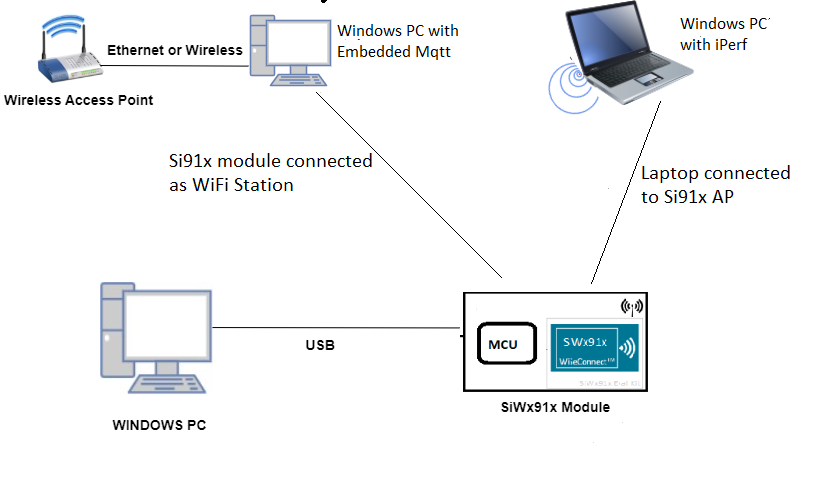

**NOTE**:

- The Host MCU platform (EFR32MG21) and the SiWx91x interact with each other through the SPI interface.

## Getting Started

Refer to the instructions [here](https://docs.silabs.com/wiseconnect/latest/wiseconnect-getting-started/) to:

- [Install Simplicity Studio](https://docs.silabs.com/wiseconnect/latest/wiseconnect-developers-guide-developing-for-silabs-hosts/#install-simplicity-studio)
- [Install WiSeConnect 3 extension](https://docs.silabs.com/wiseconnect/latest/wiseconnect-developers-guide-developing-for-silabs-hosts/#install-the-wi-se-connect-3-extension)
- [Connect your device to the computer](https://docs.silabs.com/wiseconnect/latest/wiseconnect-developers-guide-developing-for-silabs-hosts/#connect-si-wx91x-to-computer)
- [Upgrade your connectivity firmware ](https://docs.silabs.com/wiseconnect/latest/wiseconnect-developers-guide-developing-for-silabs-hosts/#update-si-wx91x-connectivity-firmware)
- [Create a Studio project ](https://docs.silabs.com/wiseconnect/latest/wiseconnect-developers-guide-developing-for-silabs-hosts/#create-a-project)

For details on the project folder structure, see the [WiSeConnect Examples](https://docs.silabs.com/wiseconnect/latest/wiseconnect-examples/#example-folder-structure) page.

## Application Build Environment

The application can be configured to suit user requirements and development environment. Read through the following sections and make any changes needed.
- In the Project explorer pane, open the **app.c** file. Configure the following parameters based on your requirements

- STA instance related parameters

  - DEFAULT_WIFI_CLIENT_PROFILE_SSID refers to the name to which the Si91x module gets connected to.

  	```c
  	#define DEFAULT_WIFI_CLIENT_PROFILE_SSID               "YOUR_AP_SSID"
  	```

  - DEFAULT_WIFI_CLIENT_CREDENTIAL refers to the secret key if the Access point is configured in WPA-PSK/WPA2-PSK security modes.

  	```c
  	#define DEFAULT_WIFI_CLIENT_CREDENTIAL            "YOUR_AP_PASSPHRASE"
  	```
  	
  - DEFAULT_WIFI_CLIENT_SECURITY_TYPE refers to the security type if the Access point is configured in WPA/WPA2 or mixed security modes.

  	```c
  	#define DEFAULT_WIFI_CLIENT_SECURITY_TYPE              SL_WIFI_WPA2 
  	```
- Other STA instance configurations can be modified if required in `wifi_client_profile` configuration structure.

- AP instance related parameters

	- DEFAULT_WIFI_AP_PROFILE_SSID refers to the SSID of the WiSeConnect softAP that would be created.

  	```c
  	#define DEFAULT_WIFI_AP_PROFILE_SSID                   "MY_AP_SSID"
  	```

	- DEFAULT_WIFI_AP_CREDENTIAL refers to the secret key of the WiSeConnect softAP that would be created.

  	```c
  	#define DEFAULT_WIFI_AP_CREDENTIAL                     "MY_AP_PASSPHRASE"
    ```
> Note: 
> User can configure default region specific regulatory information using `sl_wifi_region_db_config.h`

> Note:
>
> 1. In concurrent mode, STA and AP should be configured on the same channel. The STA instance shall first scan for the specified external AP, wherein the channel number of AP is fetched and passed as an argument during SoftAP creation.
> 2. Valid values for CHANNEL_NO are 1 to 11 in 2.4GHz band and 36 to 48 & 149 to 165 in 5GHz. In this example, default configured band is 2.4GHz.

> Note:
>
> - In `sl_wifi_default_concurrent_configuration`, `oper_mode` must be `SL_SI91X_CONCURRENT_MODE` for this example.

- Configure the following parameters in `ap_throughput.c` to test throughput app as per requirements

  - Client/Server IP Settings

      ```c
      #define LISTENING_PORT     <local_port>       // Local port to use
      #define SERVER_PORT        <remote_port>      // Remote server port
      #define SERVER_IP_ADDRESS  "192.168.0.100"    // Remote server IP address
      #define SOCKET_ASYNC_FEATURE 1                // Type of Socket used. Synchronous = 0, Asynchronous = 1
      ```

  - Throughput Measurement Types

    - The application may be configured to measure throughput using UDP or TCP packets. Choose the measurement type using the `THROUGHPUT_TYPE` macro.

      ```c
      #define THROUGHPUT_TYPE  TCP_TX     // Selects the throughput option

      #define TCP_TX           0   // SiWx91x transmits packets to remote TCP client
      #define TCP_RX           1   // SiWx91x receives packets from remote TCP server
      #define UDP_TX           2   // SiWx91x transmits packets to remote UDP client
      #define UDP_RX           3   // SiWx91x receives packets from remote UDP server
      ```

  - Throughput Test options

      ```c
      #define BYTES_TO_SEND     (1 << 29)     // To measure TX throughput with 512MB data transfer
      #define BYTES_TO_RECEIVE  (1 << 20)     // To measure RX throughput with 1MB data transfer
      #define TEST_TIMEOUT      10000         // Throughput test timeout in ms
      ```
  - Configure the TCP RX window size and TCP RX window division factor to 44 in the socket configuration in **app.c** to achieve high throughput for TCP_RX and TLS_RX.
   
    ```c
    static sl_si91x_socket_config_t socket_config = {
      2,  // Total sockets
      2,  // Total TCP sockets
      0,  // Total UDP sockets
      0,  // TCP TX only sockets
      2,  // TCP RX only sockets
      0,  // UDP TX only sockets
      0,  // UDP RX only sockets
      1,  // TCP RX high performance sockets
      44, // TCP RX window size
      44  // TCP RX window division factor
    };
    ```

- Configure the following parameters in `station_embedded.c` to test throughput app as per requirements

  - MQTT_BROKER_PORT port refers to the port number on which the remote MQTT broker/server is running.

   ```c
   #define MQTT_BROKER_PORT                                8886
   ```

  - MQTT_BROKER_IP refers remote peer IP address (Windows PC1) on which MQTT server is running.

   ```c
   #define MQTT_BROKER_IP                         "192.168.10.1"
   ```

  - CLIENT_PORT port refers to the device MQTT client port number.

   ```c
   #define CLIENT_PORT                                1
   ```

  - CLIENT_ID refers to the unique ID with which the MQTT client connects to MQTT broker/server.

   ```c
   #define clientID "WIFI-SDK-MQTT-CLIENT"
   ```

  - PUBLISH_TOPIC refers to the topic to which MQTT client is supposed to subscribe.

   ```c
   #define PUBLISH_TOPIC  "WiFiSDK_TOPIC"
   ```

  - PUBLISH_MESSAGE refers to message that would be published by MQTT client.

   ```c
   #define PUBLISH_MESSAGE    "Lorem ipsum dolor sit amet, consectetur adipiscing elit, sed do"
   ```

  - QOS_OF_PUBLISH_MESSAGE indicates quality of service using which MQTT client publishes message.

   ```c
   #define QOS_OF_PUBLISH_MESSAGE 0
   ```

  - IS_DUPLICATE_MESSAGE indicates whether message sent by MQTT client is a duplicated message.

   ```c
   #define IS_DUPLICATE_MESSAGE 0
   ```

  - IS_MESSAGE_RETAINED whether broker need to retain message published by MQTT client.

   ```c
   #define IS_MESSAGE_RETAINED 0
   ```

  - IS_CLEAN_SESSION indicates whether this connection is new one or continuation of last session

   ```c
   #define IS_CLEAN_SESSION 0
   ```

  - LAST_WILL_TOPIC Topic of last will message

   ```c
   #define LAST_WILL_TOPIC  "WiFiSDK-MQTT-CLIENT-LAST-WILL"
   ```

  - LAST_WILL_MESSAGE Message that would be published by broker if MQTT client disconnect abruptly.

   ```c
   #define LAST_WILL_MESSAGE  "WiFiSDK-MQTT-CLIENT has been disconnect from network"
   ```

  - QOS_OF_LAST_WILL Quality of service for last will message

   ```c
   #define QOS_OF_LAST_WILL  1
   ```

  - IS_LAST_WILL_RETAINED Whether broker needs to retail last will message of client

   ```c
   #define IS_LAST_WILL_RETAINED 1
   ```

  - ENCRYPT_CONNECTION Whether the connection between client and broker should be encrypted using SSL.

   ```c
   #define ENCRYPT_CONNECTION  0
   ```

  - KEEP_ALIVE_INTERVAL client keep alive period in milliseconds

   ```c
   #define KEEP_ALIVE_INTERVAL                       100
   ```

  - MQTT_CONNECT_TIMEOUT Timeout for broker connection in milliseconds

   ```c
   #define MQTT_CONNECT_TIMEOUT                      5000
   ```

  - SEND_CREDENTIALS Whether to send username and password in connect request.

   ```c
   #define SEND_CREDENTIALS 0
   ```

  - USERNAME for login credentials

   ```c
   #define USERNAME "WIFISDK"
   ```

  - PASSWORD for login credentials

   ```c
   #define PASSWORD "password"
   ```

### Test the application

### Instructions for Simplicity Studio IDE and Silicon Labs devices (SoC and NCP Modes)

Refer to the instructions [here](https://docs.silabs.com/wiseconnect/latest/wiseconnect-getting-started/) to:

- Build the application.
- Flash, run and debug the application.

  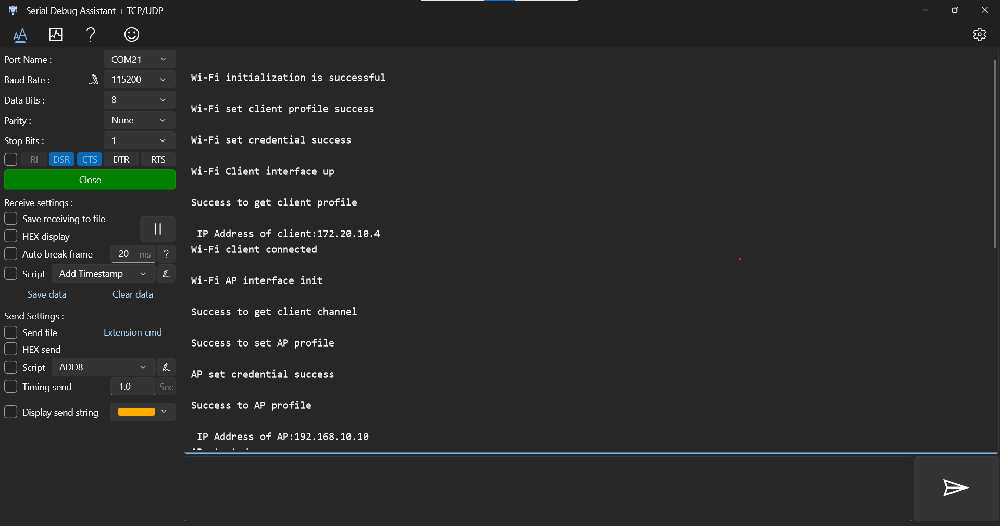
  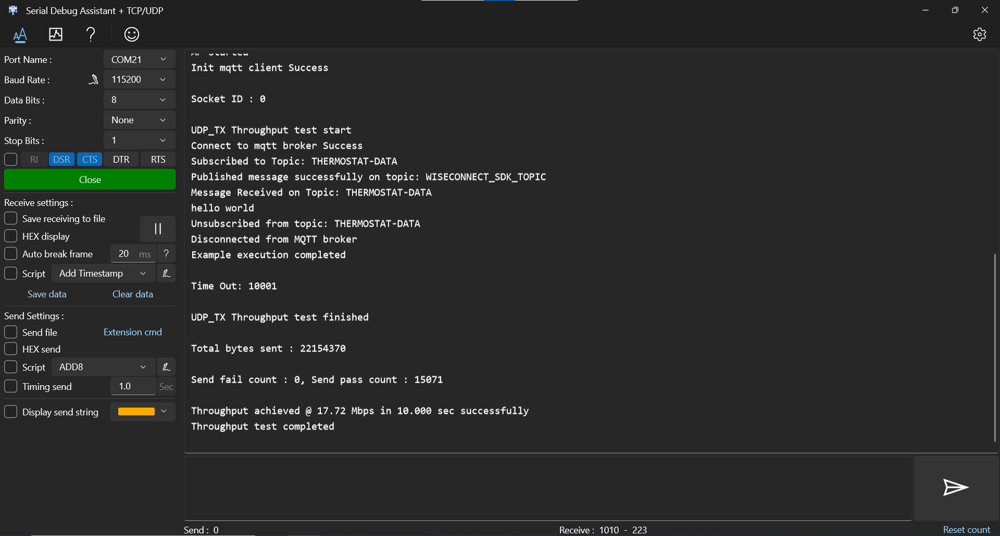


### Procedure to execute the application

#### Procedure for executing throughput

##### UDP Tx Throughput

To measure UDP Tx throughput, configure the SiWx91x as a UDP client and start a UDP server on the remote PC. To establish UDP Server on remote PC, open [iPerf Application](https://sourceforge.net/projects/iperf2/files/iperf-2.0.8-win.zip/download) and run the below command from the installed folder's path in the command prompt.
The iPerf command to start the UDP server on the PC is:

  > `C:\> iperf.exe -s -u -p <SERVER_PORT> -i 1`
  >
  > For example ...
  >
  > `C:\> iperf.exe -s -u -p 5001 -i 1`

  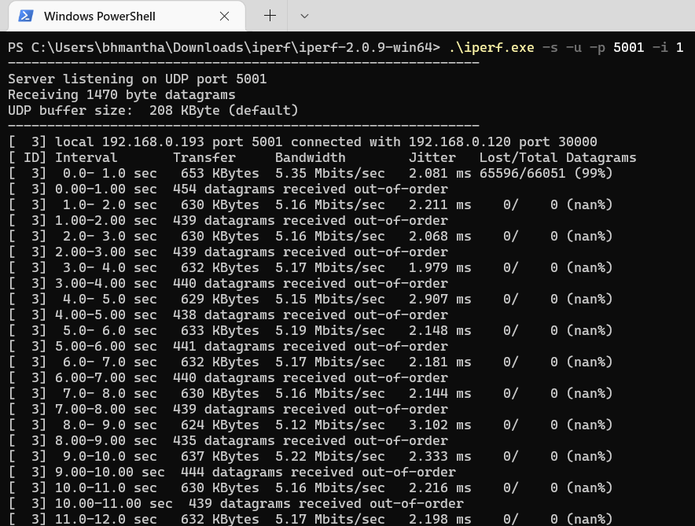

##### UDP Rx Throughput

To measure UDP Rx throughput, configure the SiWx91x as a UDP server and start a UDP client on the remote PC.
The iPerf command to start the UDP client is:

  > `C:\> iperf.exe -c <Module_IP> -u -p <Module_Port> -i 1 -b <Bandwidth> -t <time interval in seconds>`
  >
  > For example ...
  >
  > `C:\> iperf.exe -c 192.168.0.100 -u -p 5001 -i 1 -b70M -t 30`  

  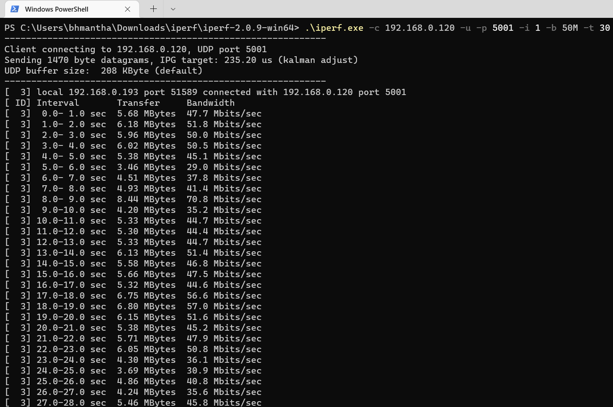

##### TCP Tx Throughput

To measure TCP Tx throughput, configure the SiWx91x as a TCP client and start a TCP server on the remote PC. To establish TCP Server on remote PC, open [iPerf Application](https://sourceforge.net/projects/iperf2/files/iperf-2.0.8-win.zip/download) and run the below command from the installed folder's path in the command prompt.
The iPerf command to start the TCP server is:
  
  > `C:\> iperf.exe -s -p <SERVER_PORT> -i 1`
  >
  > For example ...
  >
  > `C:\> iperf.exe -s -p 5001 -i 1`

  

##### TCP Rx Throughput

To measure TCP Rx throughput, configure the SiWx91x as TCP server and start a TCP client on the remote PC.
The iPerf command to start the TCP client is:

  > `C:\> iperf.exe -c <Module_IP> -p <module_PORT> -i 1 -t <time interval in sec>`
  >
  > For example ...
  >
  > `C:\> iperf.exe -c 192.168.0.100 -p 5001 -i 1 -t 30`  

  

#### Procedure for executing Embedded Mqtt

- Once the SiWx91x gets connected to the MQTT broker, it will subscribe to the topic **TOPIC_TO_BE_SUBSCRIBED (Ex: "THERMOSTAT-DATA")**. The user can see the client connected and subscription success information in the MQTT broker.

   **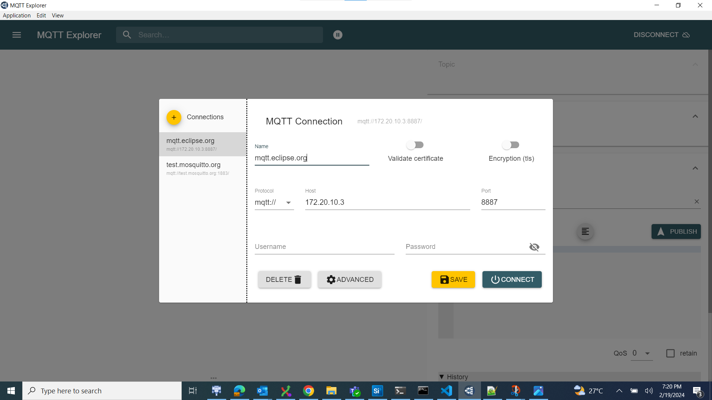**

- SiWx91x publishes a message which is given in **PUBLISH_MESSAGE**
  (Ex: "Lorem ipsum dolor sit amet, consectetur adipiscing elit, sed do") on **PUBLISH_TOPIC(Ex: WiFiSDK_TOPIC)**

- MQTT Explorer which is running on Windows PC2 will receive the message published by the SiWx91x EVK as it subscribed to the same topic.

   **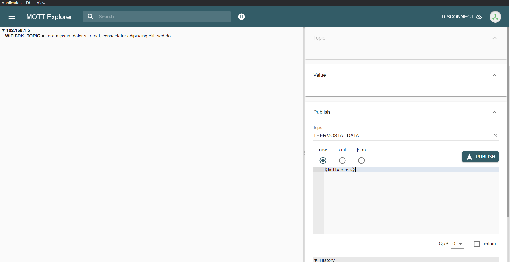**

- Now to publish a message using MQTT Explorer, enter the topic name under **Publish** tab, select **raw** data format, type the data that user wishes to send and then click on **publish**. This message will be received by the SiWx91x.

    ****

- In the MQTT broker and on the terminal, user can observe the published message as the MQTT client is subscribed to that topic.

- SiWx91x unsubscribes to the topic that it has subscribe after receiving the message that was published by MQTT Explorer running on Windows PC2.

- Once subscription is successful, SiWx91x disconnects from the broker.

### Procedure for executing the application when enabled with SSL

1. Install MQTT broker in Windows PC1 which is connected to Access Point through LAN.

2. Update the **mosquitto.conf** file with the proper file paths, in which the certificates are available in the mosquitto.conf file.

3. Also, add **certs** folder to the mosquitto broker folder.

4. Execute the following command in MQTT server installed folder. (Ex:  C:\Program Files\mosquitto>mosquitto.exe -c mosquitto.conf -v) (Port should be 8883)

   `mosquitto.exe -c mosquitto.conf -v`  
  
   **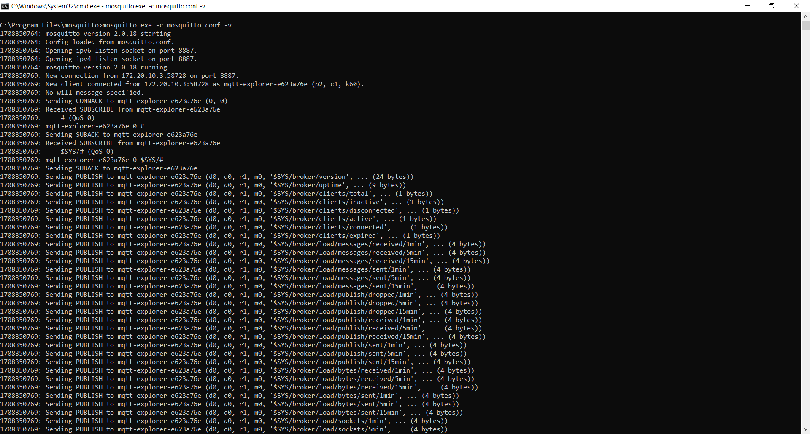**

5. If you see any error - Unsupported tls_version **tlsv1**, just comment the **tls_version tlsv1** in **mosquitto.conf** file.

>**Note:**
> Multiple MQTT client instances can be created.
> If mosquitto isn't allowing external connections to broker, add the below lines in **mosquitto.conf** file:

  ```c
  listener 8886
  allow_anonymous true
  ```

> For using a different config file for mosquitto broker, use command:
  `mosquitto -v -p 8886 -c config/mosquitto.conf`
  where **config** is the sub folder and **mosquitto.conf** is the different config file than default.

## Additional Information

### Steps to set up MQTT server

1. To run MQTT broker on port 8886 in Windows PC1, open command prompt and go to MQTT installed folder (Ex: C:\Program Files\mosquitto) and run the following command:

   ```c
   mosquitto.exe –p 8886 –v
   ```

   **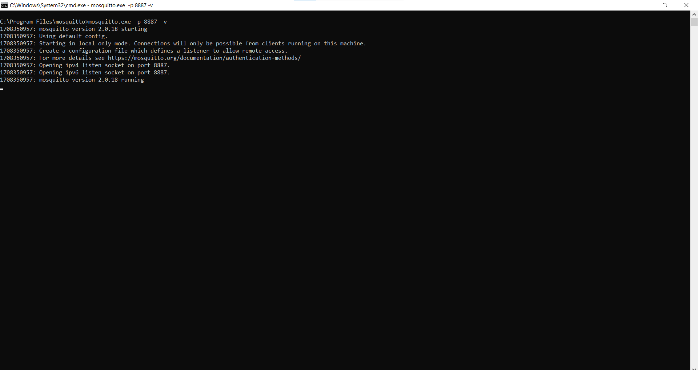**

2. Open MQTT Explorer in Windows PC2 and delete the existing connections if any and click on **Advanced** as shown in the below image.

   ****

3. Delete the existing topic names if any. Enter the desired **TOPIC_NAME** in topic field and click on **ADD**. Then the desired topic name can be observed in the topic list and click on **BACK** as shown in below image.

   **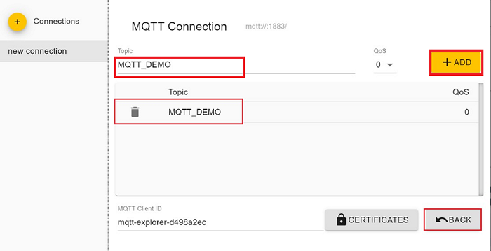**

4. Connect to MQTT broker by giving IP address and port number of Windows PC1 in HOST and PORT fields in MQTT Explorer respectively and click on **CONNECT** to connect to the MQTT broker. If you are running your MQTT broker on the same PC then the following configuration is made as shown in the below image.

   **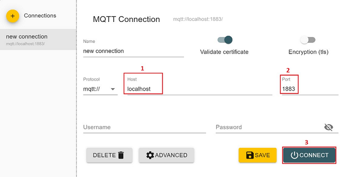**
