# Wi-Fi - Paho MQTT Client Over TCP (LwIP)

## Table of Contents

- [Wi-Fi - Paho MQTT Client Over TCP (LwIP)](#wi-fi---paho-mqtt-client-over-tcp)
  - [Table of Contents](#table-of-contents)
  - [Purpose/Scope](#purposescope)
  - [Prerequisites/Setup Requirements](#prerequisitessetup-requirements)
    - [Hardware Requirements](#hardware-requirements)
    - [Software Requirements](#software-requirements)
    - [Setup Diagram](#setup-diagram)
  - [Getting Started](#getting-started)
  - [Application Build Environment](#application-build-environment)
  - [Test the Application](#test-the-application)
    - [Procedure for executing the application when enabled with SSL](#procedure-for-executing-the-application-when-enabled-with-ssl)
  - [Additional Information](#additional-information)
    - [Steps to set up MQTT server](#steps-to-set-up-mqtt-server)

## Purpose/Scope

This application illustrates how to configure the SiWx91x device as an Message Queuing Telemetry Transport (MQTT) client using the Paho MQTT library, with all Transmission Control Protocol/Internet Protocol (TCP/IP) networking managed by the Lightweight IP (LwIP) stack running on the host MCU. 

Operating in Wi-Fi station mode, the SiWx91x connects to a local access point and uses LwIP for socket-level communication. The application walks through the essential steps to establish a secure connection with an MQTT broker, subscribe to specific topics, and publish messages over TCP using Secure Sockets Layer/Transport Layer Security (SSL/TLS) encryption, integrated via mbedTLS.

## Prerequisites/Setup Requirements

### Hardware Requirements  

- Windows PC
- Wireless Access Point
- Windows PC1 (for running the MQTT broker)
- Windows PC2 (for running the MQTT client utility - MQTT Explorer)
- System-on-Chip (SOC) Mode:
  - Silicon Labs [BRD4338A, BRD4343A](https://www.silabs.com/)
  - For Soc Mode, Simplicity Studio Energy Profiler can be used to measure current consumption - [Simplicity Studio Energy Profiler](#using-simplicity-studio-energy-profiler-for-current-measurement).
- Network Co-Processor (NCP) Mode:
  - Silicon Labs [BRD4180B](https://www.silabs.com/) 
  - Host MCU Eval Kit. This example has been tested with:
    - Silicon Labs [WSTK + EFR32MG21](https://www.silabs.com/development-tools/wireless/efr32xg21-bluetooth-starter-kit)
   - Interface and Host MCU Supported
      - SPI - EFR32 
      - UART - EFR32

### Software Requirements

- Simplicity Studio

### Setup Diagram

  

>**Note:** The Host MCU platform (EFR32MG21) and the SiWx91x interact with each other through the SPI interface.

## Getting Started

Refer to the instructions [here](https://docs.silabs.com/wiseconnect/latest/wiseconnect-getting-started/) to:

- [Install Simplicity Studio](https://docs.silabs.com/wiseconnect/latest/wiseconnect-developers-guide-developing-for-silabs-hosts/#install-simplicity-studio)
- [Install the WiSeConnect extension](https://docs.silabs.com/wiseconnect/latest/wiseconnect-developers-guide-developing-for-silabs-hosts/#install-the-wi-se-connect-3-extension)
- [Connect your device to the computer](https://docs.silabs.com/wiseconnect/latest/wiseconnect-developers-guide-developing-for-silabs-hosts/#connect-si-wx91x-to-computer)
- [Upgrade your connectivity firmware ](https://docs.silabs.com/wiseconnect/latest/wiseconnect-developers-guide-developing-for-silabs-hosts/#update-si-wx91x-connectivity-firmware)
- [Create a Studio project](https://docs.silabs.com/wiseconnect/latest/wiseconnect-developers-guide-developing-for-silabs-hosts/#create-a-project)

For details on the project folder structure, see the [WiSeConnect Examples](https://docs.silabs.com/wiseconnect/latest/wiseconnect-examples/#example-folder-structure) page.

## Application Build Environment

The application can be configured to suit your requirements and development environment. Review the following sections and make any changes needed.

In the Project Explorer pane, expand the **config** folder and open the ``sl_net_default_values.h`` file. Configure the following parameters to enable your Silicon Labs Wi-Fi device to connect to your Wi-Fi network.

- STA instance related parameters

  - DEFAULT_WIFI_CLIENT_PROFILE_SSID refers to the name with which the Wi-Fi network shall be advertised. The Si91X module is connected to it.

    ```c
    #define DEFAULT_WIFI_CLIENT_PROFILE_SSID "YOUR_AP_SSID"      
     ```
  - DEFAULT_WIFI_CLIENT_CREDENTIAL refers to the secret key if the access point is configured in WPA-PSK/WPA2-PSK security modes.

    ```c
    #define DEFAULT_WIFI_CLIENT_CREDENTIAL "YOUR_AP_PASSPHRASE" 
     ```
  
   - DEFAULT_WIFI_CLIENT_SECURITY_TYPE refers to the security type if the access point is configured in WPA/WPA2 or mixed security modes.

     ```c
     #define DEFAULT_WIFI_CLIENT_SECURITY_TYPE SL_WIFI_WPA2
      ```

- Other STA instance configurations can be modified if required in `default_wifi_client_profile` configuration structure.

  - MQTT_BROKER_PORT port refers to the port number on which the remote MQTT broker/server is running.

    ```c
     #define MQTT_BROKER_PORT  1883 // Standard MQTT port
     #define MQTTS_BROKER_PORT 8883 // Standard MQTTS (TLS) port
    ```

  - MQTT_BROKER_IP refers remote peer IP address (Windows PC1) on which MQTT server is running.

     ```c
     #define MQTT_BROKER_IP "192.168.10.1"
     ```

  - CLIENT_PORT port refers to the device MQTT client port number.

    ```c
    #define CLIENT_PORT 5001
     ```

  - client.ipstack->transport_type = MQTT_TRANSPORT_TCP;

     ```c
    This sets the transport type for the MQTT client to use TCP, enabling MQTT communication over a TCP connection.
     ```

  - CLIENT_ID refers to the unique ID with which the MQTT client connects to MQTT broker/server.

     ```c
     int8_t clientID[] = "WISECONNECT_SDK_TOPIC";
     ```

  - PUBLISH_MESSAGE refers to message that would be published by MQTT client.

     ```c
     uint8_t publish_message[] = "THIS IS MQTT CLIENT DEMO FROM APPLICATION";
     ```

  - QOS indicates quality of service which MQTT client uses to publish a message.

     ```c
     #define QOS 0
     ```

  - KEEP_ALIVE_PERIOD client keep alive period in seconds.

     ```c
    #define KEEP_ALIVE_PERIOD 100
     ```

  - For reliable operation, the MQTTYield's timeout_ms should be less than or equal to `keepAliveInterval * 1000`. If it exceeds timeout_ms value, the keepalive mechanism may not have enough opportunity to send a PINGREQ before MQTTYield returns. Alternatively, MQTTYield should be called frequently enough to ensure that the keepalive check is performed within the interval.

  - MQTT_CONNECT_TIMEOUT Timeout for broker connection in milliseconds.

     ```c
     #define TCP_MQTT_CONNECT_TIME_OUT 20000
     ```

  - SEND_CREDENTIALS Whether to send username and password in connect request.

     ```c
     #define SEND_CREDENTIALS 0
     ```

  - USERNAME for login credentials.

      ```c
      #define USERNAME "username"
      ```

  - PASSWORD for login credentials.

      ```c
      #define PASSWORD "password"
      ```

  - In your project configuration (refer to `app.c`, `wifi_mqtt_client_configuration.boot_config.tcp_ip_feature_bit_map`), make sure bypass mode is enabled as shown below:

    ```c
      .tcp_ip_feature_bit_map = (SL_SI91X_TCP_IP_FEAT_BYPASS | ..)
     ```

**MQTT client application level memory configuration**
   ```c
//! Memory to initialize MQTT client Info structure
#define TCP_MQTT_CLIENT_INIT_BUFF_LEN 3500 
      
      //! Global buffer or memory which is used for MQTT client initialization. This is used for the MQTT client information storage.
      uint8_t tcp_mqtt_client_buffer[TCP_MQTT_CLIENT_INIT_BUFF_LEN];
   ```

> **Note**: For recommended settings, see the [Recommendations Guide](https://docs.silabs.com/wiseconnect/latest/wiseconnect-developers-guide-prog-recommended-settings/).

## Test the Application

Refer to the instructions [here](https://docs.silabs.com/wiseconnect/latest/wiseconnect-getting-started/) to:

- Build the application.
- Flash, run, and debug the application.

- SoC mode

   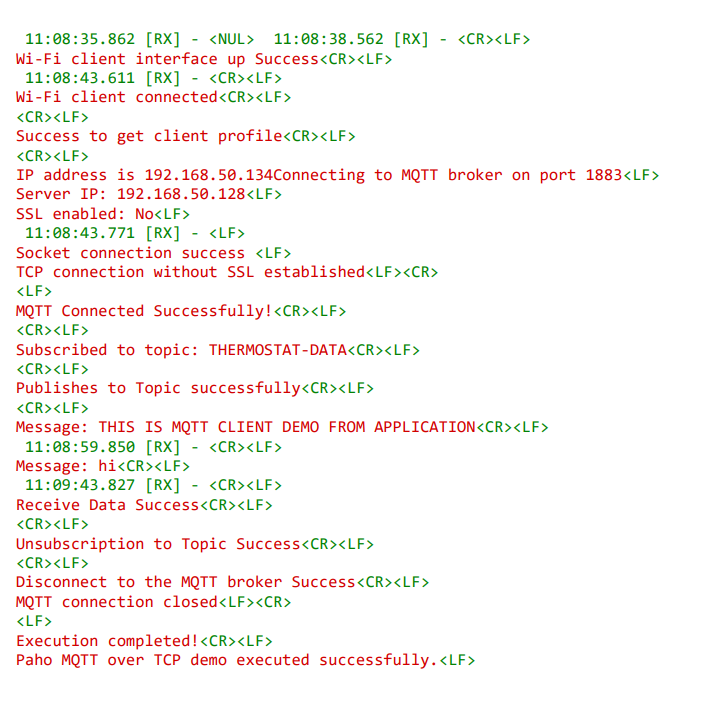

- SoC mode with SSL enabled

   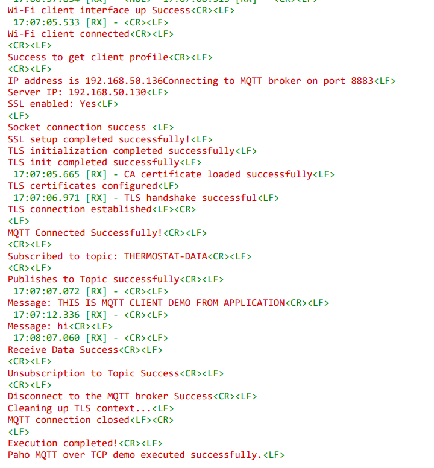
  
- NCP mode

   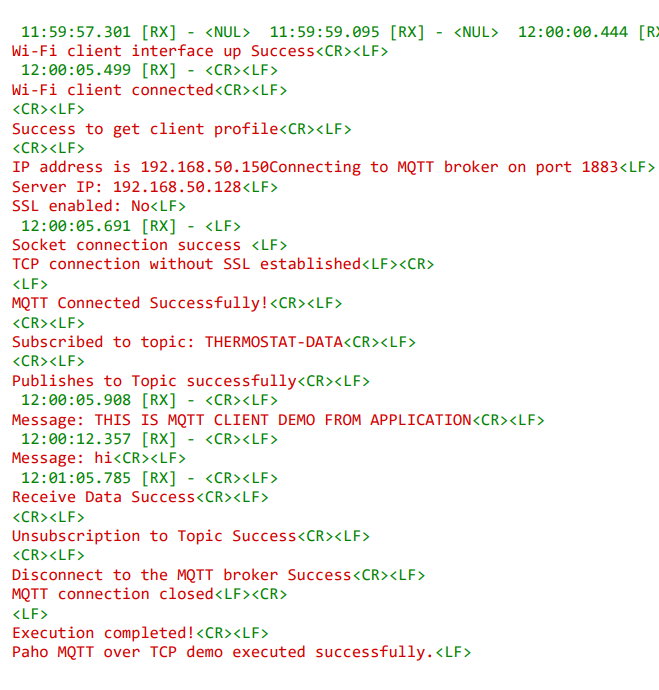

- NCP mode with SSL enabled

   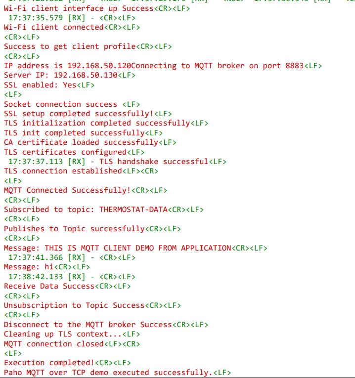

Follow the steps below for successful execution of the application:

- Once the SiWx91x gets connected to the MQTT broker, it will subscribe to the topic **TOPIC_TO_BE_SUBSCRIBED (Ex: "THERMOSTAT-DATA")**. You can see the client connected and subscription success information in the MQTT broker.

   ****

- SiWx91x publishes a message which is given in **publish_message[]**. 
  (Ex: "THIS IS MQTT CLIENT DEMO FROM APPLICATION") on **PUBLISH_TOPIC** (Ex:THERMOSTAT-DATA ).

- MQTT Explorer which is running on Windows PC2 will receive the message published by the SiWx91x EVK as it subscribed to the same topic.

   **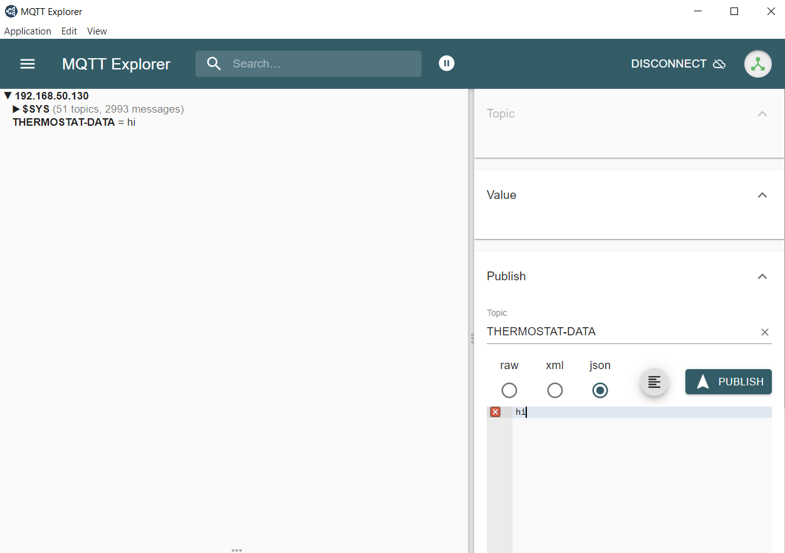**

- To publish a message using MQTT Explorer, enter the topic name under **Publish** tab, type the data that you wish to send, and then click on **Publish**. This message will be received by the SiWx91x.

    ****

- In the MQTT broker and on the terminal, you can observe the published message as the MQTT client is subscribed to that topic.

   **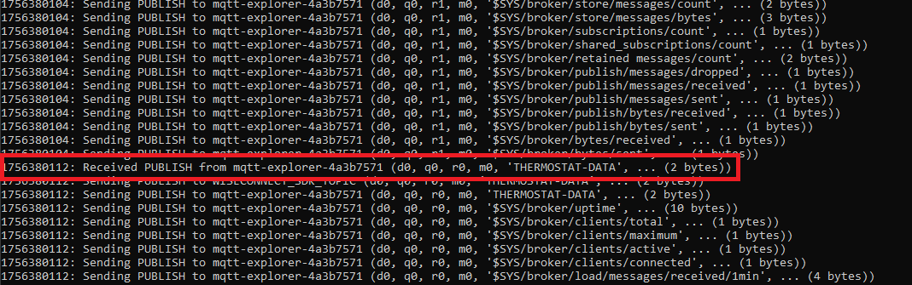**

- SiWx91x unsubscribes to the topic that it has subscribed to after receiving the message that was published by MQTT Explorer running on Windows PC2.

- Once unsubscription is successful, SiWx91x disconnects from the broker.

   **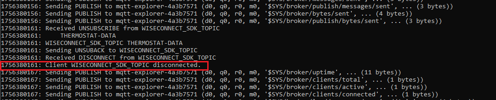**

### Procedure for Executing the Application when Enabled with SSL (LwIP)

> **Note**: For LwIP stack with mbedTLS TLS support, see [LwIP TLS Procedure](LWIP_TLS_PROCEDURE.md) for detailed instructions specific to the LwIP implementation.

1. Install MQTT broker in Windows PC1 which is connected to the access point through LAN.

2. Update the `mosquitto.conf` file with the proper file paths, in which the certificates are available in the mosquitto.conf file.

3. Also, add `certs` folder to the mosquitto broker folder.

4. Execute the following command in MQTT server installed folder. (Ex:  `C:\Program Files\mosquitto>mosquitto.exe -c mosquitto.conf -v`)

   `mosquitto.exe -c mosquitto.conf -v`  
  
   **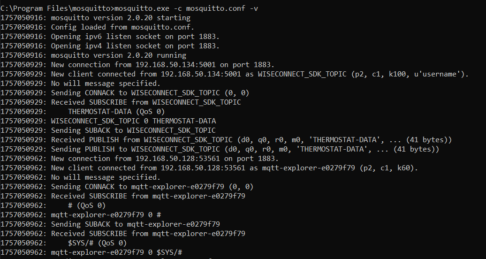**

5. If you see any error - Unsupported tls_version **tlsv1**, just comment the **tls_version tlsv1** in `mosquitto.conf` file.

>**Note:**
> Multiple MQTT client instances can be created.

- If mosquitto is not allowing external connections to the broker, add the following lines in the `mosquitto.conf` file:

   ```c
   listener 1883
   allow_anonymous true
   ```

- For SSL support, add the following configuration in the `mosquitto.conf`file.

  ```c
   listener 8883
   allow_anonymous true
   #Paths to SSL / TLS certificates
   certfile \resources\certificates\server.crt
   keyfile \resources\certificates\server.key
   cafile \resources\certificates\ca.crt
   require_certificate false
  ```

- To use a different configuration file for the mosquitto broker, use the following command:
  `mosquitto -v -p 1883 -c config/mosquitto.conf`
  where **config** is the sub-folder and **mosquitto.conf** is a different config file than the default.

## Additional Information

### Steps to set up MQTT server

1. To run MQTT broker on port 1883 in Windows PC1, open the command prompt and go to the MQTT installed folder (Ex: `C:\Program Files\mosquitto`) and run the following command:

   ```c
   mosquitto.exe -c mosquitto.conf -v
   ```

   ****

2. Open MQTT Explorer in Windows PC2 and delete the existing connections, if any, and click **Advanced** as shown in the following image.

   ****

3. Delete the existing topic names if any. Enter the desired **TOPIC_NAME** in the topic field and click **ADD**. The desired topic name then can be observed in the topic list. Click **BACK** as shown in the image below.

   ****

4. Connect to MQTT broker by entering the IP address and port number of Windows PC1 in HOST and PORT fields in MQTT Explorer respectively, and click **CONNECT**. If you are running your MQTT broker on the same PC, configure the settings as shown in the following image.

   **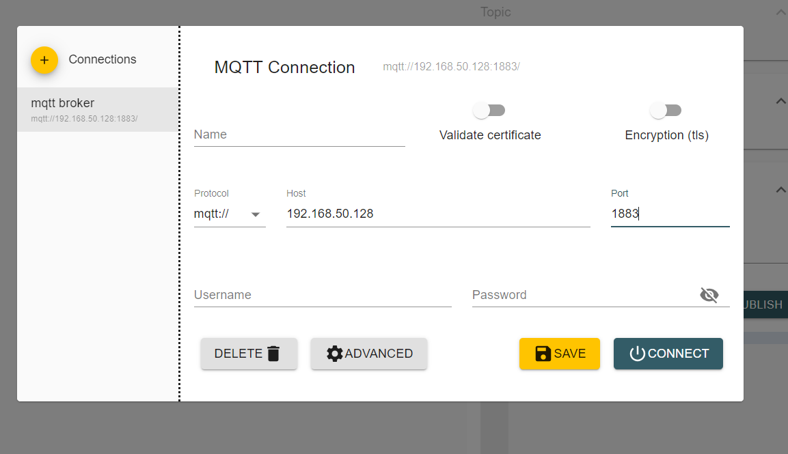**

5. If SSL is enabled, enable **Encryption (TLS)** in MQTT Explorer. Then, go to **Advanced** > **Certificates**, click on **Server certificate (CA)**, and add the CA certificate (`ca.crt`) from the `resources\certificates` directory. Refer to the following images for step-by-step guidance.

   **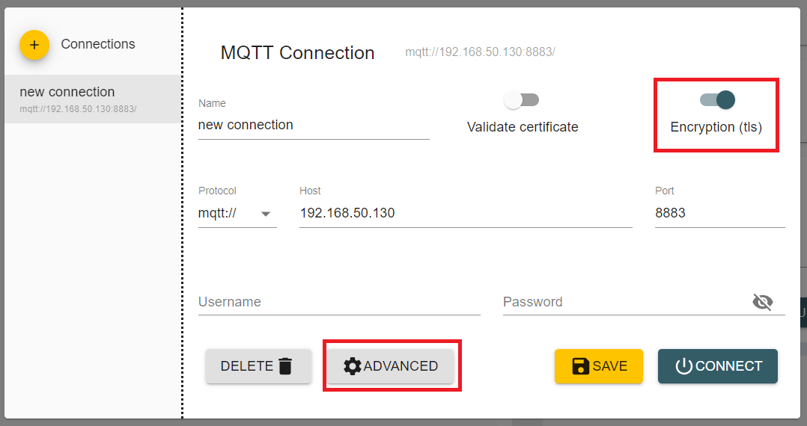**

   **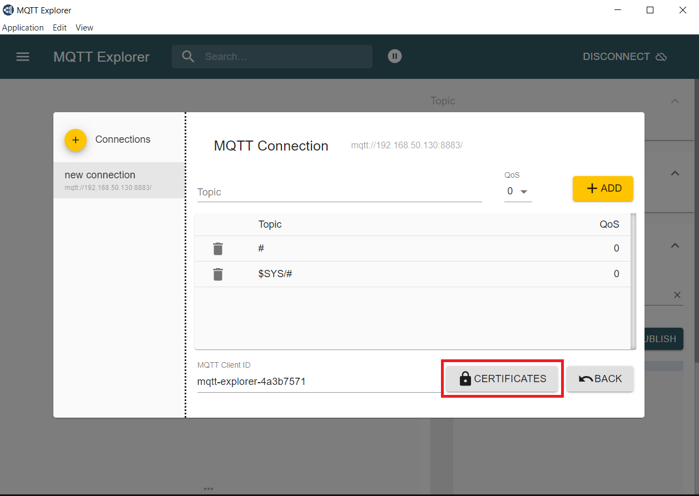**

   **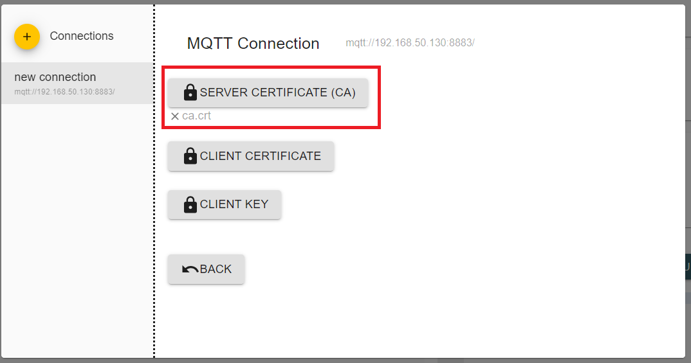**

## Procedure to configure for IPv6

- Define the following macros in the application to enable IPv6 support:

   - `SLI_SI91X_ENABLE_IPV6`
   - `LWIP_IPV6`

   **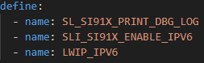**

- Use the Mosquitto command line to test the example because the MQTT Explorer application does not support IPv6.

- The following commands can be used to test the MQTT client with IPv6 addresses using the Mosquitto command line:

1. `mosquitto_sub -h 2409:40f2:2044:d93c:f088:79d:19aa:c1c3 -p 1883 -t THERMOSTAT-DATA`

     This command runs the Mosquitto client in subscriber mode.  It will connect to the MQTT broker and listen for messages published to a specific topic.

     - `-h 2409:40f2:2044:d93c:f088:79d:19aa:c1c3`: Specifies the hostname or IP address of the MQTT broker to connect to. In this example, it's an IPv6 address.
     - `-p 1883`: Specifies the network port that the MQTT broker is listening on. The default MQTT port is 1883.
     - `-t THERMOSTAT-DATA`: Specifies the topic that the client should subscribe to. The client will receive any messages published to this topic.

2. `mosquitto_pub -h 2409:40f2:2044:d93c:f088:79d:19aa:c1c3 -p 1883 -t THERMOSTAT-DATA -m "hello"`

     This command runs the Mosquitto client in publisher mode. It connects to the MQTT broker, publishes a message to a specific topic, and then automatically disconnects and closes the client.

     - `-h 2409:40f2:2044:d93c:f088:79d:19aa:c1c3`: Like the `-h` option for `mosquitto_sub`, this specifies the hostname or IP address of the MQTT broker to connect to.
     - `-p 1883`: This is the same as the `-p` option for `mosquitto_sub`, specifying the network port of the MQTT broker.
     - `-t THERMOSTAT-DATA`: Specifies the topic that the client should publish the message to.
     - `-m "hello"`: Specifies the message to publish. In this example, the message is the string "hello".

>**Notes:**
>
> To generate the certificates locally, run the following commands:
>
> 1. Generate CA private key `openssl genrsa -out ca.key 2048`
> 2. Create CA certificate `openssl req -new -x509 -days 365 -key ca.key -out ca.crt`
> 3. Generate server private key `openssl genrsa -out server.key 2048`
> 4. Create server certificate signing request `openssl req -new -key server.key -out server.csr`
> 5. Sign server certificate with CA `openssl x509 -req -in server.csr -CA ca.crt -CAkey ca.key -CAcreateserial -out server.crt`
