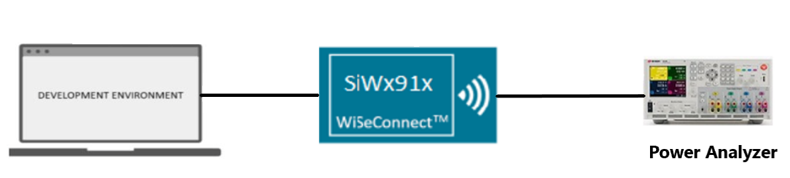
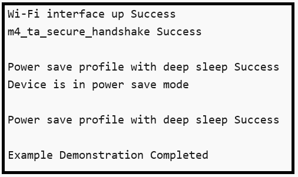

# Wi-Fi - Powersave Deep Sleep

## Table of Contents

- [Purpose/Scope](#purposescope)
- [Prerequisites/Setup Requirements](#prerequisitessetup-requirements)
  - [Hardware Requirements](#hardware-requirements)
  - [Software Requirements](#software-requirements)
  - [Set up Diagram](#set-up-diagram)
- [Getting Started](#getting-started)
- [Application Build Environment](#application-build-environment)
- [Test the Application](#test-the-application)
- [Application Output](#application-output)

## Purpose/Scope

This application demonstrates how to enable power save deep sleep profile with SiWx91x. This application enables power save profile mode in STANDBY_POWER_SAVE_WITH_RAM_RETENTION and then wait in a scheduler for some time. Once it will come out of delay, it will start running in HIGH performance mode.

## Prerequisites/Setup Requirements

### Hardware Requirements

- Windows PC
- Wireless Access Point
- **SoC Mode**:
  - Standalone
    - BRD4002A Wireless pro kit mainboard [SI-MB4002A]
    - Radio Boards 
  	  - BRD4338A [SiWx917-RB4338A]
      - BRD4339B [SiWx917-RB4339B]
  	  - BRD4340A [SiWx917-RB4340A]
  - Kits
  	- SiWx917 Pro Kit [Si917-PK6031A](https://www.silabs.com/development-tools/wireless/wi-fi/siwx917-pro-kit?tab=overview)
  	- SiWx917 Pro Kit [Si917-PK6032A]
  	
- **NCP Mode**:
  - Standalone
    - BRD4002A Wireless pro kit mainboard [SI-MB4002A]
    - EFR32xG24 Wireless 2.4 GHz +10 dBm Radio Board [xG24-RB4186C](https://www.silabs.com/development-tools/wireless/xg24-rb4186c-efr32xg24-wireless-gecko-radio-board?tab=overview)
    - NCP EFR Expansion Kit with NCP Radio board (BRD4346A + BRD8045A) [SiWx917-EB4346A]
  - Kits
  	- EFR32xG24 Pro Kit +10 dBm [xG24-PK6009A](https://www.silabs.com/development-tools/wireless/efr32xg24-pro-kit-10-dbm?tab=overview)

### Software Requirements

- Simplicity Studio

### Set up Diagram

  

## Getting Started

Refer to the instructions [here](https://docs.silabs.com/wiseconnect/latest/wiseconnect-getting-started/) to:

- Install Studio and WiSeConnect 3 extension
- Connect your device to the computer
- Upgrade your connectivity firmware
- Create a Studio project

## Application Build Environment

The application can be configured to suit user requirements and development environment. Read through the following sections and make any changes needed.

- In the Project explorer pane, expand the **config** folder and open the **sl_net_default_values.h** file. Configure the following parameters to enable your Silicon Labs Wi-Fi device to connect to your Wi-Fi network.

- STA instance related parameters

  - DEFAULT_WIFI_CLIENT_PROFILE_SSID refers to the name with which Wi-Fi network that shall be advertised and Si91X module is connected to it.
 
   ```c
   #define DEFAULT_WIFI_CLIENT_PROFILE_SSID               "YOUR_AP_SSID"      
   ```

  - DEFAULT_WIFI_CLIENT_CREDENTIAL refers to the secret key if the Access point is configured in WPA-PSK/WPA2-PSK security modes.

   ```c
   #define DEFAULT_WIFI_CLIENT_CREDENTIAL                 "YOUR_AP_PASSPHRASE" 
   ```

  - DEFAULT_WIFI_CLIENT_SECURITY_TYPE refers to the security type if the Access point is configured in WPA/WPA2 or mixed security modes.

   ```c
   #define DEFAULT_WIFI_CLIENT_SECURITY_TYPE SL_WIFI_WPA2 
   ```
  
- Other STA instance configurations can be modified if required in `default_wifi_client_profile` configuration structure.

- `sl_wifi_performance_profile_t` in **app.c** can be configured as per requirements to test Deep-Sleep Powersave application.

**Soc Mode**:

The M4 processor is set in sleep mode. The M4 processor can be woken in several ways as mentioned below:

- ALARM timer-based - In this method, an ALARM timer is run that wakes the M4 processor up periodically every **ALARM_PERIODIC_TIME** time period.
  - We can enable the ALARM timer-wakeup by adding the preprocessor macro "SL_SI91X_MCU_ALARM_BASED_WAKEUP" for the example.
  - In the Project explorer pane, expand as follows wiseconnect3_sdk_xxx > components > device > silabs > si91x > mcu > drivers > peripheral_drivers > src folder and open sl_si91x_m4_ps.c file. Configure **ALARM_PERIODIC_TIME**, in seconds, in sl_si91x_m4_ps.c
- Button press-based (GPIO) - In this method, the M4 processor wakes up upon pressing a button (BTN0).
  - We can enable the Button press-based wakeup by adding the preprocessor macro "SL_SI91X_MCU_BUTTON_BASED_WAKEUP" for the example.
- Wireless-based - When an RX packet is to be received by the TA, the M4 processor is woken up.
  - We can enable the Wireless-wakeup by adding the preprocessor macro "SL_SI91X_MCU_WIRELESS_BASED_WAKEUP" for the example.

## Test the Application

Refer to the instructions [here](https://docs.silabs.com/wiseconnect/latest/wiseconnect-getting-started/) to:

- Build the application.
- Flash, run and debug the application.

## Application Output

  
