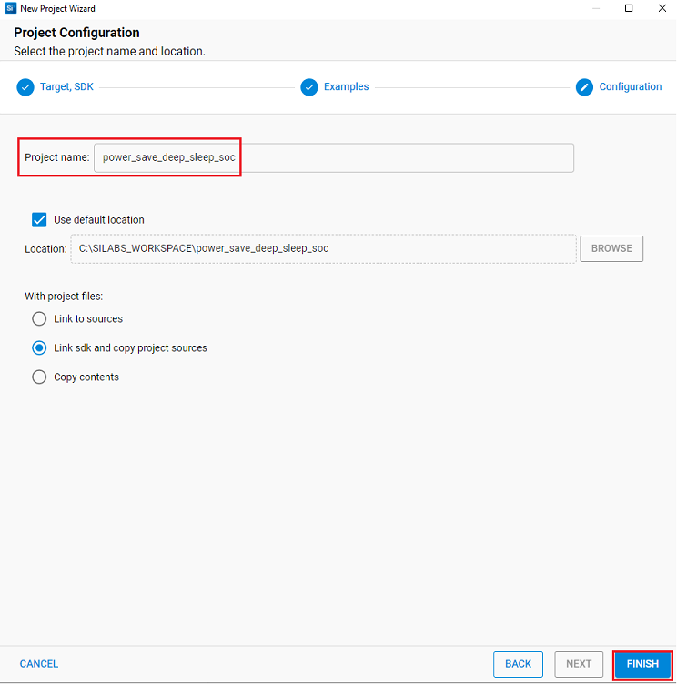
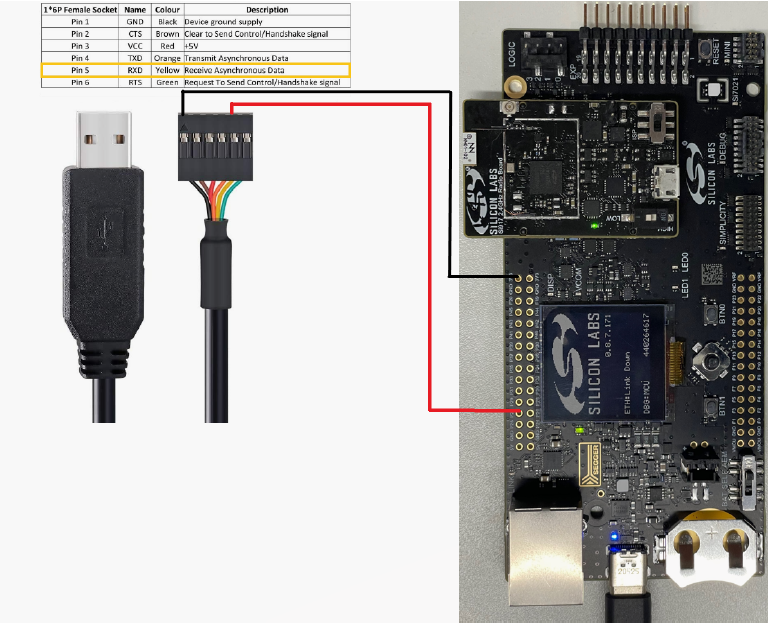

# Power Save Deep Sleep

## 1 Purpose/Scope

This application demonstrates how to enable power save deep sleep profile with SiWx91x. This application enables power save profile mode 8 and then wait in a scheduler for some time. Once it will come out of delay, it will start running in HIGH performance mode.

## 2 Prerequisites/Setup Requirements

### 2.1 Hardware Requirements

- Windows PC
- Wireless Access Point
- **SoC Mode**:
  - Silicon Labs [BRD4325A, BRD4325B, BRD4325C, BRD4325G, BRD4388A](https://www.silabs.com/)
- **NCP Mode**:
  - Silicon Labs [BRD4180B](https://www.silabs.com/); **AND**
  - Host MCU Eval Kit. This example has been tested with:
    - Silicon Labs [WSTK + EFR32MG21](https://www.silabs.com/development-tools/wireless/efr32xg21-bluetooth-starter-kit)

### 2.2 Software Requirements

- Simplicity Studio IDE
  - Download the [Simplicity Studio IDE](https://www.silabs.com/developers/simplicity-studio).
  - Follow the [Simplicity Studio user guide](https://docs.silabs.com/simplicity-studio-5-users-guide/1.1.0/ss-5-users-guide-getting-started/install-ss-5-and-software#install-ssv5) to install Simplicity Studio IDE.

### 2.3 Set up Diagram

#### SoC Mode

Set up diagram for SoC mode:


#### NCP Mode

Set up diagram for NCP mode:


Follow the [Getting Started with Wiseconnect3 SDK](https://docs.silabs.com/wiseconnect/latest/wiseconnect-getting-started/) guide to set up the hardware connections and Simplicity Studio IDE.

## 3 Project Environment

1. Ensure the SiWx91x loaded with the latest firmware following the [Upgrade Si91x firmware](https://docs.silabs.com/wiseconnect/latest/wiseconnect-getting-started/getting-started-with-soc-mode#upgrade-si-wx91x-connectivity-firmware). The firmware file is located at `<WiSeConnect3>/connectivity_firmware/`.

2. Ensure the EFx32 and SiWx91x set up is connected to your PC.

3. Ensure the latest Gecko SDK along with the extension WiSeConnect3 is added to Simplicity Studio.

### 3.1 Creating the project

#### 3.1.1 SoC mode

- Connect your board. The Si917 compatible SoC boards are **BRD4325A, BRD4325B, BRD4325C, BRD4325G**.
- Studio should detect your board. Your board will be shown here.

  ****

- Go to the 'EXAMPLE PROJECT & DEMOS' tab and select Wi-Fi - Powersave Deep Sleep

  ****

- Give the desired name to your project and click on **Finish**.

  ****

#### 3.1.2 NCP mode

- Connect your board. The supported NCP boards are: **BRD4180B**
- The EFR32 board will be detected under **Debug Adapters** pane as shown below.

  ****

- Go to the 'EXAMPLE PROJECT & DEMOS' tab and select Wi-Fi - NCP Deep-Sleep Powersave

  ****

- Give the desired name to your project and click on **Finish**

   ****

### 3.3 Set up for application prints

Before setting up Tera Term, do the following for SoC mode.

**SoC mode**:
You can use either of the below USB to UART converters for application prints.

1. Set up using USB to UART converter board.

   - Connect Tx (Pin-6) to P27 on WSTK
   - Connect GND (Pin 8 or 10) to GND on WSTK

      

2. Set up using USB to UART converter cable.

   - Connect RX (Pin 5) of TTL convertor to P27 on WSTK
   - Connect GND (Pin1) of TTL convertor to GND on WSTK

      

**Tera term set up - for NCP and SoC modes**

1. Open the Tera Term tool.
   - For SoC mode, choose the serial port to which USB to UART converter is connected and click on **OK**.

     ****

   - For NCP mode, choose the J-Link port and click on **OK**.

     ****

2. Navigate to the Setup → Serial port and update the baud rate to **115200** and click on **OK**.

    ****

    ****

The serial port is now connected.

## 4 Application Build Environment

### 4.1 Configure the Application

The application can be configured to suit user requirements and development environment. Read through the following sections and make any changes needed.

#### 4.1.1 In the Project explorer pane, expand the **resources\defaults** folder and open the **sl_net_default_values.h** file. Configure the following parameters to enable your Silicon Labs Wi-Fi device to connect to your Wi-Fi network

- **STA instance related parameters**

- DEFAULT_WIFI_CLIENT_PROFILE_SSID refers to the name with which the SiWx91x SoftAP's Wi-Fi network shall be advertised.

  ```c
  #define DEFAULT_WIFI_CLIENT_PROFILE_SSID               "YOUR_AP_SSID"      
  ```

- DEFAULT_WIFI_CLIENT_CREDENTIAL refers to the secret key if the Access point is configured in WPA-PSK/WPA2-PSK security modes.

  ```c
  #define DEFAULT_WIFI_CLIENT_CREDENTIAL                 "YOUR_AP_PASSPHRASE" 
  ```

- Other STA instance configurations can be modified if required in `default_wifi_client_profile` configuration structure.

#### 4.1.2 `sl_wifi_performance_profile_t` in **app.c** can be configured as per requirements to test Deep-Sleep Powersave application

### 4.2 Build the Application

#### - SoC Mode : Build as powersave_deep_sleep Example

  ****

#### - NCP Mode

### 4.3 Run and Test the application

1. Once the build was successful, right click on project and select Debug As → Silicon Labs ARM Program to program the device as shown in below image.

    ****

2. As soon as the debug process is completed, the application control branches to the main().

3. Go to the J-link Silicon Labs console pane to observe the debug prints in the Serial 1 tab.

4. Click on the **Resume** icon in the Simplicity Studio IDE toolbar to run the application.

    ****

### 4.4 Application Output

- SoC mode:

  

- NCP mode:

  
