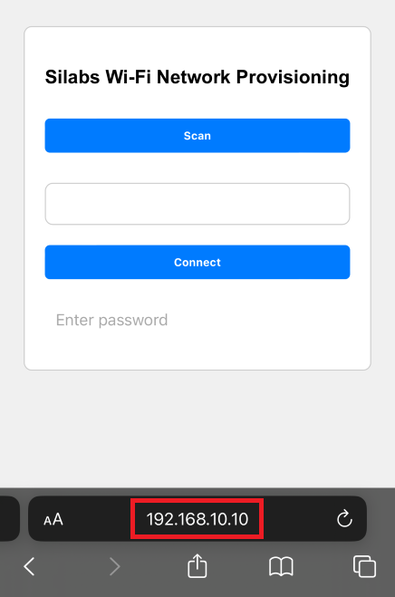

# Wi-Fi Provisioning via Access Point

This example illustrates Wi-Fi provisioning using Access Point (AP) mode. It demonstrates how to display available Wi-Fi networks on an HTTP server and allows the device to connect to a third-party Access Point (AP) via the STA instance. Users can view and select networks from the HTTP interface, enabling straightforward connection to the chosen network.

## Table of Contents

- [Wi-Fi Provisioning via Access Point](#wi-fi-provisioning-via-access-point)
	- [Table of Contents](#table-of-contents)
	- [Purpose/Scope](#purposescope)
	- [Prerequisites/Setup Requirements](#prerequisitessetup-requirements)
		- [Hardware Requirements](#hardware-requirements)
		- [Software Requirements](#software-requirements)
		- [Setup Diagram](#setup-diagram)
	- [Getting Started](#getting-started)
	- [Application Build Environment](#application-build-environment)
	- [Run the Application](#run-the-application)
		- [Connecting to a Wi-Fi Network](#connecting-to-a-wi-fi-network)

## Purpose/Scope

The app starts in Wi-Fi access point (AP) mode, creating a local network that users can connect to with their device. Once connected, users access a local web server hosted by the SiWx91x module through their browser. This web server facilitates the provisioning process by allowing users to scan for available Wi-Fi networks, select their desired network, and enter the network credentials.

After successfully provisioning, the app transitions from AP mode to Wi-Fi Station mode. In Station mode, the SiWx91x module connects to the selected Wi-Fi network. Users can then continue to interact with the device via their browser to monitor or control the device's functionalities.

All device activities can be observed on the serial terminal prints. You may use a readily available terminal program such as [Tera Term](https://teratermproject.github.io/index-en.html) or [PuTTY](https://www.putty.org/).

## Prerequisites/Setup Requirements

 Before running the application, you will need the following things for setup.

### Hardware Requirements

- Windows PC
- Wireless Access Point
- **SoC Mode**:
  - Silicon Labs [BRD4388A](https://www.silabs.com/)
- NCP Mode:
  - Standalone
    - BRD4002A Wireless Pro Kit Mainboard [SI-MB4002A]
    - EFR32xG24 Wireless 2.4 GHz +10 dBm Radio Board [xG24-RB4186C](https://www.silabs.com/development-tools/wireless/xg24-rb4186c-efr32xg24-wireless-gecko-radio-board?tab=overview)
    - NCP Expansion Kit with NCP Radio Boards
      - (BRD4346A + BRD8045A) [SiWx917-EB4346A]
      - (BRD4357A + BRD8045A) [SiWx917-EB4357A]

### Software Requirements

- [Simplicity Studio](https://www.silabs.com/developers/simplicity-studio)


### Setup Diagram


## Getting Started

Refer to the instructions [here](https://docs.silabs.com/wiseconnect/latest/wiseconnect-getting-started/) to:

- [Install Simplicity Studio](https://docs.silabs.com/wiseconnect/latest/wiseconnect-developers-guide-developing-for-silabs-hosts/#install-simplicity-studio)
- [Install WiSeConnect extension](https://docs.silabs.com/wiseconnect/latest/wiseconnect-developers-guide-developing-for-silabs-hosts/#install-the-wi-se-connect-extension)
- [Connect your device to the computer](https://docs.silabs.com/wiseconnect/latest/wiseconnect-developers-guide-developing-for-silabs-hosts/#connect-si-wx91x-to-computer)
- [Upgrade your connectivity firmware ](https://docs.silabs.com/wiseconnect/latest/wiseconnect-developers-guide-developing-for-silabs-hosts/#update-si-wx91x-connectivity-firmware)
- [Create a Studio project ](https://docs.silabs.com/wiseconnect/latest/wiseconnect-developers-guide-developing-for-silabs-hosts/#create-a-project)

## Application Build Environment

The application can be configured to suit your requirements and development environment. Read through the following sections and make any changes needed.

1. In the Project explorer pane, expand the **config** folder and open the **sl_net_default_values.h** file.
- **SiWx91x Provisioning AP instance related parameters**

	- DEFAULT_WIFI_AP_PROFILE_SSID refers to the SSID of the SiWx91x Provisioning AP that would be created.

  	```c
  	#define DEFAULT_WIFI_AP_PROFILE_SSID                   "MY_AP_SSID"
  	```

	- DEFAULT_WIFI_AP_CREDENTIAL refers to the secret key of the SiWx91x Provisioning AP that would be created.

  	```c
  	#define DEFAULT_WIFI_AP_CREDENTIAL                     "MY_AP_PASSPHRASE"
  	```

	-  HTTP_SERVER_PORT refers to the port number of the SiWx91x Provisioning AP's HTTP server that would be created.

  	```c
  	#define HTTP_SERVER_PORT 80
  	```

> **Note**: For recommended settings, please refer the [recommendations guide](https://docs.silabs.com/wiseconnect/latest/wiseconnect-developers-guide-prog-recommended-settings/).

## Run the Application

Refer to the instructions [here](https://docs.silabs.com/wiseconnect/latest/wiseconnect-getting-started/) to:

- Build the application.
- Flash, run, and debug the application.

**Step 1**: The SiWx91x module starts in AP mode. All device activities can be observed on the serial terminal prints.

**Step 2**: Connect your laptop/mobile to the SiWx91x module's AP. The default network name and password are `MY_AP_SSID` and `MY_AP_PASSPHRASE`, respectively.

**Step 3**: Launch the browser 

### Connecting to a Wi-Fi Network


**Step 1** : Make sure that your Laptop/mobile device is connected to the SiWx91x module's AP network.

**Step 2** : Enter `192.168.10.10` on your browser to open the provisioning webpage.



**Step 3** : Click `Scan` to scan for available networks. 


**Step 4** : Select your desired network, enter password, and then click `Connect`.


**Step 5** : The SiWx91x module switches to Wi-Fi Station mode and connects to the selected Wi-Fi network. 


