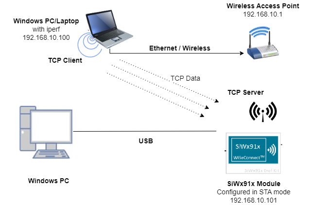

# Wi-Fi - Select App

## Table of Contents

- [Purpose/Scope](#purposescope)
- [Prerequisites/Setup Requirements](#prerequisitessetup-requirements)
  - [Hardware Requirements](#hardware-requirements)
  - [Software Requirements](#software-requirements)
  - [Setup Diagram](#setup-diagram)
- [Getting Started](#getting-started)
- [Application Build Environment](#application-build-environment)
- [Test the Application](#test-the-application)

## Purpose/Scope

This application demonstrates how to create the sockets in SiWx91x and monitor sockets for a certain activity to occur. The Select App provides info about whether the data is to be read on the socket or not.

## Prerequisites/Setup Requirements

### Hardware Requirements

- Windows PC
- SoC Mode:
  - Silicon Labs [BRD4388A](https://www.silabs.com/)
- NCP Mode:
  - Silicon Labs [BRD4180B](https://www.silabs.com/)
  - Host MCU Eval Kit. This example has been tested with:
    - Silicon Labs [WSTK + EFR32MG21](https://www.silabs.com/development-tools/wireless/efr32xg21-bluetooth-starter-kit)
  - Interface and Host MCU Supported
    - SPI - EFR32 

### Software Requirements

- Simplicity Studio

### Setup Diagram



**NOTE**:

- The Host MCU platform (EFR32MG21) and the SiWx91x interact with each other through the SPI interface.

## Getting Started

Refer to the instructions [here](https://docs.silabs.com/wiseconnect/latest/wiseconnect-getting-started/) to:

- [Install Simplicity Studio](https://docs.silabs.com/wiseconnect/latest/wiseconnect-developers-guide-developing-for-silabs-hosts/#install-simplicity-studio)
- [Install WiSeConnect 3 extension](https://docs.silabs.com/wiseconnect/latest/wiseconnect-developers-guide-developing-for-silabs-hosts/#install-the-wi-se-connect-3-extension)
- [Connect your device to the computer](https://docs.silabs.com/wiseconnect/latest/wiseconnect-developers-guide-developing-for-silabs-hosts/#connect-si-wx91x-to-computer)
- [Upgrade your connectivity firmware ](https://docs.silabs.com/wiseconnect/latest/wiseconnect-developers-guide-developing-for-silabs-hosts/#update-si-wx91x-connectivity-firmware)
- [Create a Studio project ](https://docs.silabs.com/wiseconnect/latest/wiseconnect-developers-guide-developing-for-silabs-hosts/#create-a-project)

For details on the project folder structure, see the [WiSeConnect Examples](https://docs.silabs.com/wiseconnect/latest/wiseconnect-examples/#example-folder-structure) page.

## Application Build Environment

The application can be configured to suit user requirements and development environment. Read through the following sections and make any changes needed.

In the Project explorer pane, expand the **config** folder and open the ``sl_net_default_values.h`` file. Configure the following parameters to enable your Silicon Labs Wi-Fi device to connect to your Wi-Fi network.

- STA instance related parameters

	- DEFAULT_WIFI_CLIENT_PROFILE_SSID refers to the name with which the Wi-Fi network shall be advertised and Si91X module is connected to it.
	
  	```c
  	#define DEFAULT_WIFI_CLIENT_PROFILE_SSID               "YOUR_AP_SSID"      
  	```

	- DEFAULT_WIFI_CLIENT_CREDENTIAL refers to the secret key if the access point is configured in WPA-PSK/WPA2-PSK security modes.

  	```c
  	#define DEFAULT_WIFI_CLIENT_CREDENTIAL                 "YOUR_AP_PASSPHRASE" 
  	```

	- DEFAULT_WIFI_CLIENT_SECURITY_TYPE refers to the security type if the access point is configured in WPA/WPA2 or mixed security modes.

  	```c
  	#define DEFAULT_WIFI_CLIENT_SECURITY_TYPE SL_WIFI_WPA2 
  	```

> Note: 
> You can configure default region-specific regulatory information using `sl_wifi_region_db_config.h`.
 
- Other STA instance configurations can be modified if required in `default_wifi_client_profile` configuration structure.

  - RECV_BUFFER_SIZE refers to size of buffer used to receive the data sent by the remote client.

    ```c
        #define RECV_BUFFER_SIZE                                500
     ```

  - DEVICE_PORT refers to port on which the server would be listening on.

    ```c
      #define DEVICE_PORT                                       5001
    ```

  - BACKLOG refers to the maximum number of clients the server can accept.

    ```c
      #define BACKLOG                                          1
    ```

  - SELECT_TIME_OUT refers to time (in seconds) Select is supposed to wait before it throws a time out error. If the value is set to 0, the API would wait for an indefinite amount of time.

    ```C
     #define SELECT_TIME_OUT                                   30
    ```
    
## Test the Application

Refer to the instructions [here](https://docs.silabs.com/wiseconnect/latest/wiseconnect-getting-started/) to:

- Build the application.

- Flash, run, and debug the application.

- After successful connection with the access point, the program waits for the client to get connected.

- Open the TCP client from WindowsPC2 and connect to the TCP server opened on the device on port number DEVICE_PORT.
   The iPerf command to start the TCP client is:

  >  **Note**
  `C:\> iperf.exe -c <Module_IP> -p <module_PORT> -i 1 -t <time interval in sec>`
  For example ...
 `C:\> iperf.exe -c 192.168.0.100 -p 5001 -i 1 -t 30`  

  

- Select provides the response about whether the data is to be read on the socket or not.

- If data is to be received on the socket, then the receive function is called on the socket.

   
