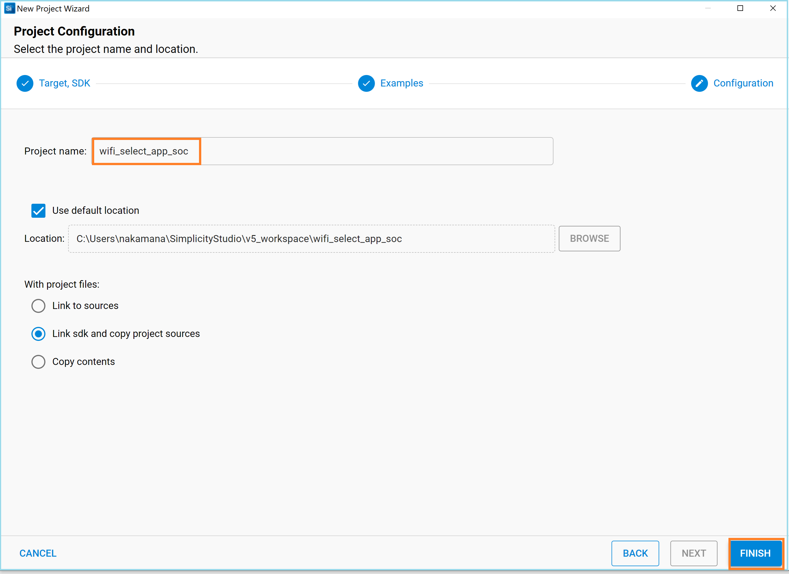

# Socket Select

## 1 Purpose/Scope

This application demonstrates how to create the sockets in SiWx91x and monitor sockets for a certain activity to occur. Select provides the info about the socket whether the data is to be read on the socket or not.

## 2 Prerequisites/Setup Requirements

### 2.1 Hardware Requirements

- A Windows PC.
- **SoC Mode**: 
  - Silicon Labs [BRD4325A,BRD4325B, BRD4325G](https://www.silabs.com/)
- **NCP Mode**:
  - Silicon Labs [(BRD4180A, BRD4280B)](https://www.silabs.com/) **AND**
  - Host MCU Eval Kit. This example has been tested with:
    - Silicon Labs [WSTK + EFR32MG21](https://www.silabs.com/development-tools/wireless/efr32xg21-bluetooth-starter-kit)

### 2.2 Software Requirements

- Simplicity Studio IDE 

  - Download the latest [Simplicity Studio IDE](https://www.silabs.com/developers/simplicity-studio)
  - Follow the [Simplicity Studio user guide](https://docs.silabs.com/simplicity-studio-5-users-guide/1.1.0/ss-5-users-guide-getting-started/install-ss-5-and-software#install-ssv5) to install Simplicity Studio IDE

### 2.3 Setup Diagram

#### SoC Mode  


Follow the [Getting Started with SiWx91x SoC](https://docs.silabs.com/) guide to set up the hardware connections and Simplicity Studio IDE.

#### NCP Mode  


Follow the [Getting Started with EFx32](https://docs.silabs.com/rs9116-wiseconnect/latest/wifibt-wc-getting-started-with-efx32/) guide to setup the hardware connections and Simplicity Studio IDE.

**NOTE**: 

- The Host MCU platform (EFR32MG21) and the SiWx91x interact with each other through the SPI interface. 

## 3. Project Environment

- Ensure the SiWx91x loaded with the latest firmware following the [Getting started with a PC](https://docs.silabs.com/rs9116/latest/wiseconnect-getting-started)

#### 3.1.1 SoC mode

- In the Simplicity Studio IDE, the SiWx91x SoC board will be detected under **Debug Adapters** pane as shown below.

    ****

- Ensure the latest Gecko SDK along with the  WiSeConnect3 extension is added to Simplicity Studio.

- Studio should detect your board. Your board will be shown here. Click on the board detected and go to **EXAMPLE PROJECTS & DEMOS** section.

- Filter for Wi-Fi examples from the Gecko SDK added. For this, check the *Wi-Fi* checkbox under **Wireless Technology** 

    ****

- Click 'Create'. The "New Project Wizard" window appears. Click 'Finish'

    ****

#### 3.1.2 NCP mode

- In the Simplicity Studio IDE, the EFR32 board will be detected under **Debug Adapters** pane as shown below.

  ****

- Ensure the latest Gecko SDK along with the  WiSeConnect3 extension is added to  Simplicity Studio.

- Go to the 'EXAMPLE PROJECT & DEMOS' tab and select Wi-Fi - NCP Access Point example.

  ****

- Click 'Create'. The "New Project Wizard" window appears. Click 'Finish'

   ****

### 3.2 Set up for application prints

#### 3.2.1 SoC mode

  You can use either of the below USB to UART converters for application prints.

1. Set up using USB to UART converter board.

   - Connect Tx (Pin-6) to P27 on WSTK
   - Connect GND (Pin 8 or 10) to GND on WSTK

    ****

2. Set up using USB to UART converter cable.

   - Connect RX (Pin 5) of TTL convertor to P27 on WSTK
   - Connect GND (Pin1) of TTL convertor to GND on WSTK

    ****

**Tera Term set up - for NCP and SoC modes**

1. Open the Tera Term tool.

 - For SoC mode, choose the serial port to which USB to UART converter is connected and click on **OK**. 

      ****

 - For NCP mode, choose the J-Link port and click on **OK**.
    
      ****

2. Navigate to the Setup → Serial port and update the baud rate to **115200** and click on **OK**.

 ****

 ****

## 4 Application Build Environment

The application can be configured to suit your requirements and development environment. 

## 4 Application Build Environment

### 4.1 Configure the application

The application can be configured to suit user requirements and development environment. Read through the following sections and make any changes needed.

#### 4.1.1 In the Project explorer pane, expand the **config** folder and open the **sl_net_default_values.h** file. Configure the following parameters to enable your Silicon Labs Wi-Fi device to connect to your Wi-Fi network

- **STA instance related parameters**

- DEFAULT_WIFI_CLIENT_PROFILE_SSID refers to the name with which the SiWx91x SoftAP's Wi-Fi network shall be advertised.

  ```c
  #define DEFAULT_WIFI_CLIENT_PROFILE_SSID               "YOUR_AP_SSID"      
  ```

- DEFAULT_WIFI_CLIENT_CREDENTIAL refers to the secret key if the Access point is configured in WPA-PSK/WPA2-PSK security modes.

  ```c 
  #define DEFAULT_WIFI_CLIENT_CREDENTIAL                 "YOUR_AP_PASSPHRASE" 
  ```

- Other STA instance configurations can be modified if required in `default_wifi_client_profile` configuration structure. 

  - RECV_BUFFER_SIZE refers to size of buffer used to receive the data sent by the remote client.

    ```c
        #define RECV_BUFFER_SIZE                                500
     ```

  - DEVICE_PORT refers to port on which the server would be listening on.

    ```c
      #define DEVICE_PORT                                       5001
    ```

  - BACKLOG refers to maximum number of client server can accept.

    ```c
      #define BACKLOG                                          1
    ```

  - SELECT_TIME_OUT refers to time(In seconds) select is supposed to wait before it time out error is thrown. If values is set to 0, the API would wait for indefinite amount of time.

    ```C
     #define SELECT_TIME_OUT                                   30
    ```

### 4.2 Build the application

- SoC mode: Build as Access Point Example

  ****

- NCP mode: 

### 4.3 Run and Test the application

- Once the build was successful, right click on project and click on Debug As->Silicon Labs ARM Program as shown in below image.

- After successful connection with the access point, the program waits for client to get connected.

- Open TCP client from WindowsPC2 and connect to TCP server opened on the device on port number DEVICE_PORT. 
   The Iperf command to start the TCP client is: 

 > `C:\> iperf.exe -c <Module_IP> -p <module_PORT> -i 1 -t <time interval in sec>`
 >
 > For example ...
 >
 > `C:\> iperf.exe -c 192.168.0.100 -p 5001 -i 1 -t 30`  


- Select provides the response about the socket whether the data is to be read on the socket or not.

- If data is to be received on the socket, then the receive function is called on the socket.

  - SoC
    
    ****

  - NCP

    ****

### 4.4 Application Output

**Application Prints - SoC mode**:

   ****

**Application Prints - NCP mode**:

   ****
