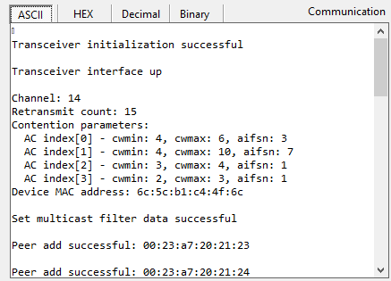
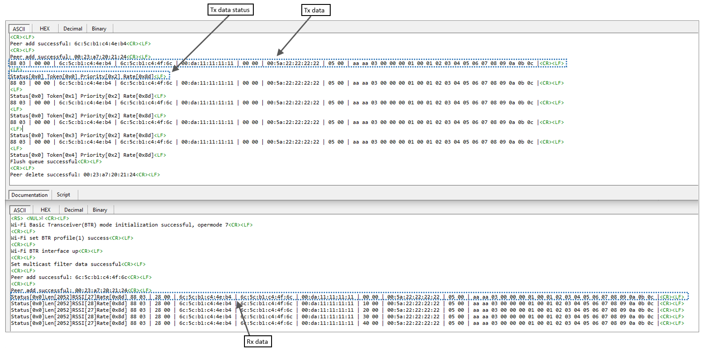

#Wi - Fi Transceiver application

## Table of Contents

- [Purpose/Scope](#purposescope)
- [Prerequisites/Setup Requirements](#prerequisitessetup-requirements)
  - [Hardware Requirements](#hardware-requirements)
  - [Software Requirements](#software-requirements)
  - [Setup Diagram](#setup-diagram)
- [Getting Started](#getting-started)
- [Application Build Environment](#application-build-environment)
- [Test the application](#test-the-application)
- [Application Execution Flow](#application-execution-flow)

## Purpose/Scope

The application demonstrates how to configure 2 SiWx91x modules in Wi-Fi Transceiver mode and send/receive data.

## Prerequisites/Setup Requirements

### Hardware Requirements

- A Windows PC.
- **NCP Mode**:
  - EFR32xG25 FG25 Pro Kit [FG25-PK6012A](https://www.silabs.com/development-tools/wireless/proprietary/efr32fg25-pro-kit-fg25-pk6012a?tab=overview)
  - EFR32xG24 Pro Kit +10 dBm [xG24-PK6009A](https://www.silabs.com/development-tools/wireless/efr32xg24-pro-kit-10-dbm?tab=overview)
  - EFR32xG21 Wireless Gecko Starter Kit [SLWSTK6006A](https://www.silabs.com/development-tools/wireless/efr32xg21-wireless-starter-kit)

### Software Requirements

- Simplicity Studio

### Setup Diagram

  

## Getting Started

Refer to the instructions [here](https://docs.silabs.com/wiseconnect/latest/wiseconnect-getting-started/) to:

- Install Studio and WiSeConnect 3 extension
- Connect your device to the computer
- Upgrade your connectivity firmware
- Create a Studio project

For details on the project folder structure, see the [WiSeConnect Examples](https://docs.silabs.com/wiseconnect/latest/wiseconnect-examples/#example-folder-structure) page.

## Application Build Environment

The application can be configured to suit user requirements and development environment.

Read through the following sections and make any changes needed.

- In the Project explorer pane, open the app.c file. Configure the following parameters based on your requirements.

    **1. Pre-processor settings**

    Right-click project and select `Properties`. Go to `C/C++ Build` -> `Settings` -> Under `GNU ARM C Compiler` select `Preprocessor` and add below macros as required in `Tool Settings` tab.
     * TRANSCEIVER_TX_TEST_ENABLE - enable TX test mode
     * TRANSCEIVER_RX_DBG_FILTER_BCAST_MCAST - filter out all RX bcast/mcast frames in application RX debug messages.
     * TRANSCEIVER_MAC_PEER_DS_SUPPORT - add peers in MAC layer. This is mandatory to support auto-rate and per RA per TID sequence numbers for TX unicast packets.
     * TRANSCEIVER_RX_MCAST_MAC_FILTER_EN - configure RX mcast MAC address filtering in firmware

    **2. Wi-Fi transceiver mode configurable options**

    ```c
//! Configure payload length for TX packet. Max sample packet length supported is 2020 (excluding MAC header).
#define TX_SAMPLE_PACKET_LEN 2020

//! Configure number of data packets to send
#define TX_SAMPLE_PACKET_COUNT 10

//! Configure priority queue for data: AC_BE - 0, AC_BK - 1, AC_VI - 2, AC_V0 - 3
#define TX_SAMPLE_PACKET_PRIORITY_Q 2

//! Configure data rate to be used for TX packet
#define TX_SAMPLE_PACKET_DATA_RATE SL_WIFI_DATA_RATE_36

/* Control flags for data frame.
     * TX_FRAME_TYPE_4ADDR - Set to encapsulate TX data packet with 4-addr MAC header. If not set, 3-addr type MAC header shall be used
     * TX_FRAME_TYPE_QOS - If set, data packet shall be sent as QoS frame. Unset to send as non-Qos frame
     * TX_FRAME_FIXED_RATE - Send data packet with fixed rate. Use rate field in sl_wifi_transceiver_tx_data_control_t to provide the required data rate
     * TX_FRAME_TODS - Shall be set to enable ToDS bit in FC. Valid only for 3-addr frame format.
     * TX_FRAME_FROMDS - Shall be set to enable FromDS bit in FC. Valid only for 3-addr frame format.
     * TX_FRAME_CFM_TO_HOST - Shall be set if host requires confirm status for data packet
     */
#define TX_SAMPLE_PACKET_CTRL_FLAGS \
  (TX_FRAME_TYPE_QOS | TX_FRAME_TYPE_4ADDR | TX_FRAME_CFM_TO_HOST | TX_FRAME_FIXED_RATE)

//! Peer 1 destination MAC address (Addr1)
#define TX_SAMPLE_PACKET_PEER1_ADDR1   \
  {                                    \
    0x00, 0x23, 0xa7, 0x20, 0x21, 0x23 \
  }
//! Peer 2 destination MAC address (Addr1)
#define TX_SAMPLE_PACKET_PEER2_ADDR1   \
  {                                    \
    0x00, 0x23, 0xa7, 0x20, 0x21, 0x24 \
  }
    ```

    Note: Broadcast/multicast address can be updated in `TX_SAMPLE_PACKET_PEER1_ADDR1` to send bcast/mcast TX packets.

    **2. Test configurations to add peers in MAC layer**

    ```c
#define PEER_DS_RATE_BITMAP                                                                  \
  (PEER_DS_BITMAP_DATA_RATE_1 | PEER_DS_BITMAP_DATA_RATE_2 | PEER_DS_BITMAP_DATA_RATE_5P5    \
   | PEER_DS_BITMAP_DATA_RATE_11 | PEER_DS_BITMAP_DATA_RATE_6 | PEER_DS_BITMAP_DATA_RATE_9   \
   | PEER_DS_BITMAP_DATA_RATE_12 | PEER_DS_BITMAP_DATA_RATE_18 | PEER_DS_BITMAP_DATA_RATE_24 \
   | PEER_DS_BITMAP_DATA_RATE_36 | PEER_DS_BITMAP_DATA_RATE_48 | PEER_DS_BITMAP_DATA_RATE_54)
    uint8_t peer_ds_mac_1[MAC_ADDR_LEN] = TX_SAMPLE_PACKET_PEER1_ADDR1;
    uint8_t peer_ds_mac_2[MAC_ADDR_LEN] = TX_SAMPLE_PACKET_PEER2_ADDR1;
    ```

    **3. Test configurations to filter RX multicast addresses**

    ```c
//! RX multicast MAC address 1 to filter in firmware
#define MCAST_FILTER_ADDR_IPV4         \
  {                                    \
    0x01, 0x00, 0x5e, 0x00, 0x01, 0x01 \
  }
//! RX multicast MAC address 2 to filter in firmware
#define MCAST_FILTER_ADDR_IPV6         \
  {                                    \
    0x33, 0x33, 0xff, 0xff, 0xff, 0xff \
  }
    ```

    **4. Test configurations for interface initialization**

    4.1. Transceiver opermode and country code settings can be configured in `device_configuration`:
    ```c
      static const sl_wifi_device_configuration_t device_configuration = {
  .region_code = JP, .boot_config = {
    .oper_mode = SL_SI91X_TRANSCEIVER_MODE,
  };
  ```

    4.2. Channel,
    retransmit count and cw_params can be configured in `transceiver_config`:
    ```c static sl_wifi_transceiver_configuration_t transceiver_config = {
      .channel.chan_info = { .channel   = SL_CHANNEL_NO,
                             .band      = SL_WIFI_BAND_2_4GHZ,
                             .bandwidth = SL_WIFI_BANDWIDTH_20MHz },
      .channel.tx_power  = SL_TX_POWER,
      .parameters        = { .set              = 1,
                      .retransmit_count = DEFAULT_RETRANSMIT_COUNT,
                      .cw_params[0]     = { .cwmin = DEFAULT_QOS_BE_CWMIN,
                                        .cwmax = DEFAULT_QOS_BE_CWMAX,
                                        .aifsn = DEFAULT_QOS_BE_AIFSN },
                      .cw_params[1]     = { .cwmin = DEFAULT_QOS_BK_CWMIN,
                                        .cwmax = DEFAULT_QOS_BK_CWMAX,
                                        .aifsn = DEFAULT_QOS_BK_AIFSN },
                      .cw_params[2]     = { .cwmin = DEFAULT_QOS_VI_CWMIN,
                                        .cwmax = DEFAULT_QOS_VI_CWMAX,
                                        .aifsn = DEFAULT_QOS_VI_AIFSN },
                      .cw_params[3]     = { .cwmin = DEFAULT_QOS_VO_CWMIN,
                                        .cwmax = DEFAULT_QOS_VO_CWMAX,
                                        .aifsn = DEFAULT_QOS_VO_AIFSN } },
    };
    ```

## Test the application

Refer to the instructions [here](https://docs.silabs.com/wiseconnect/latest/wiseconnect-getting-started/) to:

- Build the application.
- Flash, run and debug the application.

## Application Execution Flow

  **1. Initialize DUT in Wi-Fi Transceiver mode**

  - Configure the SiWx917 module in SL_SI91X_TRANSCEIVER_MODE(7) opermode

  ```c
  //! Silabs module initialization
  sl_wifi_init(&device_configuration, NULL, sl_wifi_default_event_handler);
  ```

  - Bring up interface

  ```c
  //! Sets channel and Transceiver config params and marks interface as up
  sl_wifi_transceiver_up(SL_WIFI_TRANSCEIVER_INTERFACE, &transceiver_config);
  ```

  Note: This API internally calls `sl_wifi_set_transceiver_parameters` and `sl_wifi_transceiver_set_channel` to configure the Transceiver config params and channel number.

  - Register group callback handler to recieve `SL_WIFI_TRANSCEIVER_RX_DATA_RECEIVE_CB` and `SL_WIFI_TRANSCEIVER_TX_DATA_STATUS_CB` events

  ```c
  sl_wifi_set_transceiver_callback(transceiver_event_handler, NULL);
  ```

  Prints on Serial Terminal during initialization:

  

  **2. Configure Peer details for TX/RX data transfer**

  Application calls `sl_wifi_send_transceiver_data` to send data to the peer with below configurations which shall be provided by the user:

  - DUT 1: User shall enable `TRANSCEIVER_TX_TEST_ENABLE` pre-processor macro and configure DUT 2 MAC address in TX_SAMPLE_PACKET_PEER1_ADDR1. On running the application, DUT 1 sends TX data packets to DUT 2.
  ```c
#define TX_SAMPLE_PACKET_PEER1_ADDR1   \
  {                                    \
    0x6c, 0x5c, 0xb1, 0xc4, 0x37, 0x94 \
  } 
  ```
  - DUT 2: User shall enable `TRANSCEIVER_TX_TEST_ENABLE` and configure DUT 1 MAC address in TX_SAMPLE_PACKET_PEER1_ADDR1. On running the application, DUT 2 sends TX data packets to DUT 1.
  ```c
#define TX_SAMPLE_PACKET_PEER1_ADDR1   \
  {                                    \
    0x6c, 0x5c, 0xb1, 0xc4, 0x37, 0x04 \
  } 
  ```
  - To receive confirm status for TX data packet, user shall enable TX_FRAME_CFM_TO_HOST in TX_SAMPLE_PACKET_CTRL_FLAGS, and group callback shall be registered.

  Prints on Serial Terminal during TX/RX data transfer:

  

  **3. Add peers in MAC layer**

  - User shall enable `TRANSCEIVER_MAC_PEER_DS_SUPPORT=1` in application pre-processor settings to add peers in MAC layer for auto-rate and per RA per TID sequence numbers support.
  - One or more peers shall be added by calling below API for each peer. The peer details shall be filled in the `peer` which is of type `sl_wifi_transceiver_peer_update_t`.

  ```c
  sl_wifi_update_transceiver_peer_list(SL_WIFI_TRANSCEIVER_INTERFACE, peer);
  ```

  **4. Enable multicast filtering**

  - To configure RX mcast MAC address filtering in firmware, user shall enable `TRANSCEIVER_RX_MCAST_MAC_FILTER_EN` in application pre-processor settings.
  - User shall configure the multicast address to be filtered:
  ```c
#define MCAST_FILTER_ADDR_IPV4         \
  {                                    \
    0x01, 0x00, 0x5e, 0x00, 0x01, 0x01 \
  }
  ```
  - Application calls the below API to configure the mcast filtering address in MAC layer.

  ```c
  sl_wifi_set_transceiver_multicast_filter(SL_WIFI_TRANSCEIVER_INTERFACE, mcast);
  ```

  **5. Set/get Transceiver config params (optional)**

  - Below API shall be called to set the Transceiver config params. User shall fill `params` which is of type `sl_wifi_transceiver_parameters_t`.
  - `params->set` shall be set to 0 to query the Transceiver config params from firmware.

  ```c
  sl_wifi_set_transceiver_parameters(SL_WIFI_TRANSCEIVER_INTERFACE, &params);
  ```

  **6. Flush data**

  - Application calls below API to flush the entire SW buffer pool.

  ```c
  sl_wifi_flush_transceiver_data(SL_WIFI_TRANSCEIVER_INTERFACE);
  ```
