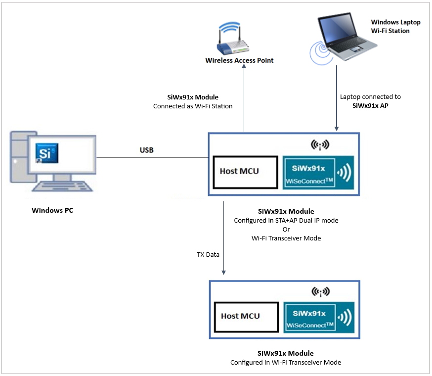
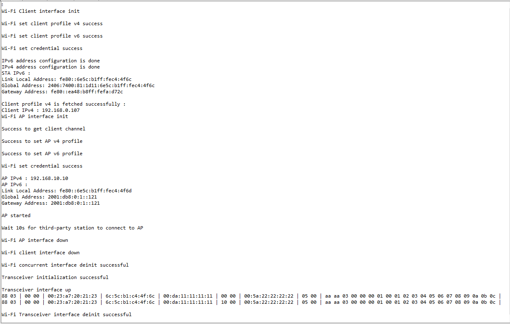

# Wi-Fi Transceiver and Concurrent dual IP mode switch

## Table of Contents

- [Purpose/Scope](#purposescope)
- [Prerequisites/Setup Requirements](#prerequisitessetup-requirements)
  - [Hardware Requirements](#hardware-requirements)
  - [Software Requirements](#software-requirements)
  - [Setup Diagram](#setup-diagram)
- [Getting Started](#getting-started)
- [Application Build Environment](#application-build-environment)
- [Test the application](#test-the-application)

## Purpose/Scope
Demonstrates mode switch between Wi-Fi Basic Transceiver and concurrent modes of operation

## Prerequisites/Setup Requirements

### Hardware Requirements

- Windows PC
- **NCP Mode**:
  - EFR32xG25 FG25 Pro Kit [FG25-PK6012A](https://www.silabs.com/development-tools/wireless/proprietary/efr32fg25-pro-kit-fg25-pk6012a?tab=overview)
  - EFR32xG24 Pro Kit +10 dBm [xG24-PK6009A](https://www.silabs.com/development-tools/wireless/efr32xg24-pro-kit-10-dbm?tab=overview)
  - EFR32xG21 Wireless Gecko Starter Kit [SLWSTK6006A](https://www.silabs.com/development-tools/wireless/efr32xg21-wireless-starter-kit)

### Software Requirements

- Simplicity Studio

### Setup Diagram

  

## Getting Started

Refer to the instructions [here](https://docs.silabs.com/wiseconnect/latest/wiseconnect-getting-started/) to:

- Install Studio and WiSeConnect 3 extension
- Connect your device to the computer
- Upgrade your connectivity firmware
- Create a Studio project

For details on the project folder structure, see the [WiSeConnect Examples](https://docs.silabs.com/wiseconnect/latest/wiseconnect-examples/#example-folder-structure) page.

## Application Build Environment

The application can be configured to suit user requirements and development environment. Read through the following sections and make any changes needed.
- In the Project Explorer pane, expand the config/folder and open the sl_net_default_values.h file. Configure the following parameters to enable your Silicon Labs Wi-Fi device to connect to your Wi-Fi network.

- STA instance related parameters

  - DEFAULT_WIFI_CLIENT_PROFILE_SSID refers to the name to which the Si91x module gets connected to.

    ```c
    #define DEFAULT_WIFI_CLIENT_PROFILE_SSID               "YOUR_AP_SSID"
    ```

  - DEFAULT_WIFI_CLIENT_CREDENTIAL refers to the secret key if the Access point is configured in WPA-PSK/WPA2-PSK security modes.

    ```c
    #define DEFAULT_WIFI_CLIENT_CREDENTIAL            "YOUR_AP_PASSPHRASE"
    ```

  - DEFAULT_WIFI_CLIENT_SECURITY_TYPE refers to the security type if the Access point is configured in WPA/WPA2 or mixed security modes.

    ```c
    #define DEFAULT_WIFI_CLIENT_SECURITY_TYPE              SL_WIFI_WPA2
    ```
- Other STA instance configurations can be modified if required in `wifi_client_profile` configuration structure.

- AP instance related parameters

  - DEFAULT_WIFI_AP_PROFILE_SSID refers to the SSID of the WiSeConnect softAP that would be created.

    ```c
    #define DEFAULT_WIFI_AP_PROFILE_SSID                   "MY_AP_SSID"
    ```

  - DEFAULT_WIFI_AP_CREDENTIAL refers to the secret key of the WiSeConnect softAP that would be created.

    ```c
    #define DEFAULT_WIFI_AP_CREDENTIAL                     "MY_AP_PASSPHRASE"
    ```

## Test the application

Refer to the instructions [here](https://docs.silabs.com/wiseconnect/latest/wiseconnect-getting-started/) to:

- Build the application.
- Flash, run and debug the application.
- When the application gets executed successfully, below logs are printed on the console.

  
