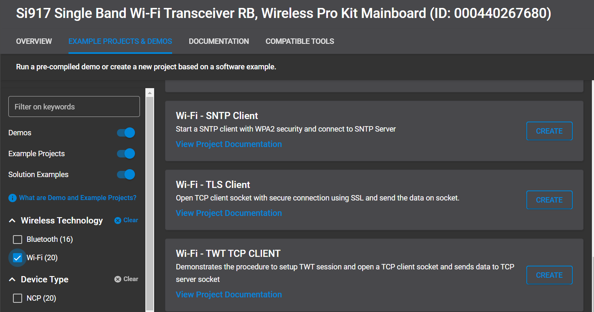
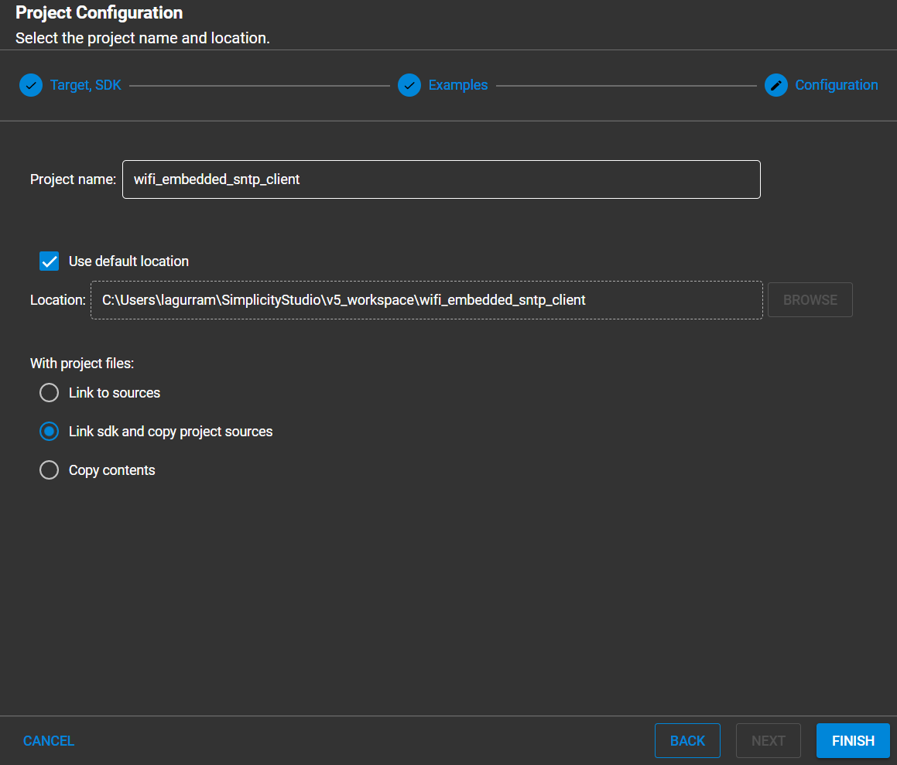
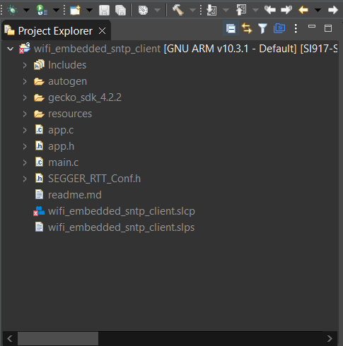
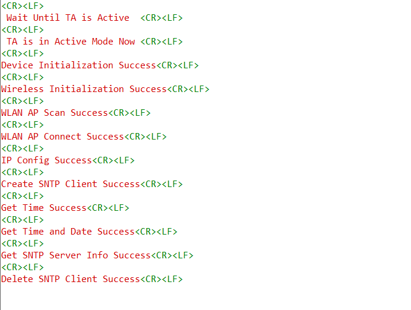

# SNTP Client

## 1. Purpose / Scope

This application demonstrates how Silicon Labs device gets info from SNTP server. In this application, Silicon Labs device connects to Access Point in client mode and connects to SNTP server. After successful connection with SNTP server, application gets time and date info from SNTP server.

## 2. Prerequisites / Setup Requirements

Before running the application, set up the following:

### 2.1 Hardware Requirements

- A Windows PC.
- WiFi Access point with internet
- SiWx91x Wi-Fi Evaluation Kit
  - **SoC Mode**: 
    - Silicon Labs [BRD4325A, BRD4325B, BRD4325G](https://www.silabs.com/)
  - **NCP Mode**:
    - Silicon Labs [(BRD4180A, BRD4280B)](https://www.silabs.com/); **AND**
    - Host MCU Eval Kit. This example has been tested with:
      - Silicon Labs [WSTK + EFR32MG21](https://www.silabs.com/development-tools/wireless/efr32xg21-bluetooth-starter-kit)

#### SoC Mode 


  
#### NCP Mode  


## 3. Application Build Environment

### 3.1 Project Setup

- **SoC Mode**
  - **Silicon Labs SiWx91x SoC**. Follow the [Getting Started with SiWx91x SoC](https://docs.silabs.com/) to setup the example to work with SiWx91x SoC and Simplicity Studio.
- **NCP Mode**
  - **Silicon Labs EFx32 Host**. Follow the [Getting Started with EFx32](https://docs.silabs.com/rs9116-wiseconnect/latest/wifibt-wc-getting-started-with-efx32/) to setup the example to work with EFx32 and Simplicity Studio.

### 3.2 NCP Mode - Host Interface 

- By default, the application is configured to use the SPI bus for interfacing between Host platforms(EFR32MG21) and the SiWx91x EVK.

## 4. Application Configuration Parameters

The application can be configured to suit your requirements and development environment. Read through the following sections and make any changes needed.

**4.1** Configure the following parameters in **sl_net_default_values.h** to enable your Silicon Labs Wi-Fi device to connect to your Wi-Fi network.
  
```                                     
#define DEFAULT_WIFI_CLIENT_PROFILE_SSID    "YOUR_AP_SSID"          // Wi-Fi Network Name
#define DEFAULT_WIFI_CLIENT_CREDENTIAL      "YOUR_AP_PASSPHRASE"    // Wi-Fi Password
#define DEFAULT_WIFI_CLIENT_SECURITY_TYPE   SL_WIFI_WPA_WPA2_MIXED  // Wi-Fi Security Type
#define DEFAULT_WIFI_CLIENT_ENCRYPTION_TYPE SL_WIFI_CCMP_ENCRYPTION
```

To select IPv6, FLAGS should be set to 1, by default it supports IPv4

```
#define FLAGS                               0
```

SERVER_IP_ADDRESS refers remote SNTP Server IP address to connect.

```
#define NTP_SERVER_IP                       "162.159.200.123"
```

Configure the SNTP method to use the server

```
#define SNTP_METHOD                        SL_SNTP_UNICAST_MODE
```

SNTP time out value to use

```
#define SNTP_TIMEOUT                       50
```

**4.2** Configure the following parameters in **rsi_wlan_config.h** to enable your Silicon Labs Wi-Fi device to connect to your Wi-Fi network.

```
.tcp_ip_feature_bit_map =
                     (SL_SI91X_TCP_IP_FEAT_DHCPV4_CLIENT |
                      SL_SI91X_TCP_IP_FEAT_DNS_CLIENT | 
                      SL_SI91X_TCP_IP_FEAT_SSL |
                      SL_SI91X_TCP_IP_FEAT_SNTP_CLIENT | 
                      SL_SI91X_TCP_IP_FEAT_EXTENSION_VALID),                 
```

## 5. Testing the Application

Follow the below steps for the successful execution of the application.

### 5.1 Loading the SiWx91x Firmware

Refer [Getting started with a PC](https://docs.silabs.com/rs9116/latest/wiseconnect-getting-started) to load the firmware into SiWx91x EVK. The firmware file is located in `<SDK>/firmware/`

### 5.2 Creating the Project and builing the Application
  
Refer [Getting started with EFX32](https://docs.silabs.com/rs9116-wiseconnect/latest/wifibt-wc-getting-started-with-efx32/), for setting-up EFR host platforms

#### 5.2.1 Project Creation - SoC Mode 

- Connect your board. The Si917 compatible SoC board is **BRD4325A**.
- Studio should detect your board. Your board will be shown here.


#### 5.2.2 Project Creation - NCP Mode 

- Connect your board. The supported NCP boards are: **BRD4180A,BRD4280B**
- Studio should detect your board. Your board will be shown here.


#### 5.2.3 Selecting an example application and generate project

- Go to the 'EXAMPLE PROJECT & DEMOS' tab and select your desired example application

- Click 'Create'. The "New Project Wizard" window appears. Click 'Finish'


#### 5.2.4 Build Project - SoC Mode

- Once the project is created, right click on project and go to properties → C/C++ Build → Settings → Build Steps
- Add post_build_script_SimplicityStudio.bat file path (SI917_COMBO_SDK.X.X.X.XX\utilities\isp_scripts_common_flash) in build steps settings as shown in below image.

- Check for M4 projects macros in preprocessor settings(RSI_M4_INTERFACE=1)
- Click on the build icon (hammer) to build the project

- Successful build output will show as below.


#### 5.2.5 Build Project - NCP Mode

- Click on the build icon (hammer) to build the project

- Successful build output will show as below.


## 6. Program the device

Once the build was successfull, right click on project and click on Debug As->Silicon Labs ARM Program as shown in below image.

### SoC Mode


### NCP Mode 


### 6.1 Running the SiWx91x Application

- Configure the Access point (internet AP) in OPEN / WPA-PSK / WPA2-PSK mode in order to connect Silicon Labs device in STA mode.

- Connect to SNTP server and request server for information.
  Eg: SNTP server ip address 128.138.141.172
  
- After the program gets executed, Silicon Labs Device would be connected to Access point and gets IP.

- After successful connection with access Point, Device starts connection with the SNTP server.

- After successful connection, module will send request to the server for time,date and Server Details.

- Application gets  all the information requested.

- Analyze the sniffer capture for NTP server response which contains date and time.

## 7. Observing the output prints on serial terminal

### 7.1 SoC Mode
>
> Connect USB to UART connector Tx and GND pins to WSTK radio board.

- Connect Tx(Pin-6) to P27 on WSTK
- Connect GND(Pin 8 or 10) to GND on WSTK


> Prints can see as below in any Console terminal


### 7.2 NCP Mode

Prints can see as below in any Console terminal


## 8. Selecting Bare Metal

The application has been designed to work with FreeRTOS and Bare Metal configurations. By default, the application project files (Simplicity studio) are configured with FreeRTOS enabled. The following steps demonstrate how to configure Simplicity Studio to test the application in a Bare Metal environment.
