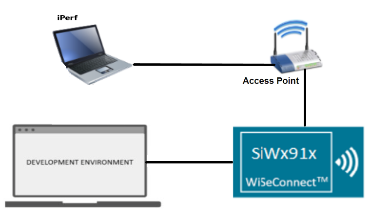
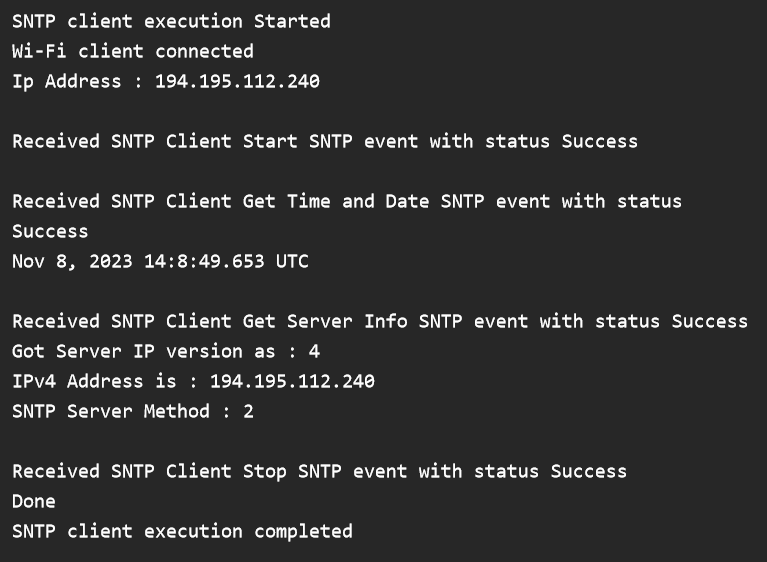

# Wi-Fi - SNTP Client

## Table of Contents

- [Purpose / Scope](#purpose--scope)
- [Prerequisites / Setup Requirements](#prerequisites--setup-requirements)
  - [Hardware Requirements](#hardware-requirements)
  - [Software Requirements](#software-requirements)
  - [Setup Diagram](#setup-diagram)
- [Getting Started](#getting-started)
- [Application Configuration Parameters](#application-configuration-parameters)
- [Test the Application](#test-the-application)

## Purpose / Scope

This application demonstrates how Silicon Labs device gets info from SNTP server. In this application, Silicon Labs device connects to Access Point in client mode and connects to SNTP server. After successful connection with SNTP server, application gets time and date info from SNTP server.

## Prerequisites / Setup Requirements

### Hardware Requirements

- A Windows PC.
- WiFi Access point with internet
- SiWx91x Wi-Fi Evaluation Kit
- SoC Mode:
  - Silicon Labs [BRD4388A](https://www.silabs.com/)
- NCP Mode:
  - Silicon Labs [BRD4180B](https://www.silabs.com/)
  - Host MCU Eval Kit. This example has been tested with:
    - Silicon Labs [WSTK + EFR32MG21](https://www.silabs.com/development-tools/wireless/efr32xg21-bluetooth-starter-kit)

### Software Requirements

- Simplicity Studio

### Setup Diagram



## Getting Started

Refer to the instructions [here](https://docs.silabs.com/wiseconnect/latest/wiseconnect-getting-started/) to:

- Install Studio and WiSeConnect 3 extension
- Connect your device to the computer
- Upgrade your connectivity firmware
- Create a Studio project

For details on the project folder structure, see the [WiSeConnect Examples](https://docs.silabs.com/wiseconnect/latest/wiseconnect-examples/#example-folder-structure) page.

## Application Configuration Parameters

The application can be configured to suit your requirements and development environment. Read through the following sections and make any changes needed.

- Configure the following parameters in ``sl_net_default_values.h`` to enable your Silicon Labs Wi-Fi device to connect to your Wi-Fi network.
  
```c
#define DEFAULT_WIFI_CLIENT_PROFILE_SSID    "YOUR_AP_SSID"          // Wi-Fi Network Name
#define DEFAULT_WIFI_CLIENT_CREDENTIAL      "YOUR_AP_PASSPHRASE"    // Wi-Fi Password
#define DEFAULT_WIFI_CLIENT_SECURITY_TYPE   SL_WIFI_WPA2            // Wi-Fi Security Type
#define DEFAULT_WIFI_CLIENT_ENCRYPTION_TYPE SL_WIFI_DEFAULT_ENCRYPTION
```

- To select IPv6, FLAGS should be set to 1, by default it supports IPv4

```c
#define FLAGS                               0
```

- SERVER_IP_ADDRESS refers remote SNTP Server IP address to connect.

```c
#define NTP_SERVER_IP                       "162.159.200.123"
```

- Configure the SNTP method to use the server

```c
#define SNTP_METHOD                        SL_SNTP_UNICAST_MODE
```

- SNTP time out value to use

```c
#define SNTP_TIMEOUT                       50
```

- Configure the **.tcp_ip_feature_bit_map** of structure **sl_wifi_sntp_client_configuration** in ``app.c`` to enable your Silicon Labs Wi-Fi device to connect to your Wi-Fi network. The following parameters are enabled by default in this application.

```c
.tcp_ip_feature_bit_map =
                     (SL_SI91X_TCP_IP_FEAT_DHCPV4_CLIENT |
                      SL_SI91X_TCP_IP_FEAT_DNS_CLIENT | 
                      SL_SI91X_TCP_IP_FEAT_SSL |
                      SL_SI91X_TCP_IP_FEAT_SNTP_CLIENT | 
                      SL_SI91X_TCP_IP_FEAT_EXTENSION_VALID),                 
```

## Test the Application

Before running the application, configure your access point (AP) in one of the following security modes in order for your Silicon Labs device to connect to it:
- Open
- WPA-PSK
- WPA2-PSK

Refer to the instructions [here](https://docs.silabs.com/wiseconnect/latest/wiseconnect-getting-started/) to:
- Build the application.
- Flash, run and debug the application.

When the application starts running, the following will take place:

- The Silicon Labs device will connect to your AP and obtain an IP address.

- The device will initiate a connection to the SNTP server.

- The device will send a request to the SNTP server for time, date, and server details.

- The SNTP server will send back the information requested.

- The SNTP server response containing the date and time can be seen in sniffer logs.


