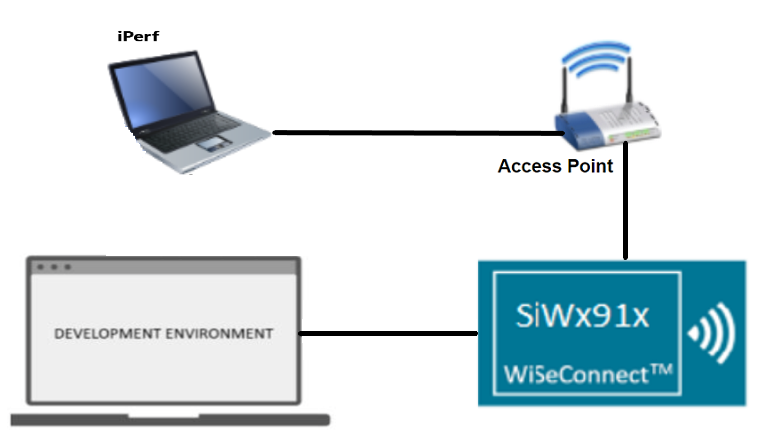
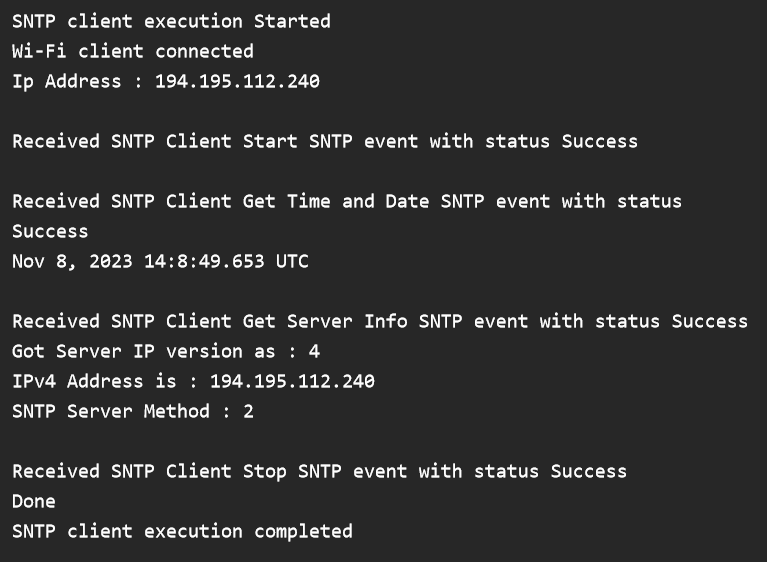

# Wi-Fi - SNTP Client

## High-Level Overview

SiWx91x SNTP client example: Connect to Wi-Fi and synchronize date and time from an SNTP server in SoC and NCP modes.

## Table of Contents

- [Wi-Fi - SNTP Client](#wi-fi---sntp-client)
  - [Table of Contents](#table-of-contents)
  - [High-Level Overview](#high-level-overview)
  - [Purpose / Scope](#purpose--scope)
  - [Prerequisites / Setup Requirements](#prerequisites--setup-requirements)
    - [Hardware Requirements](#hardware-requirements)
    - [Software Requirements](#software-requirements)
    - [Setup Diagram](#setup-diagram)
  - [Getting Started](#getting-started)
  - [Application Configuration Parameters](#application-configuration-parameters)
  - [Test the Application](#test-the-application)

  - [Troubleshooting](#troubleshooting)
  - [Resources](#resources)
  - [Report Bugs and Get Support](#report-bugs-and-get-support)

## Purpose / Scope

This application demonstrates how a Silicon Labs device gets info from the SNTP server. In this application, the Silicon Labs device connects to the access point in client mode and connects to SNTP server. After successful connection with SNTP server, the application gets time and date info from SNTP server.

## Prerequisites / Setup Requirements

### Hardware Requirements

- Windows PC
- WiFi access point with internet
- SiWx91x Wi-Fi Evaluation Kit
- SoC Mode:
  - Standalone
    - BRD4002A Wireless Pro Kit Mainboard [SI-MB4002A](https://www.silabs.com/development-tools/wireless/wireless-pro-kit-mainboard?tab=overview)
    - Radio Boards 
	  - BRD4338A [SiWx917-RB4338A](https://www.silabs.com/development-tools/wireless/wi-fi/siwx917-rb4338a-wifi-6-bluetooth-le-soc-radio-board?tab=overview)
	  - BRD4342A [SiWx917-RB4342A](https://www.silabs.com/development-tools/wireless/wi-fi/siwx91x-rb4342a-wifi-6-bluetooth-le-soc-radio-board?tab=overview)
	  - BRD4339B [SiWx917-RB4339B](https://docs.silabs.com/wiseconnect/latest/wiseconnect-getting-started/getting-started-with-at)
	  - BRD4340A [SiWx917-RB4340A](https://docs.silabs.com/wiseconnect/latest/wiseconnect-getting-started/getting-started-with-at)
	  - BRD4343A [SiWx917-RB4343A](https://www.silabs.com/development-tools/wireless/wi-fi/siw917y-rb4343a-wi-fi-6-bluetooth-le-8mb-flash-radio-board-for-module?tab=overview)
	  - BRD4343C [SiWx917-RB4343C](https://www.silabs.com/development-tools/wireless/wi-fi/siw917y-rb4343c-wi-fi-6-bluetooth-le-8mb-flash-radio-board-for-module?tab=overview)
  - Kits
	- SiWG917 Dev Kit [BRD2605A](https://www.silabs.com/development-tools/wireless/wi-fi/siwx917-dk2605a-wifi-6-bluetooth-le-soc-dev-kit?tab=overview)
    - SiWx917 AC1 Module Explorer Kit [BRD2708A](https://www.silabs.com/development-tools/wireless/wi-fi/siw917y-ek2708a-explorer-kit?tab=overview)

- NCP Mode:
  - [BRD4346A](https://www.silabs.com/development-tools/wireless/wi-fi/siwx917-rb4346a-wifi-6-bluetooth-le-soc-4mb-flash-radio-board?tab=overview) + [BRD8045C](https://www.silabs.com/development-tools/wireless/wi-fi/shield-adapter-board-for-co-processor-radio-boards?tab=overview)
  - [BRD4357A](https://www.silabs.com/development-tools/wireless/wi-fi/siw917y-rb4357a-wi-fi-6-bluetooth-le-4mb-flash-radio-board-for-rcp-and-ncp-modules?tab=overview) + [BRD8045C](https://www.silabs.com/development-tools/wireless/wi-fi/shield-adapter-board-for-co-processor-radio-boards?tab=overview)
  - [BRD4357C](https://www.silabs.com/development-tools/wireless/wi-fi/siw917y-rb4357c-wi-fi-6-bluetooth-le-4mb-flash-radio-board-for-rcp-and-ncp-modules?tab=overview) + [BRD8045C](https://www.silabs.com/development-tools/wireless/wi-fi/shield-adapter-board-for-co-processor-radio-boards?tab=overview)
  - Silicon Labs [BRD4180B](https://www.silabs.com/development-tools/wireless/slwrb4180b-efr32xg21-wireless-gecko-radio-board?tab=overview)
  - Host MCU Eval Kit. This example has been tested with:
    - Silicon Labs [WSTK + EFR32MG21](https://www.silabs.com/development-tools/wireless/efr32xg21-bluetooth-starter-kit)
  - Interface and Host MCU Supported
    - SPI - EFR32
    - UART - EFR32


### Software Requirements

- Simplicity Studio

### Setup Diagram



## Getting Started

Refer to the instructions [here](https://docs.silabs.com/wiseconnect/latest/wiseconnect-getting-started/) to:

- [Install Simplicity Studio](https://docs.silabs.com/wiseconnect/latest/wiseconnect-developers-guide-developing-for-silabs-hosts/#install-simplicity-studio)
- [Install WiSeConnect extension](https://docs.silabs.com/wiseconnect/latest/wiseconnect-developers-guide-developing-for-silabs-hosts/#install-the-wi-se-connect-extension)
- [Connect your device to the computer](https://docs.silabs.com/wiseconnect/latest/wiseconnect-developers-guide-developing-for-silabs-hosts/#connect-si-wx91x-to-computer)
- [Upgrade your connectivity firmware ](https://docs.silabs.com/wiseconnect/latest/wiseconnect-developers-guide-developing-for-silabs-hosts/#update-si-wx91x-connectivity-firmware)
- [Create a Studio project ](https://docs.silabs.com/wiseconnect/latest/wiseconnect-developers-guide-developing-for-silabs-hosts/#create-a-project)

For details on the project folder structure, see the [WiSeConnect Examples](https://docs.silabs.com/wiseconnect/latest/wiseconnect-examples/#example-folder-structure) page.

## Application Configuration Parameters

The application can be configured to suit your requirements and development environment. Read through the following sections and make any changes needed.

- Configure the following parameters in ``sl_net_default_values.h`` to enable your Silicon Labs Wi-Fi device to connect to your Wi-Fi network.
  
```c
#define DEFAULT_WIFI_CLIENT_PROFILE_SSID    "YOUR_AP_SSID"          // Wi-Fi Network Name
#define DEFAULT_WIFI_CLIENT_CREDENTIAL      "YOUR_AP_PASSPHRASE"    // Wi-Fi Password
#define DEFAULT_WIFI_CLIENT_SECURITY_TYPE   SL_WIFI_WPA2            // Wi-Fi Security Type
#define DEFAULT_WIFI_CLIENT_ENCRYPTION_TYPE SL_WIFI_DEFAULT_ENCRYPTION
```

- To select IPv6, FLAGS should be set to 1. By default, it supports IPv4.

```c
#define FLAGS                               0
```

- NTP_SERVER_IP is the hostname or IP address of the SNTP server to synchronize time with (default: "0.pool.ntp.org", which may resolve to IP addresses such as "162.159.200.123").

```c
#define NTP_SERVER_IP                       "0.pool.ntp.org"
```

- Configure the SNTP method to use the server.

```c
#define SNTP_METHOD                        SL_SNTP_UNICAST_MODE
```

- SNTP time out value to use

```c
#define SNTP_TIMEOUT                       50
```

- Configure the **.tcp_ip_feature_bit_map** of structure **sl_wifi_sntp_client_configuration** in ``app.c`` to enable your Silicon Labs Wi-Fi device to connect to your Wi-Fi network. The following parameters are enabled by default in this application.

```c
.tcp_ip_feature_bit_map =
                     (SL_SI91X_TCP_IP_FEAT_DHCPV4_CLIENT |
                      SL_SI91X_TCP_IP_FEAT_DNS_CLIENT | 
                      SL_SI91X_TCP_IP_FEAT_SSL |
                      SL_SI91X_TCP_IP_FEAT_SNTP_CLIENT | 
                      SL_SI91X_TCP_IP_FEAT_EXTENSION_VALID),                 
```

> **Note**: For recommended settings, please refer the [recommendations guide](https://docs.silabs.com/wiseconnect/latest/wiseconnect-developers-guide-prog-recommended-settings/).

## Test the Application

Before running the application, configure your access point (AP) in one of the following security modes in order for your Silicon Labs device to connect to it:
- Open
- WPA-PSK
- WPA2-PSK

Refer to the instructions [here](https://docs.silabs.com/wiseconnect/latest/wiseconnect-getting-started/) to:
- Build the application.
- Flash, run, and debug the application.

When the application starts running, the following will take place:

- The Silicon Labs device will connect to your AP and obtain an IP address.

- The device will initiate a connection to the SNTP server.

- The device will send a request to the SNTP server for time, date, and server details.

- The SNTP server will send back the information requested.

- The SNTP server response containing the date and time can be seen in sniffer logs.



## Troubleshooting

If you encounter issues while running this example, check the following:

- Verify Wi-Fi credentials in `sl_net_default_values.h` and SNTP server address in your application configuration.
- Ensure that your access point provides internet access so the SNTP server is reachable.
- Confirm the configured SNTP server IP address or hostname resolves and responds on port `123`.

## Resources

- [WiSeConnect Getting Started Guide](https://docs.silabs.com/wiseconnect/latest/wiseconnect-getting-started/)
- [WiSeConnect Examples](https://docs.silabs.com/wiseconnect/latest/wiseconnect-examples/#example-folder-structure)
- [WiSeConnect Recommended Settings Guide](https://docs.silabs.com/wiseconnect/latest/wiseconnect-developers-guide-prog-recommended-settings/)

## Report Bugs and Get Support

Report issues and get help from the Silicon Labs community:

- [Silicon Labs Community](https://www.silabs.com/community)

