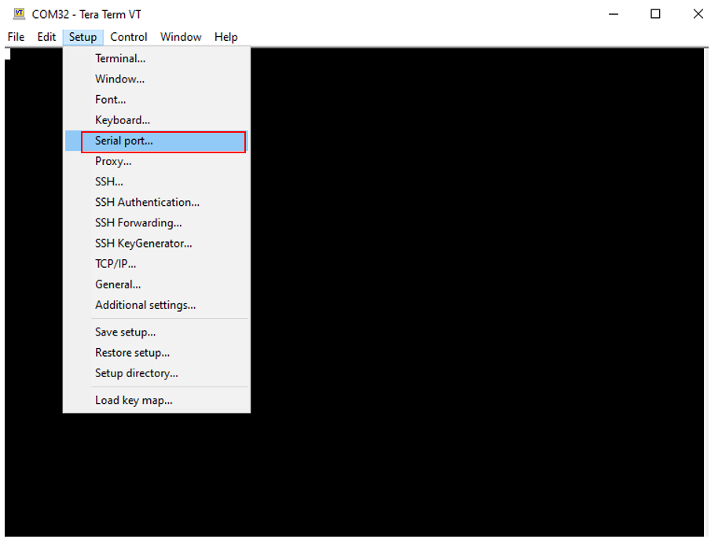
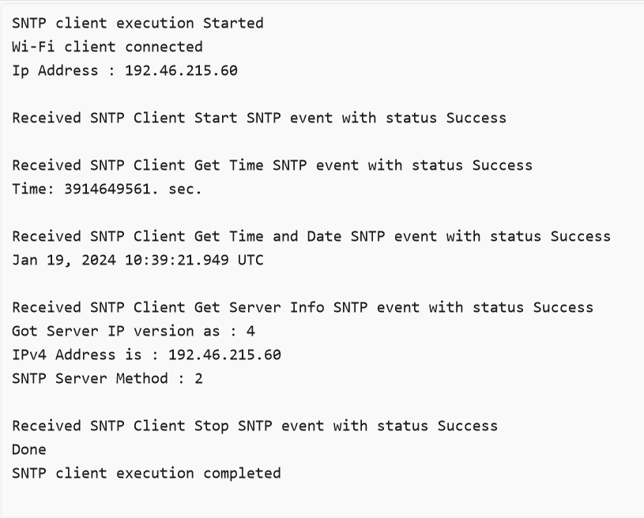

# SNTP Client

## 1. Purpose / Scope

This application demonstrates how Silicon Labs device gets info from SNTP server. In this application, Silicon Labs device connects to Access Point in client mode and connects to SNTP server. After successful connection with SNTP server, application gets time and date info from SNTP server.

## 2. Prerequisites / Setup Requirements

Before running the application, set up the following:

### 2.1 Hardware Requirements

- A Windows PC.
- WiFi Access point with internet
- SiWx91x Wi-Fi Evaluation Kit
- **SoC Mode**:
  - Silicon Labs [BRD4325A, BRD4325B, BRD4325C, BRD4325G, BRD4388A](https://www.silabs.com/)
- **NCP Mode**:
  - Silicon Labs [BRD4180B](https://www.silabs.com/)
  - Host MCU Eval Kit. This example has been tested with:
    - Silicon Labs [WSTK + EFR32MG21](https://www.silabs.com/development-tools/wireless/efr32xg21-bluetooth-starter-kit)

### 2.2 Software Requirements

- Simplicity Studio IDE
  - Download the latest [Simplicity Studio IDE](https://www.silabs.com/developers/simplicity-studio)
  - Follow the [Simplicity Studio user guide](https://docs.silabs.com/simplicity-studio-5-users-guide/1.1.0/ss-5-users-guide-getting-started/install-ss-5-and-software#install-ssv5) to install Simplicity Studio IDE

### 2.3 Setup Diagram

#### SoC Mode


#### NCP Mode  


**NOTE**:

- The Host MCU platform (EFR32MG21) and the SiWx91x interact with each other through the SPI interface.

Follow the [Getting Started with Wiseconnect3 SDK](https://docs.silabs.com/wiseconnect/latest/wiseconnect-getting-started/) guide to set up the hardware connections and Simplicity Studio IDE.

## 3 Project Environment

- Ensure the SiWx91x loaded with the latest firmware following the [Upgrade Si91x firmware](https://docs.silabs.com/wiseconnect/latest/wiseconnect-getting-started/getting-started-with-soc-mode#upgrade-si-wx91x-connectivity-firmware)

- Ensure the latest Gecko SDK along with the extension WiSeConnect3 is added to Simplicity Studio.

### 3.1 Creating the project

#### 3.1.1 SoC mode

- Ensure the SiWx91x set up is connected to your PC.

- In the Simplicity Studio IDE, the SiWx91x SoC board will be detected under **Debug Adapters** pane as shown below.

  ****

#### 3.1.2 NCP mode

- Ensure the EFx32 and SiWx91x set up is connected to your PC.

- In the Simplicity Studio IDE, the EFR32 board will be detected under **Debug Adapters** pane as shown below.

  ****

### 3.2 Importing the project

- Studio should detect your board. Your board will be shown here. Click on the board detected and go to **EXAMPLE PROJECTS & DEMOS** section 

#### SOC Mode

- Select **Wi-Fi - SNTP Client(SOC)** test application

  ****

- Click 'Create'. The "New Project Wizard" window appears. Click 'Finish'

  ****

#### NCP Mode

- Select **Wi-Fi - SNTP Client(NCP)** test application

  ****

- Click 'Create'. The "New Project Wizard" window appears. Click 'Finish'

  ****

### 3.3 Set up for application prints

#### 3.3.1 Teraterm set up - for BRD4325A, BRD4325B, BRD4325C, BRD4325G

You can use either of the below USB to UART converters for application prints.

1. Set up using USB to UART converter board.

   - Connect Tx (Pin-6) to P27 on WSTK
   - Connect GND (Pin 8 or 10) to GND on WSTK

   ****

2. Set up using USB to UART converter cable.

   - Connect RX (Pin 5) of TTL convertor to P27 on WSTK
   - Connect GND (Pin1) of TTL convertor to GND on WSTK

   ****

3. Open the Teraterm tool.

   - For SoC mode, choose the serial port to which USB to UART converter is connected and click on **OK**.

     ****

**Note:** For Other 917 SoC boards please refer section #3.3.2

#### 3.3.2 **Teraterm set up - for NCP and SoC modes**

1. Open the Teraterm tool.

- choose the J-Link port and click on **OK**.
    
    ****

2. Navigate to the Setup → Serial port and update the baud rate to **115200** and click on **OK**.

    ****

    ****

## 4. Application Configuration Parameters

The application can be configured to suit your requirements and development environment. Read through the following sections and make any changes needed.

**4.1** Configure the following parameters in **sl_net_default_values.h** to enable your Silicon Labs Wi-Fi device to connect to your Wi-Fi network.
  
```c
#define DEFAULT_WIFI_CLIENT_PROFILE_SSID    "YOUR_AP_SSID"          // Wi-Fi Network Name
#define DEFAULT_WIFI_CLIENT_CREDENTIAL      "YOUR_AP_PASSPHRASE"    // Wi-Fi Password
#define DEFAULT_WIFI_CLIENT_SECURITY_TYPE   SL_WIFI_WPA2            // Wi-Fi Security Type
#define DEFAULT_WIFI_CLIENT_ENCRYPTION_TYPE SL_WIFI_CCMP_ENCRYPTION
```

To select IPv6, FLAGS should be set to 1, by default it supports IPv4

```c
#define FLAGS                               0
```

SERVER_IP_ADDRESS refers remote SNTP Server IP address to connect.

```c
#define NTP_SERVER_IP                       "162.159.200.123"
```

Configure the SNTP method to use the server

```c
#define SNTP_METHOD                        SL_SNTP_UNICAST_MODE
```

SNTP time out value to use

```c
#define SNTP_TIMEOUT                       50
```

**4.2** Configure the **.tcp_ip_feature_bit_map** of structure **sl_wifi_sntp_client_configuration** in **app.c** to enable your Silicon Labs Wi-Fi device to connect to your Wi-Fi network. The following parameters are enabled by default in this application.

```c
.tcp_ip_feature_bit_map =
                     (SL_SI91X_TCP_IP_FEAT_DHCPV4_CLIENT |
                      SL_SI91X_TCP_IP_FEAT_DNS_CLIENT | 
                      SL_SI91X_TCP_IP_FEAT_SSL |
                      SL_SI91X_TCP_IP_FEAT_SNTP_CLIENT | 
                      SL_SI91X_TCP_IP_FEAT_EXTENSION_VALID),                 
```

## 4.2 Build the application

- SoC mode: Build as SNTP Example(SOC)

  ****

- NCP mode:Build as SNTP Example(NCP)

  ****

### 4.3 Run and Test the application

- Configure the Access point (internet AP) in OPEN / WPA-PSK / WPA2-PSK mode in order to connect Silicon Labs device in STA mode.

- Connect to SNTP server and request server for information.
  Eg: SNTP server ip address 128.138.141.172
  
- After the program gets executed, Silicon Labs Device would be connected to Access point and gets IP.

- After successful connection with access Point, Device starts connection with the SNTP server.

- After successful connection, module will send request to the server for time,date and Server Details.

- Application gets  all the information requested.

- Analyze the sniffer capture for NTP server response which contains date and time.

- Once the build was successful, right click on project and click on Debug As->Silicon Labs ARM Program as shown in below image.

  - SoC

    ****

  - NCP

    ****

### 4.4 Application Output

- Output for SoC and NCP :

 ****
