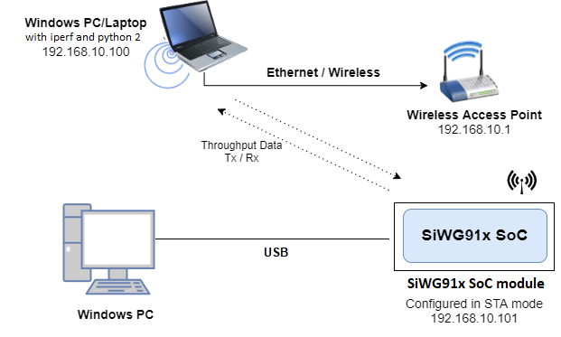

# WLAN TCP TX on periodic wakeup

## High-Level Overview

SiWx91x low-power TCP example: Maintain a TCP client socket in connected sleep and periodically wake to transmit data in SoC mode.

## Table of Contents

- [WLAN TCP TX on periodic wakeup](#wlan-tcp-tx-on-periodic-wakeup)
  - [Table of Contents](#table-of-contents)
  - [High-Level Overview](#high-level-overview)
  - [Purpose/Scope](#purposescope)
  - [Soc Mode:](#soc-mode)
    - [Tickless Mode](#tickless-mode)
  - [Prerequisites/Setup Requirements](#prerequisitessetup-requirements)
    - [Hardware Requirements](#hardware-requirements)
    - [Software Requirements](#software-requirements)
  - [Setup Diagram](#setup-diagram)
  - [Getting Started](#getting-started)
  - [Application Build Environment](#application-build-environment)
  - [Test the Application](#test-the-application)

  - [Troubleshooting](#troubleshooting)
  - [Resources](#resources)
  - [Report Bugs and Get Support](#report-bugs-and-get-support)

## Purpose/Scope
This application demonstrates the process for configuring SiWx91x in connected sleep mode while having a TCP client socket in open state.

The application creates a TCP client socket and then connects to a remote server to send 64MB data to the TCP Server. After completing the data transfer, NWP enters connected sleep and M4 goes to sleep with a configurable alarm time. After the alarm times out, M4 wakes up NWP by sending a packet and the data transmission repeats.

## Soc Mode:

If macro **SL_SI91X_TICKLESS_MODE** enabled, Then M4 processor is set in sleep mode. The M4 processor can be woken in several ways as mentioned below:

### Tickless Mode

In Tickless Mode, the device enters sleep based on the idle time set by the scheduler. The device can be awakened by these methods: SysRTC, a wireless signal, Button press-based (GPIO) and Alarm based wakeup.

- **SysRTC (System Real-Time Clock)**: By default, the device uses SysRTC as the wakeup source. The device will enter sleep mode and then wake up when the SysRTC matches the idle time set by the scheduler.

- **Wireless Wakeup**: The device can also be awakened by a wireless signal. If this signal is triggered before the idle time set by the scheduler, the device will wake up in response to it.

- **Button Based Wakeup**:The device can also be awakened by a button signal.

- **Alarm Based Wakeup**:The device can also be awakened by setting the timeout to the appropriate duration in the osSemaphoreAcquire function.

## Prerequisites/Setup Requirements

### Hardware Requirements

- Windows PC
- **SoC Mode**:
  - Standalone
    - BRD4002A Wireless Pro Kit Mainboard [SI-MB4002A](https://www.silabs.com/development-tools/wireless/wireless-pro-kit-mainboard?tab=overview)
    - Radio Boards 
  	  - BRD4338A [SiWx917-RB4338A](https://www.silabs.com/development-tools/wireless/wi-fi/siwx917-rb4338a-wifi-6-bluetooth-le-soc-radio-board?tab=overview)
  	  - BRD4342A [SiWx917-RB4342A](https://www.silabs.com/development-tools/wireless/wi-fi/siwx91x-rb4342a-wifi-6-bluetooth-le-soc-radio-board?tab=overview)
      - BRD4339B [SiWx917-RB4339B](https://docs.silabs.com/wiseconnect/latest/wiseconnect-getting-started/getting-started-with-at)
  	  - BRD4340A [SiWx917-RB4340A](https://docs.silabs.com/wiseconnect/latest/wiseconnect-getting-started/getting-started-with-at)
  	  - BRD4343A [SiWx917-RB4343A](https://www.silabs.com/development-tools/wireless/wi-fi/siw917y-rb4343a-wi-fi-6-bluetooth-le-8mb-flash-radio-board-for-module?tab=overview)
  	  - BRD4343C [SiWx917-RB4343C](https://www.silabs.com/development-tools/wireless/wi-fi/siw917y-rb4343c-wi-fi-6-bluetooth-le-8mb-flash-radio-board-for-module?tab=overview)
  - Kits
	- SiWG917 Dev Kit [BRD2605A](https://www.silabs.com/development-tools/wireless/wi-fi/siwx917-dk2605a-wifi-6-bluetooth-le-soc-dev-kit?tab=overview)
    - SiWx917 AC1 Module Explorer Kit [BRD2708A](https://www.silabs.com/development-tools/wireless/wi-fi/siw917y-ek2708a-explorer-kit?tab=overview)
- **NCP Mode**:
  - Standalone
    - BRD4002A Wireless Pro Kit Mainboard [SI-MB4002A](https://www.silabs.com/development-tools/wireless/wireless-pro-kit-mainboard?tab=overview)
    - EFR32xG24 Wireless 2.4 GHz +10 dBm Radio Board [xG24-RB4186C](https://www.silabs.com/development-tools/wireless/xg24-rb4186c-efr32xg24-wireless-gecko-radio-board?tab=overview)
    - NCP Expansion Kit with NCP Radio Boards
      - [BRD4346A](https://www.silabs.com/development-tools/wireless/wi-fi/siwx917-rb4346a-wifi-6-bluetooth-le-soc-4mb-flash-radio-board?tab=overview) + [BRD8045C](https://www.silabs.com/development-tools/wireless/wi-fi/shield-adapter-board-for-co-processor-radio-boards?tab=overview)
      - [BRD4357A](https://www.silabs.com/development-tools/wireless/wi-fi/siw917y-rb4357a-wi-fi-6-bluetooth-le-4mb-flash-radio-board-for-rcp-and-ncp-modules?tab=overview) + [BRD8045C](https://www.silabs.com/development-tools/wireless/wi-fi/shield-adapter-board-for-co-processor-radio-boards?tab=overview)
      - [BRD4357C](https://www.silabs.com/development-tools/wireless/wi-fi/siw917y-rb4357c-wi-fi-6-bluetooth-le-4mb-flash-radio-board-for-rcp-and-ncp-modules?tab=overview) + [BRD8045C](https://www.silabs.com/development-tools/wireless/wi-fi/shield-adapter-board-for-co-processor-radio-boards?tab=overview)
  - Kits
  	- EFR32xG24 Pro Kit +10 dBm [xG24-PK6009A](https://www.silabs.com/development-tools/wireless/efr32xg24-pro-kit-10-dbm?tab=overview)
  - Interface and Host MCU Supported
    - SPI - EFR32
    - UART - EFR32
- Wireless Access Point
- Windows PC with iPerf and similar TCP Server application


### Software Requirements

- Simplicity Studio
- [iPerf Application](https://sourceforge.net/projects/iperf2/files/iperf-2.0.8-win.zip/download) to run TCP Server. iPerf is a tool for active measurements of the maximum achievable bandwidth on IP networks. It supports tuning of various parameters related to timing, buffers and protocols (TCP and UDP with IPv4 and IPv6).
- VCOM Setup
  - The Docklight tool's setup instructions are provided below.

    

## Setup Diagram



## Getting Started

Refer to the instructions [here](https://docs.silabs.com/wiseconnect/latest/wiseconnect-getting-started/) to:

- Install Simplicity Studio and WiSeConnect extension
- Connect SiWx917 device to the computer
- Upgrade the device connectivity firmware
- Create the Studio project

For details on the project folder structure, see the [WiSeConnect Examples](https://docs.silabs.com/wiseconnect/latest/wiseconnect-examples/#example-folder-structure) page.

## Application Build Environment

The application can be configured to suit your requirements and development environment. 

**STA instance related parameters**

- In the Project Explorer pane, expand the **config** folder and open the **sl_net_default_values.h** file. Configure the following parameters to enable your Silicon Labs Wi-Fi device to connect to your Wi-Fi network

- DEFAULT_WIFI_CLIENT_PROFILE_SSID refers to the name with which Wi-Fi network that shall be advertised and SiWx91x module is connected to it.

  ```c
  #define DEFAULT_WIFI_CLIENT_PROFILE_SSID               "YOUR_AP_SSID"      
  ```

- DEFAULT_WIFI_CLIENT_CREDENTIAL refers to the secret key if the Access point is configured in WPA-PSK/WPA2-PSK security modes.

  ```c
  #define DEFAULT_WIFI_CLIENT_CREDENTIAL                 "YOUR_AP_PASSPHRASE" 
  ```

- DEFAULT_WIFI_CLIENT_SECURITY_TYPE refers to the security type of the Access point. The supported security modes are mentioned in `sl_wifi_security_t`.

  ```c
  #define DEFAULT_WIFI_CLIENT_SECURITY_TYPE               SL_WIFI_WPA2 
  ```

- Other STA instance configurations can be modified if required in `default_wifi_client_profile` configuration structure.

**TCP Configuration**

- In the Project Explorer pane, open the **app.c** file. 

  ```c
  #define SERVER_IP_ADDRESS  "192.168.0.179"  // Server IP address 
  #define SERVER_PORT        5002             // TCP server port of the remote TCP server
  ```

> **Note**: For recommended settings, please refer the [recommendations guide](https://docs.silabs.com/wiseconnect/latest/wiseconnect-developers-guide-prog-recommended-settings/).

## Test the Application

Refer to the instructions [here](https://docs.silabs.com/wiseconnect/latest/wiseconnect-getting-started/) to:

- Build the application
- Flash, run and debug the application

To establish TCP Server on remote PC, open [iPerf Application](https://sourceforge.net/projects/iperf2/files/iperf-2.0.8-win.zip/download) and run the below command from the downloaded folder's path in the command prompt.
		
  ```c
  C:\> iperf.exe -s -p <SERVER_PORT> -i 1
   For example ...
  C:\> iperf.exe -s -p 5002 -i 1
  ```

The SiWx91x SoC, which is configured as a TCP client, connects to the iPerf server and the power save profile is set to ASSOCIATED_POWER_SAVE_LOW_LATENCY. Upon successsful TCP connection, the Si917 NWP sends 512MB data to server. Once the configured ALARM_TIMEOUT expires or a button is pressed, M4 is triggered out of sleep, performs data transfer and goes back to sleep.


## Troubleshooting

If you encounter issues while running this example, check the following:

- Verify Wi-Fi credentials and TCP server IP/port in `app.c`.
- Start the remote TCP server before the SiWx91x client connects.
- If periodic transmission does not resume after sleep, review alarm and tickless wakeup settings.
- Ensure that connected sleep mode is supported and enabled for your target configuration.

## Resources

- [WiSeConnect Getting Started Guide](https://docs.silabs.com/wiseconnect/latest/wiseconnect-getting-started/)
- [WiSeConnect Examples](https://docs.silabs.com/wiseconnect/latest/wiseconnect-examples/#example-folder-structure)
- [WiSeConnect Recommended Settings Guide](https://docs.silabs.com/wiseconnect/latest/wiseconnect-developers-guide-prog-recommended-settings/)

## Report Bugs and Get Support

Report issues and get help from the Silicon Labs community:

- [Silicon Labs Community](https://www.silabs.com/community)

