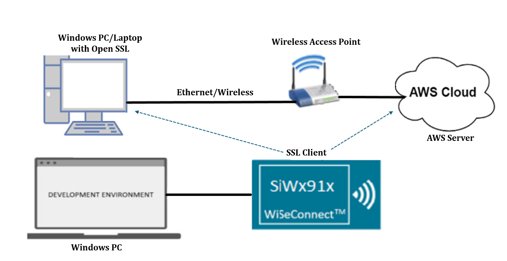
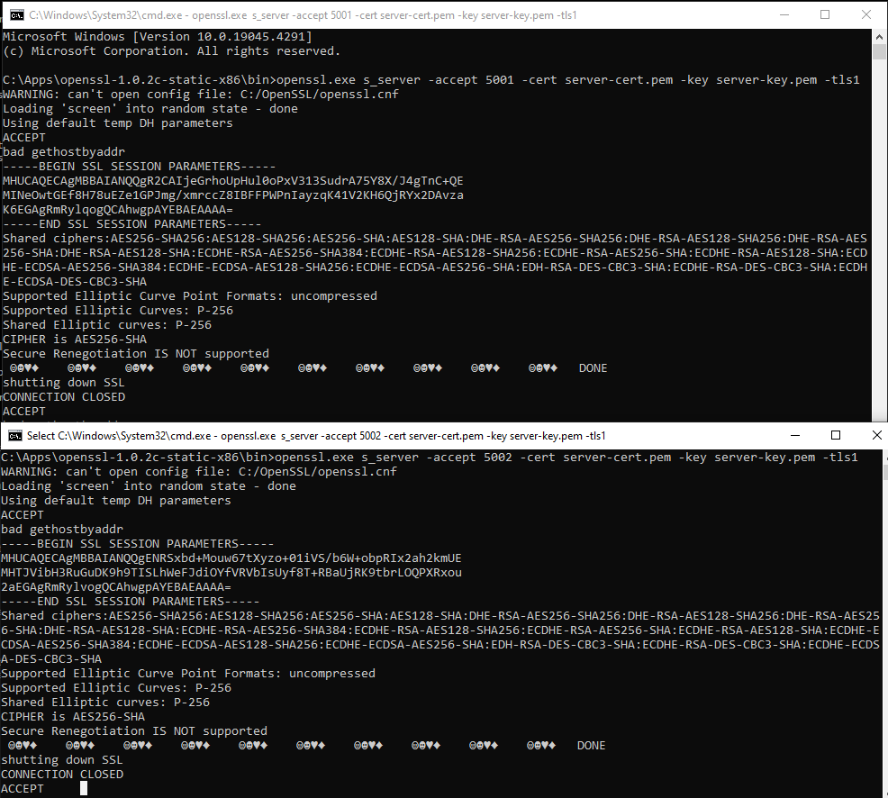
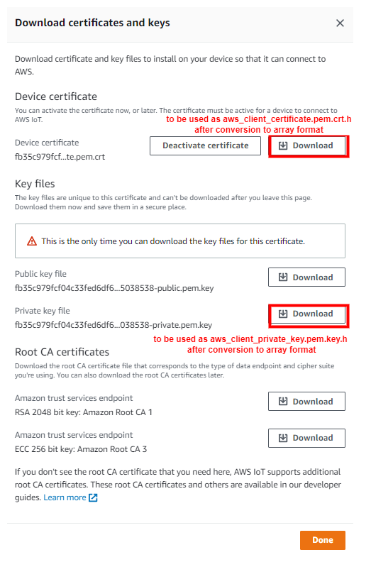

# Wi-Fi - Three TLS Concurrent Client Sockets

## Table of Contents

  - [Purpose/Scope](#purposescope)
  - [Prerequisites/Set up Requirements](#prerequisitesset-up-requirements)
    - [Hardware Requirements](#hardware-requirements)
    - [Software Requirements](#software-requirements)
    - [Setup Diagram](#setup-diagram)
  - [Getting Started](#getting-started)
  - [Application Build Environment](#application-build-environment)
    - [Configure the below parameters in `aws_iot_config.h` file present at `<project>/config`](#configure-the-below-parameters-in-aws_iot_configh-file-present-at-projectconfig)
  - [Test the Application](#test-the-application)
    - [Build and Run the Server](#build-and-run-the-server)
    - [Run the application](#run-the-application)
  - [Additional Information](#additional-information)
    - [Setting up Security Certificates](#setting-up-security-certificates)
    - [Create an AWS Thing](#create-an-aws-thing)

## Purpose/Scope

This application demonstrates how the SiWx91x will connect to three different SSL servers with three different sets of SSL certificates and load certificates into the FLASH.

## Prerequisites/Set up Requirements

### Hardware Requirements

- Windows PC
- USB-C cable
- A Wireless Access Point (which has an active internet access)

- **SoC Mode**:
  - Standalone
    - BRD4002A Wireless pro kit mainboard [SI-MB4002A]
    - Radio Boards 
  	  - BRD4338A [SiWx917-RB4338A]
      - BRD4342A [SiWx917-RB4342A]
  	  - BRD4343A [SiWx917-RB4343A]
  - Kits
  	- SiWx917 Pro Kit [Si917-PK6031A](https://www.silabs.com/development-tools/wireless/wi-fi/siwx917-pro-kit?tab=overview)
  	- SiWx917 Pro Kit [Si917-PK6032A]
    - SiWx917 AC1 Module Explorer Kit (BRD2708A)
  	
- **NCP Mode**:
  - Standalone
    - BRD4002A Wireless pro kit mainboard [SI-MB4002A]
    - EFR32xG24 Wireless 2.4 GHz +10 dBm Radio Board [xG24-RB4186C](https://www.silabs.com/development-tools/wireless/xg24-rb4186c-efr32xg24-wireless-gecko-radio-board?tab=overview)
 
  - Kits
  	- EFR32xG24 Pro Kit +10 dBm [xG24-PK6009A](https://www.silabs.com/development-tools/wireless/efr32xg24-pro-kit-10-dbm?tab=overview)
  - NCP Expansion Kit with NCP Radio boards
      - (BRD4346A + BRD8045A) [SiWx917-EB4346A]
      - (BRD4357A + BRD8045A) [SiWx917-EB4357A]
  - Interface and Host MCU Supported
    - SPI - EFR32 
  
### Software Requirements

- Simplicity Studio.
- [OpenSSL Application](http://ufpr.dl.sourceforge.net/project/gnuwin32/openssl/0.9.8h-1/openssl-0.9.8h-1-bin.zip) in Windows PC (Remote PC).
-  Serial Terminal - [Docklight](https://docklight.de/)/[Tera Term](https://ttssh2.osdn.jp/index.html.en)
-  AWS server information like domain name running in the cloud which supports SSL connection.

### Setup Diagram

  

## Getting Started

Refer to the instructions [here](https://docs.silabs.com/wiseconnect/latest/wiseconnect-getting-started/) to:

- [Install Simplicity Studio](https://docs.silabs.com/wiseconnect/latest/wiseconnect-developers-guide-developing-for-silabs-hosts/#install-simplicity-studio)
- [Install WiSeConnect 3 extension](https://docs.silabs.com/wiseconnect/latest/wiseconnect-developers-guide-developing-for-silabs-hosts/#install-the-wi-se-connect-3-extension)
- [Connect your device to the computer](https://docs.silabs.com/wiseconnect/latest/wiseconnect-developers-guide-developing-for-silabs-hosts/#connect-si-wx91x-to-computer)
- [Upgrade your connectivity firmware](https://docs.silabs.com/wiseconnect/latest/wiseconnect-developers-guide-developing-for-silabs-hosts/#update-si-wx91x-connectivity-firmware)
- [Create a Studio project](https://docs.silabs.com/wiseconnect/latest/wiseconnect-developers-guide-developing-for-silabs-hosts/#create-a-project)
- Setup the console prints

For details on the project folder structure, see the [WiSeConnect Examples](https://docs.silabs.com/wiseconnect/latest/wiseconnect-examples/#example-folder-structure) page.

## Application Build Environment

- In the Project Explorer pane, expand the **config** folder and open the ``sl_net_default_values.h`` file. Configure the following parameters to enable your Silicon Labs Wi-Fi device to connect to your Wi-Fi network.

- STA instance related parameters

  - DEFAULT_WIFI_CLIENT_PROFILE_SSID refers to the name with which Wi-Fi network shall be advertised and Si91X module is connected to it.
 
   ```c
   #define DEFAULT_WIFI_CLIENT_PROFILE_SSID               "YOUR_AP_SSID"      
   ```

  - DEFAULT_WIFI_CLIENT_CREDENTIAL refers to the secret key if the Access point is configured in WPA-PSK/WPA2-PSK security modes.

   ```c
   #define DEFAULT_WIFI_CLIENT_CREDENTIAL                 "YOUR_AP_PASSPHRASE" 
   ```

  - DEFAULT_WIFI_CLIENT_SECURITY_TYPE refers to the security type of the Access point. The supported security modes are mentioned in `sl_wifi_security_t`.

   ```c
   #define DEFAULT_WIFI_CLIENT_SECURITY_TYPE               SL_WIFI_WPA2
   ```
  
- Other STA instance configurations can be modified if required in `default_wifi_client_profile` configuration structure.

> Note: 
> Users can configure default region-specific regulatory information using `sl_wifi_region_db_config.h`
  
- Configure the following parameters in ``app.c`` to test three_ssl_client_sockets app as per requirements:  

```c
   #define SERVER_PORT1   <remote port>       // Remote server port
   #define SERVER_PORT2   <remote port>       // Remote server port cloud.
   #define SERVER_PORT3   <remote port>       //  remote peer/ which is running on cloud.   
   #define SERVER_ADDR    "192.168.1.108"     // Remote server IP address
```

- If certificates are not there in flash, then SSL handshake will fail.
  
- AWS_DOMAIN_NAME refers to the domain name of the AWS server. To get this name, refer to the [Configure the below parameters in `aws_iot_config.h` file present at `<project>/config`](#configure-the-below-parameters-in-aws_iot_configh-file-present-at-projectconfig).

```c
   #define AWS_DOMAIN_NAME   "a2m21kovu9tcsh-ats.iot.us-east-2.amazonaws.com"
```

### Configure the below parameters in `aws_iot_config.h` file present at `<project>/config`

> - Before configuring the parameters in `aws_iot_config.h`, register the SiWx917 device in the AWS IoT registry by following the steps mentioned in [Create an AWS Thing](#create-an-aws-thing) section.
>
> - Configure AWS_IOT_MQTT_HOST macro with the device data endpoint to connect to AWS. To get the device data endpoint in the AWS IoT Console, navigate to Settings, copy the Endpoint, and define the AWS_IOT_MQTT_HOST macro with this value.
>
>  

```c
#define AWS_IOT_MQTT_HOST "a2m21kovu9tcsh-ats.iot.us-east-2.amazonaws.com"  ///< Customer specific MQTT HOST. The same will be used for Thing Shadow
#define AWS_IOT_MQTT_PORT      8883                 ///< Default port for MQTT/S
#define AWS_IOT_MQTT_CLIENT_ID "silicon_labs_thing" ///< MQTT client ID should be unique for every device
#define AWS_IOT_MY_THING_NAME  "silicon_labs_thing" 
```

> - To authenticate and securely connect with AWS, the SiWx917 device requires a unique x.509 security certificate and private key, as well as a CA certificate. At this point, you must have a device certificate, private key, and CA certificate, which are downloaded during the creation/registration of AWS Thing.
> 
> - By default, the certificate and private key that are downloaded from the AWS are in [.pem format](https://en.wikipedia.org/wiki/Privacy-Enhanced_Mail). To load the certificate and private key to the SiWx917, the certificate and private key should be converted into a C-array. For converting the certificates and private key into a C-array, refer to [Setting up Security Certificates](#setting-up-security-certificates).
>
> - By default, the WiSeConnect 3 SDK contains the Starfield Root CA Certificate in C-array format. 

> **Note** :
 The included self-signed certificates will work for local OpenSSL servers. For a cloud server, using default certificates will not work for the cloud connection. You must replace the default certificates with valid certificates while connecting to a cloud server.

## Test the Application

### Build and Run the Server

Copy the certificates server-cert and server-key into Openssl/bin folder in the Windows PC (Remote PC).

>**NOTE:** All the certificates are given in the SDK. Path: `<SDK>/resources/certificates`.

- In Windows PC (Remote PC). which is connected to AP, run the Openssl server by giving the following command.

```c
    > Openssl.exe s_server -accept <SERVER_PORT> -cert <server_certificate_file_path> -key <server_key_file_path> -tls<tls_version>

   Example: openssl.exe s_server -accept 5001 -cert server-cert.pem -key server-key.pem -tls1
```


### Run the application

Refer to the instructions [here](https://docs.silabs.com/wiseconnect/latest/wiseconnect-getting-started/) to:

- Build the application.
- Flash, run, and debug the application.

- After the program is executed, the SiWx91x connects to the access point that has the same configuration as that in the application, and gets the IP.

- The device which is configured as an SSL client will connect to three different remote SSL servers.

  

  
  
## Additional Information

### Setting up Security Certificates

- The WiSeConnect 3 SDK provides a conversion script (written in Python 3) to make the conversion straightforward. The script is provided in the SDK `<SDK>/resources/scripts` directory and is called [certificate_to_array.py](https://github.com/SiliconLabs/wiseconnect/tree/master/resources/certificates/).

- Copy the downloaded device certificate, private key from AWS, and also the certificate_to_array.py to the `<SDK>/resources/certificates`.

- To convert the device certificate and private key to C arrays, open a system command prompt in the same path and give the following commands.

  ```sh
  $> python3 certificate_to_array.py <input filename> <output arrayname>

  For example:
  $> python3 certificate_to_array.py d8f3a44d3f.pem.crt aws_device_certificate
  $> python3 certificate_to_array.py d8f3a44d3f.pem.key aws_private_key
  ```

- After running the above commands, two new files are created as below:

  ```sh
  aws_device_certificate.crt.h
  aws_private_key.key.h
  ```

- After converting the certificate and private key to C - array, it is essential to include the device certificate: aws_device_certificate.crt.h and private key: aws_private_key.key.h in the app.c.

- Ensure to load the certificate and private key to SiWx917 using [sl_net_set_credential()](https://docs.silabs.com/wiseconnect/latest/wiseconnect-api-reference-guide-nwk-mgmt/net-credential-functions#sl-net-set-credential) API.

- Ensure to update the certificate names in the **IoT_Client_Init_Params** structure before calling the **aws_iot_mqtt_init()** API.

- The Starfield Root CA certificate used by your Wi-Fi device to verify the AWS server is already included in the WiSeConnect 3 SDK at `<SDK>/resources/certificates`; no additional setup is required.

> **NOTE :**
> Amazon uses [Starfield Technologies](https://www.starfieldtech.com/) to secure the AWS website, the WiSeConnect SDK includes the [Starfield CA Certificate](https://github.com/SiliconLabs/wiseconnect/tree/master/resources/certificates/aws_starfield_ca.pem.h).
>
> AWS has announced that there will be changes in their root CA chain. More details can be found in the reference link:(https://aws.amazon.com/blogs/security/acm-will-no-longer-cross-sign-certificates-with-starfield-class-2-starting-august-2024/)
>
> We are providing both root CAs (Starfield class-2 and Starfield G2) in aws_starfield_ca.pem.h, which is located in the WiSeConnect directory `<SDK>/resources/certificates/aws_starfield_ca.pem.h`.
>
> For AWS connectivity, StarField Root CA certificate has the highest authority being at the top of the signing hierarchy.
>
> The StarField Root CA certificate is an expected/required certificate which usually comes pre-installed in the operating systems and plays a key part in certificate chain verification when a device is performing TLS authentication with the IoT endpoint.
>
> On the SiWx91x device, we do not maintain the root CA trust repository due to memory constraints, so it is mandatory to load Starfield Root CA certificate for successful mutual authentication to the AWS server.
>
> The certificate chain sent by AWS server is as below:
> Starfield Class 2 :
> id-at-commonName=Amazon,RSA 2048 M01,id-at-organizationName=Amazon,id-at-countryName=US
> id-at-commonName=Amazon Root CA 1,id-at-organizationName=Amazon,id-at-countryName=US
> id-at-commonName=Starfield Services Root Certificate Authority - G2,id-at-organizationName=Starfield Technologies, Inc.,id-at-localityName=Scottsdale,id-at- stateOrProvinceName=Arizona,id-at-countryName=US
>id-at-organizationalUnitName=Starfield Class 2 Certification Authority,id-at-organizationName=Starfield Technologies, Inc.,id-at-countryName=US
>
> Starfield G2:
> id-at-commonName=Amazon RSA 2048 M01,id-at-organizationName=Amazon,id-at-countryName=US
> id-at-commonName=Amazon Root CA 1,id-at-organizationName=Amazon,id-at-countryName=US
> id-at-commonName=Starfield Services Root Certificate Authority - G2,id-at-organizationName=Starfield Technologies, Inc.,id-at-localityName=Scottsdale,id-at-stateOrProvinceName=Arizona,id-at-countryName=US
>
> To authenticate the AWS server on SiWx91x, first validate the Root CA (validate the Root CA received with the Root CA loaded on the device). Once the Root CA validation is successful, other certificates sent from the AWS server are validated.
> Alternate certification chains are supported. With this, as opposed to requiring full chain validation, only the peer certificate must validate to a trusted certificate. This allows loading intermediate root CA's as trusted.
> The default CA certificate is the Starfield Combined CA certificate. To use the Intermediate Amazon Root CA 1 certificate, define the `SL_SI91X_AWS_IOT_ROOT_CA1` macro in the application.

### Create an AWS Thing

Create a thing in the AWS IoT registry to represent your IoT device.

- In the [AWS IoT console](https://console.aws.amazon.com/iot/home), in the navigation pane, under Manage, choose All devices, and then choose Things.

  

- If **No things** message is displayed, click on **Create things**.

  

- On the **Create things** page, choose **Create a single thing** and click next.

  

- On the **Specify thing properties** page, enter a name for your IoT thing (for example, **Test_IoT**), and choose **Unnamed shadow (classic)** in the Device Shadow section, then choose **Next**. You cannot change the name of a thing after you create it. To change a thing's name, you must create a new thing, give it the new name, and then delete the old thing.

  

- During the **Configure device certificate** step, choose **Auto-generate a new certificate (recommended)** option and click next.

  

- Attach the policy to the thing created.
  -  If you have any existing policy, attach it and click on create thing.

     

  -  If policy is not yet created, follow the steps below.
  
     -   Choose **Create policy** and fill in the fields as per your requirements.
     
         

     - Give the **Name** to your Policy. Fill in the **Action** and **Resource ARN** fields as shown in the image below. Click on **Allow** under **Effect** and click **Create**.
    
       

     - Choose the created policy and click on **Create thing**.

- Choose the **Download** links to download the device certificate and private key. Note that Root CA certificate is already present in SDK (aws_starfield_ca.pem.h), and can be directly used.
  > **Warning:** This is the only instance you can download your device certificate and private key. Make sure to save them securely.

  

- Click **Done**.

- The created thing should now be visible on the AWS console (Manage > All devices > Things).
