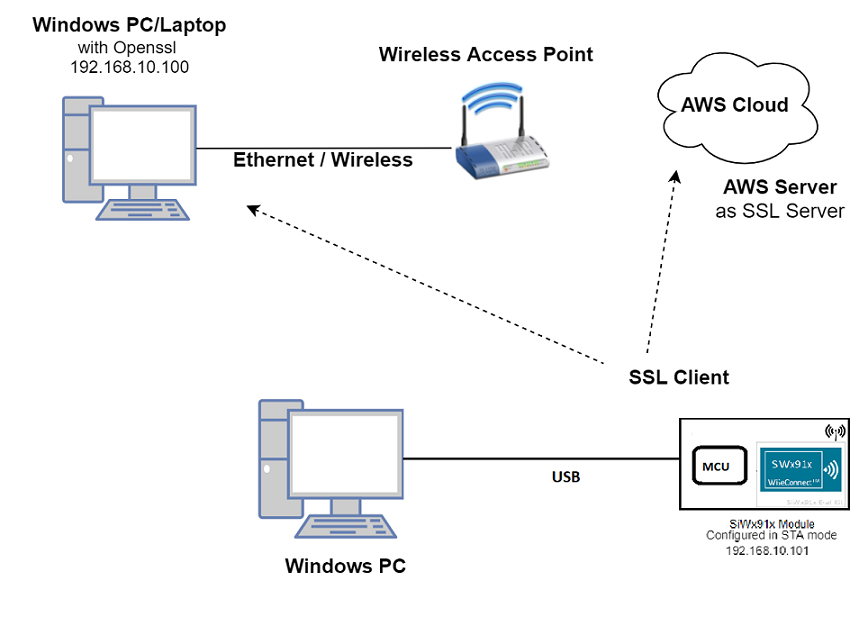
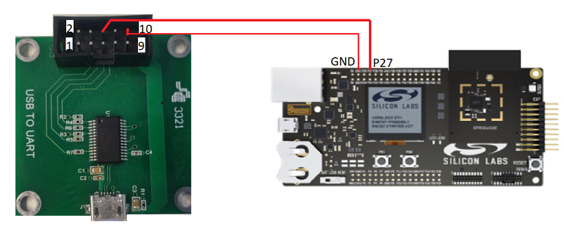
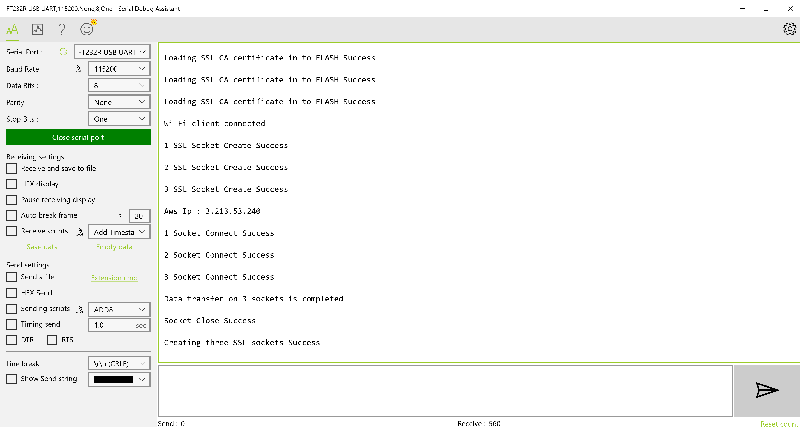

# Three SSL Client Sockets

## 1 Purpose/Scope

This application demonstrates how SiWx91x will connect to three different SSL servers with three different set of SSL certificates and loading certificates into the FLASH.

## 2 Prerequisites/Setup Requirements

### 2.1 Hardware Requirements

- Windows PC
- AWS server information like domain name running in the cloud which supports SSL connection.
- Wireless Access Point
- TCP server over SSL running in Windows PC (This application uses OpenSSL to create TCP server over SSL)
- SiWx91x Wi-Fi Evaluation Kit
- **SoC Mode**:
  - Silicon Labs [(BRD4325A, BRD4325B, BRD4325C, BRD4325G, BRD4388A)](https://www.silabs.com/)
- **NCP Mode**:
  - Silicon Labs [BRD4180B](https://www.silabs.com/)
  - Host MCU Eval Kit. This example has been tested with:
    - Silicon Labs [WSTK + EFR32MG21](https://www.silabs.com/development-tools/wireless/efr32xg21-bluetooth-starter-kit)

### 2.2 Software Requirements

- Simplicity Studio IDE

  - Download the latest [Simplicity Studio IDE](https://www.silabs.com/developers/simplicity-studio)
  - Follow the [Simplicity Studio user guide](https://docs.silabs.com/simplicity-studio-5-users-guide/1.1.0/ss-5-users-guide-getting-started/install-ss-5-and-software#install-ssv5) to install Simplicity Studio IDE

### 2.3 Setup Diagram

#### SoC Mode 


#### NCP Mode  



Follow the [Getting Started with Wiseconnect3 SDK](https://docs.silabs.com/wiseconnect/latest/wiseconnect-getting-started/) guide to set up the hardware connections and Simplicity Studio IDE.

## 3 Project Environment

- Ensure the SiWx91x loaded with the latest firmware following the [Upgrade Si91x firmware](https://docs.silabs.com/wiseconnect/latest/wiseconnect-getting-started/getting-started-with-soc-mode#upgrade-si-wx91x-connectivity-firmware)

- Ensure the latest Gecko SDK along with the extension WiSeConnect3 is added to Simplicity Studio.

### 3.1 Creating the project

#### 3.1.1 SoC mode

- Ensure the SiWx91x set up is connected to your PC.

- In the Simplicity Studio IDE, the SiWx91x SoC board will be detected under **Debug Adapters** pane as shown below.

  ****

#### 3.1.2 NCP mode

- Ensure the EFx32 and SiWx91x set up is connected to your PC.

- In the Simplicity Studio IDE, the EFR32 board will be detected under **Debug Adapters** pane as shown below.

  ****

### 3.2 Importing the project

- Studio should detect your board. Your board will be shown here. Click on the board detected and go to **EXAMPLE PROJECTS & DEMOS** section 

#### SOC Mode

- Select **Wi-Fi - Three TLS Concurrent Client Sockets** test application

  ****

- Click 'Create'. The "New Project Wizard" window appears. Click 'Finish'

  ****

### 3.3 Set up for application prints

#### 3.3.1 Teraterm set up - for BRD4325A, BRD4325B, BRD4325C, BRD4325G

You can use either of the below USB to UART converters for application prints.

1. Set up using USB to UART converter board.

   - Connect Tx (Pin-6) to P27 on WSTK
   - Connect GND (Pin 8 or 10) to GND on WSTK

   ****

2. Set up using USB to UART converter cable.

   - Connect RX (Pin 5) of TTL convertor to P27 on WSTK
   - Connect GND (Pin1) of TTL convertor to GND on WSTK

   ****

3. Open the Teraterm tool.

   - For SoC mode, choose the serial port to which USB to UART converter is connected and click on **OK**.

     ****

**Note:** For Other 917 SoC boards please refer section #3.3.2

#### 3.3.2 **Teraterm set up - for NCP and SoC modes**

1. Open the Teraterm tool.

- choose the J-Link port and click on **OK**.
    
    ****

2. Navigate to the Setup → Serial port and update the baud rate to **115200** and click on **OK**.

    ****

    ****

## 4 Application Build Environment

The application can be configured to suit user requirements and development environment.
Read through the following sections and make any changes needed.

### 4.1 Configure the application  

The application can be configured to suit user requirements and development environment. Read through the following sections and make any changes needed.

#### 4.1.1 In the Project explorer pane, expand the **config** folder and open the **sl_net_default_values.h** file. Configure the following parameters to enable your Silicon Labs Wi-Fi device to connect to your Wi-Fi network

**STA instance related parameters**

	- DEFAULT_WIFI_CLIENT_PROFILE_SSID refers to the name with which Wi-Fi network that shall be advertised and Si91X module is connected to it.

  	```c
  	#define DEFAULT_WIFI_CLIENT_PROFILE_SSID               "YOUR_AP_SSID"      
  	```

	- DEFAULT_WIFI_CLIENT_CREDENTIAL refers to the secret key if the Access point is configured in WPA-PSK/WPA2-PSK security modes.

  	```c 
  	#define DEFAULT_WIFI_CLIENT_CREDENTIAL                 "YOUR_AP_PASSPHRASE" 
  	```
  
	- DEFAULT_WIFI_CLIENT_SECURITY_TYPE refers to the security type if the Access point is configured in WPA/WPA2 or mixed security modes.

  	```c
  	#define DEFAULT_WIFI_CLIENT_SECURITY_TYPE               SL_WIFI_WPA2 
  	```
  
- Other STA instance configurations can be modified if required in `default_wifi_client_profile` configuration structure.

2. Configure the following parameters in **app.c** to test three_ssl_client_sockets app as per requirements  

```c
   #define SERVER_PORT1   <remote port>       // Remote server port
   #define SERVER_PORT2   <remote port>       // Remote server port cloud.
   #define SERVER_PORT3   <remote port>       //  remote peer/ which is running on cloud.   
   #define SERVER_ADDR    "192.168.1.108"     // Remote server IP address
```

If certificates are not there in flash, then ssl handshake will fail.
  
AWS_DOMAIN_NAME refers to domain name of the AWS server

```c
   #define AWS_DOMAIN_NAME   "a25jwtlmds8eip-ats.iot.us-east-2.amazonaws.com"
```

### 4.2 Build the application

Follow the below steps for the successful execution of the application.

- SoC mode: Build as  TLS Client Example

  ****

- NCP mode:

### 4.3 Run and Test the application

After making any custom configuration changes required, build, download and run the application as below.

- Copy the certificates server-cert and server-key into Openssl/bin folder in the Windows PC (Remote PC).

**Note!**
 > All the certificates are given in the SDK. Path: `<SDK>/resources/certificates`

- In Windows PC (Remote PC) which is connected to AP, run the Openssl server by giving the following command

```sh
    > Openssl.exe s_server -accept<SERVER_PORT> -cert <server_certificate_file_path> -key <server_key_file_path> -tls<tls_version>

   Example: openssl.exe s_server -accept 5001 -cert server-cert.pem -key server-key.pem -tls1
```


- Make sure the SSL server is running in the cloud (check with the domain name)

- After the program gets executed, SiWx91x would be connected to Access point having the configuration same that of in the application and get IP.

- The Device which is configured as SSL client will connect to three different remote SSL servers.

### 4.4 Application Output

****
****