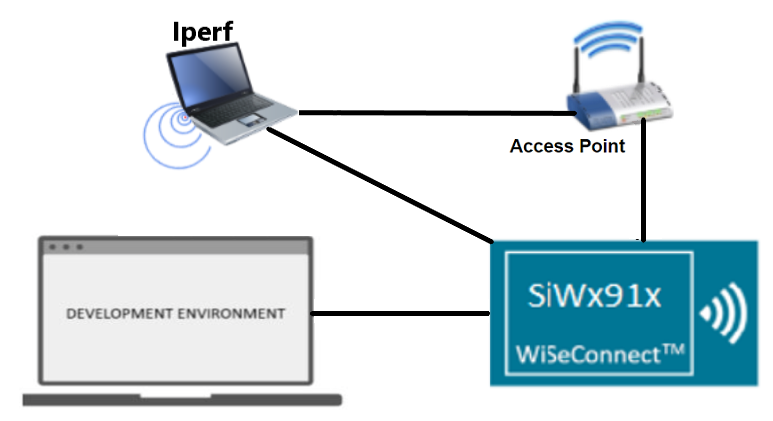

# TLS Client

## Table of Contents

- [Purpose/Scope](#purposescope)
- [Prerequisites/Setup Requirements](#prerequisitessetup-requirements)
  - [Hardware Requirements](#hardware-requirements)
  - [Software Requirements](#software-requirements)
  - [Setup Diagram](#setup-diagram)
- [Getting Started](#getting-started)
- [Application Build Environment](#application-build-environment)
- [Test the Application](#test-the-application)

## Purpose/Scope

This application demonstrates how to open a TCP client socket and use this TCP client socket with secure connection using SSL and send the data on socket.

## Prerequisites/Setup Requirements

### Hardware Requirements

- A Windows PC.
- SoC Mode:
  - Silicon Labs [BRD4325A, BRD4325B, BRD4325C, BRD4325G, BRD4388A](https://www.silabs.com/)
- NCP Mode:
  - Silicon Labs [BRD4180B](https://www.silabs.com/) **AND**
  - Host MCU Eval Kit. This example has been tested with:
    - Silicon Labs [WSTK + EFR32MG21](https://www.silabs.com/development-tools/wireless/efr32xg21-bluetooth-starter-kit)

### Software Requirements

- Simplicity Studio
- Windows PC (Remote PC) with openssl application

### Setup Diagram

  

## Getting Started

Refer to the instructions [here](https://docs.silabs.com/wiseconnect/latest/wiseconnect-getting-started/) to:

- Install Studio and WiSeConnect 3 extension
- Connect your device to the computer
- Upgrade your connectivity firmware
- Create a Studio project

## Application Build Environment

The application can be configured to suit user requirements and development environment. Read through the following sections and make any changes needed.

- The application uses the default configurations as provided in the **default_wifi_ap_profile** in ``sl_net_default_values.h`` and user can choose to configure these parameters as needed.

> **Note:**
>
> - For NCP mode, following defines have to enabled manually in preprocessor setting of example project
>
> - For 917 A0 expansion board, enable `CHIP_917 = 1`
> - For 917 B0 1.2 expansion board, enable `CHIP_917 = 1`, `CHIP_917B0 = 1`
> - For 917 B0 2.0 expansion board, enable `CHIP_917 = 1`, `CHIP_917B0 = 1`, `SI917_RADIO_BOARD_V2 = 1` (This is enabled by default for all examples)

- In the Project Explorer pane, expand the **config** folder and open the **sl_net_default_values.h** file. Configure the following parameters to enable your Silicon Labs Wi-Fi device to connect to your Wi-Fi network.

  - STA instance related parameters

    - DEFAULT_WIFI_CLIENT_PROFILE_SSID refers to the name with which Wi-Fi network that shall be advertised and Si91X module is connected to it.

      ```c
      #define DEFAULT_WIFI_CLIENT_PROFILE_SSID               "YOUR_AP_SSID"      
      ```

    - DEFAULT_WIFI_CLIENT_CREDENTIAL refers to the secret key if the Access point is configured in WPA-PSK/WPA2-PSK security modes.

      ```c
      #define DEFAULT_WIFI_CLIENT_CREDENTIAL                 "YOUR_AP_PASSPHRASE" 
      ```

    - DEFAULT_WIFI_CLIENT_SECURITY_TYPE refers to the security type if the Access point is configured in WPA/WPA2 or mixed security modes.

      ```c
      #define DEFAULT_WIFI_CLIENT_SECURITY_TYPE              SL_WIFI_WPA2 
      ```
  
  - Other STA instance configurations can be modified if required in `default_wifi_client_profile` configuration structure.

  - Configure the following parameters in ``app.c`` to test tls client app as per requirements

  - Client/Server IP Settings

    ```c
    #define SERVER_PORT1        <remote_port>      // Remote server port
    #define SERVER_PORT2        <remote_port>      // Remote server port
    #define SERVER_IP          "192.168.0.100"     // Remote server IP address
    ```

- `sl_wifi_device_configuration_t` from `app.c` should be modified as per below requirements

  **sl_wifi_set_certificate()** API expects the certificate in the form of linear array. Convert the pem certificate into linear array form using python script provided in the SDK `<SDK>/resources/scripts/certificate_script.py`.

   For example : If the certificate is ca-certificate.pem, enter the command in the following way:
   python certificate_script.py ca-certificate.pem 
   The script will generate ca-certificate.pem in which one linear array named ca-certificate contains the certificate.

  Root CA certificate needs to be converted as mentioned above.

  After the conversion, place the converted file in `<SDK>/resources/certificates/` path and include the certificate file in app.c

  - For HTTPs Apache server

  ```c
  // Certificate includes
  #include "cacert.pem"
  
  // Load Security Certificates
  status = sl_wifi_set_certificate(SL_TLS_SSL_CA_CERTIFICATE, cacert, (sizeof(cacert) - 1));
  ```
## Test the Application

Refer to the instructions [here](https://docs.silabs.com/wiseconnect/latest/wiseconnect-getting-started/) to:

- Build the application
- Flash, run and debug the application

  

- After making any custom configuration changes required, build, download and run the application as below.
- Copy the certificates server-cert and server-key into Openssl/bin folder in the Windows PC2 (Remote PC).
- In Windows PC2 (Remote PC) which is connected to AP, run the Openssl and run two SSL servers by giving the following command

  ```sh
      > Openssl.exe s_server -accept<SERVER_PORT> -cert <server_certificate_file_path> -key <server_key_file_path> -tls<tls_version>

      Example:
      > openssl.exe s_server -accept 5002 -cert server-cert.pem -key server-key.pem -tls1
  ```

- After the program gets executed, SiWx91x EVK would be connected to access point having the configuration same as that of in the application and get IP.
- The SiWx91x EVK which is configured as SSL client will connect to remote SSL server and sends number of packets configured in NUMBER_OF_PACKETS.

- EVK connects to remote SSL server-1

  
    
- EVK connects to remote SSL server-2
  
  