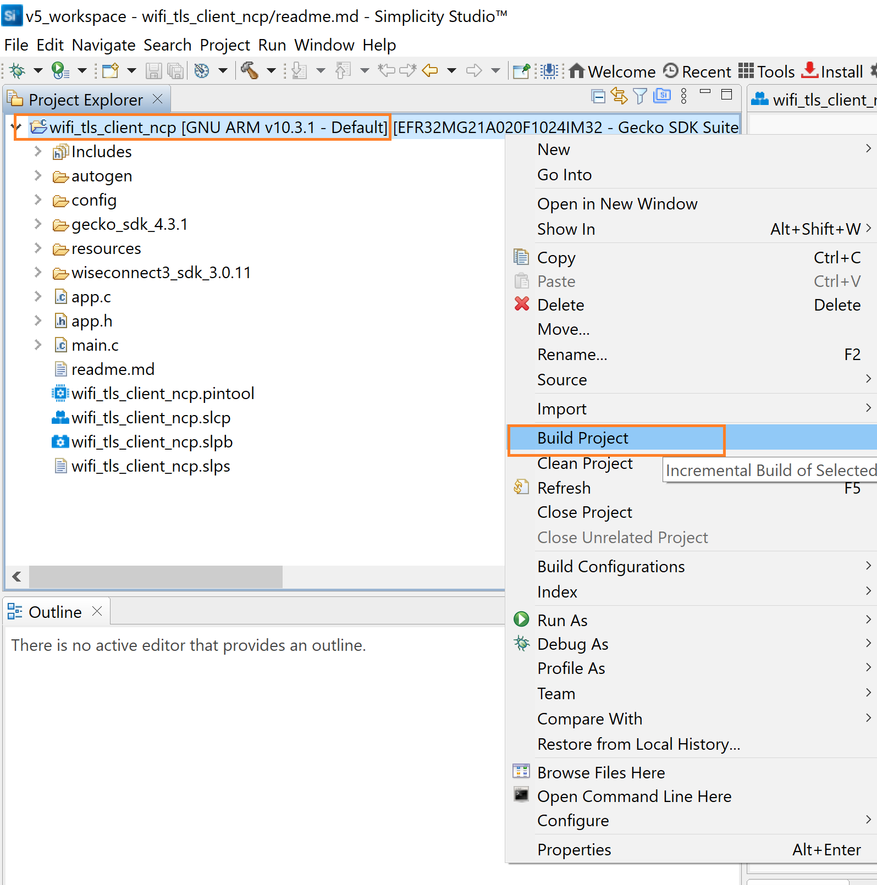

# TLS Client

## 1 Purpose/Scope

This application demonstrates how to open a TCP client socket and use this TCP client socket with secure connection using SSL and send the data on socket.

## 2 Prerequisites/Setup Requirements

### 2.1 Hardware Requirements

- A Windows PC.
- Windows PC (Remote PC) with openssl application

- **SoC Mode**: 
  - Silicon Labs [BRD4325A,BRD4325B, BRD4325G](https://www.silabs.com/)
- **NCP Mode**:
  - Silicon Labs [(BRD4180A, BRD4280B)](https://www.silabs.com/) **AND**
  - Host MCU Eval Kit. This example has been tested with:
    - Silicon Labs [WSTK + EFR32MG21](https://www.silabs.com/development-tools/wireless/efr32xg21-bluetooth-starter-kit)

### 2.2 Software Requirements

- Simplicity Studio IDE 

  - Download the latest [Simplicity Studio IDE](https://www.silabs.com/developers/simplicity-studio)
  - Follow the [Simplicity Studio user guide](https://docs.silabs.com/simplicity-studio-5-users-guide/1.1.0/ss-5-users-guide-getting-started/install-ss-5-and-software#install-ssv5) to install Simplicity Studio IDE

### 2.3 Setup Diagram

#### SoC Mode  


Follow the [Getting Started with SiWx91x SoC](https://docs.silabs.com/) guide to set up the hardware connections and Simplicity Studio IDE.

#### NCP Mode  


Follow the [Getting Started with EFx32](https://docs.silabs.com/rs9116-wiseconnect/latest/wifibt-wc-getting-started-with-efx32/) guide to setup the hardware connections and Simplicity Studio IDE.

**NOTE**: 

- The Host MCU platform (EFR32MG21) and the SiWx91x interact with each other through the SPI interface. 

## 3 Project Environment

- Ensure the SiWx91x loaded with the latest firmware following the [Getting started with a PC](https://docs.silabs.com/rs9116/latest/wiseconnect-getting-started)

### 3.1 Creating the project

#### 3.1.1 SoC mode

- In the Simplicity Studio IDE, the SiWx91x SoC board will be detected under **Debug Adapters** pane as shown below.

    ****

- Ensure the latest Gecko SDK along with the  WiSeConnect3 extension is added to Simplicity Studio.

- Studio should detect your board. Your board will be shown here. Click on the board detected and go to **EXAMPLE PROJECTS & DEMOS** section.

- Filter for Wi-Fi examples from the Gecko SDK added. For this, check the *Wi-Fi* checkbox under **Wireless Technology** 

    ****

- Click 'Create'. The "New Project Wizard" window appears. Click 'Finish'

    ****

#### 3.1.2 NCP mode

- In the Simplicity Studio IDE, the EFR32 board will be detected under **Debug Adapters** pane as shown below.

  ****

- Ensure the latest Gecko SDK along with the  WiSeConnect3 extension is added to  Simplicity Studio.

- Go to the 'EXAMPLE PROJECT & DEMOS' tab and select Wi-Fi - TLS Client example.

  ****

- Click 'Create'. The "New Project Wizard" window appears. Click 'Finish'

   ****

### 3.2 Set up for application prints

#### 3.2.1 SoC mode

  You can use either of the below USB to UART converters for application prints.

1. Set up using USB to UART converter board.

   - Connect Tx (Pin-6) to P27 on WSTK
   - Connect GND (Pin 8 or 10) to GND on WSTK

      

2. Set up using USB to UART converter cable.

   - Connect RX (Pin 5) of TTL convertor to P27 on WSTK
   - Connect GND (Pin1) of TTL convertor to GND on WSTK

      

**Tera Term set up - for NCP and SoC modes**

1. Open the Tera Term tool.

 - For SoC mode, choose the serial port to which USB to UART converter is connected and click on **OK**. 

      ****

 - For NCP mode, choose the J-Link port and click on **OK**.
    
      ****

2. Navigate to the Setup → Serial port and update the baud rate to **115200** and click on **OK**.

 ****

 ****

## 4 Application Build Environment

The application can be configured to suit user requirements and development environment. Read through the following sections and make any changes needed.

### 4.1 Configure the application

- The application uses the default configurations as provided in the **default_wifi_ap_profile** in **sl_net_default_valus.h** and user can choose to configure these parameters as needed.

1. In the Project explorer pane, expand the **config** folder and open the **sl_net_default_values.h** file. Configure the following parameters to enable your Silicon Labs Wi-Fi device to connect to your Wi-Fi network.

- **STA instance related parameters**

  - DEFAULT_WIFI_CLIENT_PROFILE_SSID refers to the name with which the SiWx91x SoftAP's Wi-Fi network shall be advertised.

     ```c
     #define DEFAULT_WIFI_CLIENT_PROFILE_SSID               "YOUR_AP_SSID"      
     ```

  - DEFAULT_WIFI_CLIENT_CREDENTIAL refers to the secret key if the Access point is configured in WPA-PSK/WPA2-PSK security modes.

     ```c 
     #define DEFAULT_WIFI_CLIENT_CREDENTIAL                 "YOUR_AP_PASSPHRASE" 
     ```

  - Other STA instance configurations can be modified if required in `default_wifi_client_profile` configuration structure.

   2. Configure the following parameters in **app.c** to test tls client app as per requirements

  - **Client/Server IP Settings**

    ```c
    #define SERVER_PORT1        <remote_port>      // Remote server port
    #define SERVER_PORT2        <remote_port>      // Remote server port
    #define SERVER_IP          "192.168.0.100"     // Remote server IP address
    ```

### 4.2 Build the application

- SoC mode: Build as  TLS Client Example

  ****

- NCP mode: 

### 4.3 Run and Test the application

- After making any custom configuration changes required, build, download and run the application as below.
- Copy the certificates server-cert and server-key into Openssl/bin folder in the Windows PC2 (Remote PC).
- In Windows PC2 (Remote PC) which is connected to AP, run the Openssl and run two SSL servers by giving the following command

```sh
    > Openssl.exe s_server -accept<SERVER_PORT> -cert <server_certificate_file_path> -key <server_key_file_path> -tls<tls_version>

    Example:
    > openssl.exe s_server -accept 5002 -cert server-cert.pem -key server-key.pem -tls1
```

- After the program gets executed, SiWx91x EVK would be connected to access point having the configuration same as that of in the application and get IP.
- The SiWx91x EVK which is configured as SSL client will connect to remote SSL server and sends number of packets configured in NUMBER_OF_PACKETS.

EVK connects to remote SSL server-1
  
EVK connects to remote SSL server-2

- Now for debug right click on project and click on Debug As->Silicon Labs ARM Program as shown in below image.
- SoC
    
    ****

- NCP

    ****

### 4.4 Application Output

  ****
