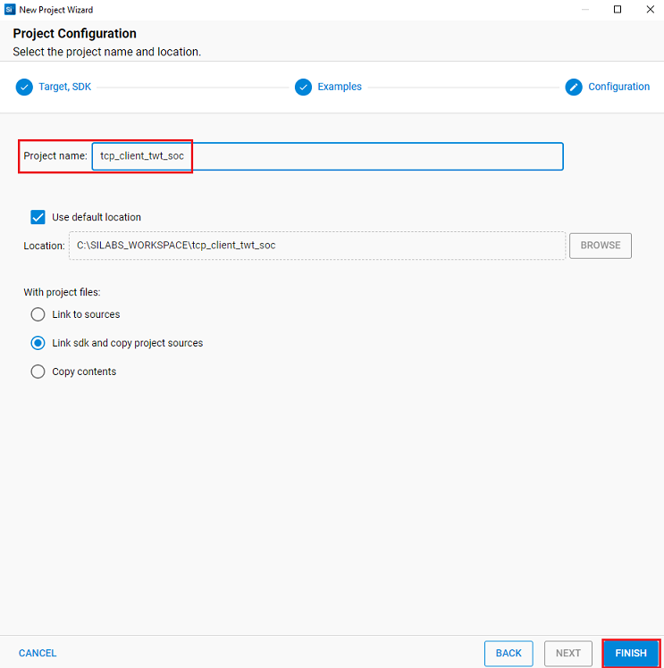
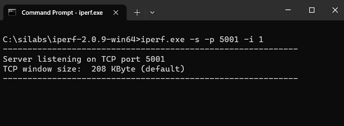
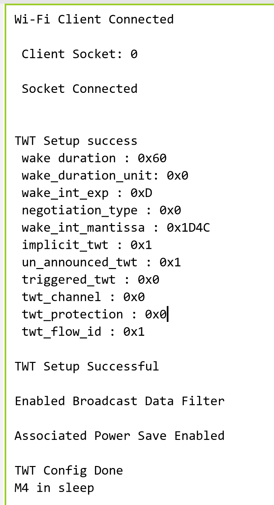
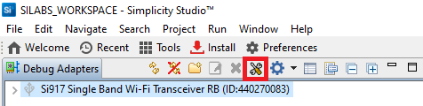
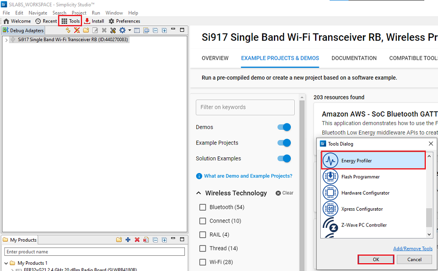

# TCP Client with TWT feature

## 1 Purpose/Scope

This application demonstrates the procedure to setup TWT session and configure the SiWx91x in TCP client role.

In this application, the SiWx91x connects to a Wi-Fi access point, obtains an IP address, connects to Iperf server running on a remote PC and maintains  TCP Socket connection and periodically wakes up as per the configured TWT wakeup interval in powersave.

## 2 Prerequisites/Setup Requirements

### 2.1 Hardware Requirements  

- Windows PC
- Wi-Fi Access Point with 11ax and TWT responder mode support.
- PC2 (Remote PC) with TCP server application (iperf)
- **SoC Mode**: 
  - Silicon Labs [BRD4325A,BRD4325B, BRD4325G](https://www.silabs.com/)
- **NCP Mode**:
  - Silicon Labs [(BRD4180A, BRD4280B)](https://www.silabs.com/)
  - Host MCU Eval Kit. This example has been tested with Silicon Labs [WSTK + EFR32MG21](https://www.silabs.com/development-tools/wireless/efr32xg21-bluetooth-starter-kit) 

### 2.2 Software Requirements

- Simplicity Studio IDE 

  - Download the latest [Simplicity Studio IDE](https://www.silabs.com/developers/simplicity-studio)
  - Follow the [Simplicity Studio user guide](https://docs.silabs.com/simplicity-studio-5-users-guide/1.1.0/ss-5-users-guide-getting-started/install-ss-5-and-software#install-ssv5) to install Simplicity Studio IDE

- [Iperf Application](https://iperf.fr/iperf-download.php)

### 2.3 Setup Diagram

#### SoC Mode 


  
Follow the [Getting Started with SiWx91x SoC](https://docs.silabs.com/) guide to set up the hardware connections and Simplicity Studio IDE.

#### NCP Mode  


Follow the [Getting Started with EFx32](https://docs.silabs.com/rs9116-wiseconnect/latest/wifibt-wc-getting-started-with-efx32/) guide to setup the hardware connections and Simplicity Studio IDE.

## 3 Project Environment

1. Ensure the SiWx91x loaded with the latest firmware following the [Getting started with a PC](https://docs.silabs.com/rs9116/latest/wiseconnect-getting-started)

2. Ensure the EFx32 and SiWx91x set up is connected to your PC.

### 3.1 Creating the project

#### 3.1.1 SoC mode

- In the Simplicity Studio IDE, the SiWx91x SoC board will be detected under **Debug Adapters** pane as shown below.

    ****

- Ensure the latest Gecko SDK along with the WiSeConnect3 extension is added to Simplicity Studio.
- Studio should detect your board. Your board will be shown here. Click on the board detected and go to **EXAMPLE PROJECTS & DEMOS** section.

- Filter for Wi-Fi examples from the Gecko SDK added. For this, check the *Wi-Fi* checkbox under **Wireless Technology** 

    

- Click 'Create'. The "New Project Wizard" window appears. Click 'Finish'

  

#### 3.1.2 NCP mode

- In the Simplicity Studio IDE, the EFR32 board will be detected under **Debug Adapters** pane as shown below.

    ****

- Ensure the latest Gecko SDK along with the WiSeConnect3 extension is added to Simplicity Studio.

- Go to the 'EXAMPLE PROJECT & DEMOS' tab and select Wi-Fi - NCP Powersave Standby Associated application

  

- Click 'Create'. The "New Project Wizard" window appears. Click 'Finish'

  

### 3.2 Set up for application prints

#### 3.2.1 SoC mode

  You can use either of the below USB to UART converters for application prints.

1. Set up using USB to UART converter board.

   - Connect Tx (Pin-6) to P27 on WSTK
   - Connect GND (Pin 8 or 10) to GND on WSTK

      

2. Set up using USB to UART converter cable.

   - Connect RX (Pin 5) of TTL convertor to P27 on WSTK
   - Connect GND (Pin1) of TTL convertor to GND on WSTK

      

**Tera Term set up - for NCP and SoC modes**

1. Open the Tera Term tool.

 - For SoC mode, choose the serial port to which USB to UART converter is connected and click on **OK**. 

      ****

 - For NCP mode, choose the J-Link port and click on **OK**.
    
      ****

2. Navigate to the Setup → Serial port and update the baud rate to **115200** and click on **OK**.

 ****

 ****

## 4 Application Build Environment

The application can be configured to suit your requirements and development environment. 

### 4.1 Configure the application

1. In the Project explorer pane, expand the **config** folder and open the **sl_net_default_values.h** file. Configure the following parameters to enable your Silicon Labs Wi-Fi device to connect to your Wi-Fi network.

- **STA instance related parameters**

  - DEFAULT_WIFI_CLIENT_PROFILE_SSID refers to the name with which the SiWx91x SoftAP's Wi-Fi network shall be advertised.

     ```c
     #define DEFAULT_WIFI_CLIENT_PROFILE_SSID               "YOUR_AP_SSID"      
     ```

  - DEFAULT_WIFI_CLIENT_CREDENTIAL refers to the secret key if the Access point is configured in WPA-PSK/WPA2-PSK security modes.

     ```c 
     #define DEFAULT_WIFI_CLIENT_CREDENTIAL                 "YOUR_AP_PASSPHRASE" 
     ```

  - Other STA instance configurations can be modified if required in `default_wifi_client_profile` configuration structure.

2. Configure the following parameters in **app.c** to test throughput app as per requirements
    - `SERVER_PORT` is the remote TCP server port number on the PC running Iperf.
    - `SERVER_IP` is the remote TCP server IP address on the PC running Iperf. 
    - `NUMBER_OF_PACKETS` controls the number of packets sent to the remote TCP server.

    ```c
    #define SERVER_IP   "192.168.0.247"
    #define SERVER_PORT         5001
    #define NUMBER_OF_PACKETS   1000
    ```

#### iTWT Configuration

    - TWT (Target Wake Time) setup is only supported in 11ax (HE) connectivity. Please follow below procedure to enable TWT.
    - In the yakka file enable HIGH_EFFICIENCY_PARAMS_SUPPORT and TWT_SUPPORT.

#### iTWT Setup Configuration

    ```c
    int32_t sl_wifi_enable_target_wake_time(sl_wifi_twt_request_t *twt_request)
    ```

### iTWT Teardown Configuration

    ```c
    int32_t sl_wifi_disable_target_wake_time(sl_wifi_twt_request_t *twt_request)
    ```

    Parameters of twt_request are explained below :

    - **twt_enable**: This parameter tells whether the twt is used for setup or teardown. 1 indicates that it is setup and 0 indicates it is teardown.
    - **twt_flow_id**: This parameter identifies the type data being sent by the device. The AP will use the flow ID to determine when to wake up the device for communication. Allowed value range is 0 - 7 or 0xFF.
    - **wake_duration**: This is the nominal minimum wake duration of TWT. This is the time for which DUT will be in wake state for Transmission or reception of data. Allowed values range is  0-255.
    - **wake_duration_unit**: This parameter defines unit for wake_duration. Allowed values are  0 (256uS) and 1 (1024uS).
    - **wake_duration_tol**: This is the tolerance allowed for wake duration in case of suggest TWT. Received TWT wake duration from AP will be validated against tolerance limits and decided if TWT config received is in acceptable range. Allowed values are 0-255.
    - **wake_int_exp**: TWT Wake interval exponent. It is exponent to base 2. Allowed values are 0 - 31.
    - **wake_int_exp_tol**: This is the allowed tolerance for wake_int_exp in case of suggest TWT request. Received TWT wake interval exponent from AP will be validated against tolerance limits and decided if TWT config received is in acceptable range. Allowed values are 0 - 31.
    - **wake_int_mantissa**: This is the TWT wake interval mantissa. Allowed values are 0-65535.
    - **wake_int_mantissa_tol**: This is tolerance allowed for wake_int_mantissa in case of suggest TWT. Received TWT wake interval mantissa from AP will be validated against tolerance limits and decided if TWT config received is in acceptable range. Allowed values are 0-65535.
    - **implicit_twt**: If enabled (1), the TWT requesting STA calculates the Next TWT by adding a fixed value to the current TWT value. Explicit TWT is currently not allowed.
    - **un_announced_twt**: If enabled (1), TWT requesting STA does not announce its wake up to AP through PS-POLLs or UAPSD Trigger frames.
    - **triggered_twt**: If enabled(1), atleast one trigger frame is included in the TWT Service Period(TSP).
    - **twt_channel**: Currently this configuration is not supported. Allowed values are 0-7.
    - **twt_protection**:  If enabled (1), TSP is protected. This is negotiable with AP. Currently not supported. Only zero is allowed.
    - **restrict_tx_outside_tsp**: If enabled (1), any Tx outside the TSP is restricted. Else, TX can happen outside the TSP also.
    - **twt_retry_limit**: This is the maximum number of retries allowed, if the TWT response frame is not recieved for the sent TWT request frame. Allowed values are 0 - 15.
    - **twt_retry_interval**: The interval, in seconds, between two twt request retries. Allowed values are 5 - 255.
    - **req_type**: This is the TWT request type.
    >
    > - 0 - Request TWT
    > - 1 - Suggest TWT
    > - 2 - Demand TWT

    Given below are sample configurations.

    ```c
            twt_request.twt_enable               = 1;
            twt_request.twt_flow_id              = 1;
            twt_request.wake_duration            = 0x60;
            twt_request.wake_duration_unit       = 0;
            twt_request.wake_duration_tol        = 0x60;
            twt_request.wake_int_exp             = 13;
            twt_request.wake_int_exp_tol         = 13;
            twt_request.wake_int_mantissa        = 0x1D4C;
            twt_request.wake_int_mantissa_tol    = 0x1D4C;
            twt_request.implicit_twt             = 1;
            twt_request.un_announced_twt         = 1;
            twt_request.triggered_twt            = 0;
            twt_request.twt_channel              = 0;
            twt_request.twt_protection           = 0;
            twt_request.restrict_tx_outside_tsp  = 1;
            twt_request.twt_retry_limit          = 6;
            twt_request.twt_retry_interval       = 10;
            twt_request.req_type                 = 1;
            twt_request.negotiation_type         = 0;
    ```

    > Note:
    >
    > - TWT Wake duration depends on the wake duration unit. For example, for the above configuration, wake duration value is  (0xE0 * 256 = 57.3 msec).
    > - TWT Wake interval is calculated as mantissa *2 ^ exp.  For example, for the above configuration, wake interval value is (0x1B00* 2^13  = 55.2 sec).
    > - Configuring TWT Wake interval beyond 1 min might lead to disconnections from the AP.
    > - There might be disconnections while using TWT with wake interval > 4sec when connected to an AP with non-zero GTK key renewal time.
    > - Keep Alive timeout should be non-zero when negotiated TWT setup is **unannounced**, otherwise there might be disconnections.

### 4.2 Build the application

- SoC mode: Build as twt_tcp_client Example

    ****

- NCP mode: 

    ****

### 4.3 Run and Test the application

- Once the build was successful, right click on project and click on Debug As->Silicon Labs ARM Program as shown in below image.

    

- Start a TCP server using the below command in command prompt.

> `C:\ iperf.exe –s -p <SERVER_PORT> -i 1` 

  

> If the IPerf server does not start and gives an error in the form of "Access Denied", the user can resolve this error by running the command prompt as an administrator.

- When the twt application runs, SiWx91x scans and connect to the Wi-Fi access point and obtains an IP address. After a successful connection, the device connects to the tcp server socket and then sends the enable twt request API call. If TWT session setup is successful, the following notification will be printed with TWT Response parameters from the AP.
 
  

### 4.4 Application Output

- SoC mode:

  

- NCP mode:

  

### 4.5 Additional Information

#### Using Simplicity Studio Energy Profiler for current measurement
  
  After flashing the application code to the module. Energy profiler can be used for current consumption measurements.

- Go to launcher → Debug Adapters pane and click on the board name.
  
  

- Click on Device configuration symbol
  
  

- Open the device configuration tab
  
  

- Change the Target part name to "EFR32MG21A020F1024IM32"

  

- Change board name to "BRD4180B", click "OK"

  

- From tools, choose Energy Profiler and click "OK"

  

- From Quick Access, choose Start Energy Capture option 

  

**NOTE** : The target part and board name have to be reverted to default to flash application binary. 

  

# Expected output in Energy Profiler

  

**NOTE**: The average current consumption may vary based on the environment, the above image is for reference 
