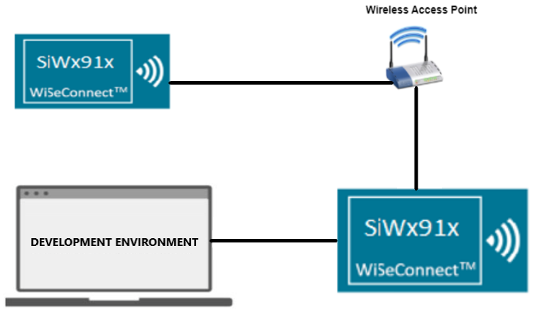

# Wi-Fi - TWT Use case demo app

- [Purpose/Scope](#purposescope) 
- [Prerequisites/Setup Requirements](#prerequisitessetup-requirements)
  - [Hardware Requirements](#hardware-requirements)
  - [Software Requirements](#software-requirements)
  - [Setup Diagram](#setup-diagram)
- [Getting Started](#getting-started)
- [Application Build Environment](#application-build-environment)
  - [Configure the Application](#configure-the-application)
  - [Application Configuration](#application-configuration)
- [Test the Application](#test-the-application)

## Purpose/Scope

The **TWT Use Case Remote App** is an application that utilizes both TCP and UDP server sockets. Once a TCP client is connected, a trigger is sent over the TCP socket. Following this, in the scenario of a door lock, TCP data is received, while UDP data is received in the case of a camera. This application does **not** include TWT sleep feature and is intended to be used in conjunction with the TWT Use Case Demo App.

## Prerequisites/Setup Requirements

### Hardware Requirements  

- PC or Mac.
- Linux PC or Cygwin on Windows (to build and run the TCP server source provided)
- Wi-Fi Access point with a connection to the internet
- **SoC Mode**:
  - Standalone
    - BRD4002A Wireless pro kit mainboard [SI-MB4002A]
    - Radio Boards 
  	  - BRD4338A [SiWx917-RB4338A]
      - BRD4339B [SiWx917-RB4339B]
  	  - BRD4340A [SiWx917-RB4340A]
  - Kits
  	- SiWx917 Pro Kit [Si917-PK6031A](https://www.silabs.com/development-tools/wireless/wi-fi/siwx917-pro-kit?tab=overview)
  	- SiWx917 Pro Kit [Si917-PK6032A]
  	
- **NCP Mode**:
  - Standalone
    - BRD4002A Wireless pro kit mainboard [SI-MB4002A]
    - EFR32xG24 Wireless 2.4 GHz +10 dBm Radio Board [xG24-RB4186C](https://www.silabs.com/development-tools/wireless/xg24-rb4186c-efr32xg24-wireless-gecko-radio-board?tab=overview)
    - NCP EFR Expansion Kit with NCP Radio board (BRD4346A + BRD8045A) [SiWx917-EB4346A]
  - Kits
  	- EFR32xG24 Pro Kit +10 dBm [xG24-PK6009A](https://www.silabs.com/development-tools/wireless/efr32xg24-pro-kit-10-dbm?tab=overview)

### Software Requirements

- Simplicity Studio 
- [Iperf Application](https://iperf.fr/iperf-download.php)

### Setup Diagram

 

## Getting Started

Refer to the instructions [here](https://docs.silabs.com/wiseconnect/latest/wiseconnect-getting-started/) to:

- Install Studio and WiSeConnect 3 extension
- Connect your device to the computer
- Upgrade your connectivity firmware
- Create a Studio project

## Application Build Environment

The application can be configured to suit your requirements and development environment.

### Configure the Application

In the Project Explorer pane, expand the **config** folder and open the **sl_net_default_values.h** file. Configure the following parameters to enable your Silicon Labs Wi-Fi device to connect to your Wi-Fi network.

This application is designed to be used alongside the TWT Use Case Demo Application. Together, these two applications simulate scenarios involving door locks and cameras. 

In the camera scenario, the remote application (Device A) sends a command to the DUT (Device B, where the TWT Use Case Application is running). Upon receiving the command, Device B responds by sending UDP data (equivalent to camera streaming) to the remote application. 

In the door lock scenario, Device B sends a TCP response (equivalent to door lock status response) to the remote application (Device A) upon receiving the command from Device A. 

To support these scenarios, this app creates a TCP server to listen for connections and trigger commands to Device B periodically. After transmitting the command, Device A waits for a TCP/UDP response based on the use case being executed. 

On the other end, Device B is set up as a TCP client and, if the SEND_TCP_DATA macro is disabled in that application for the camera scenario, it also brings up a UDP client. 

This application also measures Round Trip Time (RTT) in milliseconds. RTT is calculated as the difference between the time the command is sent and the time the first response packet is received.

- **STA instance related parameters**

  - DEFAULT_WIFI_CLIENT_PROFILE_SSID refers to the name with which the SiWx91x SoftAP's Wi-Fi network shall be advertised.

     ```c
     #define DEFAULT_WIFI_CLIENT_PROFILE_SSID               "YOUR_AP_SSID"      
     ```

  - DEFAULT_WIFI_CLIENT_CREDENTIAL refers to the secret key if the access point is configured in WPA-PSK/WPA2-PSK security modes.

     ```c 
     #define DEFAULT_WIFI_CLIENT_CREDENTIAL                 "YOUR_AP_PASSPHRASE" 
     ```

  - For Doorlock use case, TCP_RECEIVE should be 1 and for camera streaming scenario TCP_RECEIVE should be 0.

- **Configure the following parameters in app.c**
  - Configure RECEIVE_DATA_TIMEOUT. It is the interval between two successive trigger commands from the application. It is in milli seconds.

  - Other STA instance configurations can be modified if required in `default_wifi_client_profile` configuration structure.

  - Client/Server IP Settings

      ```c
      #define TCP_RECEIVE        1
      #define TCP_LISTENING_PORT 5001
      #define UDP_LISTENING_PORT 5002            
      ```

  - IP address Configuration  
    - DHCP_MODE refers to whether the IP address is configured through DHCP or STATIC.

    ```c
     //! Whether IP address is configured through DHCP or STATIC
     #define DHCP_MODE               1           
    ```
  
     >- If user wants to configure STA IP address through DHCP, then set DHCP_MODE to "1" and skip configuring the following DEVICE_IP, GATEWAY and NETMASK macros.
                                          (Or)
     >- If user wants to configure STA IP address through STATIC,  then set DHCP_MODE macro to "0" and configure following DEVICE_IP, GATEWAY and NETMASK macros.

     ```c
       #define DEVICE_IP              "192.168.10.1"
       #define GATEWAY                "192.168.10.1"
       #define NETMASK                "255.255.255.0"
     ```

## Test the Application

Refer to the instructions [here](https://docs.silabs.com/wiseconnect/latest/wiseconnect-getting-started/) to:

- Build the application.
- Flash, run and debug the application.
- After successful connection, module will be brought up as a TCP server socket, listens for TCP client and sends configured NUMBER_OF_PACKETS to TCP or UDP client (Si91x module with TWT enabled).

    
