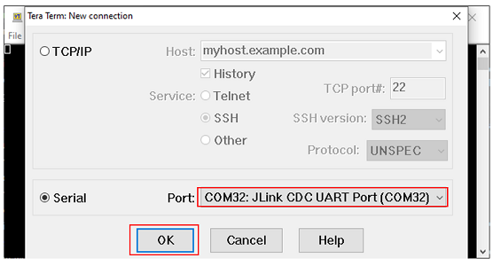

# **TWT Use Case Remote App**

## 1 Purpose/Scope

The **TWT Use Case Remote App** application has TCP and UDP server sockets which sends a trigger over the TCP socket once a TCP client is connected and receives TCP Data in Door lock scenario and UDP Data in camera scenario..

## 2 Prerequisites/Setup Requirements

### 2.1 Hardware Requirements  

- PC or Mac.
- Linux PC or Cygwin on Windows (to build and run the TCP server source provided)
- Wi-Fi Access point with a connection to the internet
- **SoC Mode**:
  - Silicon Labs [BRD4325A, BRD4325B, BRD4325C, BRD4325G, BRD4338A](https://www.silabs.com/)
- **NCP Mode**:
  - Silicon Labs [BRD4180B](https://www.silabs.com/)
  - Host MCU Eval Kit. This example has been tested with:
    - Silicon Labs [WSTK + EFR32MG21](https://www.silabs.com/development-tools/wireless/efr32xg21-bluetooth-starter-kit)

### 2.2 Software Requirements

- Simplicity Studio IDE 

  - Download the latest [Simplicity Studio IDE](https://www.silabs.com/developers/simplicity-studio)
  - Follow the [Simplicity Studio user guide](https://docs.silabs.com/simplicity-studio-5-users-guide/1.1.0/ss-5-users-guide-getting-started/install-ss-5-and-software#install-ssv5) to install Simplicity Studio IDE
  - Installation of Build tools for Linux including the gcc compiler (or equivalent on PC or Mac)

- [Iperf Application](https://iperf.fr/iperf-download.php)

### 2.3 Setup Diagram

### **2.3.1 SOC** 


### **2.3.2 NCP** 


**NOTE**: 
- The Host MCU platform (EFR32xG21) and the SiWx91x interact with each other through the SPI interface. 

Follow the [Getting Started with Wiseconnect3 SDK](https://docs.silabs.com/wiseconnect/latest/wiseconnect-getting-started/) guide to set up the hardware connections and Simplicity Studio IDE.

## 3 Project Environment

- Ensure the SiWx91x loaded with the latest firmware following the [Upgrade Si91x firmware](https://docs.silabs.com/wiseconnect/latest/wiseconnect-getting-started/getting-started-with-soc-mode#upgrade-si-wx91x-connectivity-firmware)

- Ensure the latest Gecko SDK along with the extension WiSeConnect3 is added to Simplicity Studio.

### 3.1 Creating the project

#### 3.1.1 SoC mode

- Ensure the SiWx91x set up is connected to your PC.

- In the Simplicity Studio IDE, the SiWx91x SoC board will be detected under **Debug Adapters** pane as shown below.

  ****

#### 3.1.2 NCP mode

- Ensure the EFx32 and SiWx91x set up is connected to your PC.

- In the Simplicity Studio IDE, the EFR32 board will be detected under **Debug Adapters** pane as shown below.

  ****

### 3.2 Importing the project

- Studio should detect your board. Your board will be shown here. Click on the board detected and go to **EXAMPLE PROJECTS & DEMOS** section 

#### SOC Mode

- Select **Wi-Fi - TWT Use Case Remote App(SOC)** test application

  ****

- Click 'Create'. The "New Project Wizard" window appears. Click 'Finish'

  ****

#### NCP Mode

- Select **Wi-Fi - TWT Use Case Remote App(NCP)** test application

  ****

- Click 'Create'. The "New Project Wizard" window appears. Click 'Finish'

  ****

### 3.3 Set up for application prints

#### 3.3.1 Teraterm set up - for BRD4325A, BRD4325B, BRD4325C, BRD4325G

You can use either of the below USB to UART converters for application prints.

1. Set up using USB to UART converter board.

   - Connect Tx (Pin-6) to P27 on WSTK
   - Connect GND (Pin 8 or 10) to GND on WSTK

   ****

2. Set up using USB to UART converter cable.

   - Connect RX (Pin 5) of TTL convertor to P27 on WSTK
   - Connect GND (Pin1) of TTL convertor to GND on WSTK

   ****

3. Open the Teraterm tool.

   - For SoC mode, choose the serial port to which USB to UART converter is connected and click on **OK**.

     ****

**Note:** For Other 917 SoC boards please refer section #3.3.2

#### 3.3.2 **Teraterm set up - for NCP and SoC modes**

1. Open the Teraterm tool.

- choose the J-Link port and click on **OK**.
    
    ****

2. Navigate to the Setup → Serial port and update the baud rate to **115200** and click on **OK**.

    ****

    ****

## 4 Application Build Environment

The application can be configured to suit your requirements and development environment.

### 4.1 Configure the application

1. In the Project explorer pane, expand the **config** folder and open the **sl_net_default_values.h** file. Configure the following parameters to enable your Silicon Labs Wi-Fi device to connect to your Wi-Fi network.

- **STA instance related parameters**

  - DEFAULT_WIFI_CLIENT_PROFILE_SSID refers to the name with which the SiWx91x SoftAP's Wi-Fi network shall be advertised.

     ```c
     #define DEFAULT_WIFI_CLIENT_PROFILE_SSID               "YOUR_AP_SSID"      
     ```

  - DEFAULT_WIFI_CLIENT_CREDENTIAL refers to the secret key if the Access point is configured in WPA-PSK/WPA2-PSK security modes.

     ```c 
     #define DEFAULT_WIFI_CLIENT_CREDENTIAL                 "YOUR_AP_PASSPHRASE" 
     ```

  - Other STA instance configurations can be modified if required in `default_wifi_client_profile` configuration structure.

### **Application configuration**

Read through the following sections and make any changes needed. 

This application is created to be used in combination with TWT Use Case Demo Application. These two applications simulate Door lock and Camera like scenarios. 

This application can be used in combination with **TWT Use Case Remote App** Application. These two applications simulate Door lock and Camera like scenarios.

In Camera scenario, remote application (Device A) sends a command to the DUT (where TWT Use Case Application is running. Say Device B). Upon receiving the command (from Device A), DUT sends UDP data(equivalent to camera streaming) in response to the remote application's trigger.

In Door Lock scenario, upon receiving the command (from Device A), DUT (Device B) sends a TCP response (equivalent to door lock status response) to the remote application (Device B).

To support above scenarios, this app creates TCP server to listen for connections and trigger command (to device B) periodically. After transmitting the command, device A waits for TCP/UDP response based on the use case being executed.

Also on other end, device B is brought up as a TCP client. It also brings up UDP client in addition to TCP client if SEND_TCP_DATA macro is disabled.

This application also measures Round Trip Time (RTT) in milli seconds. It is calculated as the difference between the time the command is sent to the time the first response packet is received.
  
1. In the Project explorer pane of the IDE, expand the **twt_use_case_remote_app** folder and open the **app.c** file. Configure the following parameters based on your requirements.

   

- **STA instance related parameters**

- DEFAULT_WIFI_CLIENT_PROFILE_SSID refers to the name with which the SiWx91x SoftAP's Wi-Fi network shall be advertised.

  ```c
  #define DEFAULT_WIFI_CLIENT_PROFILE_SSID               "YOUR_AP_SSID"      
  ```

- DEFAULT_WIFI_CLIENT_CREDENTIAL refers to the secret key if the Access point is configured in WPA-PSK/WPA2-PSK security modes.

  ```c
  #define DEFAULT_WIFI_CLIENT_CREDENTIAL                 "YOUR_AP_PASSPHRASE" 
  ```

- DEFAULT_WIFI_CLIENT_SECURITY_TYPE refers to the security type of the Access point. The supported security modes are mentioned in `sl_wifi_security_t`.

  ```c
  #define DEFAULT_WIFI_CLIENT_SECURITY_TYPE SL_WIFI_WPA_WPA2_MIXED 
  ```

- Other STA instance configurations can be modified if required in `default_wifi_client_profile` configuration structure.

For Doorlock usecase, TCP_RCV should be 1 and for camera streaming scenario TCP_RCV should be 0.

CMD_INTERVAL is the interval between two successive trigger commands from the application. It is in milli seconds.

- **Client/Server IP Settings**

    ```c
    #define TCP_RCV 0

    //! Device TCP port number
    #define TCP_DEVICE_PORT 5001
    
    //! Device UDP port number
    #define UDP_DEVICE_PORT 5002
    
    //! Server port number
    #define SERVER_PORT 5001
    
    //! Server IP address. Should be in reverse long format
    #define SERVER_IP_ADDRESS "192.168.10.100"
    
    //! Number of packet to send or receive
    #define NUMBER_OF_PACKETS 1            
    ```

- **To configure IP address**
DHCP_MODE refers whether IP address configured through DHCP or STATIC

  ```c
    //! Whether IP address is configured through DHCP or STATIC
    #define DHCP_MODE               1           
  ```

  > If user wants to configure STA IP address through DHCP then set DHCP_MODE to "1" and skip configuring the following DEVICE_IP, GATEWAY and NETMASK macros.
                                          (Or)
  > If user wants to configure STA IP address through STATIC then set DHCP_MODE macro to "0" and configure following DEVICE_IP, GATEWAY and NETMASK macros.

  ```c
      #define DEVICE_IP              "192.168.10.1"
      #define GATEWAY                "192.168.10.1"
      #define NETMASK                "255.255.255.0"
    ```

### 4.2 Build the application

- SoC mode: Build as twt_tcp_client Example

    ****

- Debug the Project

    ****

## **Application Output**

1. Configure the Access point in OPEN/WPA-PSK/WPA2-PSK mode to connect Silicon Labs device in STA mode.

2. After program gets executed, SiWx917 module would scan and connect to Access point and get IP.

3. After successful connection, module will be brought up as a TCP server socket, listens for TCP client and sends configured NUMBER_OF_PACKETS to TCP client (Si91x module with TWT enabled) or a UDP client.

> For Door lock scenario, enable TCP_RCV. The module sends trigger command every CMD_INTERVAL and receives TCP data on the same socket.
>  For Camera scenario, disable TCP_RCV. The module sends trigger command every CMD_INTERVAL and receives UDP data on the UDP server socket.

4. Application prints can be observed as follows:
  
   
