# User Gain Table

## 1 Purpose/Scope
While measuring the performance of 802.11 Wireless Devices, packet error test has become an integral part for FCC certification. This application explains users how to start transmission in Burst mode with different data rates, transmit power and lengths with user gain table values.

## 2 Prerequisites/Setup Requirements

### 2.1 Hardware Requirements

- Windows PC.
- Spectrum Analyzer and UFL connector
- SiWx91x Wi-Fi Evaluation Kit
  - **SoC Mode**:
    - Silicon Labs [BRD4325A, BRD4325B, BRD4325C, BRD4325G, BRD4388A](https://www.silabs.com/)
  - **NCP Mode**:
    - Silicon Labs [BRD4180B](https://www.silabs.com/)
    - Host MCU Eval Kit. This example has been tested with:
      - Silicon Labs [WSTK + EFR32MG21](https://www.silabs.com/development-tools/wireless/efr32xg21-bluetooth-starter-kit)
    - Spectrum Analyzer

### 2.2 Software Requirements

- Simplicity Studio IDE

    - Download the latest [Simplicity Studio IDE](https://www.silabs.com/developers/simplicity-studio)
    - Follow the [Simplicity Studio user guide](https://docs.silabs.com/simplicity-studio-5-users-guide/1.1.0/ss-5-users-guide-getting-started/install-ss-5-and-software#install-ssv5) to install Simplicity Studio IDE

### 2.3 Setup Diagram

#### SoC Mode

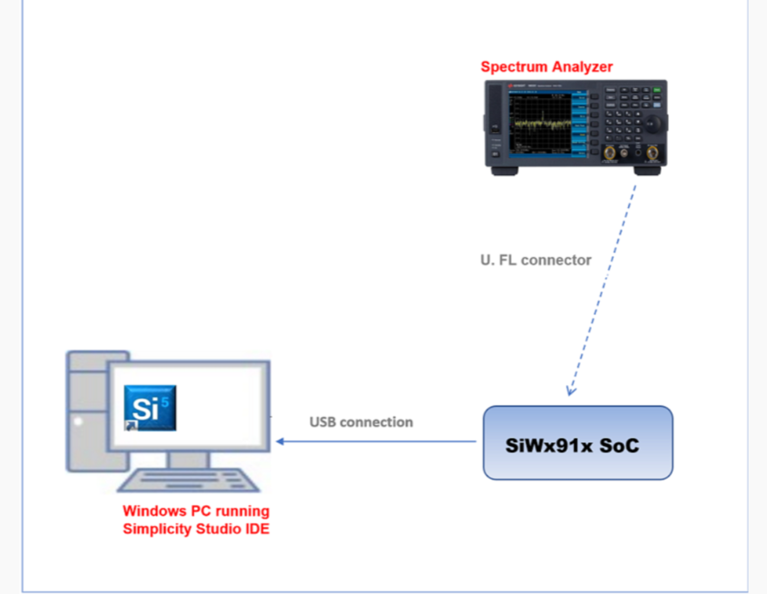

#### NCP Mode
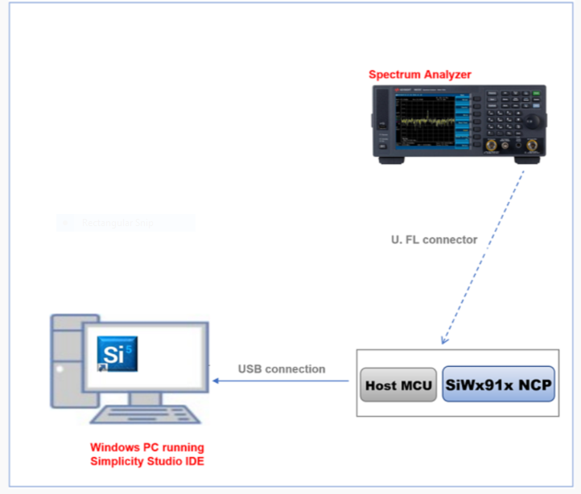

Follow the [Getting Started with Wiseconnect3 SDK](https://docs.silabs.com/wiseconnect/latest/wiseconnect-getting-started/) guide to set up the hardware connections and Simplicity Studio IDE.

**NOTE:**
By default, The radio is mapped to internal antenna path. To perform RF measurements, the signal path has to be shifted towards the U.FL port.
To change the signal path, the following hardware changes are required (for both SoC and NCP modes) -

1) Unmount C24
2) Mount R22

This hardware change is required only for the Transmit Performance and Regulatory Testing example. While testing the other applications, the hardware changes have to be reverted (Mount C24 and Unmount R22) for the board to function normally.

SoC

  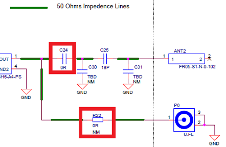

NCP

  

  **NOTE**:

- The Host MCU platform (EFR32MG21) and the SiWx91x interact with each other through the SPI interface.
- The Host MCU platform (EFM32GG11) and the SiWx91x interact with each other through the SDIO interface.

## Project Environment

- Ensure the SiWx91x loaded with the latest firmware following the [Upgrade Si91x firmware](https://docs.silabs.com/wiseconnect/latest/wiseconnect-getting-started/getting-started-with-soc-mode#upgrade-si-wx91x-connectivity-firmware)

- Ensure the latest Gecko SDK along with the extension WiSeConnect3 is added to Simplicity Studio.

### 3.1 Creating the project

#### 3.1.1 SoC Mode:

- Ensure the SiWx91x set up is connected to your PC.

- In the Simplicity Studio IDE, the SiWx91x SoC board will be detected under **Debug Adapters** pane as shown below.

 **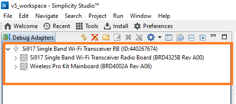**

#### 3.1.2 NCP Mode:

- Ensure the EFx32 and SiWx91x set up is connected to your PC.

- In the Simplicity Studio IDE, the EFR32 board will be detected under **Debug Adapters** pane as shown below.

 **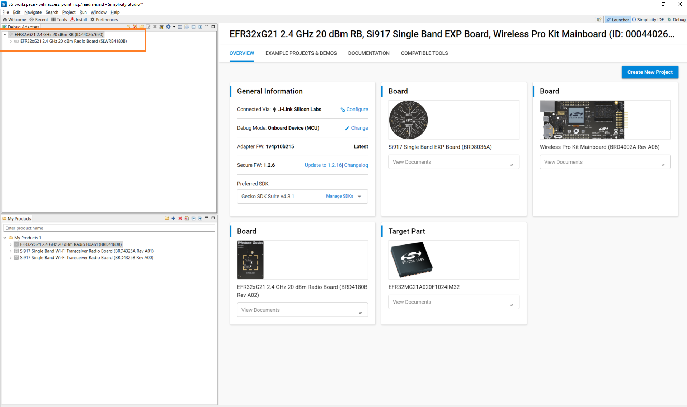**

 ### 3.2 Importing the Project

 - Studio should detect your board. Your board will be shown here. Click on the board detected and go to **EXAMPLE PROJECTS & DEMOS** section 

#### SoC Mode

- Select **Wi-Fi - User Gain Table SoC** test application

**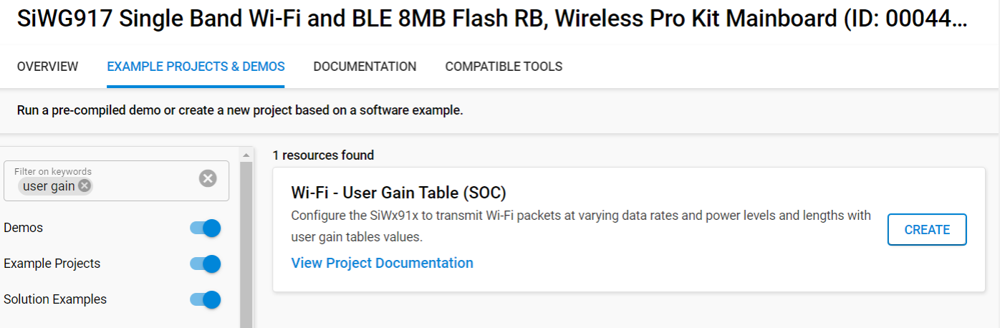**

- Click 'Create'. The "New Project Wizard" window appears. Click 'Finish'

 **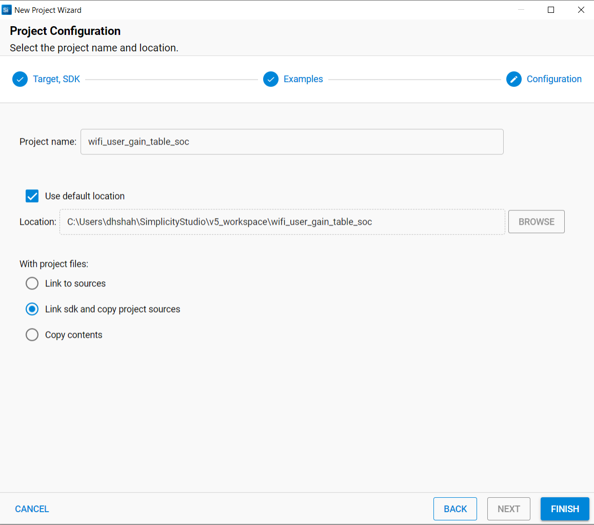**

 #### NCP Mode

- Select **Wi-Fi - User Gain Table NCP** test application

**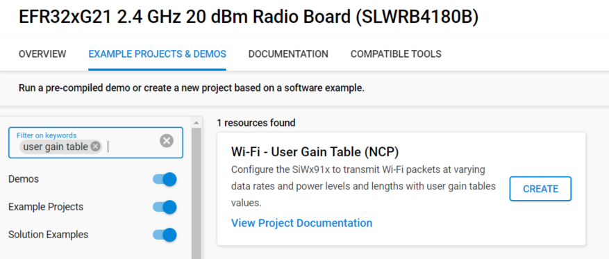** 

- Click 'Create'. The "New Project Wizard" window appears. Click 'Finish'

  **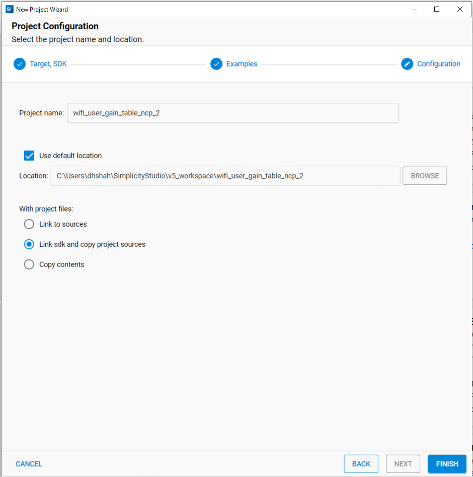** 

### 3.3 Set up for application prints

#### 3.3.1 Teraterm set up - for BRD4325A, BRD4325B, BRD4325C, BRD4325G, BRD4338A

You can use either of the below USB to UART converters for application prints.

1. Set up using USB to UART converter board.

   - Connect Tx (Pin-6) to P27 on WSTK
   - Connect GND (Pin 8 or 10) to GND on WSTK

 ****

2. Set up using USB to UART converter cable.

   - Connect RX (Pin 5) of TTL convertor to P27 on WSTK
   - Connect GND (Pin1) of TTL convertor to GND on WSTK

   ****

3. Open the Teraterm tool.

   - For SoC mode, choose the serial port to which USB to UART converter is connected and click on **OK**.

     ****

**Note:** For Other 917 SoC boards please refer section #3.3.2

#### 3.3.2 **Teraterm set up - for NCP and SoC modes**

1. Open the Teraterm tool.

- choose the J-Link port and click on **OK**.
    
    ****

2. Navigate to the Setup → Serial port and update the baud rate to **115200** and click on **OK**.

    ****

    ****

## 4 Application Build Environment

### 4.1 Configure the application

The application can be configured to suit user requirements and development environment. Read through the following sections and make any changes needed.


1. In the Project explorer pane, expand the **config** folder and open the **sl_net_default_values.h** file. Configure the following parameters to enable your Silicon Labs Wi-Fi device to connect to your Wi-Fi network.

- **STA instance related parameters**

  - DEFAULT_WIFI_CLIENT_PROFILE_SSID refers to the name with which Wi-Fi network that shall be advertised and Si91X module is connected to it.
  
     ```c
     #define DEFAULT_WIFI_CLIENT_PROFILE_SSID               "YOUR_AP_SSID"      
     ```````

  - DEFAULT_WIFI_CLIENT_CREDENTIAL refers to the secret key if the Access point is configured in WPA-PSK/WPA2-PSK security modes.

     ```c
     #define DEFAULT_WIFI_CLIENT_CREDENTIAL                 "YOUR_AP_PASSPHRASE" 
     ```

  - DEFAULT_WIFI_CLIENT_SECURITY_TYPE refers to the security type if the Access point is configured in WPA/WPA2 or mixed security modes.

  	  ```c
      #define DEFAULT_WIFI_CLIENT_SECURITY_TYPE                           SL_WIFI_WPA2 
      ```

  - Other STA instance configurations can be modified if required in `default_wifi_client_profile` configuration structure.

-  Configure the following parameters in **app.c** to test throughput app as per requirements

```c
  sl_wifi_data_rate_t rate = SL_WIFI_DATA_RATE_6; // SL_WIFI_RATE_6 stands for 6 Mbps data rate
  #define SL_TX_TEST_POWER    4               
  #define SL_TX_TEST_RATE     rate           
  #define SL_TX_TEST_LENGTH   30              // Tx packet length in the range [24:1500] bytes in burst mode, 
                                               //[24:260 ] bytes in continuous mode
  #define SL_TX_TEST_MODE     0               // Selects burst mode or continuous mode
  #define SL_TX_TEST_CHANNEL  1               // Channel number in 2.4 or 5 GHz
  #define SL_WIFI_SELECT_INTERNAL_ANTENNA          0               // 0 = RF_OUT2, 1 = RF_OUT1
```
-  User Gain Table Payload Format  

```c
For 2.4 GHz and bandwidth 20 MHz
<TABLE NAME>[] = 
{
  <NUMBER OF REGIONS>,
  <REGION NAME 1>, 
  <CHANNEL CODE 2G>,
  <CHANNEL NUMBER 1>,   <2 * MAX POWER 11b RATE>, <2 * MAX POWER 11g RATE>, <2 * MAX POWER 11n RATE>,
  <CHANNEL NUMBER 2>,   <2 * MAX POWER 11b RATE>, <2 * MAX POWER 11g RATE>, <2 * MAX POWER 11n RATE>,
     ...
  <CHANNEL NUMBER m-1>, <2 * MAX POWER 11b RATE>, <2 * MAX POWER 11g RATE>, <2 * MAX POWER 11n RATE>,
  <CHANNEL NUMBER m>,   <2 * MAX POWER 11b RATE>, <2 * MAX POWER 11g RATE>, <2 * MAX POWER 11n RATE>,

  <REGION NAME 2>, 
  <CHANNEL_CODE_2G>,
  <CHANNEL NUMBER 1>,   <2 * MAX POWER 11b RATE>, <2 * MAX POWER 11g RATE>, <2 * MAX POWER 11n RATE>,
  <CHANNEL NUMBER 2>,   <2 * MAX POWER 11b RATE>, <2 * MAX POWER 11g RATE>, <2 * MAX POWER 11n RATE>,
     ...
  <CHANNEL NUMBER m-1>, <2 * MAX POWER 11b RATE>, <2 * MAX POWER 11g RATE>, <2 * MAX POWER 11n RATE>,
  <CHANNEL NUMBER m>,   <2 * MAX POWER 11b RATE>, <2 * MAX POWER 11g RATE>, <2 * MAX POWER 11n RATE>,
     ...
};
```

-  Payload Format Example :

- band = 2.4 GHz
- bandwidth = 20 MHz

```c
{      3,                 // Number of Regions
     FCC,                 // Region Name
      13,                 // Number of channels
       1, 34, 20, 20,     // channel_number, 11b, 11g, 11n
       2, 34, 28, 28,
       3, 34, 32, 32,
       4, 34, 36, 36,
       5, 34, 38, 38,
       6, 34, 40, 40,
       7, 34, 38, 38,
       8, 34, 36, 36,
       9, 34, 32, 32,
      10, 34, 32, 32,
      11, 34, 24, 24,
      12, 34, 16, 24,
      13, 34, 12, 12,
   TELEC,                 // Region Name
      17,                 // Number of channels
     255, 20, 16, 16,     // channel_number, 11b, 11g, 11n
     KCC,                 // Region Name
      17,                 // Number of channels
     255, 26, 20, 20,     // channel_number, 11b, 11g, 11n
}
```
### 4.2 Build the application

- SoC mode: Build as User Gain Table Example

  **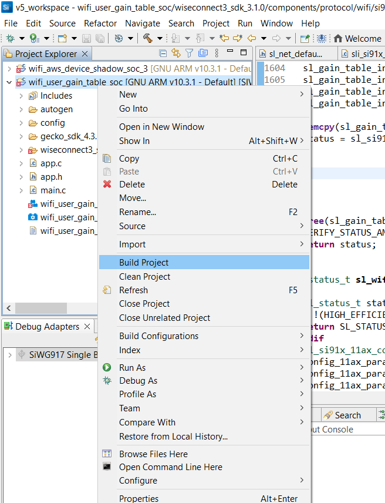**

- NCP mode: Build as User Gain Table Example

  **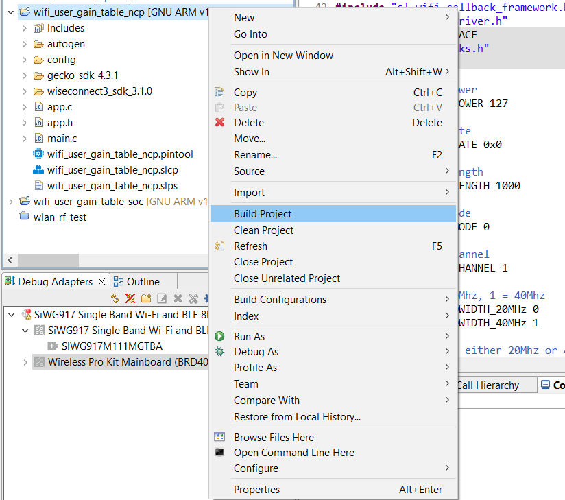** 

### 4.3 Run and Test the application

- Once the build was successful, right click on project and click on Debug As->Silicon Labs ARM Program as shown in below image.

  - SoC

    **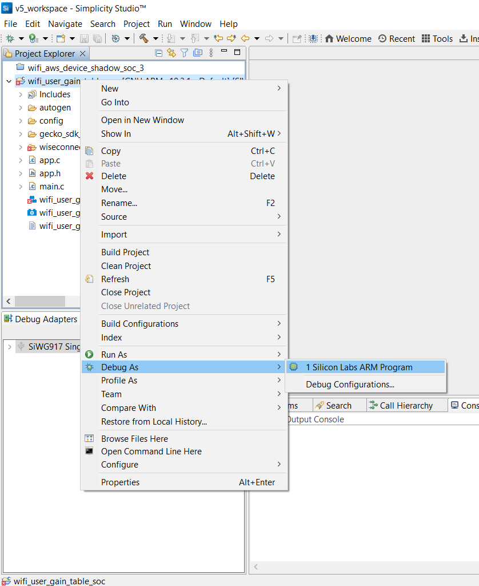**

  - NCP

    **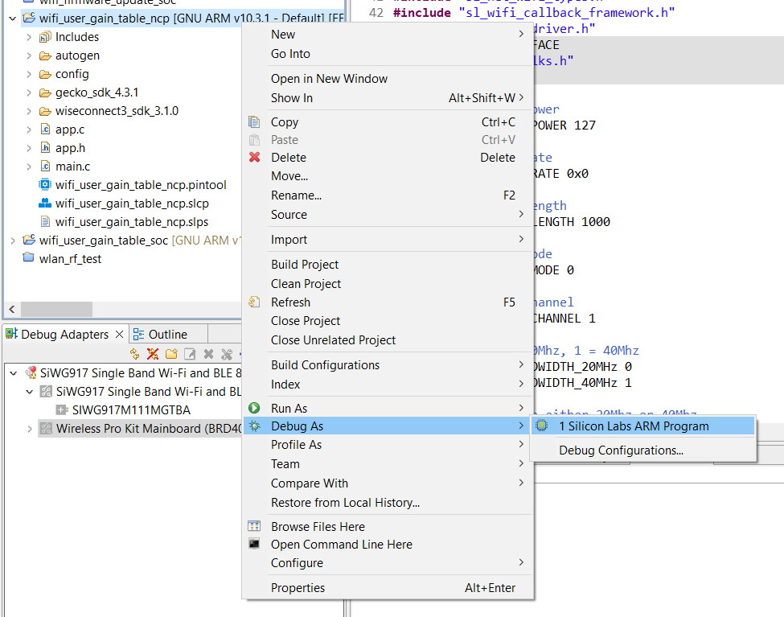**

- As soon as the debug process is completed, the application control branches to the main().

- Click on the **Resume** icon in the Simplicity Studio IDE toolbar to run the application.

****

When the application runs, the SiWx91x starts transmitting using the configuration settings. A power meter or spectrum analyzer may be used to monitor the RF output power and spectrum.

The following readme provides example spectrums when the SiWx91x is configured to transmit with the settings shown.

## Transmit Spectrum Example 
```c
  sl_wifi_data_rate_t rate = SL_WIFI_DATA_RATE_6; // For 6 Mbps data rate
  #define SL_TX_TEST_POWER    127                   
  #define SL_TX_TEST_RATE     rate                      
  #define SL_TX_TEST_LENGTH   100                   
  #define SL_TX_TEST_MODE     0 // 0 for Burst Mode  
  #define SL_TX_TEST_CHANNEL  6                     
```
The below result is for PER Mode with Channel '6' with 6 Mbps data rate and max 127 power index, in Burst mode, OFDM modulation technique.


## 4.4 Application Output

### SoC Mode

  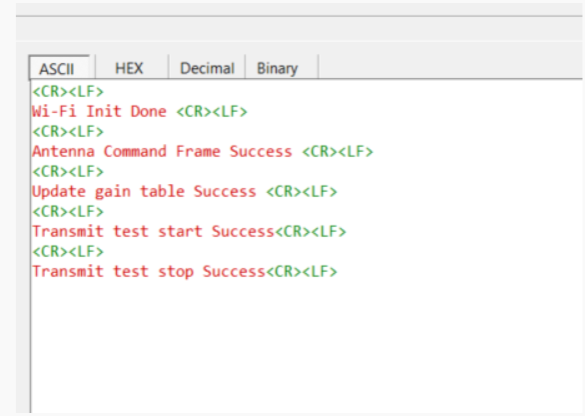

#### NCP Mode

  

### Note

For NCP mode, following defines have to enabled manually in preprocessor setting of example project

- For 917A0 expansion board, enable CHIP_917 = 1
- For 917B0 1.2 expansion board, enable CHIP_917 = 1, CHIP_917B0 = 1
- For 917B0 2.0 expansion board, enable CHIP_917 = 1, CHIP_917B0 = 1, SI917_RADIO_BOARD_V2 = 1 (This is enabled by default for all examples)