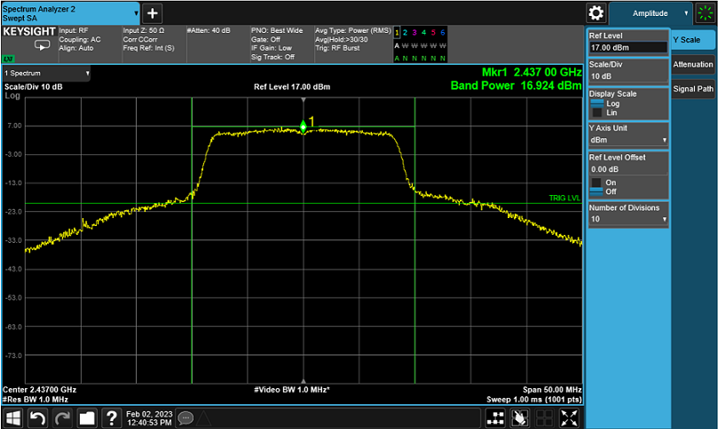

# Wi-Fi - User Gain Table 

## Table of Contents

- [Wi-Fi - User Gain Table](#wi-fi---user-gain-table)
  - [Table of Contents](#table-of-contents)
  - [Purpose/Scope](#purposescope)
  - [Prerequisites/Setup Requirements](#prerequisitessetup-requirements)
    - [Hardware Requirements](#hardware-requirements)
    - [Software Requirements](#software-requirements)
    - [Setup Diagram](#setup-diagram)
  - [Getting Started](#getting-started)
    - [Instructions for Simplicity Studio IDE and Silicon Labs devices (SoC and NCP Modes)](#instructions-for-simplicity-studio-ide-and-silicon-labs-devices-soc-and-ncp-modes)
    - [Instructions for Keil IDE and STM32F411RE MCU (NCP Mode)](#instructions-for-keil-ide-and-stm32f411re-mcu-ncp-mode)
  - [Application Build Environment](#application-build-environment)
    - [Configure the application](#configure-the-application)
  - [Test the application](#test-the-application)
    - [Instructions for Simplicity Studio IDE and Silicon Labs devices (SoC and NCP Modes)](#instructions-for-simplicity-studio-ide-and-silicon-labs-devices-soc-and-ncp-modes-1)
    - [Instructions for Keil IDE and STM32F411RE MCU](#instructions-for-keil-ide-and-stm32f411re-mcu)
  - [Transmit Spectrum Example](#transmit-spectrum-example)
  - [Application Output](#application-output)

## Purpose/Scope

While measuring the performance of 802.11 Wireless Devices, packet error test has become an integral part for FCC certification. This application explains users how to start transmission in Burst mode with different data rates, transmit power and lengths with user gain table values.

## Prerequisites/Setup Requirements

### Hardware Requirements

- Windows PC.
- Spectrum Analyzer and UFL connector
- SiWx91x Wi-Fi Evaluation Kit
- **SoC Mode**:
  - Standalone
    - BRD4002A Wireless pro kit mainboard [SI-MB4002A]
    - Radio Boards 
  	  - BRD4338A [SiWx917-RB4338A]
  	  - BRD4343A [SiWx917-RB4343A]
  - Kits
  	- SiWx917 Pro Kit [Si917-PK6031A](https://www.silabs.com/development-tools/wireless/wi-fi/siwx917-pro-kit?tab=overview)
  	- SiWx917 Pro Kit [Si917-PK6032A]
    - SiWx917 AC1 Module Explorer Kit (BRD2708A)
  	
- **NCP Mode**:
  - Standalone
    - BRD4002A Wireless pro kit mainboard [SI-MB4002A]
    - EFR32xG24 Wireless 2.4 GHz +10 dBm Radio Board [xG24-RB4186C](https://www.silabs.com/development-tools/wireless/xg24-rb4186c-efr32xg24-wireless-gecko-radio-board?tab=overview)
    - NCP Expansion Kit with NCP Radio boards
      - (BRD4346A + BRD8045A) [SiWx917-EB4346A]
      - (BRD4357A + BRD8045A) [SiWx917-EB4357A]
  - Kits
  	- EFR32xG24 Pro Kit +10 dBm [xG24-PK6009A](https://www.silabs.com/development-tools/wireless/efr32xg24-pro-kit-10-dbm?tab=overview)
  - Spectrum Analyzer
  - Interface and Host MCU Supported
    - SPI - EFR32 & STM32
    - UART - EFR32

### Software Requirements

- Simplicity Studio IDE (to be used with Silicon Labs MCU)
- Keil IDE (to be used with STM32F411RE MCU)
- Serial Terminal - [Docklight](https://docklight.de/)/[Tera Term](https://ttssh2.osdn.jp/index.html.en) (to be used with Keil IDE)

### Setup Diagram


## Getting Started

### Instructions for Simplicity Studio IDE and Silicon Labs devices (SoC and NCP Modes)

  Refer to the instructions [here](https://docs.silabs.com/wiseconnect/latest/wiseconnect-getting-started/) to:

  - Install Studio and WiSeConnect extension
  - Connect your device to the computer
  - Upgrade your connectivity firmware
  - Create a Studio project
  
For details on the project folder structure, see the [WiSeConnect Examples](https://docs.silabs.com/wiseconnect/latest/wiseconnect-examples/#example-folder-structure) page.

### Instructions for Keil IDE and STM32F411RE MCU (NCP Mode)

  - Install the [Keil IDE](https://www.keil.com/).
  - Download [WiSeConnect SDK](https://github.com/SiliconLabs/wiseconnect)
  - Update the device's connectivity firmware as mentioned [here](https://docs.silabs.com/wiseconnect/latest/wiseconnect-getting-started/getting-started-with-ncp-mode).
  - Connect the SiWx91x NCP to STM32F411RE Nucleo Board following the below steps:
   - Connect the male Arduino compatible header on carrier board to female Arduino compatible header on STM32F411RE Nucleo board.
   - Mount the NCP Radio board (BRD4346A/BRD4357A) onto the radio board socket available on the base board (BRD8045C).
   - After connecting all the boards, the setup should look like the image shown below:
    
   - Connect the setup to the computer.
  - Open the AWS DEVICE SHADOW µVision project - **user_gain_table.uvprojx** by navigating to **WiSeConnect SDK → examples → featured → user_gain_table → keil_project**. 

## Application Build Environment

### Configure the application

The application can be configured to suit user requirements and development environment. Read through the following sections and make any changes needed.

- In the Project explorer pane, expand the **config** folder and open the **sl_net_default_values.h** file. Configure the following parameters to enable your Silicon Labs Wi-Fi device to connect to your Wi-Fi network.

  - **STA instance related parameters**

    - DEFAULT_WIFI_CLIENT_PROFILE_SSID refers to the name with which Wi-Fi network that shall be advertised and Si91X module is connected to it.
  
      ```c
      #define DEFAULT_WIFI_CLIENT_PROFILE_SSID               "YOUR_AP_SSID"      
      ```````

    - DEFAULT_WIFI_CLIENT_CREDENTIAL refers to the secret key if the Access point is configured in WPA-PSK/WPA2-PSK security modes.

      ```c
      #define DEFAULT_WIFI_CLIENT_CREDENTIAL                 "YOUR_AP_PASSPHRASE" 
      ```

    - DEFAULT_WIFI_CLIENT_SECURITY_TYPE refers to the security type if the Access point is configured in WPA/WPA2 or mixed security modes.

      ```c
        #define DEFAULT_WIFI_CLIENT_SECURITY_TYPE                           SL_WIFI_WPA2 
        ```

    - Other STA instance configurations can be modified if required in `default_wifi_client_profile` configuration structure.

  - Configure the following parameters in **app.c** to test user gain table app as per requirements

    ```c
      sl_wifi_data_rate_t rate = SL_WIFI_DATA_RATE_6;
      sl_wifi_request_tx_test_info_t tx_test_info = {
        .enable      = 1,          // Enable/disable tx test mode
        .power       = 4,         // Tx RF power in the range [2:18] dBm
        .rate        = rate,      // WLAN data rate of 6Mbps
        .length      = 30,        // Tx packet length in the range [24:1500] bytes in burst mode, 
        .mode        = 0,         // Selects burst mode or continuous mode
        .channel     = 1,         // Channel number in 2.4 or 5 GHz
        // Other configurable parameters
      }
    ```

    - The different values of mode:
      - 0 - Burst Mode
      - 1 - Continuous Mode
      - 2 - Continuous wave Mode (non modulation) in DC mode
      - 3 - Continuous wave Mode (non modulation) in single tone mode (center frequency -2.5MHz)
      - 4 - Continuous wave Mode (non modulation) in single tone mode (center frequency +5MHz)

  - User Gain Table Payload Format  

    ```c

    For 2.4 GHz and bandwidth 20 MHz
    <TABLE NAME>[] = 
    {
      <NUMBER OF REGIONS>,
      <REGION NAME 1>, 
      <CHANNEL CODE 2G>,
      <CHANNEL NUMBER 1>,   <2 *MAX POWER 11b RATE>, <2* MAX POWER 11g RATE>, <2 *MAX POWER 11n RATE>,
      <CHANNEL NUMBER 2>,   <2* MAX POWER 11b RATE>, <2 *MAX POWER 11g RATE>, <2* MAX POWER 11n RATE>,
         ...
      <CHANNEL NUMBER m-1>, <2 *MAX POWER 11b RATE>, <2* MAX POWER 11g RATE>, <2 *MAX POWER 11n RATE>,
      <CHANNEL NUMBER m>,   <2* MAX POWER 11b RATE>, <2 *MAX POWER 11g RATE>, <2* MAX POWER 11n RATE>,

      <REGION NAME 2>, 
      <CHANNEL_CODE_2G>,
      <CHANNEL NUMBER 1>,   <2 *MAX POWER 11b RATE>, <2* MAX POWER 11g RATE>, <2 *MAX POWER 11n RATE>,
      <CHANNEL NUMBER 2>,   <2* MAX POWER 11b RATE>, <2 *MAX POWER 11g RATE>, <2* MAX POWER 11n RATE>,
        ...
      <CHANNEL NUMBER m-1>, <2 *MAX POWER 11b RATE>, <2* MAX POWER 11g RATE>, <2 *MAX POWER 11n RATE>,
      <CHANNEL NUMBER m>,   <2* MAX POWER 11b RATE>, <2 *MAX POWER 11g RATE>, <2* MAX POWER 11n RATE>,
        ...
    };

    ```

  - Payload Format Example :

  - band = 2.4 GHz
  - bandwidth = 20 MHz

    ```c
    {      3,                 // Number of Regions
        FCC,                 // Region Name
          13,                 // Number of channels
          1, 34, 20, 20,     // channel_number, 11b, 11g, 11n
          2, 34, 28, 28,
          3, 34, 32, 32,
          4, 34, 36, 36,
          5, 34, 38, 38,
          6, 34, 40, 40,
          7, 34, 38, 38,
          8, 34, 36, 36,
          9, 34, 32, 32,
          10, 34, 32, 32,
          11, 34, 24, 24,
          12, 34, 16, 24,
          13, 34, 12, 12,
      TELEC,                 // Region Name
          17,                 // Number of channels
        255, 20, 16, 16,     // channel_number, 11b, 11g, 11n
        KCC,                 // Region Name
          17,                 // Number of channels
        255, 26, 20, 20,     // channel_number, 11b, 11g, 11n
    }
    ```

> **Note**: For recommended settings, please refer the [recommendations guide](https://docs.silabs.com/wiseconnect/latest/wiseconnect-developers-guide-prog-recommended-settings/).

## Test the application

### Instructions for Simplicity Studio IDE and Silicon Labs devices (SoC and NCP Modes)

Refer to the instructions [here](https://docs.silabs.com/wiseconnect/latest/wiseconnect-getting-started/) to:

- Build the application.
- Flash, run and debug the application.

### Instructions for Keil IDE and STM32F411RE MCU

- Build the application.
- Set the Docklight up by connecting STM32's Serial COM port. This enables you to view the application prints.
- Flash, run and debug the application.

- When the application runs, the SiWx91x starts transmitting using the configuration settings. A power meter or spectrum analyzer may be used to monitor the RF output power and spectrum.

The following readme provides example spectrums when the SiWx91x is configured to transmit with the settings shown.

## Transmit Spectrum Example 

```c 
  sl_wifi_data_rate_t rate = SL_WIFI_DATA_RATE_6;
  sl_wifi_request_tx_test_info_t tx_test_info = {
    .enable      = 1,
    .power       = 127,
    .rate        = rate,
    .length      = 100,
    .mode        = 0,     // Burst Mode
    .channel     = 6,
    // Other configurable parameters
  }                  
```

The below result is for PER Mode with Channel '6' with 6 Mbps data rate and max 127 power index, in Burst mode, OFDM modulation technique.



## Application Output

  
