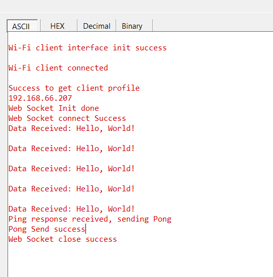

# Wi-Fi - WebSocket Client

## Table of Contents

- [Wi-Fi - WebSocket Client](#wi-fi---websocket-client)
  - [Table of Contents](#table-of-contents)
  - [Purpose/Scope](#purposescope)
  - [Prerequisites/Setup Requirements](#prerequisitessetup-requirements)
    - [Hardware Requirements](#hardware-requirements)
    - [Software Requirements](#software-requirements)
  - [Getting Started](#getting-started)
  - [Application Build Environment](#application-build-environment)
  - [Running the WebSocket Server](#running-the-websocket-server)
  - [Configuring the WebSocket Client for SSL](#configuring-the-websocket-client-for-ssl)
  - [Test the Application](#test-the-application)

## Purpose/Scope

This application demonstrates how to configure SiWx91x device as a WebSocket client. In this application, the SiWx91x is configured as a Wi-Fi station, connects to an Access point, and establishes a WebSocket connection to a server.

## Prerequisites/Setup Requirements

### Hardware Requirements

- A Windows PC.
- SoC Mode:
  - Silicon Labs [BRD4388A](https://www.silabs.com/)
- NCP Mode:
  - Standalone
    - BRD4002A Wireless pro kit mainboard [SI-MB4002A]
    - EFR32xG24 Wireless 2.4 GHz +10 dBm Radio Board [xG24-RB4186C](https://www.silabs.com/development-tools/wireless/xg24-rb4186c-efr32xg24-wireless-gecko-radio-board?tab=overview)
    - NCP Expansion Kit with NCP Radio boards
      - (BRD4346A + BRD8045A) [SiWx917-EB4346A]
      - (BRD4357A + BRD8045A) [SiWx917-EB4357A]

### Software Requirements

- Simplicity Studio

## Getting Started

Refer to the instructions [here](https://docs.silabs.com/wiseconnect/latest/wiseconnect-getting-started/) to:

- [Install Simplicity Studio](https://docs.silabs.com/wiseconnect/latest/wiseconnect-developers-guide-developing-for-silabs-hosts/#install-simplicity-studio)
- [Install WiSeConnect 3 extension](https://docs.silabs.com/wiseconnect/latest/wiseconnect-developers-guide-developing-for-silabs-hosts/#install-the-wi-se-connect-3-extension)
- [Connect your device to the computer](https://docs.silabs.com/wiseconnect/latest/wiseconnect-developers-guide-developing-for-silabs-hosts/#connect-si-wx91x-to-computer)
- [Upgrade your connectivity firmware ](https://docs.silabs.com/wiseconnect/latest/wiseconnect-developers-guide-developing-for-silabs-hosts/#update-si-wx91x-connectivity-firmware)
- [Create a Studio project ](https://docs.silabs.com/wiseconnect/latest/wiseconnect-developers-guide-developing-for-silabs-hosts/#create-a-project)

For details on the project folder structure, see the [WiSeConnect Examples](https://docs.silabs.com/wiseconnect/latest/wiseconnect-examples/#example-folder-structure) page.

## Application Build Environment

- The application can be configured to suit your requirements and development environment. Read through the following sections and make any changes as needed.
- In the Project Explorer pane, expand the **config/** folder and open the ``sl_net_default_values.h`` file. Configure the following parameters to enable your Silicon Labs Wi-Fi device to connect to your Wi-Fi network.

  - STA instance related parameters

    - DEFAULT_WIFI_CLIENT_PROFILE_SSID refers to the name with which Wi-Fi network that shall be advertised and Si91X module is connected to it.

      ```c
      #define DEFAULT_WIFI_CLIENT_PROFILE_SSID               "YOUR_AP_SSID"      
      ```

    - DEFAULT_WIFI_CLIENT_CREDENTIAL refers to the secret key if the Access point is configured in WPA-PSK/WPA2-PSK security modes.

      ```c
      #define DEFAULT_WIFI_CLIENT_CREDENTIAL                 "YOUR_AP_PASSPHRASE" 
      ```

    - DEFAULT_WIFI_CLIENT_SECURITY_TYPE refers to the security type if the Access point is configured in WPA/WPA2 or mixed security modes.

      ```c
      #define DEFAULT_WIFI_CLIENT_SECURITY_TYPE              SL_WIFI_WPA2 
      ```

  - Configure the following parameters in ``app.c`` to test WebSocket Client app as per requirements

  - WebSocket Server IP and Port Settings

    ```c
    #define SERVER_IP_ADDR "192.168.29.186"
    #define HOST_NAME      "example.com"
    #define RESOURCE_NAME  "/myresource"
    ```

NOTE:
> Procedure to run the example
> 1. The application initializes the WebSocket client with the server IP, host name, and resource name.
>
> 2. The WebSocket client connects to the server.
>
> 3. The client sends data to the server and waits for a ping response.
>
> 4. Upon receiving a ping, the client sends a pong response and closes the connection.
>
> 5. The WebSocket client is deinitialized.

## Running the WebSocket Server

To run the WebSocket server, follow these steps:

1. Ensure you have Node.js installed on your system. If not, download and install it from [Node.js official website](https://nodejs.org/).

2. Navigate to the directory containing the `package.json` file located at: `<SDK>/resources/websocket_server`.

3. Install the required dependencies by running the following command in your terminal:

   ```sh
   npm install
   ```
4. Update the `index.js` file to enable SSL if required by setting the `USE_SSL` variable to `true`:

   ```javascript
   const USE_SSL = true; // Set to true to use WSS (WebSocket Secure), false to use WS (WebSocket)
   ```

5. Start the WebSocket server by running:

   ```sh
   node index.js
   ```

6. The server will start listening on port 8080. You should see the following message in your terminal: Server is listening on port 8080

7. The WebSocket server is now ready to accept connections from the WebSocket client application.

## Configuring the WebSocket Client for SSL

1. Update the `sl_websocket_config_t` structure in your client application to set the `enable_ssl` field to `true`:

   ```c
   sl_websocket_config_t ws_config = {
     .host                = HOST_NAME,
     .resource            = RESOURCE_NAME,
     .server_port         = 8080,
     .client_port         = 5001,
     .ip_address          = SERVER_IP_ADDR,
     .data_cb             = data_callback,
     .remote_terminate_cb = remote_terminate_callback,
     .enable_ssl          = true, // Enable SSL
   };
   ```

2. Load the SSL CA certificate in the `app.c` file as shown below.

   ```c
   #include "cacert.pem.h"
   
   // Load SSL CA certificate
   status = sl_net_set_credential(SL_NET_TLS_SERVER_CREDENTIAL_ID(CERTIFICATE_INDEX),
                                  SL_NET_SIGNING_CERTIFICATE,
                                  cacert,
                                  sizeof(cacert) - 1);
   if (status != SL_STATUS_OK) {
     printf("\r\nLoading TLS CA certificate into FLASH Failed, Error Code : 0x%lX\r\n", status);
     return;
   }
   printf("\r\nLoad SSL CA certificate at index %d Success\r\n", CERTIFICATE_INDEX);
   ```

> **Note**: For recommended settings, see the [recommendations guide](https://docs.silabs.com/wiseconnect/latest/wiseconnect-developers-guide-prog-recommended-settings/).

## Test the Application

Refer to the instructions [here](https://docs.silabs.com/wiseconnect/latest/wiseconnect-getting-started/) to:

- Build the application.
- Flash, run and debug the application.

   
