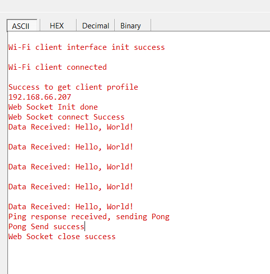

# Wi-Fi - WebSocket Client

## High-Level Overview

SiWx91x WebSocket client example: Connect to Wi-Fi and establish a WebSocket session with a remote server in SoC and NCP modes.

## Table of Contents

- [Wi-Fi - WebSocket Client](#wi-fi---websocket-client)
  - [Table of Contents](#table-of-contents)
  - [High-Level Overview](#high-level-overview)
  - [Purpose/Scope](#purposescope)
  - [Prerequisites/Setup Requirements](#prerequisitessetup-requirements)
    - [Hardware Requirements](#hardware-requirements)
    - [Software Requirements](#software-requirements)
  - [Getting Started](#getting-started)
  - [Application Build Environment](#application-build-environment)
  - [Running the WebSocket Server](#running-the-websocket-server)
  - [Configuring the WebSocket Client for SSL](#configuring-the-websocket-client-for-ssl)
  - [Test the Application](#test-the-application)

  - [Troubleshooting](#troubleshooting)
  - [Resources](#resources)
  - [Report Bugs and Get Support](#report-bugs-and-get-support)

## Purpose/Scope

This application demonstrates how to configure SiWx91x device as a WebSocket client. In this application, the SiWx91x is configured as a Wi-Fi station, connects to an Access point, and establishes a WebSocket connection to a server.

## Prerequisites/Setup Requirements

### Hardware Requirements

- A Windows PC.
- SoC Mode:
  - Standalone
    - BRD4002A Wireless Pro Kit Mainboard [SI-MB4002A](https://www.silabs.com/development-tools/wireless/wireless-pro-kit-mainboard?tab=overview)
    - Radio Boards 
	  - BRD4338A [SiWx917-RB4338A](https://www.silabs.com/development-tools/wireless/wi-fi/siwx917-rb4338a-wifi-6-bluetooth-le-soc-radio-board?tab=overview)
	  - BRD4342A [SiWx917-RB4342A](https://www.silabs.com/development-tools/wireless/wi-fi/siwx91x-rb4342a-wifi-6-bluetooth-le-soc-radio-board?tab=overview)
	  - BRD4339B [SiWx917-RB4339B](https://docs.silabs.com/wiseconnect/latest/wiseconnect-getting-started/getting-started-with-at)
	  - BRD4340A [SiWx917-RB4340A](https://docs.silabs.com/wiseconnect/latest/wiseconnect-getting-started/getting-started-with-at)
	  - BRD4343A [SiWx917-RB4343A](https://www.silabs.com/development-tools/wireless/wi-fi/siw917y-rb4343a-wi-fi-6-bluetooth-le-8mb-flash-radio-board-for-module?tab=overview)
	  - BRD4343C [SiWx917-RB4343C](https://www.silabs.com/development-tools/wireless/wi-fi/siw917y-rb4343c-wi-fi-6-bluetooth-le-8mb-flash-radio-board-for-module?tab=overview)

- NCP Mode:
  - [BRD4346A](https://www.silabs.com/development-tools/wireless/wi-fi/siwx917-rb4346a-wifi-6-bluetooth-le-soc-4mb-flash-radio-board?tab=overview) + [BRD8045C](https://www.silabs.com/development-tools/wireless/wi-fi/shield-adapter-board-for-co-processor-radio-boards?tab=overview)
  - [BRD4357A](https://www.silabs.com/development-tools/wireless/wi-fi/siw917y-rb4357a-wi-fi-6-bluetooth-le-4mb-flash-radio-board-for-rcp-and-ncp-modules?tab=overview) + [BRD8045C](https://www.silabs.com/development-tools/wireless/wi-fi/shield-adapter-board-for-co-processor-radio-boards?tab=overview)
  - [BRD4357C](https://www.silabs.com/development-tools/wireless/wi-fi/siw917y-rb4357c-wi-fi-6-bluetooth-le-4mb-flash-radio-board-for-rcp-and-ncp-modules?tab=overview) + [BRD8045C](https://www.silabs.com/development-tools/wireless/wi-fi/shield-adapter-board-for-co-processor-radio-boards?tab=overview)
  - Silicon Labs [BRD4180B](https://www.silabs.com/development-tools/wireless/slwrb4180b-efr32xg21-wireless-gecko-radio-board?tab=overview)
  - Host MCU Eval Kit. This example has been tested with:
    - Silicon Labs [WSTK + EFR32MG21](https://www.silabs.com/development-tools/wireless/efr32xg21-bluetooth-starter-kit)


### Software Requirements

- Simplicity Studio

## Getting Started

Refer to the instructions [here](https://docs.silabs.com/wiseconnect/latest/wiseconnect-getting-started/) to:

- [Install Simplicity Studio](https://docs.silabs.com/wiseconnect/latest/wiseconnect-developers-guide-developing-for-silabs-hosts/#install-simplicity-studio)
- [Install WiSeConnect extension](https://docs.silabs.com/wiseconnect/latest/wiseconnect-developers-guide-developing-for-silabs-hosts/#install-the-wi-se-connect-extension)
- [Connect your device to the computer](https://docs.silabs.com/wiseconnect/latest/wiseconnect-developers-guide-developing-for-silabs-hosts/#connect-si-wx91x-to-computer)
- [Upgrade your connectivity firmware ](https://docs.silabs.com/wiseconnect/latest/wiseconnect-developers-guide-developing-for-silabs-hosts/#update-si-wx91x-connectivity-firmware)
- [Create a Studio project ](https://docs.silabs.com/wiseconnect/latest/wiseconnect-developers-guide-developing-for-silabs-hosts/#create-a-project)

For details on the project folder structure, see the [WiSeConnect Examples](https://docs.silabs.com/wiseconnect/latest/wiseconnect-examples/#example-folder-structure) page.

## Application Build Environment

- The application can be configured to suit your requirements and development environment. Read through the following sections and make any changes as needed.
- In the Project Explorer pane, expand the **config/** folder and open the ``sl_net_default_values.h`` file. Configure the following parameters to enable your Silicon Labs Wi-Fi device to connect to your Wi-Fi network.

  - STA instance related parameters

    - DEFAULT_WIFI_CLIENT_PROFILE_SSID refers to the name with which Wi-Fi network that shall be advertised and SiWx91x module is connected to it.

      ```c
      #define DEFAULT_WIFI_CLIENT_PROFILE_SSID               "YOUR_AP_SSID"      
      ```

    - DEFAULT_WIFI_CLIENT_CREDENTIAL refers to the secret key if the Access point is configured in WPA-PSK/WPA2-PSK security modes.

      ```c
      #define DEFAULT_WIFI_CLIENT_CREDENTIAL                 "YOUR_AP_PASSPHRASE" 
      ```

    - DEFAULT_WIFI_CLIENT_SECURITY_TYPE refers to the security type if the Access point is configured in WPA/WPA2 or mixed security modes.

      ```c
      #define DEFAULT_WIFI_CLIENT_SECURITY_TYPE              SL_WIFI_WPA2 
      ```

  - Configure the following parameters in ``app.c`` to test WebSocket Client app as per requirements

  - WebSocket Server IP and Port Settings

    ```c
    #define SERVER_IP_ADDR "192.168.29.186"
    #define HOST_NAME      "example.com"
    #define RESOURCE_NAME  "/myresource"
    ```

  - Optional WebSocket Origin header

    ```c
    // Optional: sets Origin header explicitly
    ws_error = sl_websocket_set_origin(&ws_handle, "http://localhost");
    ```

    - `sl_websocket_set_origin()` is optional. If not called, the firmware uses its default Origin value (`"http://localhost"`).
    - The maximum supported Origin length is `SL_SI91X_WEBSOCKET_MAX_ORIGIN_LENGTH - 1` characters (50 characters + null terminator).

NOTE:
> Procedure to run the example
> 1. The application initializes the WebSocket client with the server IP, host name, and resource name.
>
> 2. The WebSocket client connects to the server.
>
> 3. The client sends data to the server and waits for a ping response.
>
> 4. Upon receiving a ping, the client sends a pong response and closes the connection.
>
> 5. The WebSocket client is deinitialized.

## Running the WebSocket Server

To run the WebSocket server, follow these steps:

1. Ensure you have Node.js installed on your system. If not, download and install it from [Node.js official website](https://nodejs.org/).

2. Navigate to the directory containing the `package.json` file located at: `<SDK>/resources/websocket_server`.

3. Install the required dependencies by running the following command in your terminal:

   ```sh
   npm install
   ```
4. Update the `index.js` file to enable SSL if required by setting the `USE_SSL` variable to `true`:

   ```javascript
   const USE_SSL = true; // Set to true to use WSS (WebSocket Secure), false to use WS (WebSocket)
   ```

5. Start the WebSocket server by running:

   ```sh
   node index.js
   ```

6. The server will start listening on port 8080. You should see the following message in your terminal: Server is listening on port 8080

7. The WebSocket server is now ready to accept connections from the WebSocket client application.

## Configuring the WebSocket Client for SSL

**SSL is disabled by default** in this application.

To enable SSL and use secure WebSocket (WSS), set `enable_ssl` to `true` in `app.c`:

```c
sl_websocket_config_t ws_config = {
  .enable_ssl = true,  // Enable SSL to use WSS instead of WS
  // ... other config
};
```

When SSL is enabled, the CA certificate is automatically loaded from `cacert.pem.h`.

To test WebSocket over SSL (WSS):
1. Set `.enable_ssl = true` in `app.c`.
2. Ensure the WebSocket server is started with SSL enabled (set `USE_SSL = true` in `index.js`).

> **Note**: For recommended settings, please refer the [recommendations guide](https://docs.silabs.com/wiseconnect/latest/wiseconnect-developers-guide-prog-recommended-settings/).

## Test the Application

Refer to the instructions [here](https://docs.silabs.com/wiseconnect/latest/wiseconnect-getting-started/) to:

- Build the application.
- Flash, run and debug the application.

   

## Troubleshooting

If you encounter issues while running this example, check the following:

- Verify Wi-Fi credentials in `sl_net_default_values.h` and WebSocket server IP/port in `app.c`.
- Start the WebSocket server as described in [Running the WebSocket Server](#running-the-websocket-server) before running the client.
- For secure WebSocket (wss), load valid TLS certificates as described in [Configuring the WebSocket Client for SSL](#configuring-the-websocket-client-for-ssl).

## Resources

- [WiSeConnect Getting Started Guide](https://docs.silabs.com/wiseconnect/latest/wiseconnect-getting-started/)
- [WiSeConnect Examples](https://docs.silabs.com/wiseconnect/latest/wiseconnect-examples/#example-folder-structure)
- [WiSeConnect Recommended Settings Guide](https://docs.silabs.com/wiseconnect/latest/wiseconnect-developers-guide-prog-recommended-settings/)

## Report Bugs and Get Support

Report issues and get help from the Silicon Labs community:

- [Silicon Labs Community](https://www.silabs.com/community)

