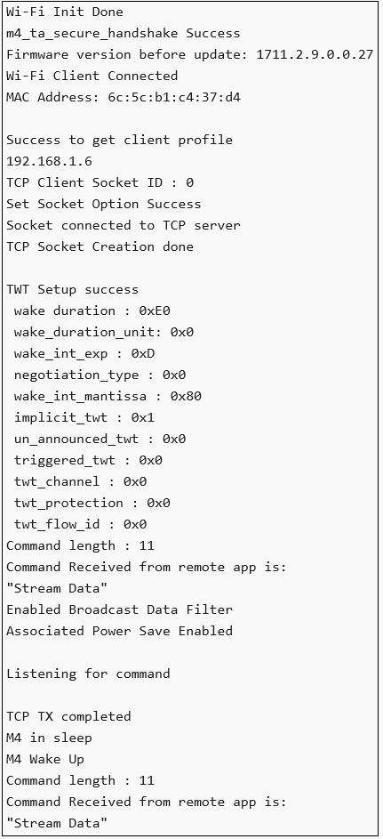

# Wi-Fi - TWT Use Case Demo App

- [Wi-Fi - TWT Use Case Demo App](#wi-fi---twt-use-case-demo-app)
  - [Purpose/Scope](#purposescope)
  - [Prerequisites/Setup Requirements](#prerequisitessetup-requirements)
    - [Hardware Requirements](#hardware-requirements)
    - [Software Requirements](#software-requirements)
    - [Setup Diagram](#setup-diagram)
  - [Getting Started](#getting-started)
  - [Application Build Environment](#application-build-environment)
    - [Configure the application](#configure-the-application)
    - [iTWT Configuration APIs](#itwt-configuration-apis)
      - [sl\_wifi\_target\_wake\_time\_auto\_selection API](#sl_wifi_target_wake_time_auto_selection-api)
      - [sl\_wifi\_enable\_target\_wake\_time API](#sl_wifi_enable_target_wake_time-api)
    - [iTWT Teardown Configuration](#itwt-teardown-configuration)
    - [iTWT Session Status Codes](#itwt-session-status-codes)
    - [Recommendations](#recommendations)
  - [Soc Mode:](#soc-mode)
    - [Without Tickless Mode:](#without-tickless-mode)
    - [Tickless Mode](#tickless-mode)
  - [Test the application](#test-the-application)
    - [Using Simplicity Studio Energy Profiler for current measurement](#using-simplicity-studio-energy-profiler-for-current-measurement)
      - [Expected output in Energy Profiler](#expected-output-in-energy-profiler)

## Purpose/Scope

The **TWT Use Case Demo App** demonstrates TCP and UDP client sockets as well as TWT session configuration. When the app receives a trigger packet over the TCP socket, it will send TCP Data for the Door lock scenario and UDP Data for the camera scenario.
This application is designed to be used in combination with **TWT Use Case Remote App**.

## Prerequisites/Setup Requirements

### Hardware Requirements  

- Windows PC
- Wi-Fi Access Point with 11ax and TWT responder mode support.
- **SoC Mode**:
  - Standalone
    - BRD4002A Wireless pro kit mainboard [SI-MB4002A]
    - Radio Boards 
  	  - BRD4338A [SiWx917-RB4338A]
  	  - BRD4343A [SiWx917-RB4343A]
  - Kits
  	- SiWx917 Pro Kit [Si917-PK6031A](https://www.silabs.com/development-tools/wireless/wi-fi/siwx917-pro-kit?tab=overview)
  	- SiWx917 Pro Kit [Si917-PK6032A]
    - SiWx917 AC1 Module Explorer Kit (BRD2708A)
  	
- **NCP Mode**:
  - Standalone
    - BRD4002A Wireless pro kit mainboard [SI-MB4002A]
    - EFR32xG24 Wireless 2.4 GHz +10 dBm Radio Board [xG24-RB4186C](https://www.silabs.com/development-tools/wireless/xg24-rb4186c-efr32xg24-wireless-gecko-radio-board?tab=overview)
    - NCP Expansion Kit with NCP Radio boards
      - (BRD4346A + BRD8045A) [SiWx917-EB4346A]
      - (BRD4357A + BRD8045A) [SiWx917-EB4357A]
  - Kits
  	- EFR32xG24 Pro Kit +10 dBm [xG24-PK6009A](https://www.silabs.com/development-tools/wireless/efr32xg24-pro-kit-10-dbm?tab=overview) 
  - Interface and Host MCU Supported
    - SPI - EFR32 
    - UART - EFR32

### Software Requirements

- Simplicity Studio IDE
- [iPerf Application](https://sourceforge.net/projects/iperf2/files/iperf-2.0.8-win.zip/download). iPerf is a tool for active measurements of the maximum achievable bandwidth on IP networks. It supports tuning of various parameters related to timing, buffers and protocols (TCP and UDP with IPv4 and IPv6).

### Setup Diagram

**SoC**
 
 
 **NCP**
 

## Getting Started

Refer to the instructions [here](https://docs.silabs.com/wiseconnect/latest/wiseconnect-getting-started/) to:

- [Install Simplicity Studio](https://docs.silabs.com/wiseconnect/latest/wiseconnect-developers-guide-developing-for-silabs-hosts/#install-simplicity-studio)
- [Install WiSeConnect 3 extension](https://docs.silabs.com/wiseconnect/latest/wiseconnect-developers-guide-developing-for-silabs-hosts/#install-the-wi-se-connect-3-extension)
- [Connect your device to the computer](https://docs.silabs.com/wiseconnect/latest/wiseconnect-developers-guide-developing-for-silabs-hosts/#connect-si-wx91x-to-computer)
- [Upgrade your connectivity firmware](https://docs.silabs.com/wiseconnect/latest/wiseconnect-developers-guide-developing-for-silabs-hosts/#update-si-wx91x-connectivity-firmware)
- [Create a Studio project](https://docs.silabs.com/wiseconnect/latest/wiseconnect-developers-guide-developing-for-silabs-hosts/#create-a-project)

For details on the project folder structure, see the [WiSeConnect Examples](https://docs.silabs.com/wiseconnect/latest/wiseconnect-examples/#example-folder-structure) page.

## Application Build Environment

The application can be configured to suit your requirements and development environment.

### Configure the application

- This application is designed to be used in combination with **TWT Use Case Remote App** Application. These two applications simulate Door lock and Camera like data transfer scenarios. It can be configured to suit your requirements and development environment.
Read through the following sections and make any changes needed. 

  - In the camera scenario, the remote app (Device A) sends a command to the Device Under Test (DUT, Device B). Device B responds with UDP data, simulating camera streaming.

  - In the door lock scenario, upon receiving a command from Device A, Device B sends a TCP response, simulating a door lock status response.

  - Device A operates as TCP server, periodically sending commands to Device B and awaiting a TCP/UDP response, depending on the scenario.

  - Device B functions as a TCP client and, if the DOOR_LOCK_SIMULATION macro is disabled for the camera scenario, also as a UDP client.

- Configure the SiWx91x as a TCP client and start a TCP server on the remote side APP. 
In general, it is advisable to start the server before the client since the client will immediately begin to try to connect to the server.

- In the Project explorer pane, expand the **config** folder and open the **sl_net_default_values.h** file. Configure the following parameters to enable your Silicon Labs Wi-Fi device to connect to your Wi-Fi network.

- **STA instance related parameters**

  - DEFAULT_WIFI_CLIENT_PROFILE_SSID refers to the name with which the SiWx91x SoftAP's Wi-Fi network shall be advertised.

     ```c
     #define DEFAULT_WIFI_CLIENT_PROFILE_SSID               "YOUR_AP_SSID"      
     ```

  - DEFAULT_WIFI_CLIENT_CREDENTIAL refers to the secret key if the Access point is configured in WPA-PSK/WPA2-PSK security modes.

     ```c 
     #define DEFAULT_WIFI_CLIENT_CREDENTIAL                 "YOUR_AP_PASSPHRASE" 
     ```

  - DEFAULT_WIFI_CLIENT_SECURITY_TYPE refers to the security type if the Access point is configured in WPA/WPA2 or mixed security modes.

    ```c
    #define DEFAULT_WIFI_CLIENT_SECURITY_TYPE              SL_WIFI_WPA2 
    ```

  - Other STA instance configurations can be modified if required in `default_wifi_client_profile` configuration structure.

  - Number of packets to send or receive

    ```c
    #define NUMBER_OF_PACKETS 1
    ```

  - TCP_SERVER_PORT port refers remote TCP server port number

    ```c
      #define TCP_SERVER_PORT 5001
    ```

  - UDP_SERVER_PORT port refers remote UDP server port number

    ```c
    #define UDP_SERVER_PORT 5005
    ```

  - SERVER_IP_ADDRESS_TCP refers remote peer IP address (Si91x remote module/ any end user application device IP) to connect with TCP server socket.

    ```c
    #define SERVER_IP_ADDRESS_TCP "192.168.50.68"
    ```

  - SERVER_IP_ADDRESS_UDP refers remote peer IP address (Si91x remote module/ any end user application device IP) to connect with UDP server socket.

    ```c
    #define SERVER_IP_ADDRESS_UDP "192.168.50.136"
    ```

  - For Doorlock scenario, enable **DOOR_LOCK_SIMULATION** macro. In this mode, DUT is a TCP client that connects to the TCP server of the end user application and does TCP Tx on trigger.

  - For Camera scenario, disable **DOOR_LOCK_SIMULATION** macro. In this mode, DUT is a both a TCP client and a UDP client. TCP client, to receive command and a UDP client to send UDP data(camera streaming). 

    ```c
    #define DOOR_LOCK_SIMULATION                             0
    ```

- **Power save configuration**

  - By default, the application is configured without power save. If user wants to run the application in power save, enable the below macro.

    ```c
    #define ENABLE_NWP_POWER_SAVE 1
    ```

  > **Note:**
  >
  > - Once TWT SP started, beacon sync will happen as described below. This will be applicable till TWT teardown.
  >   - Beacon sync will happen every 5 seconds if the TWT interval is less then 5 seconds. Else it will happen at 600ms before every TWT SP start.
  > - Listen interval/DTIM skip/DTIM based sleep setting will not be applicable once TWT SP started. These settings will be applicable once TWT teardown is done.
  > - While editing the above mentioned parameters, Simplicity Studio shows a warning, click on the "Make a Copy" option and edit the above mentioned parameters
  >  

### iTWT Configuration APIs

To configure iTWT parameters open **app.c**.
There are three TWT configuration APIs. 
>
> - sl_wifi_target_wake_time_auto_selection - This API calculates and automatically configures suitable TWT parameters based on the given inputs. Enables or disables a TWT session. Recommended for user applications.
> - sl_wifi_enable_target_wake_time - This API allows users to manually configure iTWT session parameters and enables the iTWT session. This API is not recommended for users. It is for internal certification purposes only.
> - sl_wifi_disable_target_wake_time - Disables a TWT session.

#### sl_wifi_target_wake_time_auto_selection API

```c
sl_status_t sl_wifi_target_wake_time_auto_selection(sl_wifi_twt_selection_t *twt_auto_request)
```

This TWT API is recommended because it's designed for maintaining connections, improving throughput, and enhancing power performance.

Input parameter descriptions are as follows:

- twt_enable : TWT enable. 0 - TWT session teardown; 1 - TWT session setup.
- average_tx_throughput : This is the expected average Tx throughput in Kbps. Value ranges from 0 to 10Mbps, which is half of the default [device_average_throughput](https://docs.silabs.com/wiseconnect/latest/wiseconnect-api-reference-guide-wi-fi/sl-wifi-twt-selection-t#device-average-throughput) (20Mbps by default).
- tx_latency : The allowed latency, in milliseconds, within which the given Tx operation is expected to be completed. If 0 is configured, maximum allowed Tx latency is same as rx_latency. Otherwise, valid values are in the range of [200ms - 6hrs].
- rx_latency : The maximum latency, in milliseconds, for receiving buffered packets from the AP. The device wakes up at least once for a TWT service period within the configured rx_latency if there are any pending packets destined for the device from the AP. If set to 0, the default latency of 2 seconds is used. Valid range is between 2 seconds to 6 hours. Recommended range is 2 seconds to 60 seconds to avoid connection failures with AP due to longer sleep time.

For more information on parameters, refer [sl_wifi_twt_selection_t](https://docs.silabs.com/wiseconnect/latest/wiseconnect-api-reference-guide-wi-fi/sl-wifi-twt-selection-t).

- Enable TWT_AUTO_CONFIG MACRO in the app.c file to enable usage of this API.

  ```c
  #define TWT_AUTO_CONFIG         1
  ```

Given below are sample configurations.
  
  ```c
  sl_wifi_twt_selection_t default_twt_selection_configuration = {
    .twt_enable                            = 1,
    .average_tx_throughput                 = 1000,
    .tx_latency                            = 0,
    .rx_latency                            = 5000,
    .device_average_throughput             = DEVICE_AVERAGE_THROUGHPUT,
    .estimated_extra_wake_duration_percent = ESTIMATE_EXTRA_WAKE_DURATION_PERCENT,
    .twt_tolerable_deviation               = TWT_TOLERABLE_DEVIATION,
    .default_wake_interval_ms              = TWT_DEFAULT_WAKE_INTERVAL_MS,
    .default_minimum_wake_duration_ms      = TWT_DEFAULT_WAKE_DURATION_MS,
    .beacon_wake_up_count_after_sp         = MAX_BEACON_WAKE_UP_AFTER_SP
  };
  ```
- The following are the default macro settings. User should not change these values as it may affect the working of the algorithm. 

  ```c
  #define DEVICE_AVG_THROUGHPUT                20000    // Kbps
  #define ESTIMATE_EXTRA_WAKE_DURATION_PERCENT 0        // in percentage
  #define TWT_TOLERABLE_DEVIATION              10       // in percentage
  #define TWT_DEFAULT_WAKE_INTERVAL_MS         1024     // in milli seconds
  #define TWT_DEFAULT_WAKE_DURATION_MS         16       // in milli seconds
  #define MAX_TX_AND_RX_LATENCY_LIMIT          22118400 // 6hrs in milli seconds
  #define MAX_BEACON_WAKE_UP_AFTER_SP \
    2 // The number of beacons after the service period completion for which the module wakes up and listens for any pending RX.
  ```

>**Note**
> WLAN Keep Alive should not be disabled while using this API.

#### sl_wifi_enable_target_wake_time API

Usage of this API requires knowledge of individual TWT setup negotiation. This API doesn't take care of network disconnections.

  ```c
  sl_status_t sl_wifi_enable_target_wake_time(sl_wifi_twt_request_t *twt_req);
  ```

- iTWT parameters should be configured and filled into the *sl_wifi_twt_request_t* structure in app.c and passed as a parameter to *sl_wifi_enable_target_wake_time()* API.

  Given below are sample configurations.

  ```c
  sl_wifi_twt_request_t default_twt_setup_configuration = {
    .twt_enable              = 1,
    .twt_flow_id             = 1,
    .wake_duration           = 0x60,
    .wake_duration_unit      = 0,
    .wake_duration_tol       = 0x60,
    .wake_int_exp            = 13,
    .wake_int_exp_tol        = 13,
    .wake_int_mantissa       = 0x1D4C,
    .wake_int_mantissa_tol   = 0x1D4C,
    .implicit_twt            = 1,
    .un_announced_twt        = 1,
    .triggered_twt           = 0,
    .twt_channel             = 0,
    .twt_protection          = 0,
    .restrict_tx_outside_tsp = 1,
    .twt_retry_limit         = 6,
    .twt_retry_interval      = 10,
    .req_type                = 1,
    .negotiation_type        = 0,
  };
  ```

> Note:
>
> - TWT Wake duration depends on the wake duration unit. For example, for the above configuration, wake duration value is  (0xE0 * 256 = 57.3 msec).
> - TWT Wake interval is calculated as mantissa *2 ^ exp.  For example, for the above configuration, wake interval value is (0x1B00* 2^13  = 55.2 sec).
> - Configuring TWT Wake interval beyond 1 min might lead to disconnections from the AP.
> - There might be disconnections while using TWT with wake interval > 4sec when connected to an AP with non-zero GTK key renewal time.
> - Keep Alive timeout should be non-zero when negotiated TWT setup is **unannounced**, otherwise there might be disconnections.

- For both TWT APIs, if TWT session setup is successful, the following notification will be printed with TWT response parameters from the AP.

  

### iTWT Teardown Configuration

To teardown TWT session use the matching TWT teardown API corresponding to the TWT setup configuration API:

- For TWT parameters Auto Selection API, call the following API to teardown :

  ```c
  status = sl_wifi_target_wake_time_auto_selection(twt_selection);
  ```

  - Set twt_enable parameter to '0' in the **twt_selection** structure. The other parameters in the structure are ignored. 

- For manually configurable TWT parameters API, call the following API to teardown:

  ```c
  status = sl_wifi_disable_target_wake_time(&twt_req);
  ```

  - twt_req->twt_enable should be set to '0' for teardown operation.

  - twt_req->twt_flow_id should be configured as described below: 
  >
  > - This paramater value range is 0-7. It should be same as setup flow ID, other wise error will be triggered.
  > - 0xFF - To teardown all active sessions. This value is valid only in case of teardown command.
  >
  - Rest of the parameters in the structure are ignored for a Teardown operation. 

  > Note : For setting a new TWT session, the existing TWT session must be teared down.

### iTWT Session Status Codes

- User can get asynchronous TWT session updates if *twt_response_handler* is defined and the callback is registered. A *twt_response_handler* is provided in the example application. The following are the TWT session status codes.

  |S.No|  MACRO|  Session status code|  Description|
  |:----|:------|:-------------------|:--------------|
  |1.|  TWT_SESSION_SUCC| 0|  TWT session setup success. TWT session is active.|
  |2.|  TWT_UNSOL_SESSION_SUCC| 1|  Unsolicited TWT setup response from AP accepted. TWT session is active.|
  |3.|  TWT_SETUP_AP_REJECTED|  4|  TWT Reject frame received in response for the sent TWT setup frame.|
  |4.|  TWT_SETUP_RSP_OUTOF_TOL|5|  TWT response parameters from AP for TWT Suggest request is not within tolerance set by User.|
  |5.|  TWT_SETUP_RSP_NOT_MATCHED|  6|  TWT response parameters from AP for TWT Demand request does not match parameters given by User.|
  |6.|  TWT_SETUP_UNSUPPORTED_RSP|  10| Unsupported TWT response from AP.|
  |7.|  TWT_TEARDOWN_SUCC|  11| TWT session teardown success|
  |8.|  TWT_AP_TEARDOWN_SUCC| 12| TWT session teardown from AP success|
  |9.|  TWT_SETUP_FAIL_MAX_RETRIES_REACHED| 15| TWT setup request retried maximum number of times as configured by user.|
  |10.| TWT_INACTIVE_DUETO_ROAMING| 16  |TWT session inactive due to roaming|
  |11.| TWT_INACTIVE_DUETO_DISCONNECT|  17| TWT session inactive due to disconnect|
  |12.| TWT_INACTIVE_NO_AP_SUPPORT| 18| TWT session inactive as connected AP does not support TWT.|

  > **Note:** The **twt_session_active** variable is provided in the example application and it is updated according to the asynchronous TWT session notifications. User can utilize this variable to know the existing session status. 

### Recommendations

- Use sl_wifi_target_wake_time_auto_selection with appropriate Rx Latency input according to the use case as it has improved design over sl_wifi_enable_target_wake_time. Also, it handles network level disconnections such as ARP, Embedded MQTT and TCP connections. It has better user interface and simplifies TWT usage.

- iTWT setup is recommended after IP assignment/TCP connection/application connection.

- When using sl_wifi_target_wake_time_auto_selection API, Rx Latency should be less than TCP / ARP Timeouts at the remote side.

- When using sl_wifi_enable_target_wake_time API, TWT interval configured should be less than TCP / ARP Timeouts at the remote side.

- For iTWT GTK Interval Should be kept maximum possible value or zero. If GTK interval is not configurable, recommended TWT interval (in case of sl_wifi_enable_target_wake_time) / RX Latency (in case of sl_wifi_target_wake_time_auto_selection API) is less than 4sec.

- When sl_wifi_enable_target_wake_time API is used, configuring TWT Wake interval beyond 1 min might lead to disconnections from the AP. Recommended to use TWT wake up interval less than or equal to 1 min.

- WLAN Keep Alive timeout should not be disabled when sl_wifi_target_wake_time_auto_selection API is used or when unannounced TWT session is set up using sl_wifi_enable_target_wake_time API. It is recommended to use WLAN Keep Alive timeout of 30 sec which is the default timeout even if not configured specifically by the user.

## Soc Mode:

### Without Tickless Mode:

The M4 processor is set in sleep mode. The M4 processor can be woken in several ways as mentioned below:

- ALARM timer-based - In this method, an ALARM timer runs and wakes the M4 processor periodically.
  - You can enable the ALARM timer-wakeup by setting the macros "SL_ENABLE_CALENDAR_WAKEUP_SOURCE" and "ENABLE_ALARM" to '1'.
  - You can configure the periodic alarm time by setting the macro "ALARM_TIME_MSEC" to a specific value.
- Button press-based (GPIO) - In this method, the M4 processor wakes up upon pressing a button (BTN0).
  - You can enable the Button press-based wakeup by setting the macro "ENABLE_NPSS_GPIO_2" to '1'.
- Wireless-based - When an RX packet is to be received by the NWP, the M4 processor is woken up.

### Tickless Mode

In Tickless Mode, the device enters sleep based on the idle time set by the scheduler. The device can be awakened by two methods: SysRTC or a wireless signal.

- **SysRTC (System Real-Time Clock)**: By default, the device uses SysRTC as the wakeup source. The device will enter sleep mode and then wake up when the SysRTC matches the idle time set by the scheduler.

- **Wireless Wakeup**: The device can also be awakened by a wireless signal. If this signal is triggered before the idle time set by the scheduler, the device will wake up in response to it.

> **Note**: For recommended settings, see the [recommendations guide](https://docs.silabs.com/wiseconnect/latest/wiseconnect-developers-guide-prog-recommended-settings/).

## Test the application

Refer to the instructions [here](https://docs.silabs.com/wiseconnect/latest/wiseconnect-getting-started/) to:

- Build the application.

- Flash, run and debug the application

  > **Note:**
  > If using **app.c** and using an iPerf server on remote side, to avoid loss of TCP connection due to ARP loss while the device is in sleep, it is suggested to add the device IP address to the Remote PC's ARP table.
  > For example, for device IP "192.168.0.101", MAC address "80-C9-55-XX-XX-XX" and ethernet interface 7, following is the command used in a Windows system. The MAC address and IP of SiWx917 can be observed in the serial prints.  

- For Ethernet:

  ```sh
  netsh interface ipv4 set neighbors interface="Ethernet 7" "192.168.0.101" "80-c9-55-XX-XX-XX"
  ```

- For Wi-Fi:

  ```c
  netsh interface ipv4 set neighbors interface="Wi-Fi" "192.168.0.101" "80-c9-55-XX-XX-XX"
  ```

- Sample application output:

  

### Using Simplicity Studio Energy Profiler for current measurement
  
  After flashing the application code to the module. Energy profiler can be used for current consumption measurements.

- From tools, choose Energy Profiler and click "OK"

  

- From Quick Access, choose Start Energy Capture option 

  

#### Expected output in Energy Profiler 
  
  

> **Note**: The average current consumption may vary based on the environment, the above image is for reference.
