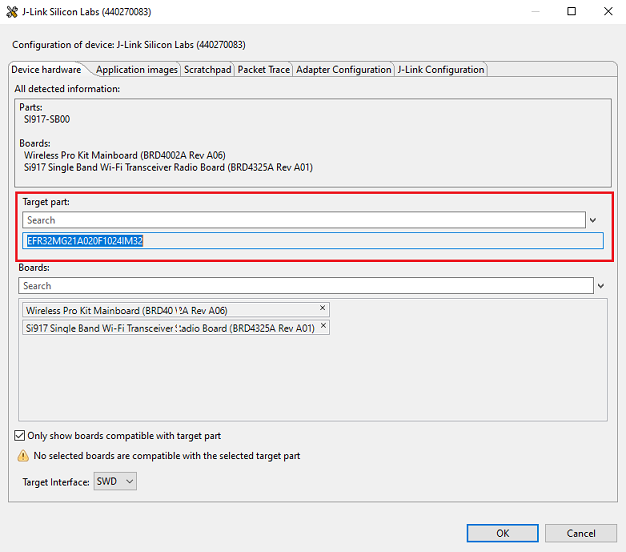

# TWT Use Case Demo

## 1 Purpose/Scope

This application demonstrates the procedure to setup TWT session and configure the SiWx91x in TCP client role.

In this application, the SiWx91x connects to a Wi-Fi access point, obtains an IP address, connects to Iperf server running on a remote PC and maintains  TCP Socket connection and periodically wakes up as per the configured TWT wakeup interval in powersave.

## 2 Prerequisites/Setup Requirements

### 2.1 Hardware Requirements  

- Windows PC
- Wi-Fi Access Point with 11ax and TWT responder mode support.
- PC2 (Remote PC) with TCP server application (iperf)
- **SoC Mode**:
  - Silicon Labs [BRD4325A, BRD4325B, BRD4325C, BRD4325G, BRD4388A](https://www.silabs.com/)
- **NCP Mode**:
  - Silicon Labs [BRD4180B](https://www.silabs.com/)
  - Host MCU Eval Kit. This example has been tested with Silicon Labs [WSTK + EFR32MG21](https://www.silabs.com/development-tools/wireless/efr32xg21-bluetooth-starter-kit) 

### 2.2 Software Requirements

- Simplicity Studio IDE

  - Download the latest [Simplicity Studio IDE](https://www.silabs.com/developers/simplicity-studio)
  - Follow the [Simplicity Studio user guide](https://docs.silabs.com/simplicity-studio-5-users-guide/1.1.0/ss-5-users-guide-getting-started/install-ss-5-and-software#install-ssv5) to install Simplicity Studio IDE

- [Iperf Application](https://iperf.fr/iperf-download.php)

### 2.3 Setup Diagram

#### SoC Mode


  
#### NCP Mode  


Follow the [Getting Started with Wiseconnect3 SDK](https://docs.silabs.com/wiseconnect/latest/wiseconnect-getting-started/) guide to set up the hardware connections and Simplicity Studio IDE.

## 3 Project Environment

- Ensure the SiWx91x loaded with the latest firmware following the [Upgrade Si91x firmware](https://docs.silabs.com/wiseconnect/latest/wiseconnect-getting-started/getting-started-with-soc-mode#upgrade-si-wx91x-connectivity-firmware)

- Ensure the latest Gecko SDK along with the extension WiSeConnect3 is added to Simplicity Studio.

### 3.1 Creating the project

#### 3.1.1 SoC mode

- Ensure the SiWx91x set up is connected to your PC.

- In the Simplicity Studio IDE, the SiWx91x SoC board will be detected under **Debug Adapters** pane as shown below.

  ****

#### 3.1.2 NCP mode

- Ensure the EFx32 and SiWx91x set up is connected to your PC.

- In the Simplicity Studio IDE, the EFR32 board will be detected under **Debug Adapters** pane as shown below.

  ****

### 3.2 Importing the project

- Studio should detect your board. Your board will be shown here. Click on the board detected and go to **EXAMPLE PROJECTS & DEMOS** section 

#### SOC Mode

- Select **Wi-Fi - TWT Use case remote app(SOC)** test application

  ****

- Click 'Create'. The "New Project Wizard" window appears. Click 'Finish'

  ****

#### NCP Mode

- Select **Wi-Fi - TWT Use case remote app(NCP)** test application

  ****

- Click 'Create'. The "New Project Wizard" window appears. Click 'Finish'

  ****

### 3.3 Set up for application prints

#### 3.3.1 Teraterm set up - for BRD4325A, BRD4325B, BRD4325C, BRD4325G

You can use either of the below USB to UART converters for application prints.

1. Set up using USB to UART converter board.

   - Connect Tx (Pin-6) to P27 on WSTK
   - Connect GND (Pin 8 or 10) to GND on WSTK

   ****

2. Set up using USB to UART converter cable.

   - Connect RX (Pin 5) of TTL convertor to P27 on WSTK
   - Connect GND (Pin1) of TTL convertor to GND on WSTK

   ****

3. Open the Teraterm tool.

   - For SoC mode, choose the serial port to which USB to UART converter is connected and click on **OK**.

     ****

**Note:** For Other 917 SoC boards please refer section #3.3.2

#### 3.3.2 **Teraterm set up - for NCP and SoC modes**

1. Open the Teraterm tool.

- choose the J-Link port and click on **OK**.
    
    ****

2. Navigate to the Setup → Serial port and update the baud rate to **115200** and click on **OK**.

    ****

    ****

## 4 Application Build Environment

The application can be configured to suit your requirements and development environment.

### 4.1 Configure the application

1. In the Project explorer pane, expand the **config** folder and open the **sl_net_default_values.h** file. Configure the following parameters to enable your Silicon Labs Wi-Fi device to connect to your Wi-Fi network.

- **STA instance related parameters**

  - DEFAULT_WIFI_CLIENT_PROFILE_SSID refers to the name with which the SiWx91x SoftAP's Wi-Fi network shall be advertised.

     ```c
     #define DEFAULT_WIFI_CLIENT_PROFILE_SSID               "YOUR_AP_SSID"      
     ```

  - DEFAULT_WIFI_CLIENT_CREDENTIAL refers to the secret key if the Access point is configured in WPA-PSK/WPA2-PSK security modes.

     ```c 
     #define DEFAULT_WIFI_CLIENT_CREDENTIAL                 "YOUR_AP_PASSPHRASE" 
     ```

	- DEFAULT_WIFI_CLIENT_SECURITY_TYPE refers to the security type if the Access point is configured in WPA/WPA2 or mixed security modes.

  	```c
  	#define DEFAULT_WIFI_CLIENT_SECURITY_TYPE              SL_WIFI_WPA2 
  	```

  - Other STA instance configurations can be modified if required in `default_wifi_client_profile` configuration structure.

2.  Configuring the Application
The application can be configured to suit your requirements and development environment.
Read through the following sections and make any changes needed. 

This application can be used in combination with **TWT Use Case Remote App** Application. These two applications simulate Door lock and Camera like scenarios.

In Camera scenario, remote application (Device A) sends a command to the DUT (where TWT Use Case Application is running. Say Device B). Upon receiving the command (from Device A), DUT sends UDP data(equivalent to camera streaming) in response to the remote application's trigger.

In Door Lock scenario, upon receiving the command (from Device A), DUT (Device B) sends a TCP response (equivalent to door lock status response) to the remote application (Device B).

To support above scenarios, this app brings up Si91x module as a TCP client. It also brings up UDP client in addition to TCP client if SEND_TCP_DATA macro is disabled.

Also on other end, device A creates TCP server to listen for connections and trigger command (to device B) periodically. After transmitting command, device waits for TCP/UDP response based on the use case being executed.

Device B remains in sleep until it receives a command from the Remote Application (Device A). 


Number of packet to send or receive
```c
#define NUMBER_OF_PACKETS 1
```

TCP_SERVER_PORT port refers remote TCP server port number
```c
//! TCP Server port number
#define TCP_SERVER_PORT 5001
```
UDP_SERVER_PORT port refers remote UDP server port number
```c
//! SERVER port number for UDP socket
#define UDP_SERVER_PORT 5005
```

SERVER_IP_ADDRESS_TCP refers remote peer IP address (Si91x remote module/ any end user application device IP) to connect with TCP server socket.

```c
//! Server IP address. Should be in reverse long format
//! E.g: 0x640AA8C0 == 192.168.10.100
#define SERVER_IP_ADDRESS_TCP "192.168.50.68"
```

SERVER_IP_ADDRESS_UDP refers remote peer IP address (Si91x remote module/ any end user application device IP) to connect with UDP server socket.
```c
#define SERVER_IP_ADDRESS_UDP "192.168.50.136"
```

For Doorlock scenario, enable **SEND_TCP_DATA** macro. In this mode, DUT is a TCP client that connects to the TCP server of the end user application and does TCP Tx on trigger.

For Camera scenario, disable **SEND_TCP_DATA** macro. In this modes, DUT is a both a TCP client and a UDP client. TCP client, to receive command and a UDP client to send UDP data(camera streaming). 

```c
//! Set SEND_TCP_DATA to 1 for TCP TX (Door lock scenario) and 0 for UDP TX (video scenario)
#define SEND_TCP_DATA 0
```

#### The desired parameters are provided below. User can also modify the parameters as per their needs and requirements.

Application memory length which is required by the driver

```c
#define GLOBAL_BUFF_LEN                            15000
```

To configure IP address
   DHCP_MODE refers whether IP address configured through DHCP or STATIC

```c
#define DHCP_MODE                                  1
```
   
> Note:

> - If user wants to configure STA IP address through DHCP then set DHCP_MODE to "1" and skip configuring the following DEVICE_IP, GATEWAY and NETMASK macros.
> **(Or)**
> - If user wants to configure STA IP address through STATIC then set DHCP_MODE macro to "0" and configure DEVICE_IP, GATEWAY and NETMASK macros. 
> - AP and the STA should be in the same network domain. 

Following are the sample configurations. 

```c
#define DEVICE_IP                                  "192.168.10.101"
```
```c
#define GATEWAY                                    "192.168.10.1"
```
```c
#define NETMASK                                    "255.255.255.0"
```

**Power save configuration**

   - By default, the application is configured without power save.

```c
#define ENABLE_POWER_SAVE 0
```
   - If user wants to run the application in power save, modify the below macro.

```c
#define ENABLE_POWER_SAVE 1
```
> Note: 
>  *  Once TWT SP started, beacon sync will happen as described below. This will be applicable till TWT teardown.
>     * Beacon sync will happen every 5 second if TWT interval is less then 5 second. Else it will happen at 600ms before every TWT SP start.
>  * Listen interval/DTIM skip/DTIM based sleep setting will not be applicable once TWT SP started. These setting will be applicable once TWT is teardown.

- While editing the above mentioned parameters, Simplicity Studio shows a warning, click on the "Make a Copy" option and edit the above mentioned parameters

   

### iTWT Configuration APIs:
There are two TWT configuration APIs. 
> * sl_wifi_target_wake_time_auto_selection - This API calculates and automatically configures TWT parameters based on the given inputs. Enables or disables a TWT session.
> * sl_wifi_enable_target_wake_time_wlan_twt_config - Configures user given TWT parameters. Enables or disables a TWT session.

#### **sl_wifi_target_wake_time_auto_selection**

```c
int32_t sl_wifi_target_wake_time_auto_selectionn(uint8_t twt_enable, uint32_t rx_latency, uint32_t tx_latency, uint16_t avg_tx_throughput)
```

Parameters of function are explained below:
- twt_enable  :  1- Setup ; 0 - teardown
- tx_latency  :  The period, in milliseconds, within which the given Tx operation needs to be completed. Valid values is either 0 or in the range of [200ms - 6hrs]
- rx_latency  :  The maximum allowed receive latency, in milliseconds, when an Rx packet is buffered at the AP. If rx_latency is less than <= 1sec (except 0), session creation is not possible. For default configuration, input 0.
- avg_tx_throughput  :  The expected average throughput, in Kilo Bytes per seconds, to be achieved within the Tx latency. Valid value is 0 to half of Device Throughput ( = 20MBPS / 2).

Enable TWT_AUTO_CONFIG MACRO in the app.c file.
Given below are sample configurations.
```c
#define TWT_AUTO_CONFIG         1
#define TWT_RX_LATENCY_MS       20000 //20 seconds
#define TWT_TX_LATENCY_MS       0     //0 -default configuration is taken
#define EXCPECTED_TX_THROUGHPUT_KBPS 0     // Default configuration  -- MBPS
```
Sample API call is given as below : 
```c
status = sl_wifi_target_wake_time_auto_selection(1, TWT_RX_LATENCY_MS, TWT_TX_LATENCY_MS, EXCPECTED_TX_THROUGHPUT_KBPS);
```
There are default macro settings that are used for calculating the iTWT parameters. 

Sample Macro Settings : 
```c
#define DEVICE_AVG_THROUGHPUT                20000 \\ KBPS
#define ESTIMATE_EXTRA_WAKE_DURATION_PERCENT 0 \\ in percentage
#define TWT_TOLERABLE_DEVIATION              10 \\ in percentage
#define TWT_DEFAULT_WAKE_INTERVAL_MS         1024     // in milli seconds
#define TWT_DEFAULT_WAKE_DURATION_MS         16       // in milli seconds
#define MAX_TX_AND_RX_LATENCY_LIMIT          22118400 // 6hrs in milli seconds
#define MAX_BEACON_WAKE_UP_AFTER_SP \
  2 // The number of beacons after the service period completion for which the module wakes up and listens for any pending RX.
```
Note :  WLAN Keep Alive should not be disabled while using this API.

#### **rsi_wlan_twt_config API**

```c
int32_t sl_wifi_enable_target_wake_time(sl_wifi_twt_request_t *twt_request)
```
Parameters of function are explained below :

- twt_enable:  1- Setup ; 0 - teardown

- twt_flow_id: range 0-7 or 0xFF

- twt_req_params: Structure with parameters in case of setup and NULL in case of teardown.

iTWT parameters should be configured and filled into the structure type *twt_user_params_t*  in app.c and passed as a parameter to *sl_wifi_enable_target_wake_time()* API.

Given below are sample configurations.

```c
        twt_user_params_t twt_req;
        twt_req.wake_duration           = 0x80;
        twt_req.wake_duration_unit      = 0;  
        twt_req.wake_duration_tol       = 0x80;
        twt_req.wake_int_exp            = 13;
        twt_req.wake_int_exp_tol        = 13;
        twt_req.wake_int_mantissa       = 0x1B00;  
        twt_req.wake_int_mantissa_tol   = 0x1B00;
        twt_req.implicit_twt            = 1;
        twt_req.un_announced_twt        = 1;
        twt_req.triggered_twt           = 0;
        twt_req.twt_channel             = 0; 
        twt_req.twt_protection          = 0;
        twt_req.restrict_tx_outside_tsp = 1;
        twt_req.twt_retry_limit         = 6;
        twt_req.twt_retry_interval      = 10;
        twt_req.req_type                = 1;
```
These parameters with their limits are defined as below.

- **wake_duration**: This is the nominal minimum wake duration of TWT. This is the time for which DUT will be in wake state for Transmission or reception of data. Allowed values range is  0-255.
- **wake_duration_unit**: This parameter defines unit for wake_duration. Allowed values are  0 (256uS) and 1 (1024uS).
- **wake_duration_tol**: This is the tolerance allowed for wake duration in case of suggest TWT. Received TWT wake duration from AP will be validated against tolerance limits and decided if TWT config received is in acceptable range. Allowed values are 0-255.
- **wake_int_exp**: TWT Wake interval exponent. It is exponent to base 2. Allowed values are 0 - 31.
- **wake_int_exp_tol**: This is the allowed tolerance for wake_int_exp in case of suggest TWT request. Received TWT wake interval exponent from AP will be validated against tolerance limits and decided if TWT config received is in acceptable range. Allowed values are 0 - 31.
- **wake_int_mantissa**: This is the TWT wake interval mantissa. Allowed values are 0-65535.
- **wake_int_mantissa_tol**: This is tolerance allowed for wake_int_mantissa in case of suggest TWT. Received TWT wake interval mantissa from AP will be validated against tolerance limits and decided if TWT config received is in acceptable range. Allowed values are 0-65535.
- **implicit_twt**: If enabled (1), the TWT requesting STA calculates the Next TWT by adding a fixed value to the current TWT value. Explicit TWT is currently not allowed.
- **un_announced_twt**: If enabled (1), TWT requesting STA does not announce its wake up to AP through PS-POLLs or UAPSD Trigger frames.
- **triggered_twt**: If enabled(1), at least one trigger frame is included in the TWT Service Period(TSP).
- **twt_channel**: Currently this configuration is not supported. Allowed values are 0-7.
- **twt_protection**:  If enabled (1), TSP is protected. This is negotiable with AP. Currently not supported. Only zero is allowed.
- **restrict_tx_outside_tsp**: If enabled (1), any Tx outside the TSP is restricted. Else, TX can happen outside the TSP also.
- **twt_retry_limit**: This is the maximum number of retries allowed, if the TWT response frame is not received for the sent TWT request frame. Allowed values are 0 - 15.
- **twt_retry_interval**: The interval, in seconds, between two twt request retries. Allowed values are 5 - 255.
- **req_type**: This is the TWT request type.
> * 0 - Request TWT
> * 1 - Suggest TWT
> * 2 - Demand TWT

Below is the sample TWT setup API call with twt_enable = 1 and flow_id = 1.
```c
status = sl_wifi_enable_target_wake_time(1,1, &twt_req);
```
> Note:
> * TWT Wake duration depends on the wake duration unit. For example, for the above configuration, wake duration value is  (0xE0 * 256 = 57.3 msec).
> * TWT Wake interval is calculated as mantissa *2 ^ exp.  For example, for the above configuration, wake interval value is (0x1B00 * 2^13  = 55.2 sec).
> * Configuring TWT Wake interval beyond 1 min might lead to disconnections from the AP.
> * There might be disconnections while using TWT with wake interval > 4sec when connected to an AP with non-zero GTK key renewal time.
> * Keep Alive timeout should be non-zero when negotiated TWT setup is **unannounced**, otherwise there might be disconnections.

For both TWT APIs, if TWT session setup is successful, the following notification will be printed with TWT Response parameters from the AP.

   

### iTWT Teardown Configuration

To teardown TWT session use the matching TWT API:
1. For TWT Auto Selection API :
```c
status = sl_wifi_target_wake_time_auto_selection(twt_selection);
```
Disable twt_enable parameter. The other parameters are ignored. 

2. For user given TWT parameters API call the API as follows:

```c
status = sl_wifi_enable_target_wake_time(0,1, NULL);
```
* 1st parameter: twt_enable: 0 - teardown

* 2nd parameter: twt_flow_id: 
> * Range: 0-7 (should be same as setup ID, other wise error will be triggered)
> * 0xFF - To teardown all active sessions. This value is valid only in case of teardown command.

* 3rd parameter: NULL

> Note : For setting a new TWT session, the existing TWT session must be teared down.

### iTWT Command Status Codes
The following are the possible TWT command status codes.

|S.No |MACRO  |Error code |Description| SAPI/WLAN error code|
|:------:|:--------|:--------|:-----------------------------|:--------|
|1.|ERROR_COMMAND_GIVEN_IN_WRONG_STATE| 0xFFFD| Occurs when the API is given before opermode is done for this particular API.|SAPI|
|2.|ERROR_INVALID_PARAM|0xFFFE|Occurs when invalid parameters are passed to this API.|SAPI|
|3.|TWT_SUPPORT_NOT_ENABLED_ERR|0x70|When HE_PARAMS_SUPPORT and TWT_SUPPORT macros are not enabled|FW|
|4.|TWT_SETUP_ERR_SESSION_ACTIVE|0x71|Occurs when user tries to give TWT config command when there is an already active TWT session.|FW|
|5.|TWT_TEARDOWN_ERR_FLOWID_NOT_MATCHED|0x72|Occurs when TWT teardown command is given with a flow ID that does not match existing session flow ID.|FW|
|6.|TWT_TEARDOWN_ERR_NOACTIVE_SESS|0x73|Occurs when teardown command is given while there is no active session.|FW|
|7.|TWT_SESSION_NOT_FEASIBLE|0x74|This error code indicates that TWT session is not feasible. It is thrown only when TWT Auto Selection API is used.|FW|

### iTWT Session Status Codes

User can get asynchronous TWT session updates if *twt_response_handler* is defined and the callback is registered. A *twt_response_handler* is provided in the example application. The following are the TWT session status codes.

|S.No|  MACRO|  Session status code|  Description|
|:----|:------|:-------------------|:--------------|
|1.|  TWT_SESSION_SUCC| 0|  TWT session setup success. TWT session is active.|
|2.|  TWT_UNSOL_SESSION_SUCC| 1|  Unsolicited TWT setup response from AP accepted. TWT session is active.|
|3.|  TWT_SETUP_AP_REJECTED|  4|  TWT Reject frame received in response for the sent TWT setup frame.|
|4.|  TWT_SETUP_RSP_OUTOF_TOL|5|  TWT response parameters from AP for TWT Suggest request is not within tolerance set by User.|
|5.|  TWT_SETUP_RSP_NOT_MATCHED|  6|  TWT response parameters from AP for TWT Demand request does not match parameters given by User.|
|6.|  TWT_SETUP_UNSUPPORTED_RSP|  10| Unsupported TWT response from AP.|
|7.|  TWT_TEARDOWN_SUCC|  11| TWT session teardown success|
|8.|  TWT_AP_TEARDOWN_SUCC| 12| TWT session teardown from AP success|
|9.|  TWT_SETUP_FAIL_MAX_RETRIES_REACHED| 15| TWT setup request retried maximum number of times as configured by user.|
|10.| TWT_INACTIVE_DUETO_ROAMING| 16  |TWT session inactive due to roaming|
|11.| TWT_INACTIVE_DUETO_DISCONNECT|  17| TWT session inactive due to disconnect|
|12.| TWT_INACTIVE_NO_AP_SUPPORT| 18| TWT session inactive as connected AP does not support TWT.|

> Note:
> **twt_session_active** variable is provided in the example application and is updated according to the asychronous TWT session notifications. User can utilise this variable to teardown or configure new session parameters depending upon existing session status. 

## Recommendations

1. Use sl_wifi_target_wake_time_auto_selection with appropriate Rx Latency input according to the user scenario as it has improved  design over sl_wifi_enable_target_wake_time, handles Embedded MQTT level disconnections and has better user interface. 
2. iTWT setup is recommended after IP assignment/TCP connection/application connection.
3. When using sl_wifi_target_wake_time_auto_selection API, increase TCP / ARP Timeouts at remote side depending upon the configured Rx Latency.
4. When using sl_wifi_enable_target_wake_time, increase TCP / ARP Timeouts at remote side depending upon the configured TWT interval configured.
5. For iTWT GTK Interval Should be kept max possible value or zero. If GTK interval is not configurable, recommended TWT interval (in case of sl_wifi_enable_target_wake_time) / RX Latency (in case of sl_wifi_target_wake_time_auto_selection API) is less than 4sec.
6. When sl_wifi_enable_target_wake_time API is used, configuring TWT Wake interval beyond 1 min might lead to disconnections from the AP. Recommended to use TWT wakeup interval less than or equal to 1 min.
7. WLAN Keep Alive timeout should not be disabled when sl_wifi_target_wake_time_auto_selection API is used or when unannounced TWT session is set up using sl_wifi_enable_target_wake_time API. It is recommended to use WLAN Keep Alive timeout of 30 sec.

## Building and Testing the Application

Follow the below steps for the successful execution of the application.

### 4.2 Build the application

- SoC mode: Build as twt_use_case_demo Example

    ****

- NCP mode:

    ****

### 4.3 Run and Test the application

1. Once the build was successful, right click on project and select Debug As → Silicon Labs ARM Program to program the device as shown in below image.

   ****

Configure the SiWx91x as a TCP client and start a TCP server on the remote side APP.
In general, it is advisable to start the server before the client since the client will immediately begin to try to connect to the server. 

> Note : 
> If using **app.c** and using an iperf server on remote side, to avoid loss of TCP connection due to ARP loss while the device is in sleep, it is suggested to add the device IP address to the Remote PC's ARP table. 
> For example, for device IP "192.168.0.101", MAC address "80-C9-55-XX-XX-XX" and ethernet interface 7, following is the command used in a Windows system. The MAC address and IP of SiWx917 can be observed in the serial prints.  

For Ethernet:
```c
netsh interface ipv4 set neighbors interface="Ethernet 7" "192.168.0.101" "80-c9-55-XX-XX-XX"
```
For Wi-Fi:
```c
netsh interface ipv4 set neighbors interface="Wi-Fi" "192.168.0.101" "80-c9-55-XX-XX-XX"
```

### 4.4 Application Output

For sl_wifi_target_wake_time_auto_selection API,


For sl_wlan_twt_auto_selection API,


## Using Simplicity Studio Energy Profiler for current measurement:
  
  After flashing the application code to the module. Energy profiler can be used for current consumption measurements.

- Go to launcher → Debug Adapters pane and click on the board name.
  
  

- Click on Device configuration symbol
  
  

- Open the device configuration tab
  
  

- Change the Target part name to "EFR32MG21A020F1024IM32"

  

- Change board name to "BRD4180B", click "OK"

  

- From tools, choose Energy Profiler and click "OK"

  

- From Quick Access, choose Start Energy Capture option 

  

**NOTE** : The target part and board name have to be reverted to default to flash application binary. 

  

## Expected output in Energy Profiler

  

**NOTE**: The average current consumption may vary based on the environment, the above image is for reference 
