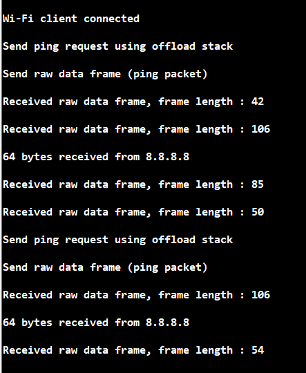
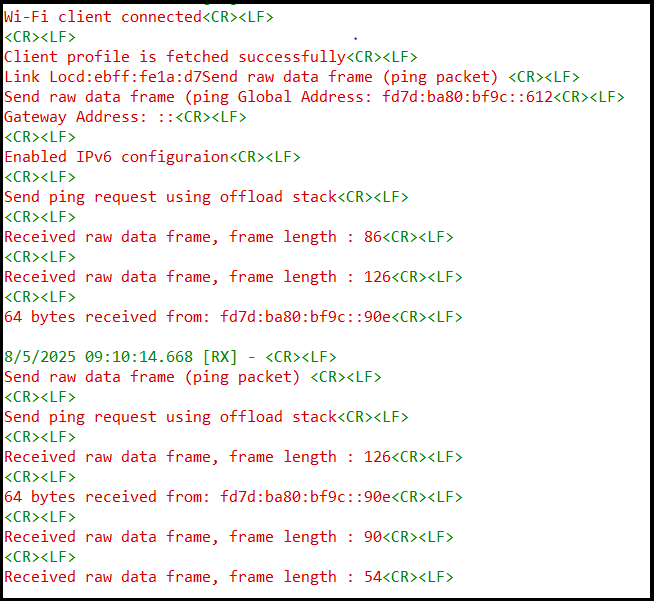

# Wi-Fi - Dual Network Stack Mode

## Table of Contents

- [Wi-Fi - Dual Network Stack Mode](#wi-fi---dual-network-stack-mode)
  - [Table of Contents](#table-of-contents)
  - [Purpose/Scope](#purposescope)
  - [Prerequisites/Setup Requirements](#prerequisitessetup-requirements)
    - [Hardware Requirements](#hardware-requirements)
    - [Software Requirements](#software-requirements)
    - [Setup Diagram](#setup-diagram)
  - [Getting Started](#getting-started)
  - [Application Build Environment](#application-build-environment)
  - [Test the application](#test-the-application)
  - [Application Execution Flow](#application-execution-flow)

## Purpose/Scope

This application demonstrates how to configure the SiWx91x module in dual network stack mode and showcases the station ping
functionality for dual network stacks by sending an Internet Control Message Protocol (ICMP) Echo Requests using raw data APIs
and the offload APIs to a remote device on the network and waiting for a reply.

The application itself creates an ICMP packet with the necessary header fields and a payload, sends the request to the firmware
using the send raw data API, and does not use an external host as part of this demo application test setup.

## Prerequisites/Setup Requirements

### Hardware Requirements

- A Windows PC.
- USB-C cable
- A Wireless Access point (which has an active internet access)

- **SoC Mode**:
  - Standalone
    - BRD4002A Wireless pro kit mainboard [SI-MB4002A]
    - Radio Boards
      - BRD4338A [SiWx917-RB4338A]
      - BRD4342A [SiWx917-RB4342A]
      - BRD4343A [SiWx917-RB4343A]
  - Kits
    - SiWx917 Pro Kit [Si917-PK6031A](https://www.silabs.com/development-tools/wireless/wi-fi/siwx917-pro-kit?tab=overview)
    - SiWx917 Pro Kit [Si917-PK6032A]
    - SiWx917 AC1 Module Explorer Kit (BRD2708A)

### Software Requirements

- Simplicity Studio
- Serial Terminal - [Docklight](https://docklight.de/)/[Tera Term](https://ttssh2.osdn.jp/index.html.en)

### Setup Diagram

  

## Getting Started

Refer to the instructions [here](https://docs.silabs.com/wiseconnect/latest/wiseconnect-getting-started/) to:

- [Install Simplicity Studio](https://docs.silabs.com/wiseconnect/latest/wiseconnect-developers-guide-developing-for-silabs-hosts/#install-simplicity-studio)
- [Install WiSeConnect extension](https://docs.silabs.com/wiseconnect/latest/wiseconnect-developers-guide-developing-for-silabs-hosts/#install-the-wi-se-connect-extension)
- [Connect your device to the computer](https://docs.silabs.com/wiseconnect/latest/wiseconnect-developers-guide-developing-for-silabs-hosts/#connect-si-wx91x-to-computer)
- [Upgrade your connectivity firmware](https://docs.silabs.com/wiseconnect/latest/wiseconnect-developers-guide-developing-for-silabs-hosts/#update-si-wx91x-connectivity-firmware)
- [Create a Studio project](https://docs.silabs.com/wiseconnect/latest/wiseconnect-developers-guide-developing-for-silabs-hosts/#create-a-project)

For details on the project folder structure, see the [WiSeConnect Examples](https://docs.silabs.com/wiseconnect/latest/wiseconnect-examples/#example-folder-structure) page.

## Application Build Environment

- The application can be configured to suit your requirements and development environment. Read through the following sections and make any changes as needed.

- In the Project Explorer pane, expand the **config/** folder and open the ``sl_net_default_values.h`` file. Configure the following parameters to enable your Silicon Labs Wi-Fi device to connect to your Wi-Fi network.

- STA instance related parameters

  - DEFAULT_WIFI_CLIENT_PROFILE_SSID refers to the name with which Wi-Fi network that shall be advertised and SiWx91x module is connected to it.
  
     ```c
     #define DEFAULT_WIFI_CLIENT_PROFILE_SSID               "YOUR_AP_SSID"      
     ```

  - DEFAULT_WIFI_CLIENT_CREDENTIAL refers to the secret key if the Access point is configured in WPA-PSK/WPA2-PSK security modes.

     ```c
     #define DEFAULT_WIFI_CLIENT_CREDENTIAL                 "YOUR_AP_PASSPHRASE"
     ```

  - DEFAULT_WIFI_CLIENT_SECURITY_TYPE refers to the security type if the Access point is configured in WPA/WPA2 or mixed security modes.

    ```c
    #define DEFAULT_WIFI_CLIENT_SECURITY_TYPE                 SL_WIFI_WPA2
    ```

  - Other STA instance configurations can be modified if required in `client_configuration` configuration structure defined in app.c.

- Configure the following parameters in ``app.c`` to test Station Ping application.

  - **Remote peer configurations**

      ```c
      #define REMOTE_IP_ADDRESS   "8.8.8.8"    // Remote/Target IPv4 address to ping
      #define PING_PACKET_SIZE    64           // Size of ping request packet
      ```

  - **IPv6 Configuration**
    - To enable IPv6, set the following macro in `app.c`:
      ```c
      #define CONFIGURE_IPV6 1
      ```
    - Ensure the preprocessor macro `SLI_SI91X_ENABLE_IPV6` is defined in the build settings.
    - Update the raw data buffer in `send_ping_raw_data_frame()` to include IPv6 headers and payload.

> **Note**: For recommended settings, please refer the [recommendations guide](https://docs.silabs.com/wiseconnect/latest/wiseconnect-developers-guide-prog-recommended-settings/).

## Test the application

Refer to the instructions [here](https://docs.silabs.com/wiseconnect/latest/wiseconnect-getting-started/) to:

- Build the application.

- Flash, run and debug the application.

- After successful connection with the Access Point, the device starts sending ping requests to the given REMOTE_IP_ADDRESS with configured PING_PACKET_SIZE to check availability of target device.

- When ping response comes from the remote node, the status of the response is known from the parameter of the callback function (`network_event_handler`) registered.

- Ping responses received for external host requests will be processed by **sl_si91x_host_process_data_frame()** API.

## Application Output

*IPv4 Ping Output:*


*IPv6 Ping Output:*



## Application Execution Flow

  **1. Initialize DUT in Wi-Fi Client Mode and Enable Dual Network Stack Mode**

  - Configure the SiWx917 module in `SL_SI91X_CLIENT_MODE` opermode.

  - Configure **SL_SI91X_EXT_TCP_IP_DUAL_MODE_ENABLE** bit of `ext_tcp_ip_feature_bit_map` in `client_configuration` to enable dual network stack feature.

  - Register network event callback handler to receive network events from the internal stack.

  ```c
  //! Silabs module initialization
  sl_net_init(SL_NET_WIFI_CLIENT_INTERFACE, &client_configuration, NULL, network_event_handler);
  ```

  - Bring up the Wi-Fi client interface.

  ```c
  sl_net_up(SL_NET_WIFI_CLIENT_INTERFACE, SL_NET_DEFAULT_WIFI_CLIENT_PROFILE_ID);
  ```

  - Ping from external host (simulating a ping packet)
    - The application prepares an ICMP packet (simulating a network ping packet from an external host) and sends it to the firmware using the raw data frame API every 2 seconds and receives the response through **sl_si91x_host_process_data_frame()** API.

    ```c
    send_ping_raw_data_frame();
    ```

  - Ping from offload network stack.
    - The application sends a ping request to the offload network stack every 2 seconds and receives ping success or failure through **network_event_handler**.

    ```c
    sl_si91x_send_ping(remote_ip_address, PING_PACKET_SIZE);
    ```


