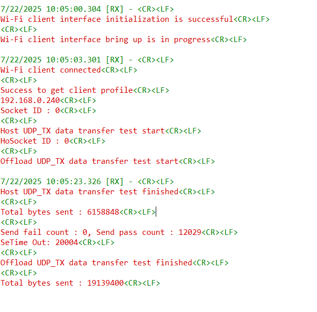
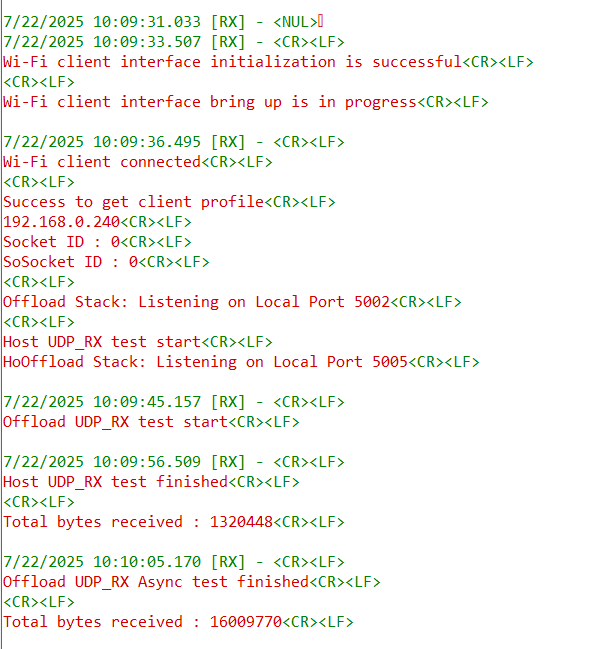
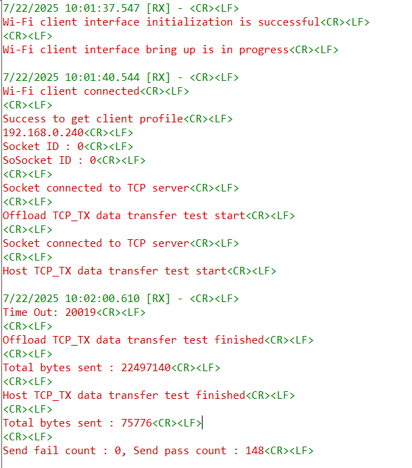
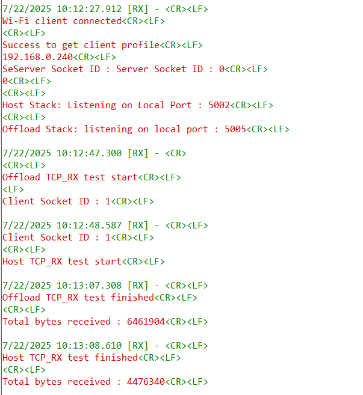

# Wi-Fi - Dual Network Stack NWP + M4

## Table of Contents

- [Wi-Fi - Dual Network Stack NWP + M4](#wi-fi---dual-network-stack-nwp-+-m4)
  - [Table of Contents](#table-of-contents)
  - [Purpose/Scope](#purposescope)
  - [Prerequisites/Setup Requirements](#prerequisitessetup-requirements)
    - [Hardware Requirements](#hardware-requirements)
    - [Software Requirements](#software-requirements)
    - [Setup Diagram](#setup-diagram)
  - [Getting Started](#getting-started)
  - [Application Build Environment](#application-build-environment)
  - [Test the application](#test-the-application)
  - [Limitations](#limitations)

## Purpose/Scope

This application demonstrates how to configure the SiWx91x module in dual network stack mode using the **SL_SI91X_EXT_TCP_IP_DUAL_MODE_ENABLE** feature and showcases simultaneous TCP/UDP data transfer from both the NWP offload stack and the M4 host-side LwIP stack.

## Prerequisites/Setup Requirements

### Hardware Requirements

- A Windows PC.
- USB-C cable
- A Wireless Access point (which has an active internet access)

- **SoC Mode**:
  - Standalone
    - BRD4002A Wireless pro kit mainboard [SI-MB4002A]
    - Radio Boards 
  	  - BRD4338A [SiWx917-RB4338A]
      - BRD4342A [SiWx917-RB4342A]
  	  - BRD4343A [SiWx917-RB4343A]
  - Kits
  	- SiWx917 Pro Kit [Si917-PK6031A](https://www.silabs.com/development-tools/wireless/wi-fi/siwx917-pro-kit?tab=overview)
  	- SiWx917 Pro Kit [Si917-PK6032A]
    - SiWx917 AC1 Module Explorer Kit (BRD2708A)

### Software Requirements

- Simplicity Studio
-  Serial Terminal - [Docklight](https://docklight.de/)/[Tera Term](https://ttssh2.osdn.jp/index.html.en)

### Setup Diagram

  

## Getting Started

Refer to the instructions [here](https://docs.silabs.com/wiseconnect/latest/wiseconnect-getting-started/) to:

- [Install Simplicity Studio](https://docs.silabs.com/wiseconnect/latest/wiseconnect-developers-guide-developing-for-silabs-hosts/#install-simplicity-studio)
- [Install WiSeConnect extension](https://docs.silabs.com/wiseconnect/latest/wiseconnect-developers-guide-developing-for-silabs-hosts/#install-the-wi-se-connect-extension)
- [Connect your device to the computer](https://docs.silabs.com/wiseconnect/latest/wiseconnect-developers-guide-developing-for-silabs-hosts/#connect-si-wx91x-to-computer)
- [Upgrade your connectivity firmware](https://docs.silabs.com/wiseconnect/latest/wiseconnect-developers-guide-developing-for-silabs-hosts/#update-si-wx91x-connectivity-firmware)
- [Create a Studio project](https://docs.silabs.com/wiseconnect/latest/wiseconnect-developers-guide-developing-for-silabs-hosts/#create-a-project)

For details on the project folder structure, see the [WiSeConnect Examples](https://docs.silabs.com/wiseconnect/latest/wiseconnect-examples/#example-folder-structure) page.

## Application Build Environment

- The application can be configured to suit your requirements and development environment. Read through the following sections and make any changes as needed.

- In the Project Explorer pane, expand the **config/** folder and open the ``sl_net_default_values.h`` file. Configure the following parameters to enable your Silicon Labs Wi-Fi device to connect to your Wi-Fi network.

- STA instance related parameters

  - DEFAULT_WIFI_CLIENT_PROFILE_SSID refers to the name with which Wi-Fi network that shall be advertised and SiWx91x module is connected to it.
  
     ```c
     #define DEFAULT_WIFI_CLIENT_PROFILE_SSID               "YOUR_AP_SSID"      
     ```

  - DEFAULT_WIFI_CLIENT_CREDENTIAL refers to the secret key if the Access point is configured in WPA-PSK/WPA2-PSK security modes.

     ```c
     #define DEFAULT_WIFI_CLIENT_CREDENTIAL                 "YOUR_AP_PASSPHRASE" 
     ```

  - DEFAULT_WIFI_CLIENT_SECURITY_TYPE refers to the security type if the Access point is configured in WPA/WPA2 or mixed security modes.

    ```c
    #define DEFAULT_WIFI_CLIENT_SECURITY_TYPE                 SL_WIFI_WPA2
    ```
  
  - Other STA instance configurations can be modified if required in `client_configuration` configuration structure defined in app.c.

- Configure the following parameters in ``app.c`` to test dual stack data transfer application.

  - The application may be configured to run TCP/UDP Tx or RX traffic from both NWP and LwIP stacks simultanuously. The default option runs traffic only from offload stack. Configure `HOST_DATA_TRANSFER` to 1 to enable host data transfer.

  - **Data Transfer Mode Configuration**

      ```c
      #define HOST_DATA_TRANSFER        0    // 1 - Enable host stack data transfer, 0 - Disable host stack data transfer
      #define TCP_MODE                  0    // 1 - TCP socket operations, 0 - UDP socket operations  
      #define TX_MODE                   0    // 1 - Transmit mode, 0 - Receive mode
      ```

  - **Socket Configuration**

      ```c
      #define LISTENING_PORT            5005 // Offload stack listening port
      #define SERVER_PORT               5004 // Offload stack server port
      #define HOST_LISTENING_PORT       5002 // Host stack listening port  
      #define HOST_SERVER_PORT          5001 // Host stack server port
      ```

  - **Remote Server Configuration**

      ```c
      #define SERVER_IP                 "192.168.0.206"  // Remote server IPv4 address
      ```

  - **Data Transfer Parameters**

      ```c
      #define BUFFER_SIZE               512   // Data buffer size for host stack
      #define TCP_BUFFER_SIZE           1460  // TCP buffer size for offload stack
      #define BYTES_TO_SEND             (1 << 29)  // Total bytes to send (512MB)
      #define BYTES_TO_RECEIVE          (1 << 28)  // Total bytes to receive (256MB)
      #define TEST_TIMEOUT              20000      // Test timeout in milliseconds
      ```

> **Note**: For recommended settings, please refer the [recommendations guide](https://docs.silabs.com/wiseconnect/latest/wiseconnect-developers-guide-prog-recommended-settings/).

## Test the application

Refer to the instructions [here](https://docs.silabs.com/wiseconnect/latest/wiseconnect-getting-started/) to:

- Build the application.

- Flash, run and debug the application.

### To Run Traffic

#### UDP Tx Traffic

To run UDP Tx traffic, configure the SiWx91x as a UDP client and start UDP servers on the remote PC. Open the [iPerf Application](https://sourceforge.net/projects/iperf2/files/iperf-2.0.8-win.zip/download) and run the following commands from the installed folder's path in the command prompt to start two UDP servers on different ports:

The iPerf command to start the UDP server on the PC is:

> `C:\> iperf.exe -s -u -p <SERVER_PORT> -i 1`

For example:

> `C:\> iperf.exe -s -u -p 5001 -i 1`
> `C:\> iperf.exe -s -u -p 5002 -i 1`

This allows simultaneous UDP traffic testing on both ports.



#### UDP Rx Traffic

To run UDP Rx traffic, configure the SiWx91x as a UDP server and start UDP clients on the remote PC using two command prompts.  
Open two command prompts in the iPerf installed folder and run the following commands to start UDP clients on different ports:

  > `C:\> iperf.exe -c <Module_IP> -u -p <LISTENING_PORT>> -i 1 -b <Bandwidth> -t <time interval in seconds>`

For example:

  > `C:\> iperf.exe -c 192.168.0.100 -u -p 5001 -i 1 -b 70M -t 30`
  > 
  > `C:\> iperf.exe -c 192.168.0.100 -u -p 5002 -i 1 -b 70M -t 30`

This will send UDP traffic to the SiWx91x module on both ports for simultaneous receive testing.

  

#### TCP Tx Traffic

To run TCP Tx traffic, configure the SiWx91x as a TCP client and start TCP servers on the remote PC using two command prompts. Open the [iPerf Application](https://sourceforge.net/projects/iperf2/files/iperf-2.0.8-win.zip/download) and run the following commands from the installed folder's path in two separate command prompts to start TCP servers on different ports:

The iPerf command to start the TCP server is:

> `C:\> iperf.exe -s -p <SERVER_PORT> -i 1 -S 0xC8`

For example:

> `C:\> iperf.exe -s -p 5001 -i 1 -S 0xC8`
>
> `C:\> iperf.exe -s -p 5002 -i 1 -S 0xC8`

This allows simultaneous TCP traffic testing on both ports.

  

#### TCP Rx Traffic

To run TCP Rx traffic, configure the SiWx91x as a TCP server and start TCP clients on the remote PC using two command prompts. Open two command prompts in the iPerf installed folder and run the following commands to start TCP clients on different ports:

The iPerf command to start the TCP client is:

  > `C:\> iperf.exe -c <Module_IP> -p <LISTENING_PORT> -i 1 -t <time interval in sec> -S 0xC8`

For example:

  > `C:\> iperf.exe -c 192.168.0.100 -p 5001 -i 1 -t 30 -S 0xC8`
  >
  > `C:\> iperf.exe -c 192.168.0.100 -p 5002 -i 1 -t 30 -S 0xC8`

This will send TCP traffic to the SiWx91x module on both ports for simultaneous receive testing. 

  


## Limitations

- IPv6 is not supported in dual network stack mode.

- Triggering DHCP process from external host is currently not supported.
