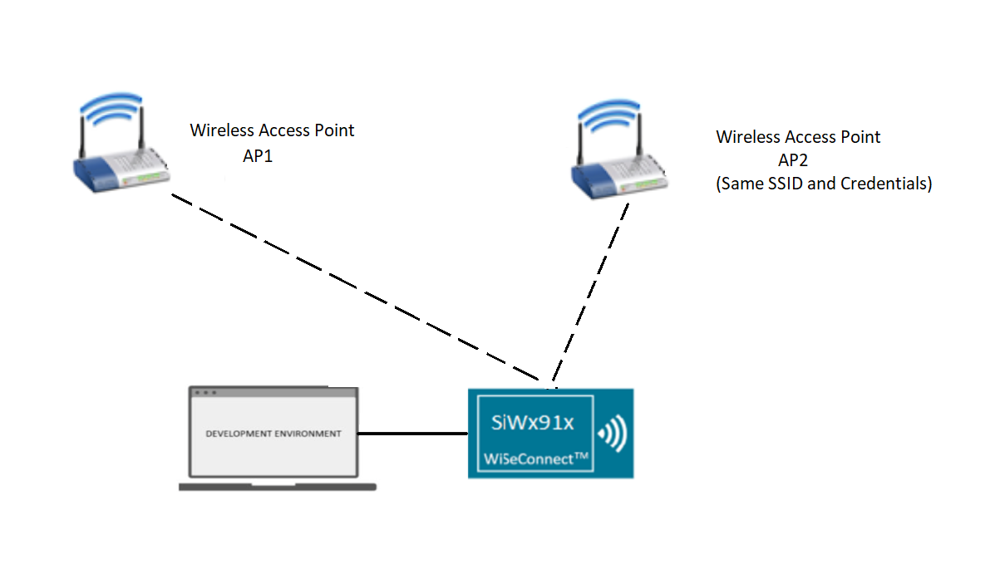
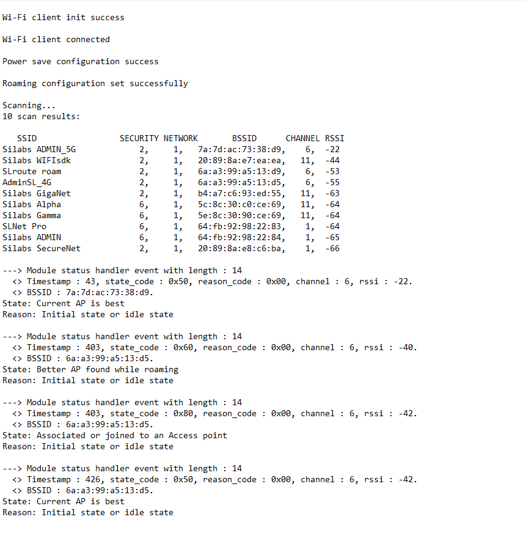

# Wi-Fi Roaming

## Table of Contents

- [Purpose/Scope](#purposescope)
- [Prerequisites/Setup Requirements](#prerequisitessetup-requirements)
  - [Hardware Requirements](#hardware-requirements)
  - [Software Requirements](#software-requirements)
  - [Set up Diagram](#set-up-diagram)
- [Getting Started](#getting-started)
- [Application Build Environment](#application-build-environment)
- [Test the Application](#test-the-application)
- [Application Output](#application-output)

## Purpose/Scope

This example demonstrates how to register for Wi-Fi asynchronous statistics response events and configure advanced scan and roaming operations. Roaming configurations enable the device to seamlessly transition between different access points (APs), maintaining a stable connection as the device moves.

Initially, the device registers for asynchronous statistics messages and enables advanced scan and roaming parameters. When the connection's RSSI (Received Signal Strength Indicator) falls below the roaming threshold and a better AP is available, the device will display the statistics message, perform a roaming operation, and connect to the better AP.

## Prerequisites/Setup Requirements

### Hardware Requirements

- Windows PC with Host interface (UART)
- Wi-Fi access point
- **SoC Mode**:
  - Standalone
    - BRD4002A Wireless Pro Kit Mainboard [SI-MB4002A](https://www.silabs.com/development-tools/wireless/wireless-pro-kit-mainboard?tab=overview)
    - Radio Boards 
  	  - BRD4338A [SiWx917-RB4338A](https://www.silabs.com/development-tools/wireless/wi-fi/siwx917-rb4338a-wifi-6-bluetooth-le-soc-radio-board?tab=overview)
  	  - BRD4343A [SiWx917-RB4343A](https://www.silabs.com/development-tools/wireless/wi-fi/siw917y-rb4343a-wi-fi-6-bluetooth-le-8mb-flash-radio-board-for-module?tab=overview)
  - Kits
  	- SiWx917 Pro Kit [Si917-PK6031A](https://www.silabs.com/development-tools/wireless/wi-fi/siwx917-pro-kit?tab=overview)
  	- SiWx917 Pro Kit [Si917-PK6032A]
    - SiWx917 AC1 Module Explorer Kit (BRD2708A)
  	
- **NCP Mode**:
  - Standalone
    - BRD4002A Wireless Pro Kit Mainboard [SI-MB4002A](https://www.silabs.com/development-tools/wireless/wireless-pro-kit-mainboard?tab=overview)
    - EFR32xG24 Wireless 2.4 GHz +10 dBm Radio Board [xG24-RB4186C](https://www.silabs.com/development-tools/wireless/xg24-rb4186c-efr32xg24-wireless-gecko-radio-board?tab=overview)
    - NCP Expansion Kit with NCP Radio Boards
      - (BRD4346A + BRD8045A) [SiWx917-EB4346A]
      - (BRD4357A + BRD8045A) [SiWx917-EB4357A]
  - Kits
  	- EFR32xG24 Pro Kit +10 dBm [xG24-PK6009A](https://www.silabs.com/development-tools/wireless/efr32xg24-pro-kit-10-dbm?tab=overview)
  - Interface and Host MCU Supported
    - SPI - EFR32
    - UART - EFR32

### Software Requirements

- [Simplicity Studio](https://www.silabs.com/developers/simplicity-studio)

### Setup Diagram



## Getting Started

Refer to the instructions [here](https://docs.silabs.com/wiseconnect/latest/wiseconnect-getting-started/) to:

- [Install Simplicity Studio](https://docs.silabs.com/wiseconnect/latest/wiseconnect-developers-guide-developing-for-silabs-hosts/#install-simplicity-studio)
- [Install WiSeConnect 3 extension](https://docs.silabs.com/wiseconnect/latest/wiseconnect-developers-guide-developing-for-silabs-hosts/#install-the-wi-se-connect-3-extension)
- [Connect your device to the computer](https://docs.silabs.com/wiseconnect/latest/wiseconnect-developers-guide-developing-for-silabs-hosts/#connect-si-wx91x-to-computer)
- [Upgrade your connectivity firmware ](https://docs.silabs.com/wiseconnect/latest/wiseconnect-developers-guide-developing-for-silabs-hosts/#update-si-wx91x-connectivity-firmware)
- [Create a Studio project ](https://docs.silabs.com/wiseconnect/latest/wiseconnect-developers-guide-developing-for-silabs-hosts/#create-a-project)

## Application Build Environment

The application can be configured to suit your requirements and development environment. Read through the following sections and make any changes needed.

1. In the Project explorer pane, expand the **config** folder and open the **sl_net_default_values.h** file.
- **STA Instance Related Parameters**

  - DEFAULT_WIFI_CLIENT_PROFILE_SSID refers to the name with which the Wi-Fi network shall be advertised. The Si91X module is connected to it.

    ```c
    #define DEFAULT_WIFI_CLIENT_PROFILE_SSID               "YOUR_AP_SSID"      
    ```

  - DEFAULT_WIFI_CLIENT_CREDENTIAL refers to the secret key if the Access point is configured in WPA-PSK/WPA2-PSK security modes.

    ```c
    #define DEFAULT_WIFI_CLIENT_CREDENTIAL                 "YOUR_AP_PASSPHRASE" 
    ```

  - DEFAULT_WIFI_CLIENT_SECURITY_TYPE refers to the security type of the Access point. The supported security modes are mentioned in `sl_wifi_security_t`.

    ```c
    #define DEFAULT_WIFI_CLIENT_SECURITY_TYPE               SL_WIFI_WPA2 
    ```

  - Other STA instance configurations can be modified if required in `default_wifi_client_profile` configuration structure.

  > Note: 
  > You can configure default region specific regulatory information using `sl_wifi_region_db_config.h`

2. Configure the following parameters in ``app.c`` to test the application as per requirements
- **Advanced Scan Configuration Parameters**

  - Configure the advanced scan configurations to optimize the device's roaming performance.

    - `ADV_ACTIVE_SCAN_DURATION`: Duration for active scanning on each channel (in milliseconds).
    - `ADV_PASSIVE_SCAN_DURATION`: Duration for passive scanning on each channel (in milliseconds).
    - `ADV_SCAN_THRESHOLD`: RSSI level to trigger advanced scan (valid range: -100 to 0 dBm).
    - `ADV_RSSI_TOLERANCE_THRESHOLD`: RSSI level change to trigger advanced scan.
    - `ADV_MULTIPROBE`: Enable or disable multi-probe feature.
    - `ENABLE_INSTANT_SCAN`: Enable or disable instant scanning feature.

- **Roaming Configuration Parameters**

  - Configure the roaming parameters to ensure seamless transition between access points.

    - `ROAMING_THRESHOLD`: The signal strength threshold at which the device will start searching for a better access point (valid range: -100 to 0 dBm).
    - `ROAMING_TRIGGER_DELTA_CHANGE`: The change in signal strength required to trigger a roaming event.

    > **Note:** Ensure that `ADV_SCAN_THRESHOLD` is set to a value greater than `ROAMING_THRESHOLD` to optimize the device's roaming performance.

## Test the Application

Refer to the instructions [here](https://docs.silabs.com/wiseconnect/latest/wiseconnect-getting-started/) to:

- Build the application.
- Flash, run, and debug the application.
- Simulate roaming by moving the device between different access points with varying signal strengths having same SSID and credentials. Monitor the device's connection status to ensure it transitions seamlessly between APs.
- Verify that the device displays the statistics message and connects to the better AP when the RSSI reaches the roaming threshold. The status will contain `state_code: 0x60` and the message "State: Better AP found while roaming".

## Application Output

When the application runs successfully, you should see the following output:



> **Note:** The actual asynchronous statistics messages can vary depending on the signal strength and the specific conditions of the Wi-Fi environment.
