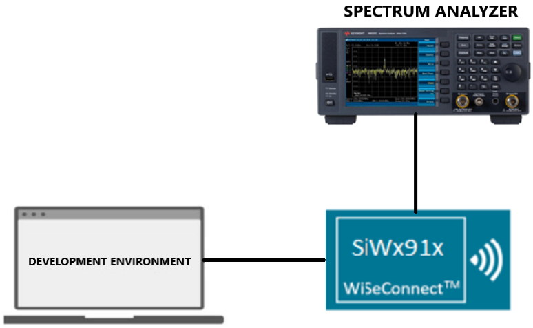
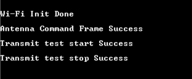
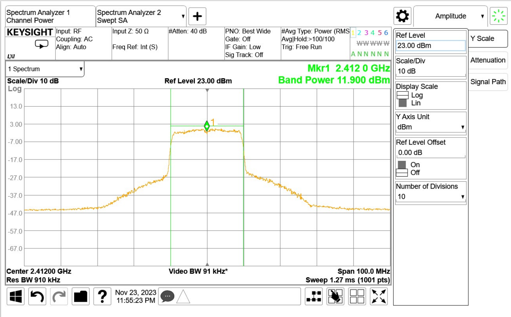

# Wi-Fi - Wlan RF Test

## Table of Contents

- [Purpose/Scope](#purposescope)
- [Prerequisites/Setup Requirements](#prerequisitessetup-requirements)
  - [Hardware Requirements](#hardware-requirements)
  - [Software Requirements](#software-requirements)
  - [Setup Diagram](#setup-diagram)
- [Getting Started](#getting-started)
- [Application Build Environment](#application-build-environment)
- [Test the Application](#test-the-application)
  - [Transmit Spectrum Example](#transmit-spectrum-example)

## Purpose/Scope

This application demonstrates how to configure the SiWx91x to transmit Wi-Fi packets at varying data rates and power levels. The application can be used to assist with regulatory certification testing.

## Prerequisites/Setup Requirements

To use this application, the following hardware, software and project setup is required.

### Hardware Requirements

- Windows PC.
- Spectrum Analyzer and RF connector
- Signal Generator and RF connectors
- SiWx91x Wi-Fi Evaluation Kit
- **SoC Mode**:
  - Standalone
    - BRD4002A Wireless pro kit mainboard [SI-MB4002A]
    - Radio Boards
    - BRD4338A [SiWx917-RB4338A]
  	- BRD4343A [SiWx917-RB4343A]
  - Kits
  - SiWx917 Pro Kit [Si917-PK6031A](https://www.silabs.com/development-tools/wireless/wi-fi/siwx917-pro-kit?tab=overview)
  - SiWx917 Pro Kit [Si917-PK6032A]
  - SiWx917 AC1 Module Explorer Kit (BRD2708A)

- **NCP Mode**:
  - Standalone
    - BRD4002A Wireless pro kit mainboard [SI-MB4002A]
    - EFR32xG24 Wireless 2.4 GHz +10 dBm Radio Board [xG24-RB4186C](https://www.silabs.com/development-tools/wireless/xg24-rb4186c-efr32xg24-wireless-gecko-radio-board?tab=overview)
    - NCP Expansion Kit with NCP Radio boards
      - (BRD4346A + BRD8045A) [SiWx917-EB4346A]
      - (BRD4357A + BRD8045A) [SiWx917-EB4357A]
  - Kits
  - EFR32xG24 Pro Kit +10 dBm [xG24-PK6009A](https://www.silabs.com/development-tools/wireless/efr32xg24-pro-kit-10-dbm?tab=overview)
  - Interface and Host MCU Supported
    - SPI - EFR32 
    - UART - EFR32

### Software Requirements

- Simplicity Studio IDE

### Setup Diagram

  

## Getting Started

Refer to the instructions [here](https://docs.silabs.com/wiseconnect/latest/wiseconnect-getting-started/) to:

- [Install Simplicity Studio](https://docs.silabs.com/wiseconnect/latest/wiseconnect-developers-guide-developing-for-silabs-hosts/#install-simplicity-studio)
- [Install WiSeConnect 3 extension](https://docs.silabs.com/wiseconnect/latest/wiseconnect-developers-guide-developing-for-silabs-hosts/#install-the-wi-se-connect-3-extension)
- [Connect your device to the computer](https://docs.silabs.com/wiseconnect/latest/wiseconnect-developers-guide-developing-for-silabs-hosts/#connect-si-wx91x-to-computer)
- [Upgrade your connectivity firmware](https://docs.silabs.com/wiseconnect/latest/wiseconnect-developers-guide-developing-for-silabs-hosts/#update-si-wx91x-connectivity-firmware)
- [Create a Studio project](https://docs.silabs.com/wiseconnect/latest/wiseconnect-developers-guide-developing-for-silabs-hosts/#create-a-project)

For details on the project folder structure, see the [WiSeConnect Examples](https://docs.silabs.com/wiseconnect/latest/wiseconnect-examples/#example-folder-structure) page.

## Application Build Environment

The application can be configured to suit user requirements and development environment. Read through the following sections and make any changes needed.

- Configure the following parameters in **app.c** to test rf_test app as per requirements

```c
  sl_wifi_data_rate_t rate = SL_WIFI_DATA_RATE_6;
  sl_si91x_request_tx_test_info_t tx_test_info = {
  .enable    = 1,    // Enable/disable tx test mode
    .power   = 4,    // Tx RF power in the range [2:18] dBm
    .rate    = rate, // WLAN data rate of 6Mbps
    .length  = 30,   // Tx packet length in the range [24:1500] bytes in burst mode,
    .mode    = 0,    // Selects burst mode or continuous mode
    .channel = 1,    // Channel number in 2.4 or 5 GHz
  // Other configurable parameters
  }
```

    The different values of mode:
      0 - Burst Mode
      1 - Continuous Mode
      2 - Continuous wave Mode (non modulation) in DC mode
      3 - Continuous wave Mode (non modulation) in single tone mode (center frequency -2.5MHz)
      4 - Continuous wave Mode (non modulation) in single tone mode (center frequency +5MHz)

  Receive stats pre-processor macro:

#define RECEIVE_STATS           0 // Enable/Disable receive stats testing
#define MAX_RECEIVE_STATS_COUNT 5 // Number of iterations for which the receive stats would be displayed

**NOTE**:
    Receive stats testing should be done in a controlled environment (RF shield box or chamber).

- In app.c file change the region_code to the respective region in transmit_test_configuration.

        region_code - US, EU, JP, WORLD_DOMAIN, KR

        Supported Channels in the specific regions
        US           -     1-11
        EUROPE       -     1-13
        JAPAN        -     1-14
        WORLD_DOMAIN -     1-14
        KOREA        -     1-13

    Note: Currently SG region is not supported.

## Test the Application

Refer to the instructions [here](https://docs.silabs.com/wiseconnect/latest/wiseconnect-getting-started/) to:

- Build the application.
- Flash, run and debug the application

  - Application prints

  

Follow the steps below for successful execution of the application:

### Transmit Spectrum Example

```c
  sl_wifi_data_rate_t rate = SL_WIFI_DATA_RATE_6;
  sl_si91x_request_tx_test_info_t tx_test_info = {
  .enable = 1, .power = 127, .rate = rate, .length = 100,
  .mode      = 1, // Continuous Mode
    .channel = 6,
  // Other configurable parameters
  }                  
```

The below result is for PER Mode with Channel '6' with 6 Mbps data rate and max 127 power index, in Continuous mode, OFDM modulation technique.


    NOTE:
    A) Receive stats testing should be done in a controlled environment (RF shield box or chamber).

### RF Test with wifi 6

- Configure the following parameters in **app.c** to perform rf_test with wifi 6 as per requirements

```c
  sl_wifi_data_rate_t rate = SL_WIFI_DATA_RATE_MCS0;
  sl_si91x_request_tx_test_info_t tx_test_info = {
    .enable      = 1,
    .power       = 127,
    .rate        = rate,
    .length      = 100,
    .mode        = 1,     // Continuous Mode
    .channel     = 1,
    .aggr_enable = 0,
#ifdef SLI_SI917
    .enable_11ax            = 1, // 11AX_ENABLE 0-disable, 1-enable
    ....
// Other configurable parameters
// The description of the configurable parameters can be found in sl_si91x_request_tx_test_info_t structure
#endif
  }

  osDelay(100000); //add delay as per the requirement
```

- Configure below parameter in **app.c** to enable AGGREGATION support
  .feature_bit_map = SL_SI91X_FEAT_AGGREGATION

The below is the result for PER Mode with Channel '1' with MCS index 0 transfer rate, in continuous mode.


