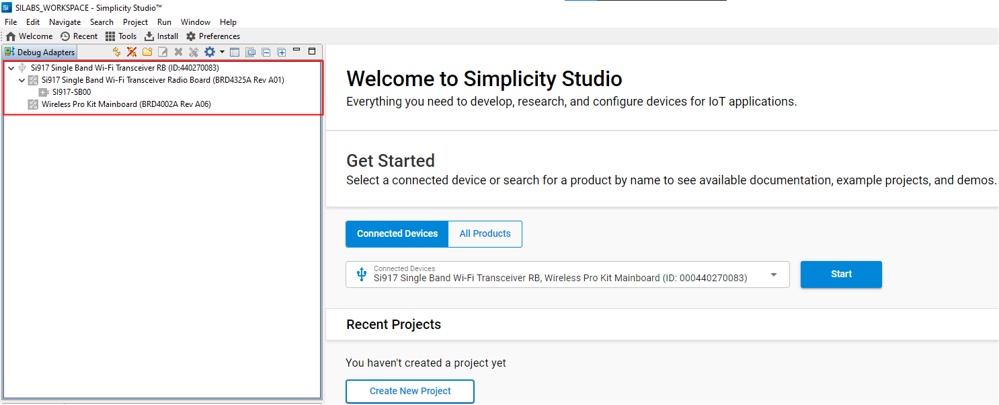
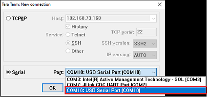

# WLAN RF Test

## 1 Purpose/Scope

This application demonstrates how to configure the SiWx91x to transmit Wi-Fi packets at varying data rates and power levels. The application can be used to assist with regulatory certification testing. 

## 2 Prerequisites/Setup Requirements

To use this application, the following hardware, software and project setup is required.

### 2.1 Hardware Requirements

- Windows PC.
- Spectrum Analyzer and RF connector 
- Signal Generator and RF connectors 
- SiWx91x Wi-Fi Evaluation Kit
  - **SoC Mode**: 
    - Silicon Labs [BRD4325A, BRD4325B, BRD4325G](https://www.silabs.com/)
  - **NCP Mode**:
    - Silicon Labs [(BRD4180A, BRD4280B)](https://www.silabs.com/)
    - Host MCU Eval Kit. This example has been tested with:
      - Silicon Labs [WSTK + EFR32MG21](https://www.silabs.com/development-tools/wireless/efr32xg21-bluetooth-starter-kit)

### 2.2 Software Requirements

- Simplicity Studio IDE 

  - Download the latest [Simplicity Studio IDE](https://www.silabs.com/developers/simplicity-studio)
  - Follow the [Simplicity Studio user guide](https://docs.silabs.com/simplicity-studio-5-users-guide/1.1.0/ss-5-users-guide-getting-started/install-ss-5-and-software#install-ssv5) to install Simplicity Studio IDE

### 2.3 Setup Diagram

#### Soc Mode 


Follow the [Getting Started with SiWx91x SoC](https://docs.silabs.com/) to setup the example to work with SiWx91x SoC and Simplicity Studio.
  
#### NCP Mode  


Follow the [Getting Started with EFx32](https://docs.silabs.com/rs9116-wiseconnect/latest/wifibt-wc-getting-started-with-efx32/) to setup the example to work with EFx32 and Simplicity Studio.

**NOTE:** 
By default, The radio is mapped to internal antenna path. To perform RF measurements, the signal path has to be shifted towards the U.FL port. 
To change the signal path, the following hardware changes are required (for both SoC and NCP modes) - 

1) Unmount C24 
2) Mount R22 

This hardware change is required only for the Transmit Performance and Regulatory Testing example. While testing the other applications, the hardware changes have to be reverted (Mount C24 and Unmount R22) for the board to function normally.

SoC

  

NCP

  

**NOTE**: 

- The Host MCU platform (EFR32MG21) and the SiWx91x interact with each other through the SPI interface. 
- The Host MCU platform (EFM32GG11) and the SiWx91x interact with each other through the SDIO interface.

## 3 Project Environment

1. Ensure the SiWx91x loaded with the latest firmware following the [Getting started with a PC](https://docs.silabs.com/rs9116/latest/wiseconnect-getting-started)

2. Ensure the EFx32 and SiWx91x set up is connected to your PC.

3. Ensure the latest Gecko SDK along with the extension WiSeConnect3 is added to Simplicity Studio.

### 3.1 Creating the project

### 3.1.1 SoC mode

- Connect your board. The Si917 compatible SoC board is BRD4325A,BRD4325B.
- Studio should detect your board. Your board will be shown here.

    ****

- Go to the 'EXAMPLE PROJECT & DEMOS' tab and select Wlan RF Test application

    

- Click 'Create'. The "New Project Wizard" window appears. Click 'Finish'

  

### 3.1.2 NCP mode

- Connect your board. The Si917 compatible SoC board is BRD4325A,BRD4325B.
- Studio should detect your board. Your board will be shown here.

    ****

- Go to the 'EXAMPLE PROJECT & DEMOS' tab and select Wlan Rf_test application

  

- Click 'Create'. The "New Project Wizard" window appears. Click 'Finish'

  

### 3.2 Set up for application prints

#### 3.2.1 SoC mode

  You can use either of the below USB to UART converters for application prints.

1. Set up using USB to UART converter board.

 - Connect Tx (Pin-6) to P27 on WSTK
 - Connect GND (Pin 8 or 10) to GND on WSTK

      ****

2. Set up using USB to UART converter cable.

 - Connect RX (Pin 5) of TTL convertor to P27 on WSTK
 - Connect GND (Pin1) of TTL convertor to GND on WSTK
    
      ****

**Tera Term set up - for NCP and SoC modes**

1. Open the Tera Term tool.

 - For SoC mode, choose the serial port to which USB to UART converter is connected and click on **OK**. 

      ****

 - For NCP mode, choose the J-Link port and click on **OK**.
    
      ****

2. Navigate to the Setup → Serial port and update the baud rate to **115200** and click on **OK**.

 ****

 ****

## 4 Application Build Environment

### 4.1 Configure the application

The application can be configured to suit user requirements and development environment. Read through the following sections and make any changes needed.

1. In the Project explorer pane, expand the **config** folder and open the **sl_net_default_values.h** file. Configure the following parameters to enable your Silicon Labs Wi-Fi device to connect to your Wi-Fi network.

- **STA instance related parameters**

  - DEFAULT_WIFI_CLIENT_PROFILE_SSID refers to the name with which the SiWx91x SoftAP's Wi-Fi network shall be advertised.

     ```c
     #define DEFAULT_WIFI_CLIENT_PROFILE_SSID               "YOUR_AP_SSID"      
     ```

  - DEFAULT_WIFI_CLIENT_CREDENTIAL refers to the secret key if the Access point is configured in WPA-PSK/WPA2-PSK security modes.

     ```c 
     #define DEFAULT_WIFI_CLIENT_CREDENTIAL                 "YOUR_AP_PASSPHRASE" 
     ```

  - Other STA instance configurations can be modified if required in `default_wifi_client_profile` configuration structure.

2. Configure the following parameters in **app.c** to test throughput app as per requirements

```c
  #define SL_TX_TEST_POWER    4               // Tx RF power in the range [2:18] dBm
  #define SL_TX_TEST_RATE     0x0             // WLAN data rate
  #define SL_TX_TEST_LENGTH   30              // Tx packet length in the range [24:1500] bytes in burst mode, 
                                               //[24:260 ] bytes in continuous mode
  #define SL_TX_TEST_MODE     0               // Selects burst mode or continuous mode
  #define SL_TX_TEST_CHANNEL  1               // Channel number in 2.4 or 5 GHz
  #define SL_WIFI_SELECT_INTERNAL_ANTENNA          0               // 0 = RF_OUT2, 1 = RF_OUT1
```

### 4.2 Build the application

- SoC mode: Build as rf_test Example

    ****

- NCP mode: 

    ****

### 4.3 Run and Test the application

1. Once the build was successful, right click on project and select Debug As → Silicon Labs ARM Program to program the device as shown in below image.

   ****

2. As soon as the debug process is completed, the application control branches to the main().

3. Click on the **Resume** icon in the Simplicity Studio IDE toolbar to run the application.

   ****

When the application runs, the SiWx91x starts transmitting using the configuration settings. A power meter or spectrum analyzer may be used to monitor the RF output power and spectrum.

The following readme provides example spectrums when the SiWx91x is configured to transmit with the settings shown.

## Transmit Spectrum Example 

```c
  #define SL_TX_TEST_POWER    127                     
  #define SL_TX_TEST_RATE     6                     
  #define SL_TX_TEST_LENGTH   100                   
  #define SL_TX_TEST_MODE     SL_CONTINUOUS_MODE   
  #define SL_TX_TEST_CHANNEL  6                     
```

The below result is for PER Mode with Channel '6' with 6 Mbps data rate and max 127 power index, in Continuous mode, OFDM modulation technique.


```c
  #define SL_TX_TEST_POWER    127                     
  #define SL_TX_TEST_RATE     6                     
  #define SL_TX_TEST_LENGTH   1000                  
  #define SL_TX_TEST_MODE     SL_BURST_MODE        
  #define SL_TX_TEST_CHANNEL  6                     
```

The below result is for PER Mode with Channel '6' with 6 Mbps data rate and max 127 power index, in Burst mode, OFDM modulation technique.


### 4.4 Application Output

#### SoC mode

  

#### NCP mode

  
