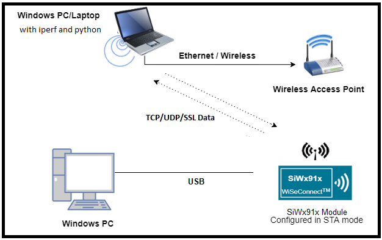
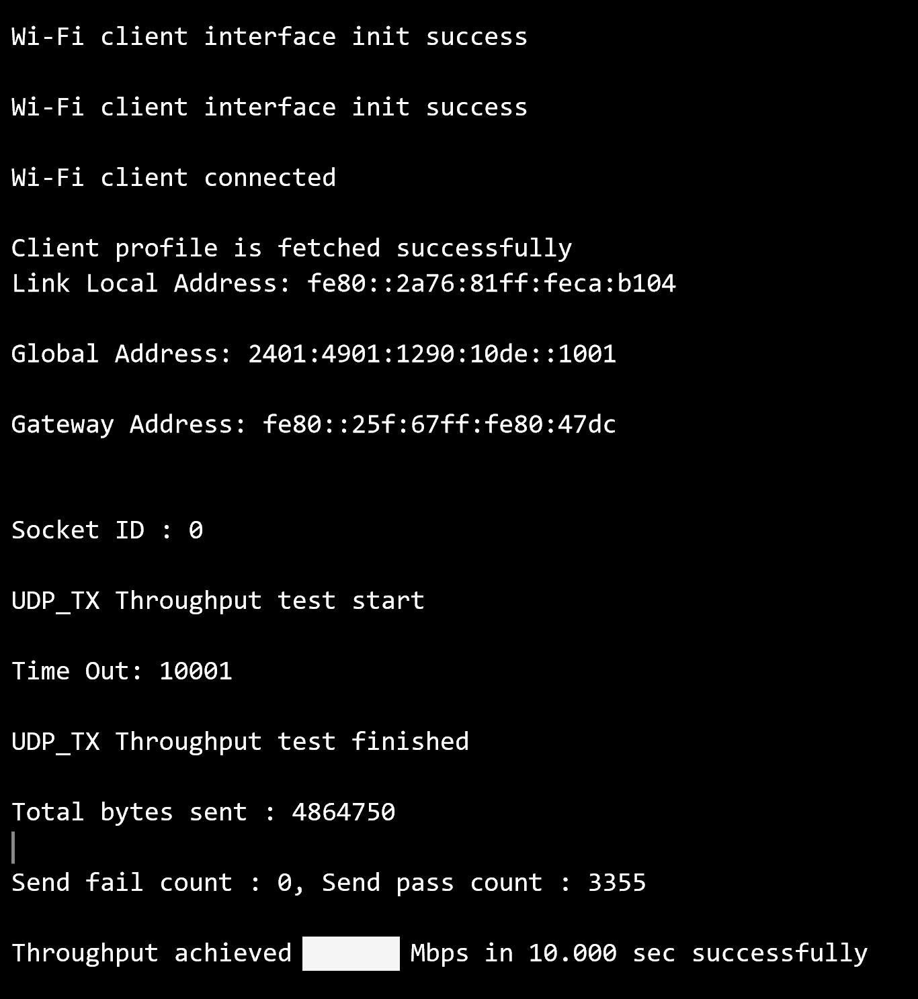
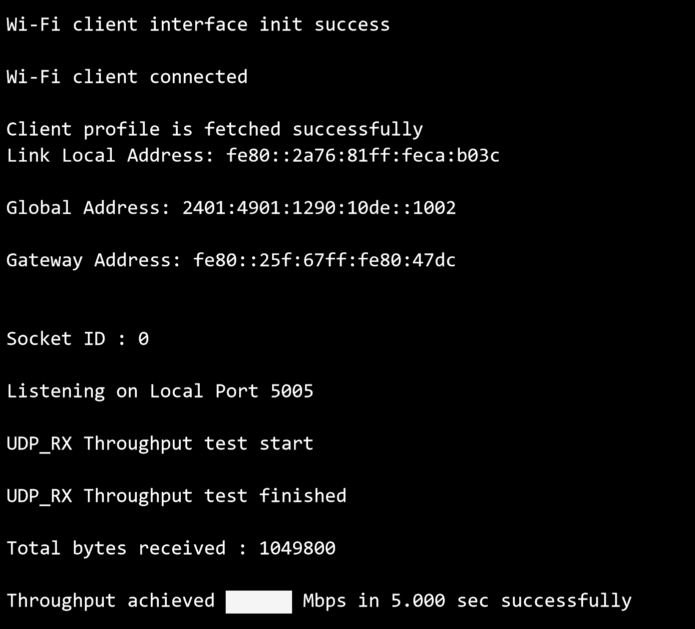
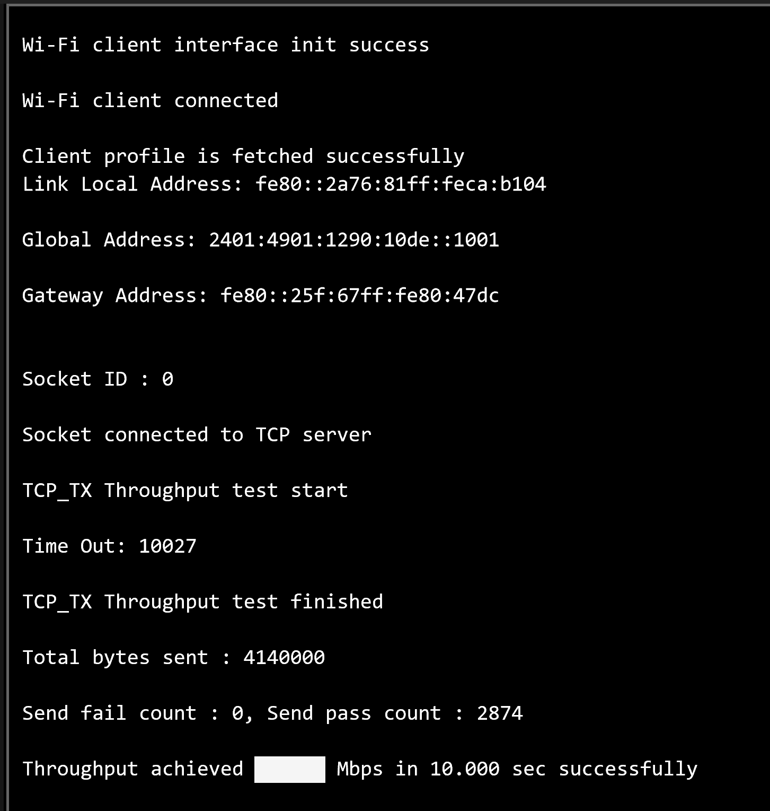
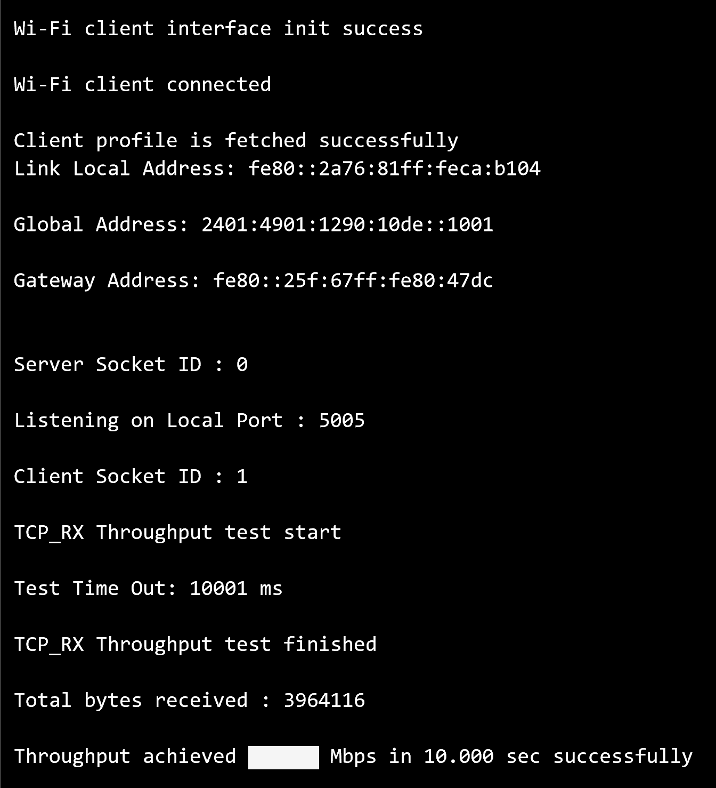
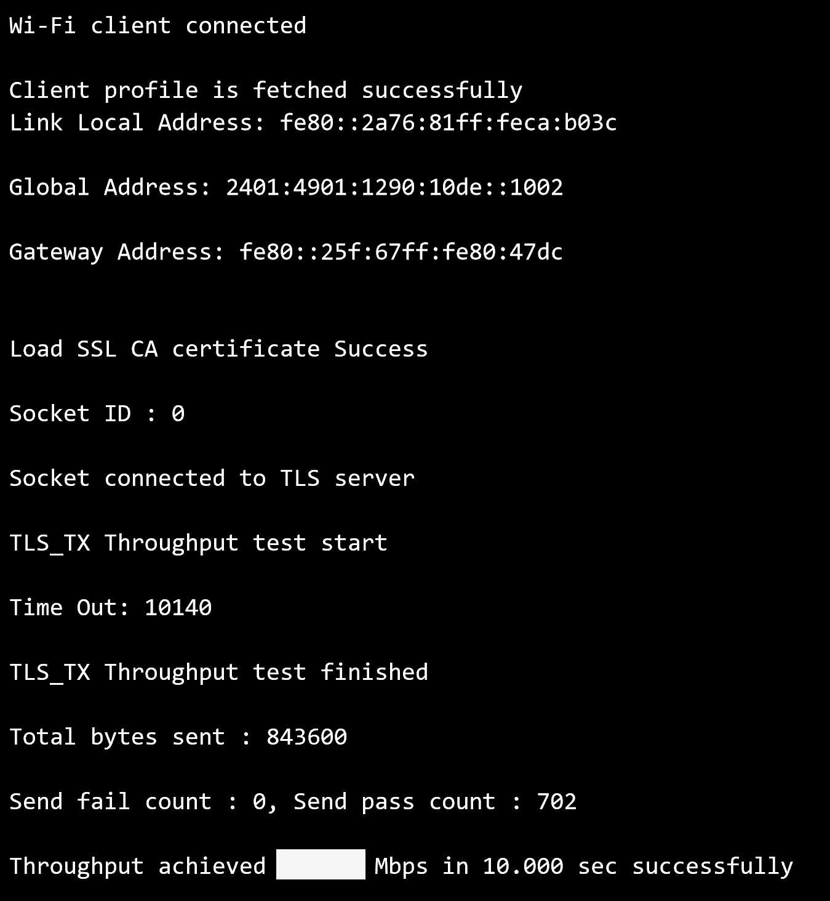
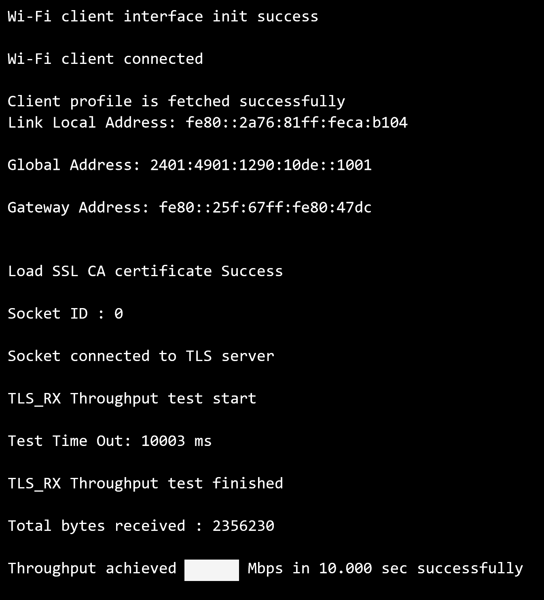

# Wi-Fi - Throughput IPv6

## Table of Contents

- [Purpose/Scope](#purposescope)
- [Prerequisites/Setup Requirements](#prerequisitessetup-requirements)
  - [Hardware Requirements](#hardware-requirements)
  - [Software Requirements](#software-requirements)
  - [Setup Diagram](#setup-diagram)
- [Getting Started](#getting-started)
- [Application Build Environment](#application-build-environment)
- [Test the Application](#test-the-application)
  - [UDP Tx Throughput](#udp-tx-throughput)
  - [UDP Rx Throughput](#udp-rx-throughput)
  - [TCP Tx Throughput](#tcp-tx-throughput)
  - [TCP Rx Throughput](#tcp-rx-throughput)
  - [TLS Tx Throughput](#tls-tx-throughput)
  - [TLS Rx Throughput](#tls-rx-throughput)
- [Application Output](#application-output)

## Purpose/Scope

This application demonstrates the procedure to measure WLAN UDP/TCP/TLS throughput by configuring the SiWx91x in client/server role using IPv6 addresses.
In this application, the SiWx91x connects to a Wi-Fi access point, obtains an IPv6 address, connects to Iperf server/client or python based TLS scripts, running on a remote PC and measures Tx/Rx throughput transmitted/received from remote PC.

## Prerequisites/Setup Requirements

### Hardware Requirements

- Windows PC
- Wireless Access Point
- **SoC Mode**:
  - Standalone
    - BRD4002A Wireless pro kit mainboard [SI-MB4002A]
    - Radio Boards 
  	  - BRD4338A [SiWx917-RB4338A]
  	  - BRD4340A [SiWx917-RB4340A]
  - Kits
  	- SiWx917 Pro Kit [Si917-PK6031A](https://www.silabs.com/development-tools/wireless/wi-fi/siwx917-pro-kit?tab=overview)
  	- SiWx917 Pro Kit [Si917-PK6032A]
  	
- **NCP Mode**:
  - Standalone
    - BRD4002A Wireless pro kit mainboard [SI-MB4002A]
    - EFR32xG24 Wireless 2.4 GHz +10 dBm Radio Board [xG24-RB4186C](https://www.silabs.com/development-tools/wireless/xg24-rb4186c-efr32xg24-wireless-gecko-radio-board?tab=overview)
    - NCP EFR Expansion Kit with NCP Radio board (BRD4346A + BRD8045A) [SiWx917-EB4346A]
  - Kits
  	- EFR32xG24 Pro Kit +10 dBm [xG24-PK6009A](https://www.silabs.com/development-tools/wireless/efr32xg24-pro-kit-10-dbm?tab=overview)

### Software Requirements

- [Simplicity Studio IDE](https://www.silabs.com/developers/simplicity-studio)
- [Iperf Application](https://iperf.fr/iperf-download.php)
- [Python Environment](https://www.python.org/downloads/)

### Setup Diagram



## Getting Started

Refer to the instructions [here](https://docs.silabs.com/wiseconnect/latest/wiseconnect-getting-started/) to:

- Install Studio and WiSeConnect 3 extension
- Connect your device to the computer
- Upgrade your connectivity firmware
- Create a Studio project

## Application Build Environment

The application can be configured to suit user requirements and development environment.
#### In the Project explorer pane, expand the **config** folder and open the **sl_net_default_values.h** file. Configure the following parameters to enable your Silicon Labs Wi-Fi device to connect to your Wi-Fi network

- **STA instance related parameters**

	- DEFAULT_WIFI_CLIENT_PROFILE_SSID refers to the name with which Wi-Fi network that shall be advertised and Si91X module is connected to it.
	
  	```c
  	#define DEFAULT_WIFI_CLIENT_PROFILE_SSID               "YOUR_AP_SSID"      
  	```

	- DEFAULT_WIFI_CLIENT_CREDENTIAL refers to the secret key if the Access point is configured in WPA-PSK/WPA2-PSK security modes.

  	```c
  	#define DEFAULT_WIFI_CLIENT_CREDENTIAL                 "YOUR_AP_PASSPHRASE" 
  	```
  	
	- DEFAULT_WIFI_CLIENT_SECURITY_TYPE refers to the security type if the Access point is configured in WPA/WPA2 or mixed security modes.

  	```c
  	#define DEFAULT_WIFI_CLIENT_SECURITY_TYPE               SL_WIFI_WPA2 
  	```
  
- Other STA instance configurations can be modified if required in `default_wifi_client_profile` configuration structure.

#### Configure the following parameters in **app.c** to test throughput app as per requirements

- **Client/Server IP Settings**

    ```c
    #define LISTENING_PORT     <local_port>       // Local port to use
    #define SERVER_PORT        <remote_port>      // Remote server port
    #define SERVER_IP_ADDRESS  "2401:4901:1290:10de::1004"    // Remote server IPv6 address
    ```

- **Throughput Measurement Types**

  - The application may be configured to measure throughput using UDP, TCP or TLS packets. Choose the measurement type using the `THROUGHPUT_TYPE` macro.

    ```c
    #define THROUGHPUT_TYPE  TCP_TX     // Selects the throughput option
    #define TCP_TX           0   // SiWx91x transmits packets to remote TCP client
    #define TCP_RX           1   // SiWx91x receives packets from remote TCP server
    #define UDP_TX           2   // SiWx91x transmits packets to remote UDP client
    #define UDP_RX           3   // SiWx91x receives packets from remote UDP server
    #define TLS_TX           4   // SiWx91x transmits packets to remote TLS server
    #define TLS_RX           5   // SiWx91x receives packets from remote TLS server
    ```

- **Throughput Test options**

    ```c
    #define BYTES_TO_SEND     (1 << 29)     // To measure TX throughput with 512MB data transfer
    #define BYTES_TO_RECEIVE  (1 << 20)     // To measure RX throughput with 1MB data transfer
    #define TEST_TIMEOUT      10000         // Throughput test timeout in ms
    ```

## Test the Application

Refer to the instructions [here](https://docs.silabs.com/wiseconnect/latest/wiseconnect-getting-started/) to:

- Build the application
- Flash, run and debug the application

There are two 'ends' involved when measuring throughput, data is sent between the client end and the server end. By default, the Iperf protocol sends data from the client to the server to measure throughput. Depending on the configuration selected, the SiWx91x may be the client or the server. In general, it is advisable to start the server before the client since the client will immediately begin to try to connect to the server to send data.

The following sections describe how to run the SiWx91x throughput application together with examples for various Iperf configurations that run on the PC.

### UDP Tx Throughput

To measure UDP Tx throughput, configure the SiWx91x as a UDP client and start a UDP server on the remote PC.
The Iperf command to start the UDP server on the PC is:

> `C:\> iperf.exe -s -u -V -p <SERVER_PORT> -i 1`
>
> For example ...
>
> `C:\> iperf.exe -s -u -V -p 5001 -i 1`

### UDP Rx Throughput

To measure UDP Rx throughput, configure the SiWx91x as a UDP server and start a UDP client on the remote PC.
The Iperf command to start the UDP client is:

> `C:\> iperf.exe -c <Module_IP> -V -u  -p <Module_Port> -i 1 -b <Bandwidth> -t <time interval in seconds> -l <UDP buffer length>`
>
> For example ...
>
> `C:\> iperf.exe -c 2001:db8:0:1::121 -V -u -p 5001 -i 1 -b 50M -t 30 -l 1450`

### TCP Tx Throughput

To measure TCP Tx throughput, configure the SiWx91x as a TCP client and start a TCP server on the remote PC.
The Iperf command to start the TCP server is:
  
> `C:\> iperf.exe -s -V -p <SERVER_PORT> -i 1`
>
> For example ...
>
> `C:\> iperf.exe -s -V -p 5001 -i 1`

### TCP Rx Throughput

To measure TCP Rx throughput, configure the SiWx91x as TCP server and start a TCP client on the remote PC.
The Iperf command to start the TCP client is:

> `C:\> iperf.exe -c <Module_IP> -V -p <module_PORT> -i 1 -t <time interval in sec>`
>
> For example ...
>
> `C:\> iperf.exe -c 2001:db8:0:1::121 -V -p 5001 -i 1 -t 30`

### TLS Tx Throughput

To measure TLS Tx throughput, configure the SiWx91x as a TLS client and start a TLS server on the remote PC as described below:

- Copy the `SSL_Server_throughput_v6.py` script from the release `/resources/scripts/` to the `/resources/certificates/` directory
- Open a command prompt and cd to the folder `/resources/certificates/`, then run the following command:
  - `C:\> python SSL_Server_throughput_v6.py`

> **Note:**
**The SSL_Server_throughput_v6.py script works only with Python version 2.**

## TLS Rx Throughput

To measure TLS RX throughput, configure the SiWx91x as a TLS client and open a TLS server on the remote PC as described below:

- Copy the `SSL_tx_throughput_v6.py` script from the release `/resources/scripts/` to the `/resources/certificates/` directory
- Open a command prompt and cd to the folder `/resources/certificates/`, then run the following command:
  - `C:\> python SSL_tx_throughput_v6.py`

> **Note:**
**The SSL_tx_throughput_v6.py script works only with Python version 2.**  

The SiWx91x, which is configured as a UDP/TCP/TLS server/client, connects to the iperf server/client and sends/receives data for configured intervals. While module is transmitting/receiving the data, application prints the throughput numbers in serial console.

## Application Output

1. UDP Tx Throughput
  
    

2. UDP Rx Throughput

    
  
3. TCP Tx Throughput
  
    
  
4. TCP Rx Throughput
  
    
  
5. TLS Tx Throughput
  
    
  
6. TLS Rx Throughput

    
