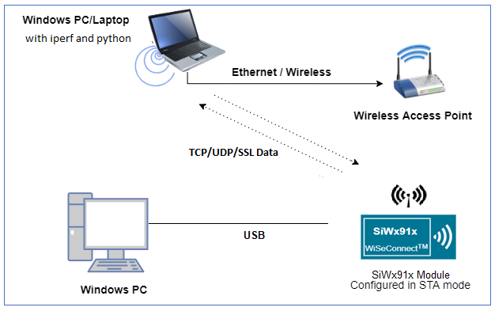
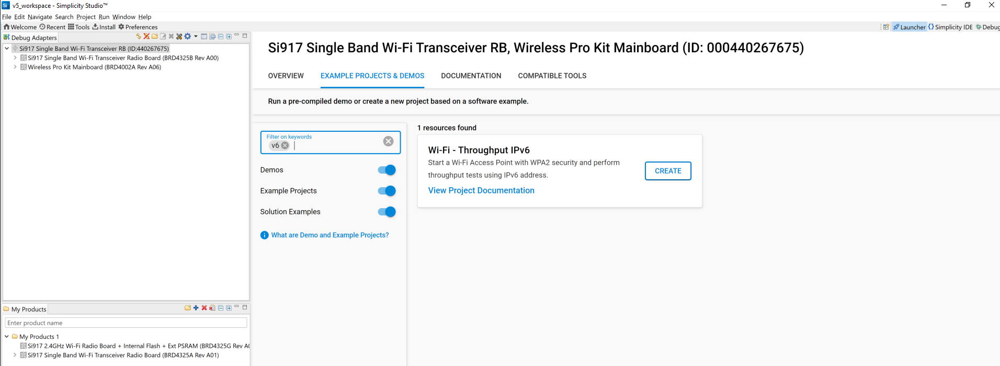
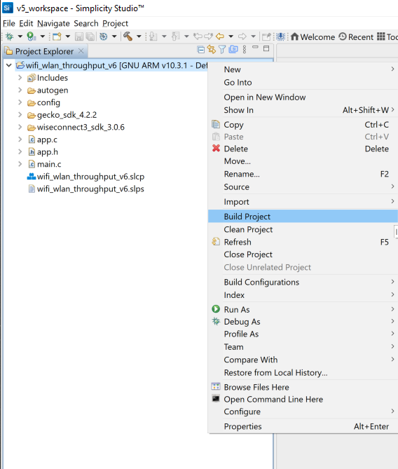
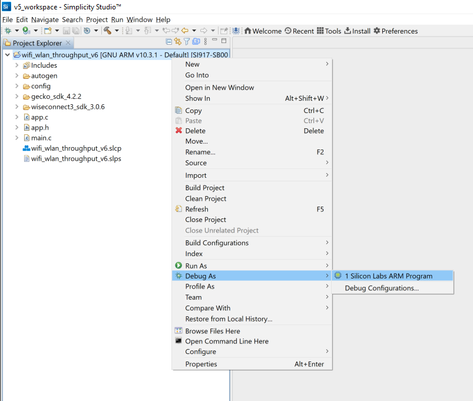

# WLAN Throughput IPv6

## 1 Purpose/Scope

This application demonstrates the procedure to measure WLAN UDP/TCP/TLS throughput by configuring the SiWx91x in client/server role using IPv6 addresses.
In this application, the SiWx91x connects to a Wi-Fi access point, obtains an IPv6 address, connects to Iperf server/client or python based TLS scripts, running on a remote PC and measures Tx/Rx throughput transmitted/received from remote PC.

## 2 Prerequisites/Setup Requirements

### 2.1 Hardware Requirements

- Windows PC
- Wireless Access Point
- **SoC Mode**:
  - Silicon Labs [BRD4325A, BRD4325B, BRD4325C, BRD4325G, BRD4388A](https://www.silabs.com/)
- **NCP Mode**:
  - Silicon Labs [BRD4180B](https://www.silabs.com/); **AND**
  - Host MCU Eval Kit. This example has been tested with:
    - Silicon Labs [WSTK + EFR32MG21](https://www.silabs.com/development-tools/wireless/efr32xg21-bluetooth-starter-kit)

### 2.2 Software Requirements

- Simplicity Studio IDE 
  - Download the [Simplicity Studio IDE](https://www.silabs.com/developers/simplicity-studio).
  - Follow the [Simplicity Studio user guide](https://docs.silabs.com/simplicity-studio-5-users-guide/1.1.0/ss-5-users-guide-getting-started/install-ss-5-and-software#install-ssv5) to install Simplicity Studio IDE.
- [Iperf Application](https://iperf.fr/iperf-download.php)
- [Python Environment](https://www.python.org/downloads/)

### 2.3 Set up Diagram

#### SoC Mode



#### NCP Mode


Follow the [Getting Started with Wiseconnect3 SDK](https://docs.silabs.com/wiseconnect/latest/wiseconnect-getting-started/) guide to set up the hardware connections and Simplicity Studio IDE.

## 3 Project Environment

- Ensure the SiWx91x loaded with the latest firmware following the [Upgrade Si91x firmware](https://docs.silabs.com/wiseconnect/latest/wiseconnect-getting-started/getting-started-with-soc-mode#upgrade-si-wx91x-connectivity-firmware)

- Ensure the latest Gecko SDK along with the extension WiSeConnect3 is added to Simplicity Studio.

### 3.1 Creating the project

#### 3.1.1 SoC mode

- Ensure the SiWx91x set up is connected to your PC.

- In the Simplicity Studio IDE, the SiWx91x SoC board will be detected under **Debug Adapters** pane as shown below.

  ****

#### 3.1.2 NCP mode

- Ensure the EFx32 and SiWx91x set up is connected to your PC.

- In the Simplicity Studio IDE, the EFR32 board will be detected under **Debug Adapters** pane as shown below.

  ****

### 3.2 Importing the project

- Studio should detect your board. Your board will be shown here. Click on the board detected and go to **EXAMPLE PROJECTS & DEMOS** section 

#### SOC Mode

- Select **Wi-Fi - Throughput IPv6** test application

  ****

- Click 'Create'. The "New Project Wizard" window appears. Click 'Finish'

  ****

### 3.3 Set up for application prints

#### 3.3.1 Teraterm set up - for BRD4325A, BRD4325B, BRD4325C, BRD4325G

You can use either of the below USB to UART converters for application prints.

1. Set up using USB to UART converter board.

   - Connect Tx (Pin-6) to P27 on WSTK
   - Connect GND (Pin 8 or 10) to GND on WSTK

   ****

2. Set up using USB to UART converter cable.

   - Connect RX (Pin 5) of TTL convertor to P27 on WSTK
   - Connect GND (Pin1) of TTL convertor to GND on WSTK

   ****

3. Open the Teraterm tool.

   - For SoC mode, choose the serial port to which USB to UART converter is connected and click on **OK**.

     ****

**Note:** For Other 917 SoC boards please refer section #3.3.2

#### 3.3.2 **Teraterm set up - for NCP and SoC modes**

1. Open the Teraterm tool.

- choose the J-Link port and click on **OK**.
    
    ****

2. Navigate to the Setup → Serial port and update the baud rate to **115200** and click on **OK**.

    ****

    ****

## 4 Application Build Environment

### 4.1 Configure the Application

The application can be configured to suit user requirements and development environment. Read through the following sections and make any changes needed.

#### 4.1.1 In the Project explorer pane, expand the **resources\defaults** folder and open the **sl_net_default_values.h** file. Configure the following parameters to enable your Silicon Labs Wi-Fi device to connect to your Wi-Fi network

- **STA instance related parameters**

	- DEFAULT_WIFI_CLIENT_PROFILE_SSID refers to the name with which Wi-Fi network that shall be advertised and Si91X module is connected to it.
	
  	```c
  	#define DEFAULT_WIFI_CLIENT_PROFILE_SSID               "YOUR_AP_SSID"      
  	```

	- DEFAULT_WIFI_CLIENT_CREDENTIAL refers to the secret key if the Access point is configured in WPA-PSK/WPA2-PSK security modes.

  	```c
  	#define DEFAULT_WIFI_CLIENT_CREDENTIAL                 "YOUR_AP_PASSPHRASE" 
  	```
  	
	- DEFAULT_WIFI_CLIENT_SECURITY_TYPE refers to the security type if the Access point is configured in WPA/WPA2 or mixed security modes.

  	```c
  	#define DEFAULT_WIFI_CLIENT_SECURITY_TYPE               SL_WIFI_WPA2 
  	```
  
- Other STA instance configurations can be modified if required in `default_wifi_client_profile` configuration structure.

#### 4.1.2 Configure the following parameters in **app.c** to test throughput app as per requirements

- **Client/Server IP Settings**

    ```c
    #define LISTENING_PORT     <local_port>       // Local port to use
    #define SERVER_PORT        <remote_port>      // Remote server port
    #define SERVER_IP_ADDRESS  "2401:4901:1290:10de::1004"    // Remote server IPv6 address
    ```

- **Throughput Measurement Types**

  - The application may be configured to measure throughput using UDP, TCP or TLS packets. Choose the measurement type using the `THROUGHPUT_TYPE` macro.

    ```c
    #define THROUGHPUT_TYPE  TCP_TX     // Selects the throughput option
    #define TCP_TX           0   // SiWx91x transmits packets to remote TCP client
    #define TCP_RX           1   // SiWx91x receives packets from remote TCP server
    #define UDP_TX           2   // SiWx91x transmits packets to remote UDP client
    #define UDP_RX           3   // SiWx91x receives packets from remote UDP server
    #define TLS_TX           4   // SiWx91x transmits packets to remote TLS server
    #define TLS_RX           5   // SiWx91x receives packets from remote TLS server
    ```

- **Throughput Test options**

    ```c
    #define BYTES_TO_SEND     (1 << 29)     // To measure TX throughput with 512MB data transfer
    #define BYTES_TO_RECEIVE  (1 << 20)     // To measure RX throughput with 1MB data transfer
    #define TEST_TIMEOUT      10000         // Throughput test timeout in ms
    ```

### 4.2 Build and Run the Application

  

Once the build was successful, right click on project and click on Debug As->Silicon Labs ARM Program as shown in below image.

  

### 4.3 Testing Throughput steps at remote system

There are two 'ends' involved when measuring throughput, data is sent between the client end and the server end. By default, the Iperf protocol sends data from the client to the server to measure throughput. Depending on the configuration selected, the SiWx91x may be the client or the server. In general, it is advisable to start the server before the client since the client will immediately begin to try to connect to the server to send data.

The following sections describe how to run the SiWx91x throughput application together with examples for various Iperf configurations that run on the PC.

### UDP Tx Throughput

To measure UDP Tx throughput, configure the SiWx91x as a UDP client and start a UDP server on the remote PC.
The Iperf command to start the UDP server on the PC is:

> `C:\> iperf.exe -s -u -V -p <SERVER_PORT> -i 1`
>
> For example ...
>
> `C:\> iperf.exe -s -u -V -p 5001 -i 1`

### UDP Rx Throughput

To measure UDP Rx throughput, configure the SiWx91x as a UDP server and start a UDP client on the remote PC.
The Iperf command to start the UDP client is:

> `C:\> iperf.exe -c <Module_IP> -V -u  -p <Module_Port> -i 1 -b <Bandwidth> -t <time interval in seconds> -l <UDP buffer length>`
>
> For example ...
>
> `C:\> iperf.exe -c 2001:db8:0:1::121 -V -u -p 5001 -i 1 -b 50M -t 30 -l 1450`

### TCP Tx Throughput

To measure TCP Tx throughput, configure the SiWx91x as a TCP client and start a TCP server on the remote PC.
The Iperf command to start the TCP server is:
  
> `C:\> iperf.exe -s -V -p <SERVER_PORT> -i 1`
>
> For example ...
>
> `C:\> iperf.exe -s -V -p 5001 -i 1`

### TCP Rx Throughput

To measure TCP Rx throughput, configure the SiWx91x as TCP server and start a TCP client on the remote PC.
The Iperf command to start the TCP client is:

> `C:\> iperf.exe -c <Module_IP> -V -p <module_PORT> -i 1 -t <time interval in sec>`
>
> For example ...
>
> `C:\> iperf.exe -c 2001:db8:0:1::121 -V -p 5001 -i 1 -t 30`

### TLS Tx Throughput

To measure TLS Tx throughput, configure the SiWx91x as a TLS client and start a TLS server on the remote PC as described below:

- Copy the `SSL_Server_throughput_v6.py` script from the release `/resources/scripts/` to the `/resources/certificates/` directory
- Open a command prompt and cd to the folder `/resources/certificates/`, then run the following command:
  - `C:\> python SSL_Server_throughput_v6.py`

> **Note:**
**The SSL_Server_throughput_v6.py script works only with Python version 2.**

## TLS Rx Throughput

To measure TLS RX throughput, configure the SiWx91x as a TLS client and open a TLS server on the remote PC as described below:

- Copy the `SSL_tx_throughput_v6.py` script from the release `/resources/scripts/` to the `/resources/certificates/` directory
- Open a command prompt and cd to the folder `/resources/certificates/`, then run the following command:
  - `C:\> python SSL_tx_throughput_v6.py`

> **Note:**
**The SSL_tx_throughput_v6.py script works only with Python version 2.**  

The SiWx91x, which is configured as a UDP/TCP/TLS server/client, connects to the iperf server/client and sends/receives data for configured intervals. While module is transmitting/receiving the data, application prints the throughput numbers in serial console.

### 4.4 Application Output

1. UDP Tx Throughput
  
    

2. UDP Rx Throughput

    
  
3. TCP Tx Throughput
  
    
  
4. TCP Rx Throughput
  
    
  
5. TLS Tx Throughput
  
    
  
6. TLS Rx Throughput

    

### Note

For NCP mode, following defines have to enabled manually in preprocessor setting of example project

- For 917A0 expansion board, enable CHIP_917 = 1
- For 917B0 1.2 expansion board, enable CHIP_917 = 1, CHIP_917B0 = 1
- For 917B0 2.0 expansion board, enable CHIP_917 = 1, CHIP_917B0 = 1, SI917_RADIO_BOARD_V2 = 1 (This is enabled by default for all examples)