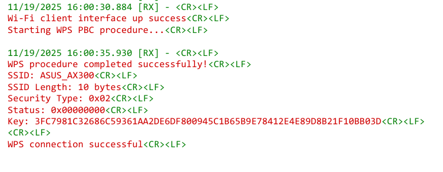
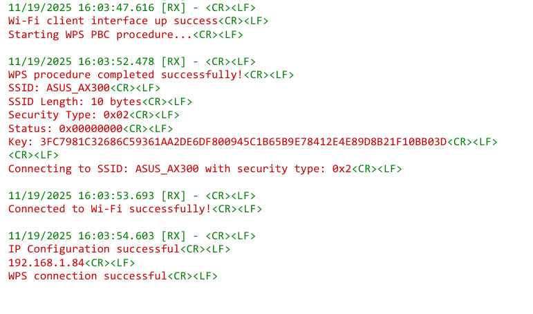

# Wi-Fi - WPS PBC

## Table of Contents

- [Wi-Fi - WPS PBC](#wi-fi---WPS-PBC)
  - [Table of Contents](#table-of-contents)
  - [Purpose/Scope](#purposescope)
  - [Prerequisites/Setup Requirements](#prerequisitessetup-requirements)
    - [Hardware Requirements](#hardware-requirements)
    - [Software Requirements](#software-requirements)
    - [Setup Diagram](#setup-diagram)
  - [Getting Started](#getting-started)
  - [Application Build Environment](#application-build-environment)
  - [Test the Application](#test-the-application)
  - [Limitation](#limitation)

## Purpose/Scope

Wi-Fi Protected Setup (WPS) Push Button Configuration (PBC) is a method to securely connect a Wi-Fi client device to an access point without manually entering network credentials. The WPS PBC procedure requires pressing the WPS button on both the client device and the access point within a specific time window. The application demonstrates how to configure the SiWx91x module in client mode to initiate WPS PBC using the `sl_wifi_start_wps_v2()` API with `SL_WIFI_WPS_PUSH_BUTTON_MODE` and `SL_WIFI_WPS_ENROLLEE_ROLE`. The application handles the WPS response containing the network SSID, security type, and encryption credentials, and can automatically connect to the discovered network or provide the credentials for manual connection.

## Prerequisites/Setup Requirements

### Hardware Requirements

- A Windows PC
- USB-C cable
- A Wireless Access Point (which has active internet access)

- **SoC Mode**:
  - Standalone
    - BRD4002A Wireless Pro Kit Mainboard [SI-MB4002A]
    - Radio Boards 
  	  - BRD4338A [SiWx917-RB4338A]
      - BRD4342A [SiWx917-RB4342A]
  	  - BRD4343A [SiWx917-RB4343A]
  - Kits
  	- SiWx917 Pro Kit [Si917-PK6031A](https://www.silabs.com/development-tools/wireless/wi-fi/siwx917-pro-kit?tab=overview)
  	- SiWx917 Pro Kit [Si917-PK6032A]
    - SiWx917 AC1 Module Explorer Kit (BRD2708A)

### Software Requirements

- Simplicity Studio
-  Serial Terminal - [Docklight](https://docklight.de/)/[Tera Term](https://ttssh2.osdn.jp/index.html.en)

### Setup Diagram

  

## Getting Started

Refer to the instructions [here](https://docs.silabs.com/wiseconnect/latest/wiseconnect-getting-started/) to:

- [Install Simplicity Studio](https://docs.silabs.com/wiseconnect/latest/wiseconnect-developers-guide-developing-for-silabs-hosts/#install-simplicity-studio)
- [Install WiSeConnect extension](https://docs.silabs.com/wiseconnect/latest/wiseconnect-developers-guide-developing-for-silabs-hosts/#install-the-wi-se-connect-extension)
- [Connect your device to the computer](https://docs.silabs.com/wiseconnect/latest/wiseconnect-developers-guide-developing-for-silabs-hosts/#connect-si-wx91x-to-computer)
- [Upgrade your connectivity firmware](https://docs.silabs.com/wiseconnect/latest/wiseconnect-developers-guide-developing-for-silabs-hosts/#update-si-wx91x-connectivity-firmware)
- [Create a Studio project](https://docs.silabs.com/wiseconnect/latest/wiseconnect-developers-guide-developing-for-silabs-hosts/#create-a-project)

For details on the project folder structure, see the [WiSeConnect Examples](https://docs.silabs.com/wiseconnect/latest/wiseconnect-examples/#example-folder-structure) page.

## Application Build Environment

- The application can be configured to suit your requirements and development environment. Read through the following sections and make any changes as needed.
- Configure the following parameter in ``app.c`` to test WPS PBC application.

  - **WPS Auto-Connect Configuration**

    - `auto_connect` refers to whether the device should automatically connect to the discovered network after WPS PBC completes, or only retrieve the network credentials for manual connection.

      - Set `auto_connect true` to automatically connect to the network after WPS PBC procedure completes.

        ```c
        wps_config.auto_connect = true;
        ```

      - Set `auto_connect false` to only retrieve network credentials without automatically connecting. The application uses the credentials to manually establish the connection.

        ```c
        wps_config.auto_connect = false;
        ```
## Test the Application

Refer to the instructions [here](https://docs.silabs.com/wiseconnect/latest/wiseconnect-getting-started/) to:

- Build the application
- Flash, run, and debug the application
- After the application starts, the SiWx91x module initializes the Wi-Fi client interface and begins the WPS PBC procedure. Press the WPS button on your access point within the WPS time window (typically 2 minutes) to establish the connection.

- If `auto_connect` is set to `true`, the device automatically connects to the discovered network, as shown in the following image:

  
  
- If `auto_connect` is set to `false`, the application uses the retrieved credentials to manually establish the connection and configure the IP address using DHCP, as shown in the following image:

  

## Limitation


WPS PBC does not support the Protected Management Frames (PMF) security feature.
